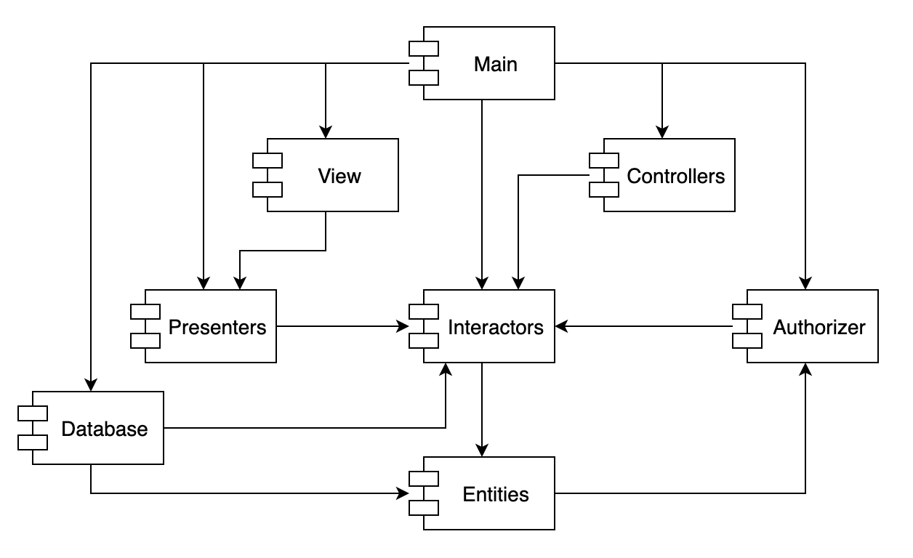
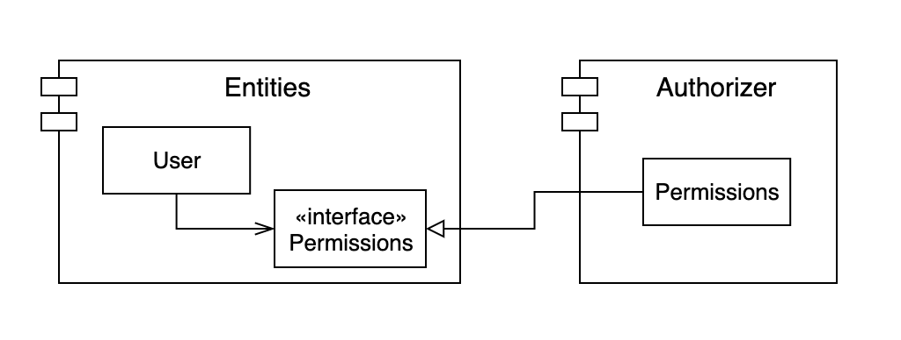
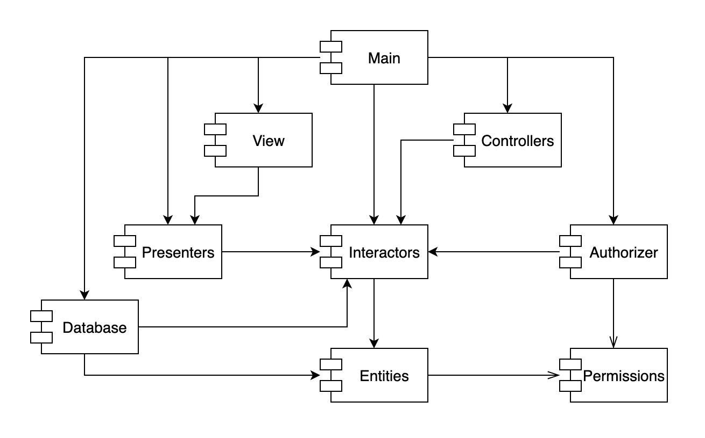
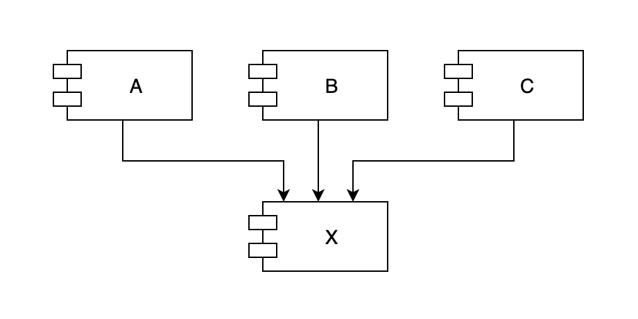
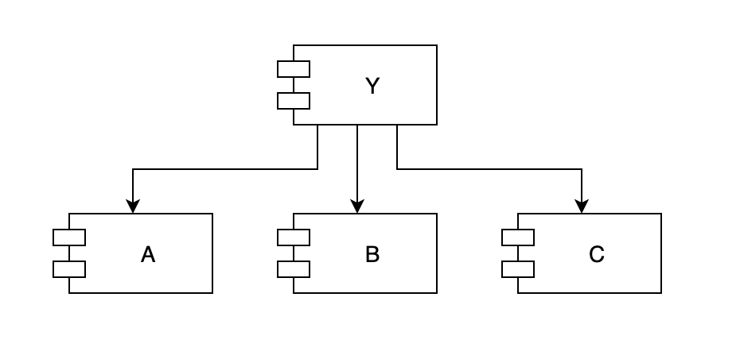
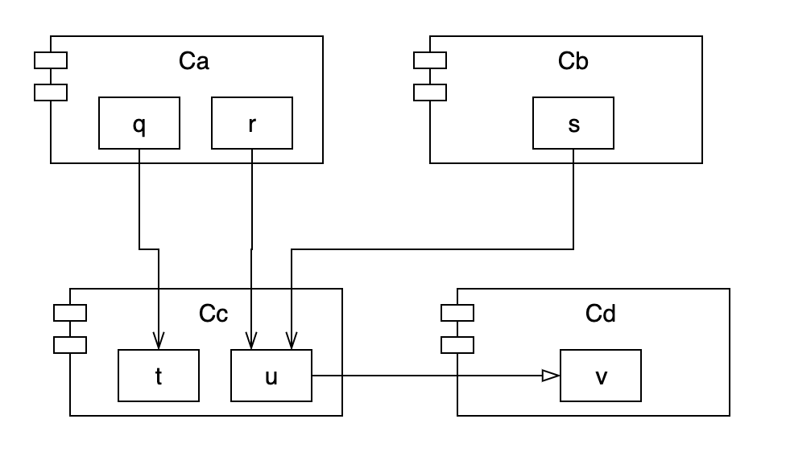
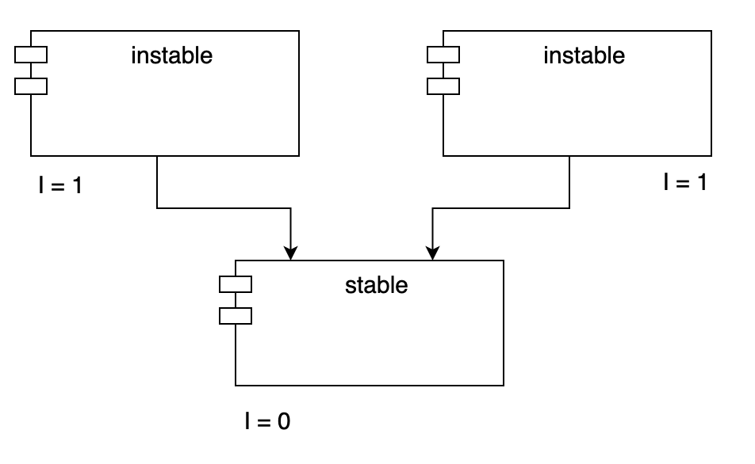
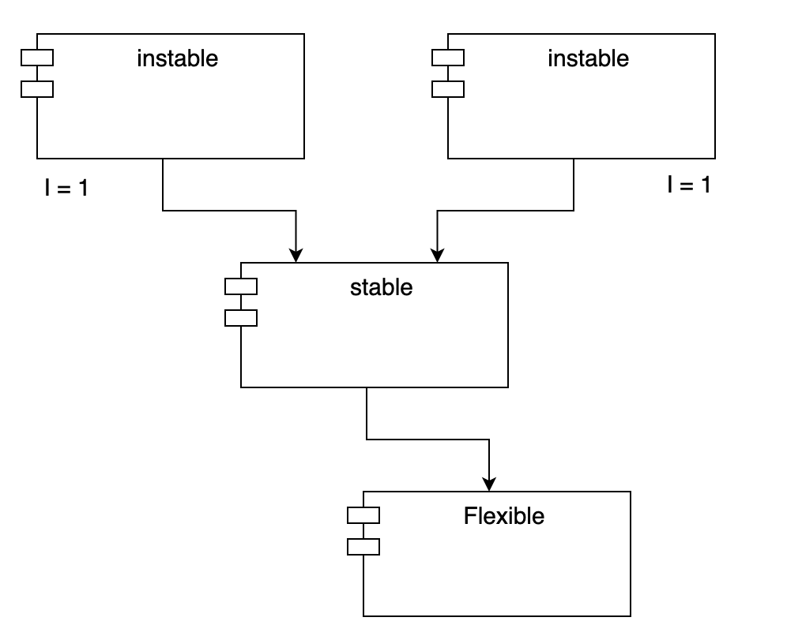
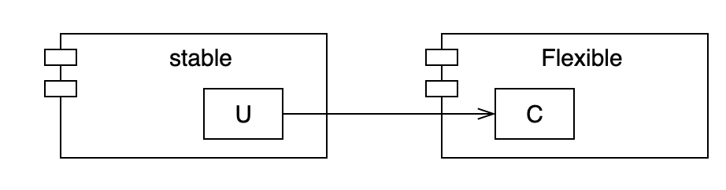
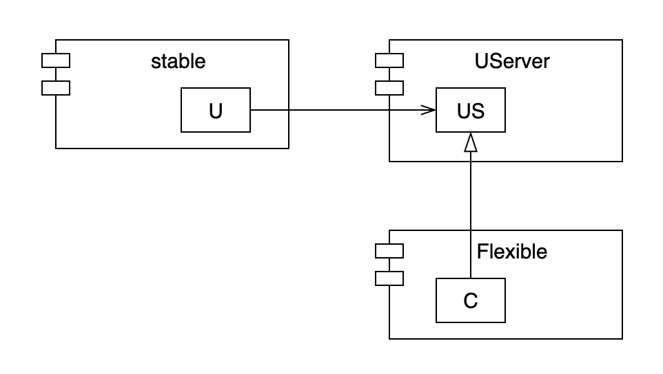

# 컴포넌트 결합

 이번 포스트에서는 컴포넌트 사이의 관계에 대한 세 가지 원칙에 대해서 정리해보겠습니다.

## ADP : 의존성 비순환 원칙 (Acyclic Dependencies Principle)

 컴포넌트 의존성 그래프에 순환이 있어서는 안된다.

 많은 개발자가 동일한 소스 파일을 수정하는 환경에서는 '숙취 증후군(The morning after syndrome)'이 발생합니다. 여기서 말하는 '숙취 증후군'은 내가 잘 동작하도록 만든 소스 코드가 다음날 아침에는 다른 사람의 수정으로 인해 동작하지 않는 현상을 말합니다. **이 문제를 해결하기 위해서는 개발 환경을 릴리스 가능한 컴포넌트 단위로 분리해야 합니다.** 이를 통해 컴포넌트 개발자 또는 단일 개발팀이 책임을 질 수 있는 작업 단위가 됩니다. 담당 개발자는 이 컴포넌트에 릴리스 번호를 부여하고, 다른 팀에서 사용할 수 있도록 하면 다른 개발자들은 릴리스된 버전을 적용할지 결정하여 개발을 진행할 수 있게 됩니다. 따라서 어떤 팀도 다른 팀에 의해 개발 업무가 좌우되지 않습니다.

 이 같은 작업 절차가 성공적으로 동작하기 위해서는 컴포넌트 사이의 의존성 구조를 반드시 관리해야 합니다. 그 관리 방법으로는 컴포넌트 사이의 의존성 구조에는 순환이 생기지 않도록 하는 것입니다. 의존성 구조에 순환이 생기면 '숙취 증후군'을 피해 갈 수 없습니다.

 위 그림은 컴포넌트 간의 의존성 구조를 방향 그래프(Directed graph)를 표현한 것입니다. 컴포넌트는 정점(Vertex)에 해당하고, 의존성 관계는 방향이 있는 간선(Directed edge)에 해당합니다. 여기서 주목할 점은 어느 컴포넌트에서 시작하더라도, 의존성 관계를 따라가면서 최초의 컴포넌트로 되돌아 갈 수 없다는 사실입니다. 이 구조에는 순환이 없습니다. 즉, 이 구조는 **비순환 방향 그래프(Directed Acyclic Graph, DAG)** 입니다.

 여기서 컴포넌트가 새로운 릴리스를 만들게 되면 어떤 컴포넌트가 영향을 받는지 생각해보겠습니다. 만약 Presenters 컴포넌트가 새롭게 릴리스가 되었다면 **의존성 화살표를 거꾸로 따라가서 찾으면 됩니다.** 즉, 이 릴리스로 인해 영향을 받는 컴포넌트는 View와 Main 컴포넌트가 영향을 받게됩니다.

 Presenters 컴포넌트를 개발하는 개발자가 이 컴포넌트를 테스트하고자 한다면, 단순히 현재 사용 중인 버전의 Interactors와 Entities를 이용해서 Presenters 자체 버전을 빌드하면 됩니다. 즉, Presenters를 개발하는 개발자가 테스트를 구성할 때 더 적은 노력이 든다는 뜻이며, 고려해야 할 변수도 상대적으로 적어지게 됩니다.

**시스템 전체를 릴리스해야 할 때가 오면 릴리스 절차는 상향식으로 진행하게 됩니다.** 먼저 Entities 컴포넌트를 컴파일하고, 테스트하고 릴리스 합니다. 그러고 나서 Database와 Interactors에 대해서도 동일한 과정을 거칩니다. 그다음에는 Presenters, View, Controllers, Authorizer 순으로 진행합니다. Main은 마지막에 처리하게 됩니다.

#### 순환이 컴포넌트 의존성 그래프에 미치는 영향

 새로운 요구사항이 발생해서 Entities에 포함된 클래스 하나가 Authorizer에 포함된 클래스 하나를 사용하도록 변경할 수밖에 없다고 가정했을 때, 아래와 같은 그림처럼 순환 의존성(Dependency cycle)이 발생합니다.

 Database 컴포넌트를 개발하는 개발자가 컴포넌트를 릴리스하려면 Entities 컴포넌트와 반드시 호환되어야 한다는 사실을 알 수 있습니다. 하지만 Entities 컴포넌트에는 순환이 있으므로, Database 컴포넌트는 Authorizer 컴포넌트와도  호환이 되어야 합니다. 그런데 Authorizer 컴포넌트는 Interactors 컴포넌트와도 의존하고 있습니다. 이로 인해 Database 컴포넌트는 릴리스하기가 훨씬 어려워집니다. 해당 컴포넌트들이 모두 항상 정확하게 동일한 릴리스를 사용해야 하기 때문입니다.

 순환 그래프가 생기면 컴포넌트를 분리하기가 상당히 어려워집니다. 단위 테스트를 하고 릴리스를 하는 일도 굉장히 어려워지며 에러도 쉽게 발생합니다. 게다가 모듈의 개수가 많아짐에 따라 빌드 관련 이슈가 기하급수적으로 증가하게 될 것입니다. 뿐만 아니라 의존성 그래프에 순환이 생기면 어떤 순서로 빌드해야 올바를지 파악하기가 상당히 힘들어집니다. 애초에 순환이 생기면 올바른 순서라는 것 자체가 없을 수 있습니다.

#### 순환 끊기

 컴포넌트 사이의 순환을 끊고 의존성을 다시 DAG(Directed Acyclic Graph, DAG)로 원상복구하는 방법은 아래의 두 가지 메커니즘을 이용하는 방법이 있습니다.

1\. 의존성 역전 원칙(DIP)을 적용합니다. 아래의 그림처럼 User가 필요로 하는 메서드를 제공하는 인터페이스를 생성합니다. 그리고 이 인터페이스는 Entities에 위치시키고, Authorizer에서는 이 인터페이스를 상속받습니다. 이렇게 하면 Entities와 Authorizer 사이의 의존성을 역전시킬 수 있고, 이를 통해 순환을 끊어낼 수 있습니다.

2\. Entities와 Authorizer가 모두 의존하는 새로운 컴포넌트를 만듭니다. 그리고 두 컴포넌트가 모두 의존하는 클래스들을 새로운 컴포넌트로 이동시킵니다.

 두 번째 해결책에서 시사하는 바는 요구사항이 변경되면 컴포넌트의 구조도 변경될 수 있다는 사실입니다. 실제로 어플리케이션이 성장함에 따라 컴포넌트 의존성 구조는 서서히 흐트러지며, 또 성장합니다. 따라서 의존성 구조에 순환이 발생하는지 항상 관찰해야 합니다. 순환이 발생하면 어떤 식으로든 끊어야 합니다. 이 말은 때론 새로운 컴포넌트를 생성하거나 의존성 구조가 더 커질 수도 있음을 의미합니다.

## SDP : 안정된 의존성 원칙 (Stable Dependencies Principle)

 안정성의 방향으로(더 안정된 쪽에) 의존하라.

 설계는 결코 정적일 수 없습니다. 설계를 유지하다 보면 변경은 불가피하게 됩니다. 공통 폐쇄 원칙(CCP)을 준수하면 컴포넌트가 다른 유형의 변경에는 영향을 받지 않도록 하고, 특정 유형의 변경에만 민감하게 만들 수 있습니다. 이처럼 컴포넌트 중 일부는 변동성을 지니도록 설계됩니다. 예를 들면 사용자와 가장 가까운 위치에서 상호작용을 하는 View 레이어의 컴포넌트들이 있습니다.

 변경이 쉽지 않는 컴포넌트가 변동이 예상되는 컴포넌트에 의존하도록 만들어서는 안됩니다. 한번 의존하게 되면 변동성이 큰 컴포넌트도 결국 변경이 어려워지기 때문입니다.

#### 안정성

 소프트웨어 컴포넌트를 변경하기 어렵게 만드는 확실한 방법은 수많은 다른 컴포넌트가 해당 컴포넌트에 의존하도록 만드는 것입니다. 컴포넌트 안쪽으로 들어오는 의존성이 많아지면 상당히 안정적이라고 볼 수 있는데, 사소한 변경이라도 의존하는 모든 컴포넌트를 만족시키면서 변경하려면 상당한 노력이 들기 때문입니다.

 위의 그림에서 X는 안정된 컴포넌트입니다. A, B, C 컴포넌트가 X에 의존하며, 따라서 **X 컴포넌트는 변경하지 말아야 할 이유가 세 가지나 되기 때문입니다.** 이 경우 X는 세 컴포넌트를 **책임진다(Responsible)** 라고 말합니다. 반대로 X는 어디에도 의존하지 않으므로 X가 변경되도록 만들 수 있는 외적인 영향이 없습니다. 이 경우 X는 **독립적이다(Independent)** 라고 말합니다.

 위 그림에서 Y는 상당히 불안정한 컴포넌트입니다. 어떤 컴포넌트도 Y를 의존하고 있지 않으므로 책임성이 없습니다. 또한 Y는 A, B, C 컴포넌트에 의존하므로 변경이 발생할 수 있는 외부 요인이 세 가지가 됩니다. 이 경우 Y는 의존적이라고 말합니다.

#### 안정성 지표

 컴포넌트로 들어오고 나가는 의존성의 개수를 세어 보는 방법을 통해 컴포넌트가 위치상 어느 정도의 안정성을 가지는지 계산할 수 있습니다.

-   _Fan-in_ : 안으로 들어오는 의존성입니다. 이 지표는 컴포넌트 내부의 클래스에 의존하는 컴포넌트 외부의 클래스 개수를 나타냅니다.
-   _Fan-out_ : 바깥으로 나가는 의존성입니다. 이 지표는 컴포넌트 외부의 클래스에 의존하는 컴포넌트 내부의 클래스 개수를 나타냅니다.
-   _I_ (불안정성) : _I = Fan-out / (Fan-in + Fan-out)_. 이 지표는 \[0, 1\] 범위의 값을 갖습니다. I = 0 이면 최고로 안정된 컴포넌트라는 뜻이고, I = 1 이면 최고로 불안정한 컴포넌트라는 뜻입니다.

 Fan-in과 Fan-out 지표는 특정 컴포넌트 내부의 클래스에 의존하는, 컴포넌트 외부에 위치한 클래스의 개수를 세어서 계산할 수 있습니다. 위 그림을 예로 Cc 컴포넌트의 안정성을 계산해보겠습니다. Cc 내부의 클래스에 의존하는 Cc 외부의 클래스는 3개입니다. 따라서 Fan-in = 3 입니다. Cc 내부의 클래스가 의존하는 Cc 외부에 위치한 클래스는 1개입니다. 따라서 Fan-out = 1 이고, I = 1 / (1 + 3) = 1 / 4 입니다.

 SDP에서 컴포넌트의 I 지표는 그 컴포넌트가 의존하는 다른 컴포넌트의 I 보다 커야 한다고 말합니다. 즉, 의존성 방향으로 갈수록 I 지표 값이 감소해야 합니다.

#### 모든 컴포넌트가 안정적이어야 하는 것은 아니다.

 모든 컴포넌트가 최고로 안정적인 시스템이라면 변경이 불가능합니다. 우리가 컴포넌트 설계를 할 때 기대하는 것은 불안정한 컴포넌트도 있고 안정된 컴포넌트도 존재하는 상태입니다.

 위 그림은 세 컴포넌트로 구성된 이상적인 구조입니다. instable 컴포넌트들은 불안정하고 비교적으로 안정적인 stable 컴포넌트에 의존하고 있습니다. 위에서 언급했던 것처럼 컴포넌트의 I 지표가 그 컴포넌트가 의존하는 다른 컴포넌트의 I 보다 큰 값을 갖도록 구성되어 있습니다. 반대로 SDP를 위배하는 구조를 살펴보겠습니다.

 Flexible 컴포넌트는 변경하기 쉽도록 설계한 컴포넌트라고 해보겠습니다. 설계자는 Flexible이 불안정한 상태이기를 바랍니다. 하지만 stable 컴포넌트가 Flexible 컴포넌트를 의존하도록 한 상태입니다. 이로 인해 SDP를 위배하게 됩니다. stable의 I 지표가 Flexible의 I 지표보다 더 작기 때문입니다. 결국 Flexible은 설계자의 의도와는 다르게 변경하기 어려운 컴포넌트가 되어버렸습니다.

 이 문제를 해결하기 위해서는 stable의 Flexible에 대한 의존성을 끊어내야 합니다. 아래와 같이 stable 내부의 클래스 U가 Flexible 내부의 클래스 C를 사용한다고 가정해보겠습니다.

 이러한 문제는 DIP를 통해 문제를 해결할 수 있습니다. 먼저 US라는 인터페이스를 생성한 후 UServer 컴포넌트에 넣습니다. 이때 US 인터페이스에는 U가 사용하는 모든 메서드가 반드시 선언되어 있어야 합니다. 그리고 나서 아래의 그림처럼 C가 해당 인터페이스를 구현하도록 만듭니다. 이를 통해 stable의 Flexible에 대한 의존성을 끊을 수 있고, 두 컴포넌트는 모두 UServer에 의존하도록 강제합니다. UServer는 매우 안정된 상태이며(I = 0), Flexible은 자신에게 맞는 불안정성(I = 1)을 그대로 유지할 수 있게 되었습니다. 이제 모든 의존성은 I가 감소하는 방향으로 흐르게 되었습니다.

## SAP : 안정된 추상화 원칙 (Stable Abstractions Principle)

 컴포넌트는 안정된 정도만큼만 추상화되어야 한다.

 시스템에는 자주 변경해서는 안되는 소프트웨어도 있습니다. 고수준 아키텍처나 정책 결정과 관련된 소프트웨어가 그러한 종류입니다. 이처럼 업무 로직이나 아키텍처와 관련된 결정에는 변동성이 없기를 기대합니다. 따라서 이와 같은 소프트웨어는 반드시 안정된 컴포넌트(I = 0)에 위치해야 합니다.

 컴포넌트가 최고로 안정된 상태이면서도(I = 0) 동시에 변경에 충분히 대응할 수 있을 정도의 유연성은 어떻게 만들 수 있을까요? 해답은 **개방 폐쇄 원칙(OCP)**에 있습니다. OCP는 클래스를 수정하지 않고도 확장이 충분히 가능할 정도로 클래스를 유연하게 만들 수 있는 바람직한 방법입니다. 그리고 **추상 클래스(Abstract Class)**가 바로 이 원칙을 준수하도록 만들 수 있습니다.

#### 안정된 추상화 원칙

 안정된 추상화 원칙(Stable Abstraction Principle, SAP)은 안정성(stability)과 추상화(abstractness) 사이의 관계를 정의합니다. 이 원칙은 안정된 컴포넌트는 추상 컴포넌트여야 하며, 이를 통해 안정성이 컴포넌트를 확장하는 일을 방해해서는 안 된다고 말합니다. 반대로 불안정한 컴포넌트는 반드시 구체 컴포넌트여야 한다고 말하는데, 컴포넌트가 불안정하므로 컴포넌트 내부의 구체적인 코드를 쉽게 변경할 수 있어야 하기 때문입니다.

 SAP와 SDP를 결합하면 컴포넌트에 대한 DIP나 마찬가지가 됩니다. SDP는 의존성이 반드시 안정된 방향으로 향해야 한다고 말하며, SAP에서는 안정성이 결국 추상화를 의미한다고 말하기 때문입니다. **따라서 의존성은 추상화의 방향으로 흐르게 됩니다.**

 하지만 DIP는 클래스에 대한 원칙이며, 클래스의 경우 중간은 존재하지 않습니다. 즉, 클래스는 추상적이거나 아니거나, 둘 중 하나입니다. SDP와 SAP의 조합은 컴포넌트에 대한 원칙이며, 컴포넌트는 어떤 부분은 추상적이면서 다른 부분은 안정적일 수 있습니다.

---

## 참고자료

[Clean Architecture](http://www.kyobobook.co.kr/product/detailViewKor.laf?ejkGb=KOR&mallGb=KOR&barcode=9788966262472&orderClick=LAG&Kc=) <<로버트C. 마틴 지음>>
