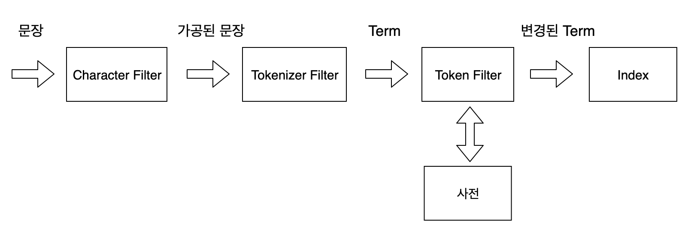
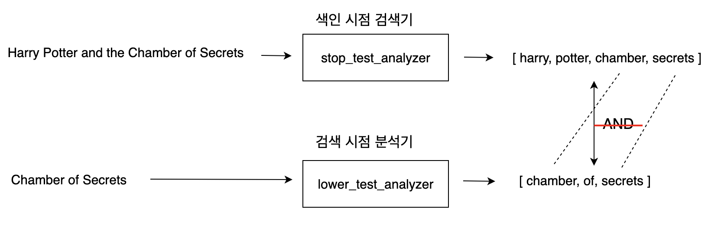

# 엘라스틱서치 분석기

## 텍스트 분석 개요

 엘라스틱서치는 루씬을 기반으로 구축된 텍스트 기반 검색엔진입니다. 루씬은 내부적으로 다양한 분석기를 제공하는데, 엘라스틱서치는 루씬이 제공하는 분석기를 그대로 활용합니다.

 다음과 같은 문장이 있다고 해보겠습니다.

"프로그래밍하기 좋은 날씨, 즐거운 프로그래밍"

 일반적으로 특정 단어가 포함된 문서를 찾으려면 검색어로 찾을 단어를 입력하면 될 것이라 생각할 것입니다. 하지만 엘라스틱 서치는 텍스트를 처리하기 위해 기본적으로 분석기를 사용하기 때문에 생각하는 대로 동작하지 않습니다. 예를 들어 "프로그래밍"이라는 단어를 입력하면 검색되지 않을 것입니다. 이는 "프로그래밍"이라는 단어가 존재하지 않기 때문에 해당 문서가 검색되지 않는 것입니다.

**엘라스틱서치는 문서를 색인하기 전에 해당 문서의 필드 타입이 무엇인지 확인하고 텍스트 타입이면 분석기를 이용해 이를 분석합니다. 텍스트가 분석되면 개별 텀(term)으로 나뉘어 형태소 형태로 분석됩니다. 해당 형태소는 특정 원칙에 의해 필터링되어 단어가 삭제되거나 추가, 수정되고 최종적으로 역색인 됩니다.**

 아까 위에서 예를 들었던 "프로그래밍하기 좋은 날씨, 즐거운 프로그래밍"이라는 문장이 실제로 어떻게 분석되는지 확인해 보겠습니다.

```
POST _analyze
{
  "analyzer": "standard",
  "text": "프로그래밍하기 좋은 날씨, 즐거운 프로그래밍"
}
```

 위의 분석 결과는 아래와 같이 token 값으로 표시됩니다.

```
{
  "tokens" : [
    {
      "token" : "프로그래밍하기",
      "start_offset" : 0,
      "end_offset" : 7,
      "type" : "<HANGUL>",
      "position" : 0
    },
    {
      "token" : "좋은",
      "start_offset" : 8,
      "end_offset" : 10,
      "type" : "<HANGUL>",
      "position" : 1
    },
    {
      "token" : "날씨",
      "start_offset" : 11,
      "end_offset" : 13,
      "type" : "<HANGUL>",
      "position" : 2
    },
    {
      "token" : "즐거운",
      "start_offset" : 15,
      "end_offset" : 18,
      "type" : "<HANGUL>",
      "position" : 3
    },
    {
      "token" : "프로그래밍",
      "start_offset" : 19,
      "end_offset" : 24,
      "type" : "<HANGUL>",
      "position" : 4
    }
  ]
}
```

 예제에서는 특별한 분석기 없이 Standard Analyzer를 사용했기 때문에 별도의 형태소 분석은 이루어지지 않았습니다. 텍스트를 분석할 때 별도의 분석기를 지정하지 않으면 기본적으로 Standard Analyzer가 사용됩니다.

## 역색인 구조

 어떤 책을 읽을 때 특정한 단어를 알고 있지만 해당 단어가 등장하는 페이지를 알지 못할 때 책의 마지막에 수록된 "찾아보기"에서 나열된 목록을 찾아보게 됩니다. 이 페이지에는 단어와 해당 단어가 포함된 페이지가 열거되어 있어서 특정 단어가 등장하는 페이지를 쉽게 찾아낼 수 있습니다. 루씬도 이와 비슷하게 동작합니다. 루씬의 색인은 역색인이라는 특수한 방식으로 구조화되어 있습니다.

 역색인 구조를 간단하게 정리하자면 다음과 같습니다.

-   모든 문서가 가지는 단어의 고유 단어 목록
-   해당 단어가 어떤 문서에 속해 있는지에 대한 정보
-   전체 문서에 각 단어가 몇 개 들어있는지에 대한 정보
-   하나의 문서에 단어가 몇 번씩 출현했는지에 대한 빈도

 예를 들어, 다음과 같은 텍스트를 가진 2개의 문서가 있다고 해보겠습니다.

문서1.

elasticsearch is cool

문서2.

Elasticsearch is great

 위의 두 문장에 대한 역색인을 만들기 위해 각 문서를 토큰화해야 합니다. 토큰화된 결과물은 대략적으로 아래와 같습니다. (실제로 저장되는 데이터는 훨씬 많은 정보를 저장합니다.)

<table style="border-collapse: collapse; width: 95.3488%; height: 202px;" border="1"><tbody><tr><td style="width: 198px;"><b>토큰</b></td><td style="width: 198px;"><b>문서번호</b></td><td style="width: 198px;"><b>텀의 위치 (Position)</b></td><td style="width: 197px;"><b>텀의 빈도 (Term Frequency)</b></td></tr><tr><td style="width: 198px;">elasticsearch</td><td style="width: 198px;">문서1</td><td style="width: 198px;">1</td><td style="width: 197px;">1</td></tr><tr><td style="width: 198px;">Elasticsearch</td><td style="width: 198px;">문서2</td><td style="width: 198px;">1</td><td style="width: 197px;">1</td></tr><tr><td style="width: 198px;">is</td><td style="width: 198px;">문서1, 문서2</td><td style="width: 198px;">2, 2</td><td style="width: 197px;">2</td></tr><tr><td style="width: 198px;">cool</td><td style="width: 198px;">문서1</td><td style="width: 198px;">3</td><td style="width: 197px;">1</td></tr><tr><td style="width: 198px;">great</td><td style="width: 198px;">문서2</td><td style="width: 198px;">3</td><td style="width: 197px;">1</td></tr></tbody></table>

 위 내용을 살펴보면 토큰이 어떤 문서의 어디에 위치하고, 토큰의 빈도수에 대한 정보를 알 수 있습니다. 이 결과를 바탕으로 검색어가 존재하는 문서를 찾기 위해 검색어와 동일한 토큰을 찾아 해당 토큰이 존재하는 문서 번호를 찾아가면 됩니다.

 하지만 여기서 "elasticsearch"를 검색어로 지정하면 우리가 예상했던 것과는 다른 결과가 나올 것입니다. 우리가 원하는 결과는 문서1, 문서2에 해당하는 내용이 모두 나와야하는 것입니다. 하지만 두 토큰(elasticsearch, Elasticsearch)은 첫 글자의 대소문자가 다르기 때문에 컴퓨터의 입장에서는 서로 다른 토큰으로 인식하여 문서1 만이 검색 결과로 나타나게 됩니다. 이러한 문제를 해결하기 위해서는 **어떻게 하면 해당 토큰들을 하나로 볼 것인가를 고민해야 합니다.**

이 문제의 가장 간단한 해결 방법은 색인 전에 텍스트 전체를 소문자로 변환한 다음 색인하는 것입니다. 그렇게 되면 두 개의 문서가 "elasticsearch"라는 토큰으로 나오게 될 것입니다.

<table style="border-collapse: collapse; width: 100%;" border="1"><tbody><tr><td style="width: 198px;"><b>토큰</b></td><td style="width: 198px;"><b>문서번호</b></td><td style="width: 198px;"><b>텀의 위치 (Position)</b></td><td style="width: 197px;"><b>텀의 빈도 (Term Frequency)</b></td></tr><tr><td style="width: 198px;">elasticsearch</td><td style="width: 198px;">문서1, 문서2</td><td style="width: 198px;">1, 1</td><td style="width: 197px;">2</td></tr><tr><td style="width: 198px;">is</td><td style="width: 198px;">문서1, 문서2</td><td style="width: 198px;">2, 2</td><td style="width: 197px;">2</td></tr><tr><td style="width: 198px;">cool</td><td style="width: 198px;">문서1</td><td style="width: 198px;">3</td><td style="width: 197px;">1</td></tr><tr><td style="width: 198px;">great</td><td style="width: 198px;">문서2</td><td style="width: 198px;">3</td><td style="width: 197px;">1</td></tr></tbody></table>

**색인한다는 것은 역색인 파일을 만드는 것입니다. 그렇다고 원문 자체를 변경한다는 의미는 아닙니다. 따라서 색인 파일들에 들어간 토큰만 변경되어 저장되고 실제 문서의 내용은 변함없이 저장됩니다. 색인할 때 특정한 규칙과 흐름에 의해 텍스트를 변경하는 과정을 분석(Analyze)이라고 하고 해당 처리는 분석기(Analyzer)라는 모듈을 조합해서 이루어집니다.**

## 분석기의 구조

 분석기는 기본적으로 다음과 같은 프로세스로 동작합니다.

1.  문장을 특정한 규칙에 의해 수정한다.
2.  수정한 문자를 개별 토큰으로 분리한다.
3.  개별 토큰을 특정한 규칙에 의해 변경한다.

 위의 세 가지 동작은 특성에 의해 각각 다음과 같은 용어로 불립니다.

#### CHARACTER FILTER

 문장을 분석하기 전에 입력 텍스트에 대해 특정한 단어를 변경하거나 HTML과 같은 태그를 제거하는 역할을 하는 필터입니다. 해당 내용은 텍스트를 개별 토근화하기 전의 전처리 과정이며, ReplaceAll() 함수처럼 패턴으로 텍스트를 변경하거나 사용자가 정의한 필터를 적용할 수 있습니다.

#### TOKENIZER FILTER

 TOKENIZER FILTER는 분석기를 구성할 때 하나만 사용할 수 있으며 텍스트를 어떻게 나눌 것인지를 정의합니다. 한글을 분해할 때는 한글 형태소 분석기의 TOKENIZER를 사용하고, 영문을 분석할 때는 영문 형태소 분석기의 TOKENIZER를 사용하는 등 상황에 맞게 적절한 TOKENIZER를 사용하면 됩니다.

#### TOKEN FILTER

 토큰화된 단어를 하나씩 필터링해서 사용자가 원하는 토큰으로 변환합니다. Token Filter는 여러 단계가 순차적으로 이뤄지며 순서를 어떻게 지정하느냐에 따라 검색의 질이 달라질 수 있습니다.

전체 분석 프로세스는 다음과 같습니다.



 실제로 분석기가 어떻게 수행되는지 확인해보겠습니다.

 우선 아래와 같이 인덱스를 생성하였습니다.

```
PUT my_custom_index
{
   "settings":{
     "number_of_replicas": 1, 
     "number_of_shards": 1,
      "analysis":{
         "analyzer":{
            "my_custom_analyzer":{ 
               "type":"custom",
               "char_filter": [
                 "html_strip"
                ],
                "tokenizer": "standard",
                "filter": [
                  "lowercase"
                ]
            }
         }
      }
   },
   "mappings":{
       "properties":{
          "title": {
             "type":"text",
             "analyzer":"my_custom_analyzer"
         }
      }
   }
}
```

-   Character Filter (char\_filter) : html\_strip을 지정하였습니다. html\_strip은 텍스트의 HTML 태그 요소들을 모두 제거해주는 필터입니다.
-   Tokenizer Filter (tokenizer) : standard로 사용하였으며, 특수문자 혹은 공백을 기준으로 텍스트를 분할합니다.
-   Token Filter (filter) : lowercase로 정의하였으며, 모든 토큰을 소문자로 변환합니다.
-   Mapping Properties : title이라는 이름의 text형 프로퍼티를 정의하였으며, 사용할 분석기로 위에서 정의했던 my\_custom\_analyzer 분석기를 사용하도록 지정하였습니다.

 이제 아래와 같이 데이터를 넣어보겠습니다.

```
PUT my_custom_index/_doc/1
{
   "title":"The Quick Brown Fox"
}

PUT my_custom_index/_doc/2
{
   "title":"A Quick Brown Fox"
}

PUT my_custom_index/_doc/3
{
   "title":"<B>Elasticsearch</B> is cool"
}

PUT my_custom_index/_doc/4
{
   "title":"<p>Elasticsearch</p> is cool"
}
```

 우선 title이라는 프로퍼티를 어떻게 분석하는지 \_analyzer API를 활용하여 확인해보겠습니다.

```
POST my_custom_index/_analyze
{
  "field": "title",
  "text": "<p>Elasticsearch</p> is cool"
}
```

 title이라는 text 타입에 "<p>Elasticsearch</p> is cool" 이라는 텍스트를 분석하면 아래와 같이 HTML 태그들이 모두 제거된 채로 토큰들이 정제된 것을 확인하실 수 있습니다.

```
{
  "tokens" : [
    {
      "token" : "elasticsearch",
      "start_offset" : 3,
      "end_offset" : 16,
      "type" : "<ALPHANUM>",
      "position" : 0
    },
    {
      "token" : "is",
      "start_offset" : 21,
      "end_offset" : 23,
      "type" : "<ALPHANUM>",
      "position" : 1
    },
    {
      "token" : "cool",
      "start_offset" : 24,
      "end_offset" : 28,
      "type" : "<ALPHANUM>",
      "position" : 2
    }
  ]
}

```

 그렇다면 실제로도 분석기에 의해 정제된 토큰과는 달리 원문 데이터는 변경되지 않았는지 확인해보겠습니다.

```
GET my_custom_index/_doc/4
```

```
{
  "_index" : "my_custom_index",
  "_type" : "_doc",
  "_id" : "4",
  "_version" : 2,
  "_seq_no" : 4,
  "_primary_term" : 1,
  "found" : true,
  "_source" : {
    "title" : "<p>Elasticsearch</p> is cool"
  }
}
```

 결과를 살펴보면 실제 문서는 변경되지 않은 채로 색인이 된 것을 확인하실 수 있습니다.

 그리고 현재 문서에 저장된 내용에 "Elasticsearch"라는 단어로 대문자가 포함되어 저장되어 있는 상태입니다. 방금 전, 분석기의 Token Filter로 lowercase를 지정하였기 때문에 색인된 토큰은 "elasticsearch"일 것입니다. 따라서 "elasticsearch"라는 단어를 이용하여 검색하여도 "Elasticsearch"라는 단어가 포함된 문서를 찾아낼 수 있을 것입니다. 실제로도 그런지 결과를 확인해 보겠습니다.

```
GET my_custom_index/_search
{
   "query":{
      "query_string":{
         "query": "elasticsearch" 
      }
   }
}
```

```
{
  "took" : 0,
  "timed_out" : false,
  "_shards" : {
    "total" : 1,
    "successful" : 1,
    "skipped" : 0,
    "failed" : 0
  },
  "hits" : {
    "total" : {
      "value" : 2,
      "relation" : "eq"
    },
    "max_score" : 0.7361701,
    "hits" : [
      {
        "_index" : "my_custom_index",
        "_type" : "_doc",
        "_id" : "3",
        "_score" : 0.7361701,
        "_source" : {
          "title" : "<B>Elasticsearch</B> is cool"
        }
      },
      {
        "_index" : "my_custom_index",
        "_type" : "_doc",
        "_id" : "4",
        "_score" : 0.7361701,
        "_source" : {
          "title" : "<p>Elasticsearch</p> is cool"
        }
      }
    ]
  }
}
```

 결과를 보면 "elasticsearch"라는 단어를 이용하여 아까 등록해두었던 "Elasticsearch"라는 단어가 포함된 두 문서를 모두 찾아낸 것을 확인할 수 있습니다.

## 색인과 검색 시 분석기를 각각 설정

 분석기는 색인할 때 사용되는 Index Analyzer와 검색할 때 사용되는 Search Analyzer로 구분하여 구성할 수도 있습니다. 인덱스를 생성할 때 색인용과 검색용 분석기를 각각 정의하고 적용하고자 하는 필드에 원하는 분석기를 지정하면 됩니다.

```
PUT my_custom_index
{
   "settings":{
     "number_of_replicas": 1, 
     "number_of_shards": 1,
      "analysis":{
         "analyzer":{
            "lower_test_analyzer":{ 
               "type":"custom",
                "tokenizer": "standard",
                "filter": [
                  "lowercase"
                ]
            },
            "stop_test_analyzer": {
              "type": "custom",
              "tokenizer": "standard",
              "filter": [
                "lowercase",
                "english_stop"
              ]
            }
         },
         "filter": {
           "english_stop": {
             "type": "stop",
             "stopwords": "_english_"
           }
         }
      }
   },
   "mappings":{
       "properties":{
          "title": {
             "type":"text",
             "analyzer":"stop_test_analyzer",
             "search_analyzer": "lower_test_analyzer"
         }
      }
   }
}
```

 위의 예제에서는 my\_custom\_index라는 인덱스를 색인하면서 lower\_test\_analyzer라는 분석기와 stop\_test\_analyzer라는 분석기를 정의하였습니다. 두 분석기는 모두 기본적으로 Standard Tokenizer를 사용하며, 분리된 토큰을 소문자로 변경합니다. stop\_test\_analyzer의 경우 추가적으로 **불용어(Stopword)**를 처리합니다.

 맵핑 시 title 필드는 Text 데이터 타입으로 지정되어 있고, 분석기가 색인 시점과 검색 시점으로 나누어져 있습니다. **색인할 때는 stop\_test\_analyzer 분석기가 동작하고, 검색할 때는 lower\_test\_analyzer 분석기가 동작하도록 설정되어 있습니다.** 즉, 색인할 때는 데이터를 소문자로 변경하고 불용어를 제거하는 동작을 수행하고, 검색할 때는 데이터를 소문자로 변경하는 동작만 수행합니다.

 색인을 수행할 때, 분석기가 어떻게 데이터를 처리하여 토큰화 시키는지 확인해보겠습니다.

```
POST my_custom_index/_analyze
{
  "field": "title",
  "text": "Harry Potter and the Chamber of Secrets"
}
```

 아래의 결과를 보시면 소문자로 변경되고, 모든 불용어가 제거되어 \[harry, potter, chamber, secrets\]로 토큰화 된 것을 확인할 수 있습니다.

```
{
  "tokens" : [
    {
      "token" : "harry",
      "start_offset" : 0,
      "end_offset" : 5,
      "type" : "<ALPHANUM>",
      "position" : 0
    },
    {
      "token" : "potter",
      "start_offset" : 6,
      "end_offset" : 12,
      "type" : "<ALPHANUM>",
      "position" : 1
    },
    {
      "token" : "chamber",
      "start_offset" : 21,
      "end_offset" : 28,
      "type" : "<ALPHANUM>",
      "position" : 4
    },
    {
      "token" : "secrets",
      "start_offset" : 32,
      "end_offset" : 39,
      "type" : "<ALPHANUM>",
      "position" : 6
    }
  ]
}
```

 이제 실제로 색인 시점과 검색 시점이 다른지에 대한 예제를 테스트 해보겠습니다. 먼저 "Harry Potter and the Chamber of Secrets"라는 문장으로 데이터를 색인시켜보겠습니다.

```
PUT my_custom_index/_doc/1
{
  "title": "Harry Potter and the Chamber of Secrets"
}
```

 그리고 아래와 같이 "Chanber of Secrets"라는 문장으로 문서를 검색해보겠습니다.

```
POST my_custom_index/_search
{
  "query": {
    "query_string": {
      "default_operator": "AND",
      "query": "Chamber of Secrets"
    }
  }
}
```

```
{
  "took" : 0,
  "timed_out" : false,
  "_shards" : {
    "total" : 1,
    "successful" : 1,
    "skipped" : 0,
    "failed" : 0
  },
  "hits" : {
    "total" : {
      "value" : 0,
      "relation" : "eq"
    },
    "max_score" : null,
    "hits" : [ ]
  }
}

```

 검색을 수행할 때는 lower\_test\_analyzer 분석기가 동작하여 불용어를 제거하지 않으므로 "Chamber of Secrets"라는 문장을 \[chamber, of, secrets\] 라는 토큰으로 분류하게 됩니다. 따라서 위와 같이 default\_operator에 AND 조건을 설정하면 저장할 때 색인했던 토큰 \[harry, potter, chamber, secrets\]과 비교했을 때, 검색시 분류했던 토큰의 "of" 라는 불용어가 존재하지 않으므로 검색되지 않는 것입니다.



 이처럼 엘라스틱서치는 같은 필드를 대상으로 색인 시점과 검색 시점에 각각 다른 기능을 하도록 설정하는 것이 가능합니다.

---

## 참고자료

[엘라스틱서치 실무 가이드](http://www.kyobobook.co.kr/product/detailViewKor.laf?ejkGb=KOR&mallGb=KOR&barcode=9791158391485&orderClick=LEa&Kc=) <<권택환, 김동우, 김흥래, 박진현, 최용호, 황희정 지음>>

[https://www.elastic.co/guide/en/elasticsearch/reference/current/analyzer.html](https://www.elastic.co/guide/en/elasticsearch/reference/current/analyzer.html)