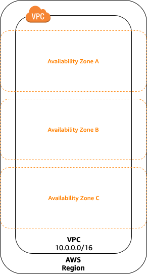
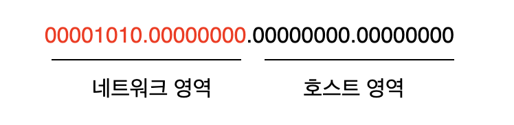
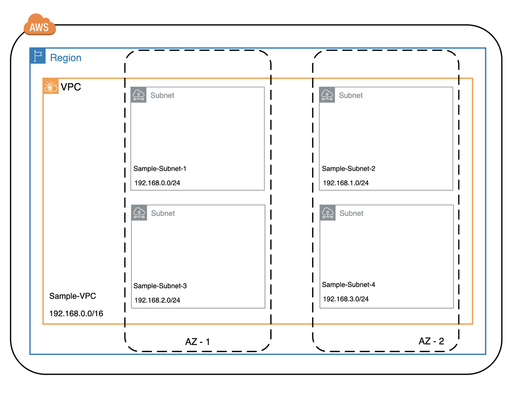
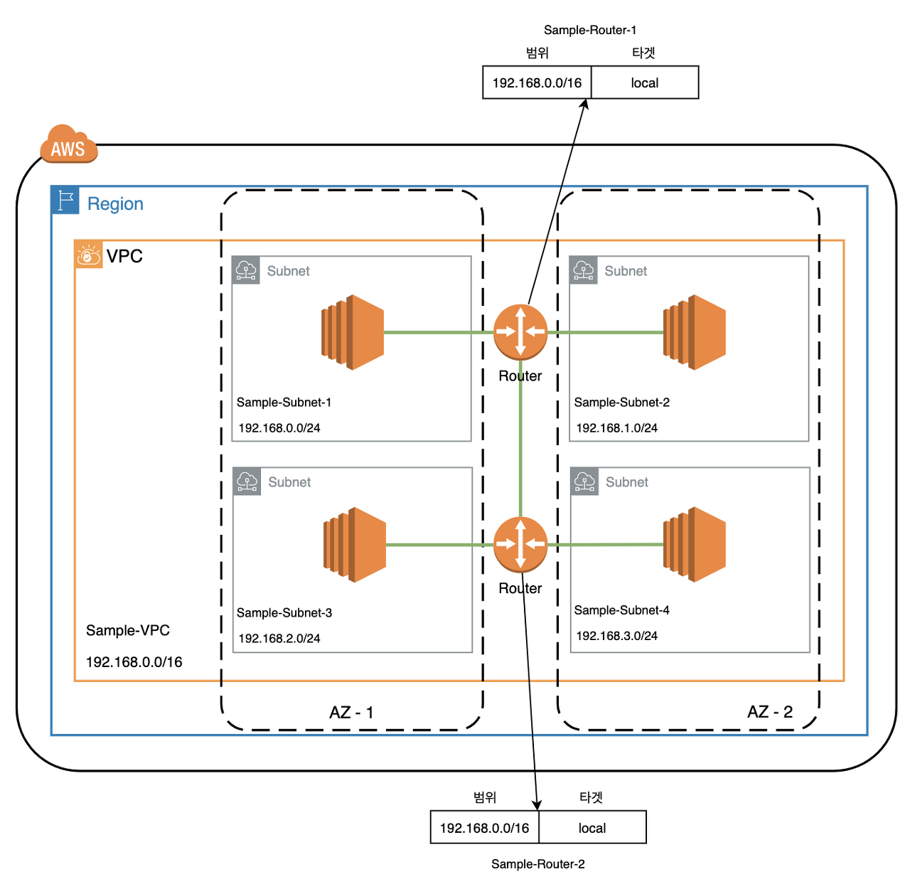
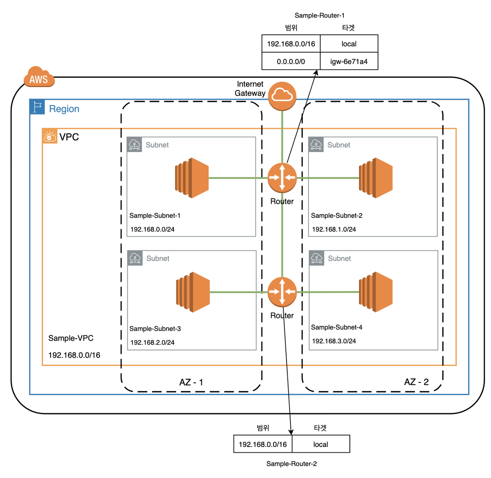
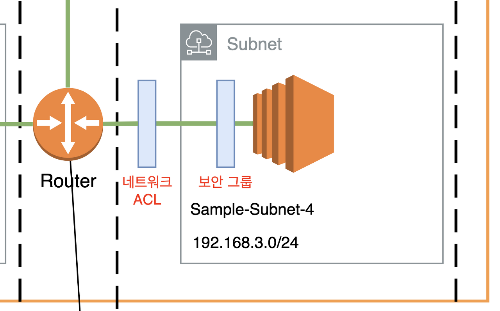

# VPC에 대해 알아보기

 VPC는 Virtual Private Cloud의 약자로 AWS 클라우드 상에서 논리적으로 격리된 네트워크 공간을 할당하여 가상 네트워크를 구성할 수 있는 서비스입니다. VPC에 대해 이해하기 위한 핵심 개념은 아래와 같습니다.

-   VPC
    
-   서브넷 (Subnet)
    
-   Private IP, Public IP, Elastic IP
    
-   라우트 테이블 (Route Table)
    
-   인터넷 게이트웨이 (Internet Gateway)
    
-   네트워크 ACL (Network ACL) / 보안 그룹 (Security Group)
    
    이제 각 개념들에 대해 살펴보겠습니다.
    

## VPC

 VPC는 포스트의 제일 위에서 설명했듯이 논리적으로 격리된 가상 네트워크를 말합니다. VPC는 하나의 리전 내에서만 속할 수 있습니다. 즉, 여러 리전에 걸쳐서 구성이 불가능합니다. VPC가 하나의 리전 내에서만 속할 수 있지만, 리전 내에 여러 개의 Available Zone에 걸쳐서 생성될 수 있습니다. VPC를 구성할 때는 IPv4 주소 범위를 CIDR(Classless Inter-Domain Routing) 블록 형태로 지정해야 합니다.

 여기서 CIDR 블록은 IP의 범위를 지정하는 방식입니다. CIDR 블록은 아이피 주소와 슬래쉬('/') 뒤에 따라오는 넷마스크 숫자로 구성되어 있습니다. 위 그림에서 보이는 "10.0.0.0/16" 과 같은 형식이 바로 CIDR 블록입니다. **허용된 블록 크기는 /16(65,536개의 IP 주소) ~ /28(16개의 IP주소)**입니다. 위 아이피 주소의 넷마스크는 16으로 되어 있는데, 아이피 주소를 2진법으로 변환했을때 앞에서부터 16비트까지가 네트워크 주소임을 나타내는 것입니다.

 VPC를 생성할 때 CIDR 범위를 지정하는데 특별한 제약은 없지만 인터넷과 연결되는 경우 주의해야할 점이 있습니다. 예를 들어 CIDR 블록을 52.12.0.0/16 으로 지정했다고 가정해보겠습니다. 생성된 VPC 내에서는 52.12.0.0/16으로 접속되는 트래픽은 VPC 내부로 라우팅 되겠지만 이 범위는 인터넷 망에서도 사용할 수 있는 IP 대역입니다. 따라서 VPC에서는 52.12.0.0/16 대역에 속한 인터넷 IP 대역에 접속하는 것이 불가능해집니다. 따라서 **인터넷 연결이 필요한 경우 반드시 사설망 대역을 이용해야 하며, 인터넷 연결이 필요하지 않더라도 사설망 대역을 이용하는 것을 권장**합니다.

 VPC의 사설망 대역은 아래와 같습니다.

-   10.0.0.0/8
-   172.16.0.0/12
-   192.168.0.0/16

## 서브넷 (Subnet)

 서브넷은 VPC 내에서 IPv4 주소가 CIDR 블록에 의해 나눠진 주소 단위입니다. 서브넷은 물리적으로 가용 공간인 Available Zone(이하 AZ)과 연결됩니다. VPC는 N개의 서브넷을 가지게 되고, 서브넷은 하나의 AZ에 연결됩니다. 각 서브넷 블록에서 첫 4개의 주소와 IP의 마지막 주소는 사용할 수 없으므로 인스턴스에 할당할 수 없습니다. 예를 들어 192.168.0.10/16 의 주소는 아래와 같이 5개의 주소에 대해 미리 예약되어 있습니다.

-   192.168.0.0 : 네트워크 주소입니다.
-   192.168.0.1 : AWS에서 VPC 라우터용으로 예약한 주소입니다.
-   192.168.0.2 : AWS에서 DNS의 기본 IP 주소는 기본 VPC 네트워크 범위에 2를 더한 주소입니다.
-   192.168.0.3 : AWS에서 앞으로 사용하려고 예약한 주소입니다.
-   192.168.0.255: 네트워크 브로드 캐스트 주소입니다.

 위 그림은 VPC의 서브넷에 대한 대략적인 그림입니다. 앞서 말씀드린 것처럼 하나의 VPC에는 N개의 서브넷이 존재하고, 각 서브넷은 하나의 AZ에 속하게 됩니다. 이 서브넷들은 라우팅 테이블에 의해 연결될 수 있습니다. 즉, 여러 AZ에서 리소스들이 물리적으로 다른 위치에 있더라도 하나의 네트워크에 속해있는 것처럼 가상의 네트워크 망을 구축할 수 있게 되는 것입니다.

## Private IP, Public IP, Elastic IP

 Private IP 주소는 인터넷을 통해 연결할 수 없고 VPC 내부에서만 사용할 수 있는 IP 주소입니다. Private IP는 인스턴스가 생성될 때 VPC의 서브넷 범위 안에서 자동으로 할당되며, 동일 네트워크에서 인스턴스 간에 통신에 사용할 수 있습니다.

 Public IP 주소는 인터넷을 통해 연결할 수 있는 IP 주소입니다. 인스턴스와 인터넷 간의 통신을 위해 사용할 수 있습니다. EC2가 생성될 때 옵션으로 Public IP 주소 사용 여부를 선택할 수 있으며, 인스턴스에서 Public IP 주소를 수동으로 연결하거나 해제할 수 없습니다. Public IP는 인스턴스가 재부팅되면 새로운 Public IP 주소가 할당됩니다.

 Elastic IP는 Public IP와 다르게 고정된 IP 주소입니다. VPC의 인스턴스와 네트워크 인터페이스에 Elastic IP를 할당할 수 있습니다. Elastic IP를 이용하면 Public IP 주소가 할당된 인스턴스가 재부팅 되었을 때 새로운 주소가 다시 할당되지 않고, 고정적으로 같은 IP를 사용할 수 있게 됩니다.

## 라우트 테이블 (Route Table)

 라우트 테이블은 서브넷과 연결되어 있는 리소스입니다. 라우트 테이블은 대상 IP에 라우팅 경로를 지정하여 서브넷 밖으로 나가는 Outbound Traffic에 대한 라우팅 경로를 정의합니다. 하나의 라우트 테이블은 VPC에 속한 여러 서브넷에 사용될 수 있습니다.

 위 그림에서는 각 서브넷에 인스턴스가 하나씩 존재하고, Router는 Sample-Router-1, Sample-Router-2 가 정의되어 있습니다. 라우트 테이블에는 타겟이 local로 지정된 기본적인 범위 규칙이 존재합니다. 이 규칙은 IPv4 CIDR 블록의 목적지가 VPC 내부로 향하도록 라우팅하는 규칙이며, 삭제할 수 없습니다.

## 인터넷 게이트웨이 (Internet Gateway)

 VPC는 기본적으로 격리되어 있는 네트워크 환경입니다. 즉, VPC 내부의 리소스들은 인터넷과 연결될 수 없는 환경입니다. 인터넷과 연결되기 위해서는 인터넷 게이트웨이가 필요합니다. 라우트 테이블에 인터넷 게이트웨이를 향하는 규칙을 추가해주면 특정 서브넷이 인터넷과 연결됩니다.

 위 그림에서 Sample-Router-1 라우트 테이블에서 인터넷 게이트웨이와 연결하는 새로운 규칙이 생겼습니다. 따라서 Sample-Subnet-1과 Sample-Subnet-2 서브넷은 인터넷과 연결이 가능해집니다. 서브넷 네트워크 트래픽이 인터넷 게이트웨이로 라우팅이 되는 서브넷을 **퍼블릭 서브넷(Public Subnet)**이라 하고, 인터넷 게이트웨이로 라우팅 되지 않는 서브넷을 **프라이빗 서브넷(Private Subnet)**이라 합니다. EC2 인스턴스가 IP를 통해 인터넷과 통신을 할 수 있게 하려면 Public IP 주소나 Elastic IP 주소가 있어야 합니다.

## 네트워크 ACL (Network Access Control List) / 보안 그룹 (Security Group)

 네트워크 ACL과 보안 그룹은 인바운드와 아웃바운드 트래픽에 대해 보안 정책을 설정할 수 있는 방화벽과 같은 역할을 합니다. 하나의 네트워크 ACL은 다수의 서브넷에서 재사용할 수 있습니다. 네트워크 ACL이 서브넷 앞단에서 트래픽을 제어하는 역할을 한다면, 인스턴스의 앞단에서 트래픽을 제어하는 역할은 보안 그룹이 합니다.

<table style="border-collapse: collapse; width: 100%; height: 114px;" border="1" data-ke-style="style12"><tbody><tr style="height: 19px;"><td style="width: 33.3333%; height: 19px;">구분</td><td style="width: 33.3333%; height: 19px;">네트워크 ACL</td><td style="width: 33.3333%; height: 19px;">보안 그룹</td></tr><tr style="height: 19px;"><td style="width: 33.3333%; height: 19px;">서비스 범위</td><td style="width: 33.3333%; height: 19px;">서브넷 레벨에 적용</td><td style="width: 33.3333%; height: 19px;">인스턴스 레벨에 적용</td></tr><tr style="height: 19px;"><td style="width: 33.3333%; height: 19px;">적용 정책</td><td style="width: 33.3333%; height: 19px;">허용(Allow) 및 거부(Deny) 규칙 적용</td><td style="width: 33.3333%; height: 19px;">허용(Allow) 규칙만 적용&nbsp;</td></tr><tr style="height: 19px;"><td style="width: 33.3333%; height: 19px;">구동 방식</td><td style="width: 33.3333%; height: 19px;">반환 트래픽이 별도로 허용되어야 함</td><td style="width: 33.3333%; height: 19px;">규칙에 상관없이 반환 트래픽 허용</td></tr><tr style="height: 19px;"><td style="width: 33.3333%; height: 19px;">룰(Rule) 검토/적용</td><td style="width: 33.3333%; height: 19px;">해당 객체 내 룰(Rule)을 번호 순으로 처리</td><td style="width: 33.3333%; height: 19px;">해당 객체 내 모든 룰(Rule) 검토</td></tr><tr style="height: 19px;"><td style="width: 33.3333%; height: 19px;">적용 방법</td><td style="width: 33.3333%; height: 19px;">연결된 서브넷에 모든 인스턴스 자동 적용됨</td><td style="width: 33.3333%; height: 19px;">인스턴스에 보안 그룹 추가 필요</td></tr></tbody></table>

---

## 참고자료

[아마존 웹 서비스 Discovery Book](http://www.kyobobook.co.kr/product/detailViewKor.laf?ejkGb=KOR&mallGb=KOR&barcode=9788956748238&orderClick=LEa&Kc=)

[https://docs.aws.amazon.com/ko\_kr/vpc/latest/userguide/what-is-amazon-vpc.html](https://docs.aws.amazon.com/ko_kr/vpc/latest/userguide/what-is-amazon-vpc.html)

[https://www.44bits.io/ko/post/understanding\_aws\_vpc](https://www.44bits.io/ko/post/understanding_aws_vpc)

[https://bluese05.tistory.com/45?category=559701](https://bluese05.tistory.com/45?category=559701)

[https://docs.aws.amazon.com/ko\_kr/vpc/latest/userguide/VPC\_ElasticNetworkInterfaces.html](https://docs.aws.amazon.com/ko_kr/vpc/latest/userguide/VPC_ElasticNetworkInterfaces.html)

[https://bcho.tistory.com/779](https://bcho.tistory.com/779)

[https://medium.com/harrythegreat/aws-%EA%B0%80%EC%9E%A5%EC%89%BD%EA%B2%8C-vpc-%EA%B0%9C%EB%85%90%EC%9E%A1%EA%B8%B0-71eef95a7098](https://medium.com/harrythegreat/aws-%EA%B0%80%EC%9E%A5%EC%89%BD%EA%B2%8C-vpc-%EA%B0%9C%EB%85%90%EC%9E%A1%EA%B8%B0-71eef95a7098)
