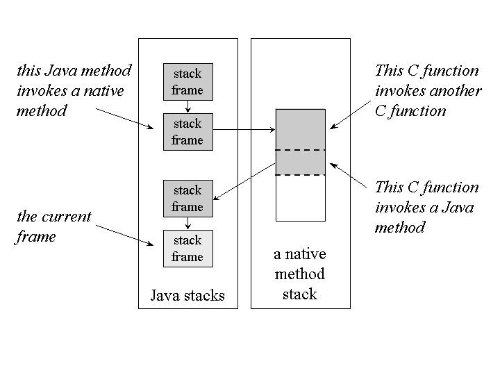

# JVM의 구조

 JVM(Java Virtual Machine)은 자바 어플리케이션을 실행시키기 위한 가상 머신입니다. Java는 WORA(Write Once Run Anywhere)이라는 목표로 개발된 언어입니다. 이러한 목표로 한 번 작성한 프로그램을 실행 환경에 구애받지 않고 어디서든 실행시킬 수 있도록 하기 위해 JVM이라는 가상 머신이 존재하는 것입니다.

## 자바가 실행되는 과정

 사용자가 작성한 소스 코드는 .java 라는 확장자를 가진 파일입니다. **.java 파일은 Compiler에 의해 .class 확장자를 가진 bite-code가 생성됩니다. bite-code는 JVM에 의해 로드되어 실행됩니다.** 아래는 JVM 구조에 대한 그림입니다.

 JVM은 위의 그림에서 보이는 것처럼 크게 3개의 서브시스템으로 나누어져 있습니다.

-   Class Loader Subsystem
-   Runtime Data Area
-   Execution Engine

### Class Loader Subsystem

 자바의 동적 클래스 로딩 기능은 Class Loader Subsystem에 의해 처리됩니다. 동적 클래스 로딩은 런타임 시에 클래스를 동적으로 읽어서 JVM 메모리에 로딩시키는 것입니다. 좀 더 자세한 내용은 아래의 링크를 참조하시면 좋습니다.

[https://futurists.tistory.com/43](https://futurists.tistory.com/43)

 Class Loader Subsystem은 런타임 중에클래스 파일이 처음으로 참조 되었을 때, 내부적으로 **Loading, Linking, Initialization**이라는 세 가지 단계를 거쳐서 JVM 메모리에 적재하게 됩니다.

#### Loading

 클래스들은 이 과정에서 로딩됩니다. 클래스들을 로딩하기 위해 **Bootstrap Class Loader, Extension Class Loader, Application Class Loader**라는 세 가지 로더가 이용됩니다.

**Bootstrap Class Loader**

 JVM이 실행될 때 가장 먼저 실행되는 로더입니다. $JAVA\_HOME/jre/lib에 있는 JVM 실행에 필요한 가장 기본적인 라이브러리(rt.jar 등)를 로딩합니다.

**Extension Class Loader**

 Bootstrap 로딩이 끝난 후에 $JAVA\_HOME/jre/lib/ext 에 있는 클래스들을 로딩합니다.

**Application Loader**

환경 변수와 같은 어플리케이션 수준의 classpath를 로딩합니다.

#### Linking

 링킹 과정에서는 **Verify, Prepare, Resolve** 과정을 거칩니다.

**Verify** - bite-code가 적절하게 포맷하여 생성되었는지 검증합니다. 만약 검증에 실패한다면 java.lang.VerifyError라는 런타임 익셉션이 발생합니다.

**Prepare** - 클래스 변수들을 위해 JVM 메모리를 할당하고, 해당 메모리를 default value로 초기화 합니다.

**Resolve** - 모든 Symbolic memory references를 Method Area의 Direct references로 대체합니다. 

#### Initialization

 초기화 과정은 Class Loader Subsystem의 마지막 단계로, code와 static block에 정의되어 있는 모든 정적 변수를 할당합니다. 이는 클래스 내에서 위에서 부터 아래 순으로 진행되고, 부모 클래스에서 자식 클래스로의 상속 구조 순으로 진행됩니다.

### Runtime Data Area

 Runtime Data Area는 다음과 같이 5개의 구성 요소로 이루어져 있습니다.

1\. Method Area

 클래스명, 부모 클래스명, 메서드와 변수명, 정적 변수 등의 클래스 수준의 정보들을 저장하는 영역입니다. JVM당 하나의 Method Area를 가지며 리소스들간에 공유되는 영역입니다.

2\. Heap Area

 모든 오브젝트와 배열들이 이 영역에 저장됩니다. JVM당 하나의 Heap Area가 존재하며, Method Area와 Heap Area는 멀티 쓰레드 환경에서 메모리를 공유합니다. 즉, 이 영역에 저장된 데이터들은 thread-safe하지 않습니다.

3\. Stack Area

 모든 쓰레드에 대해 JVM이 별도의 run-time stack을 생성하여 위치시키는 영역입니다. 모든 메소드 호출에 대해 각 진입점들에는 Stack Frame이라 불리는 Stack Memory가 생성됩니다. 모든 지역 변수들이 Stack Memory에서 생성됩니다. 이 영역은 쓰레드간에 데이터를 공유하지 않으므로 thread-safe한 영역입니다.

4\. PC Register

 PC(Program Counter) Register는 각 쓰레드별로 생성됩니다. PC Register에는 현재 실행중인 명령의 주소를 저장하고 있고, 명령이 실행되고나면 다음 명령으로 업데이트 됩니다.

5\. Native Method Stack

 Native Method Stack은 각 쓰레드별로 생성됩니다. 쓰레드가 Native Method를 호출하면 Java Stack을 벗어나게 되며, Native Method에 의해 Native Method Stack이 사용됩니다. Native Method에서 다시 자바 메소드를 호출하면 Java Stack으로 되돌아가게 됩니다. 여기서 Native Method는 다른 언어로 작성된 코드를 호출하기 위한 규약입니다. C나 C++ 언어에 접근하거나 하드웨어 접근용으로 쓰입니다.

### Execution Engine

 Execution Engine는 Runtime Data Area에 할당된 바이트 코드(.class)를 읽고 명령을 실행합니다. Execution Engine에는 세 가지 요소로 구성되어 있습니다.

1\. Interpreter

 바이트 코드를 한 줄씩 해석하고 실행합니다. 이 인터프리터의 단점은 하나의 메서드를 여러 번 호출할 때마다 해석 요청이 필요하다는 점입니다.

2\. JIT Compiler (Just-In-Time Compiler)

 JIT Compiler는 Interpreter의 단점을 보완합니다. JIT는 바이트 코드를 컴파일하여 Native Code로 변환하고, 인터프리터에서 반복되는 메서드 호출이 발견되면 인터프리터에 다시 재해석 요청을 하는 것이 아니라 JIT에서 Native Code를 제공합니다. 이러한 방법은 인터프리터에게 매번 같은 메서드를 해석하도록 요청하지 않게하므로 효율성이 높아집니다.

3\. Garbage Collector

 참조되지 않는 객체들을 수집하고 제거하는 역할을 합니다. Garbage Collector는 System.gc() 메서드를 통해 트리거를 실행할 수는 있지만, 실제로 Garbage Collector가 실행될지는 보장하지 않습니다. System.gc() 메서드는 모든 쓰레드를 중단시키기 때문에 실제로 코드 레벨에서는 호출해서는 안됩니다.

### Java Native Interface (JNI)

 JNI는 Native Method Library와 상호작용하는 인터페이스이며, 실행에 필요한 Native Library(C, C++)들을 제공합니다. JNI는 JVM이 C/C++ 라이브러리들을 호출할 수 있게하고, 하드웨어에 특정될 수 있는 C/C++ 라이브러리에 호출 될 수 있게 합니다.

 번역이 좀 어려워서 아래에 원문을 별첨합니다. (혹시 더 정확한 해석이 있다면 조언 부탁드립니다.)

  
 It is an interface which interacts with the Native Method Libraries and provides the native libraries(C, C++) required for the execution. It enables JVM to call C/C++ libraries and to be called by C/C++ libraries which may be specific to hardware.

### Native Method Libraries

 Execution Engine에서 필요로하는 Native Libraries의 컬렉션입니다.

---

## 참고자료

[https://dzone.com/articles/jvm-architecture-explained](https://dzone.com/articles/jvm-architecture-explained)

[https://www.geeksforgeeks.org/jvm-works-jvm-architecture/](https://www.geeksforgeeks.org/jvm-works-jvm-architecture/)

[https://www.artima.com/insidejvm/ed2/jvm9.html](https://www.artima.com/insidejvm/ed2/jvm9.html)
