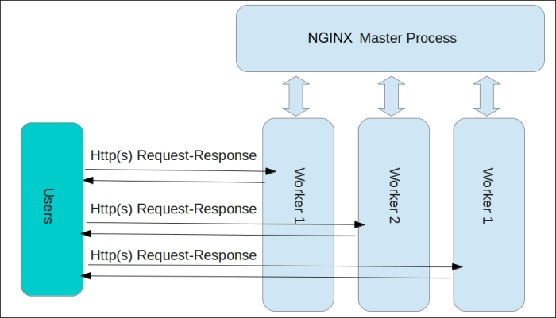
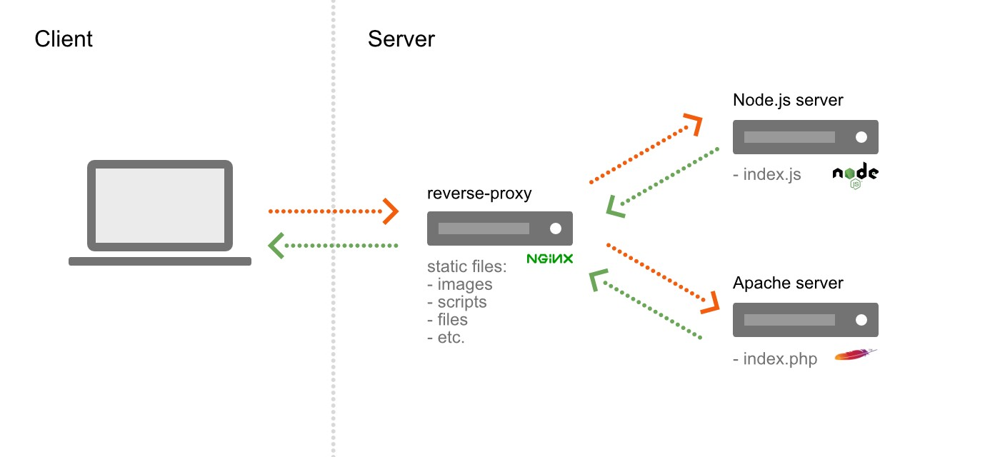

# Nginx 이해하기

## Nginx?

 Nginx는 간단하게 말씀드리자면 경량 웹 서버입니다. 클라이언트로부터 요청을 받았을 때 요청에 맞는 정적 파일을 응답해주는 HTTP Web Server로 활용되기도 하고, Reverse Proxy Server로 활용하여 WAS 서버의 부하를 줄일 수 있는 로드 밸런서로 활용되기도 합니다.

## Apache 서버와 다른 점


 Apache와 같은 웹서버는 클라이언트로부터 받은 요청을 처리할 때 새로운 프로세스 또는 쓰레드를 생성하여 처리합니다. 요청마다 쓰레드가 생성되므로 접속하는 사용자가 많으면 그만큼 쓰레드가 생성되어 CPU와 메모리 자원의 소모가 커집니다.


 Nginx는 **Event-Driven** 구조로 동작하기 때문에 한 개 또는 고정된 프로세스만 생성하여 사용하고, 비동기 방식으로 요청들을 Concurrency 하게 처리할 수 있습니다. 위의 그림에서 보이듯이 Nginx는 새로운 요청이 들어오더라도 새로운 프로세스와 쓰레드를 생성하지 않기 때문에 프로세스와 쓰레드 생성 비용이 존재하지 않고, 적은 자원으로도 효율적인 운용이 가능합니다. 이러한 Nginx의 장점 덕분에 단일 서버에서도 동시에 많은 연결을 처리할 수 있습니다.

## Nginx의 구조

 Nginx는 하나의 Master Process와 다수의 Worker Process로 구성되어 실행됩니다. Master Process는 설정 파일을 읽고, 유효성을 검사합니다. 그리고 Worker Process를 관리합니다. 모든 요청은 Worker Process에서 처리합니다. Nginx는 **이벤트 기반** 모델을 사용하고, Worker Process 사이에 요청을 효율적으로 분배하기 위해 OS에 의존적인 메커니즘을 사용합니다. Worker Process의 개수는 설정 파일에서 정의되며, 정의된 프로세스 개수와 사용 가능한 CPU 코어 숫자에 맞게 자동으로 조정됩니다.



## Nginx 설정

설정 파일 구조

 Nginx는 지시어에 부여하는 값에 의해 작동합니다. Nginx의 메인 설정 파일 경로는 /etc/nginx/nginx.conf 입니다.

( /etc/nginx/nginx.conf 에 없다면 /usr/local/nginx/conf/nginx.conf 또는 /usr/local/etc/nginx/nginx.conf 에 위치합니다.)

Nginx 모듈의 동작은 configuration 파일에 있는 directives(지시어)에 의해 제어됩니다. directive는**simple directive**와**block directive**두 가지 종류가 있습니다.

**simple directive**: 이름, 값이 있고 세미콜론(;)으로 끝납니다.

```
worker_process 1;
```

**block directive**: simple directive의 구조에 블록("{", "}")을 감싼 형태의 지시어입니다.

```
events {
    worker_connections  1024;
}
```

 block directive는 해당 directive 안에 또 다른 block directive가 포함될 수 있습니다.

```
http {
  server {

    location / {
      root /path/to/html ;
    }

    location /images/ {
      root /path/to/image ;
    }

  }
}
```

include 지시어는 특정 파일을 포함하는 기능을 수행합니다. 파일의 내용은 지시어가 있는 바로 그 위치에 해당 파일 내용이 삽입됩니다.

```
http {
    # mime.types 파일을 읽어들인다. (단일 파일을 include)
    include       /etc/nginx/mime.types;

    # /etc/nginx/conf.d 디렉토리 아래 있는 .conf 파일을 모두 읽어 들임 (특정 디렉토리의 모든 파일을 include)
    include /etc/nginx/conf.d/*.conf;
}
```

지시어 값에서 사용되는 약자

```
k 또는 K : 킬로바이트
m 또는 M : 메가바이트
ms : 밀리초
s : 초
m : 분
h : 시
d : 일
w : 주
M : 월(30일)
y : 연(365일)
```

 시간의 기본 단위는 초입니다.

```
# 아래의 세 지시어는 모두 같은 값을 가집니다. 시간의 기본 단위는 초입니다.
client_body_timeout 3m;
client_body_timeout 180s;
client_body_timeout 180;
```

문자열 값

 지시어 값으로 사용되는 문자열 값은 ' 또는 " 을 사용하지 않고 문자열을 나타낼 수 있습니다. 하지만 공백 문자, 세미 콜론(;), 중괄호 등 특수문자를 사용하기 위해서는 ' 또는 " 으로 문자열을 감싸서 지시어를 선언해야 합니다.

#### 메인 설정

 /etc/nginx/nginx.conf

```
# worker 프로세스를 실행할 사용자 설정
# - 이 사용자에 따라 권한이 달라질 수 있다.
user  nginx;
# 실행할 worker 프로세스 설정
# - 서버에 장착되어 있는 코어 수 만큼 할당하는 것이 보통, 더 높게도 설정 가능
worker_processes  1;

# 오류 로그를 남길 파일 경로 지정
error_log  /var/log/nginx/error.log warn;
# NGINX 마스터 프로세스 ID 를 저장할 파일 경로 지정
pid        /var/run/nginx.pid;


# 접속 처리에 관한 설정을 한다.
events {
    # 워커 프로레스 한 개당 동시 접속 수 지정 (512 혹은 1024 를 기준으로 지정)
    worker_connections  1024;
}

# 웹, 프록시 관련 서버 설정
http {
    # mime.types 파일을 읽어들인다.
    include       /etc/nginx/mime.types;
    # MIME 타입 설정
    default_type  application/octet-stream;

    # 엑세스 로그 형식 지정
    log_format  main  '$remote_addr - $remote_user [$time_local] "$request" '
                      '$status $body_bytes_sent "$http_referer" '
                      '"$http_user_agent" "$http_x_forwarded_for"';

    # 엑세스 로그를 남길 파일 경로 지정
    access_log  /var/log/nginx/access.log  main;

    # sendfile api 를 사용할지 말지 결정
    sendfile        on;
    #tcp_nopush     on;

    # 접속시 커넥션을 몇 초동안 유지할지에 대한 설정
    keepalive_timeout  65;

    # (추가) nginx 버전을 숨길 수 있다. (보통 아래를 사용해서 숨기는게 일반적)
    server_tokens off

    #gzip  on;

    # /etc/nginx/conf.d 디렉토리 아래 있는 .conf 파일을 모두 읽어 들임
    include /etc/nginx/conf.d/*.conf;
}
```

#### http 블록

 http 블록은 HTTP 부분과 관련된 모듈의 지시어와 블록을 정의하며, server와 location의 루트 블록이라고 할 수 있습니다. http, server, location 블록은 계층 구조를 가지고 있습니다. 많은 지시어가 각 블록에서 동시에 사용될 수 있는데, http 블록의 내용은 server 블록의 기본값이 되고, server 블록의 내용은 location 블록의 기본값이 됩니다. 만약 상위 블록에서 선언된 지시어를 하위 블록에서 다시 선언하면 상위의 지시어는 무시됩니다.http 블록 안에 한 개 이상의 server 블록을 선언할 수 있습니다.

#### server 블록

 server 블록은 하나의 호스트를 선언하는데 사용하며, http 블록 안에서만 사용할 수 있습니다.server 블록에는 한 개 이상의 location 블록을 선언할 수 있습니다.

#### location 블록

 location 블록에는 server 블록 안에 정의되며, 특정 URL을 처리하는 방법을 정의합니다. 예를 들면 http://example.com/hello/1 과 http://example.com/world/1 접근하는 요청을 다르게 처리하고 싶을 때 사용합니다.

#### events 블록

 events 블록은 네트워크의 작동 환경을 설정하는 지시어를 제공합니다. 이벤트 블록의 지시어는 이벤트 블록에서만 사용할 수 있고, http, server, local 블록과는 상속 관계를 갖지 않습니다. 아래의 지시어들은 반드시 events 블록 안에서만 사용해야 합니다.

1\. accept\_mutex

```
accept_mutex on;
```

 LISTEN 소켓을 오픈하기 위한 accept 뮤텍스의 사용/해제를 설정합니다.

2\. accept\_mutex\_delay

```
accept_mutex_delay 500ms;
```

 자원 획득을 다시 시도하기 전에 작업자 프로세스가 기다려야 하는 시간을 정의합니다. accept\_mutex 지시어가 off 로 설정되어 있으면 이 값은 사용되지 않습니다.

3\. worker\_connections

```
worker_connections 1024;
```

 Worker Process 가 동시에 처리할 수 있는 접속자 수를 정의합니다. worker\_processes \* worker\_connections = 최대 접속자 수

## Reverse Proxy



 Nginx는 리버스 프록시로도 활용할 수 있습니다. 리버스 프록시란 외부 클라이언트에서 서버로 접근 시, 중간에서 중개자 역할을 하여 내부 서버로 접근할 수 있도록 도와주는 서버입니다. 리버스 프록시를 활용했을 때 얻을 수 있는 장점은 아래와 같습니다.

-   **보안** : 외부 사용자로부터 내부망에 있는 서버의 존재를 숨길 수 있습니다. 모든 요청은 리버스 프록시 서버에서 받으며, 매핑되는 내부 서버로 요청을 전달합니다. 또한 Nginx는 SSL 설정도 가능합니다.
-   **로드밸런싱** : 리버스 프록시 서버가 내부 서버에 대한 정보를 알고 있으므로, 각 서버의 상태에 따라 부하를 분산시키며 요청을 전달할 수 있습니다.

#### Reverse Proxy 설정하기

```
http {
    server {
        listen 80;
        location / {
            proxy_pass http://127.0.0.1:8081;
        }
    }
}
```

 만약 listen 지시어를 선언하지 않으면 default 값인 80 port 로 설정됩니다.

---

## 참고자료

[https://nginx.org/en/docs/beginners\_guide.html](https://nginx.org/en/docs/beginners_guide.html)

[https://subscription.packtpub.com/book/networking\_and\_servers/9781785281839/1/ch01lvl1sec08/the-nginx-architecture](https://subscription.packtpub.com/book/networking_and_servers/9781785281839/1/ch01lvl1sec08/the-nginx-architecture)

[https://www.aosabook.org/en/posa/warp.html](https://www.aosabook.org/en/posa/warp.html)

[https://extrememanual.net/9976](https://extrememanual.net/9976)

[https://kscory.com/dev/nginx/install](https://kscory.com/dev/nginx/install)

[https://12bme.tistory.com/366](https://12bme.tistory.com/366)
