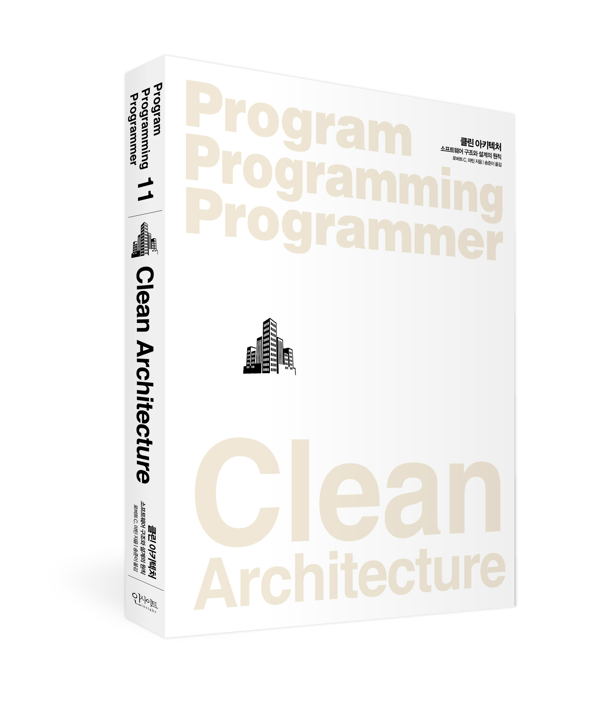

# 클린 아키텍처 1 ~ 2 장

## 1장. 설계와 아키텍쳐란?
1. 아키텍쳐 (Architecture)  
 저수준의 세부사항과는 분리된 **고수준의 구성요소**  
 
2. 설계 (Design)  
 저수준의 구조 또는 세부사항  
 
 책에 나와있는 정의로는 둘의 차이는 상당히 모호하게 느껴집니다.  
 고수준, 저수준이라는 어휘는 읽는 이에 따라 해석이 달라질 수 있습니다. 즉, 이 둘 사이에는 차이가 없습니다.
 어떤 아키텍쳐를 볼 때, 깊게 들여다보면 그 속에 들어있는 무수히 많은 저수준의 세부사항을 확인할 수 있습니다.
 
- - -
 
#### 읽으면서 제가 느꼈던 것은 지구를 바라보는 것과 같다는 생각이 들었습니다.  

#### 멀리서 바라보면 행성(고수준의 구성요소)으로 보입니다.

- - -

#### 더 가까이 확대해보면 도시(저수준의 세부사항)가 보이기 시작합니다.  

- - -

 **어느 시점에서 바라보는지에 따라 구성 요소의 수준은 상대적으로 달라지며, 이는 모두 소프트웨어를 지탱하는 전체 설계의 구성요소 입니다.** 
 이 둘은 단절없이 이어져 있으며, 이를 통해 대상 시스템의 구조를 정의합니다. 개별적으로는 존재할 수 없고, 실제로 이 둘을 구분 짓는 경계는 뚜렷하지 않습니다. 
 그저, 고수준에서 저수준으로 향하는 의사결정의 연속만이 있을 뿐입니다.

#### 그렇다면 이러한 의사결정의 최종적 목표는 무엇일까요? 좋은 소프트웨어 설계의 목표는 무엇을까요?
> 소프트웨어 아키텍처의 목표는 필요한 시스템을 만들고 유지보수하는 데 투입되는 인력을 최소화하는 데 있다.

 

> 설계는 변경을 위해 존재하고 변경에는 어떤 식으로든 비용이 발생한다. 훌륭한 설계란 합리적인 비용안에서 변경을 수용할 수 있는 구조를 만드는 것이다.  
> **오브젝트<<조영호님 저서>> 97페이지 중 일부..**
- - -

참고자료

클린 아키텍처 <<로버트C. 마틴 저>>