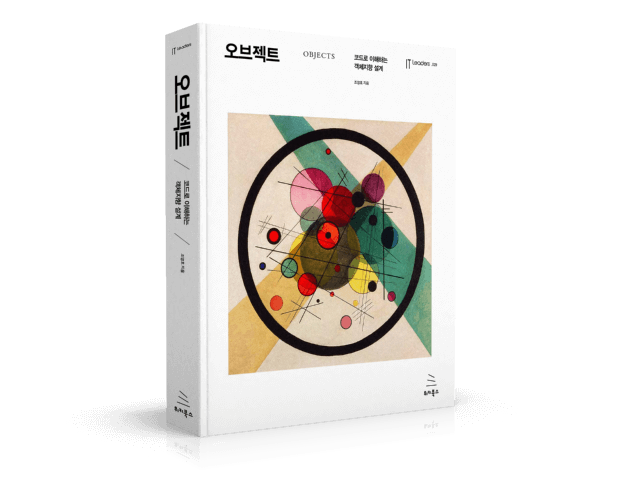

# 클린 아키텍처 1 ~ 2 장

## 1장. 설계와 아키텍쳐란?
1. 아키텍쳐 (Architecture)  
 저수준의 세부사항과는 분리된 **고수준의 구성요소**  
 
2. 설계 (Design)  
 저수준의 구조 또는 세부사항  
 
 책에 나와있는 정의로는 둘의 차이는 상당히 모호하게 느껴집니다. 
 고수준, 저수준이라는 어휘는 읽는 이에 따라 해석이 달라질 수 있습니다. 가까이에서 관찰하던 세밀한 부분을 멀리서보면 
 더이상 눈에 보이지 않고 하나의 커다란 덩어리로 보이고, 계속해서 멀어지면 커다랗게 보였던 덩어리 또한 보이지 않게되고 더 큰 덩어리로 보이게 됩니다.
 반대로 어떤 아키텍쳐를 볼 때, 깊게 들여다보면 그 속에 들어있는 무수히 많은 저수준의 세부사항을 확인할 수 있습니다.
 
- - -
 
#### 읽으면서 제가 느꼈던 것은 지구를 바라보는 것과 같다는 생각이 들었습니다.  

#### 멀리서 바라보면 행성(고수준의 구성요소)으로 보입니다.

- - -

#### 더 가까이 확대해보면 도시(저수준의 세부사항)가 보이기 시작합니다.  

- - -

 **어느 시점에서 바라보는지에 따라 구성 요소의 수준은 상대적으로 달라지며, 이는 모두 소프트웨어를 지탱하는 전체 설계의 구성요소 입니다.** 
 이 둘은 단절없이 이어져 있으며, 이를 통해 대상 시스템의 구조를 정의합니다. 개별적으로는 존재할 수 없고, 실제로 이 둘을 구분 짓는 경계는 뚜렷하지 않습니다. 
 그저, 고수준에서 저수준으로 향하는 의사결정의 연속만이 있을 뿐입니다.

#### 그렇다면 이러한 의사결정의 최종적 목표는 무엇일까요? 좋은 소프트웨어 설계의 목표는 무엇을까요?
> 소프트웨어 아키텍처의 목표는 필요한 시스템을 만들고 유지보수하는 데 투입되는 인력을 최소화하는 데 있다.

<br/>

> 설계는 변경을 위해 존재하고 변경에는 어떤 식으로든 비용이 발생한다. 훌륭한 설계란 합리적인 비용안에서 변경을 수용할 수 있는 구조를 만드는 것이다.  
> **오브젝트<<조영호님 저서>> 97페이지 중 일부..**
- - -
<br/>

## 2장. 두 가지 가치에 대한 이야기
 모든 소프트웨어 시스템은 이해관계자에게 서로 다른 두 가지 가치를 제공하는데, **행위(Behavior)와 구조(Structure)** 가 바로 그것입니다. 
 
### 행위
 소프트웨어의 첫 번째 가치는 행위입니다. 프로그래머는 이해관계자가 기능 명세서나 요구사항 문서를 구체화 할 수 있도록 돕고, 이해관계자의 기계가 이러한 요구사항을 
 만족하도록 코드를 작성합니다. 프로그래머는 요구사항을 구현하고 버그를 수정하는 일뿐만 아니라 다른 역할도 책임감 있게 수행해야 합니다.
 
### 아키텍처
 소프트웨어의 두 번째 가치는 '소프트웨어(Software)'라는 단어와 관련이 있습니다. '소프트웨어'라는 단어는 '부드러운(soft)'과 '제품(ware)'이라는 단어의 
 합성어입니다. 여기서 '부드러운(soft)'라는 단어에서 두 번째 가치가 존재합니다.  
 <br/>
 소프트웨어를 만드는 이유는 기계의 행위를 쉽게 변경할 수 있도록 하기 위함입니다. 만약 기계의 행위를 바꾸는 일을 어렵게 만들고자 했다면, 우리는 소프트웨어가 아니라
 하드웨어라고 불렀을 것입니다.  
 <br/>
 소프트웨어가 가진 본연의 목적을 추구하려면 소프웨어는 반드시 '부드러워'야 합니다. 즉, 변경하기 쉬어야 합니다. 
 이해관계자가 기능에 대한 생각을 바꾸면, 이러한 **변경사항을 간단하고 쉽게 적용할 수 있어야 합니다.**  
 <br/>
 #### 변경에 대한 유연성
 위에서 이야기한 맥락은 조영호님의 저서인 '오브젝트'라는 책에서 강조하는 내용과 같다는 생각이 들었습니다.
 
> 좋은 설계란 무엇인가? 우리가 짜는 프로그램은 두 가지 요구사항을 만족시켜야 한다. 우리는 오늘 완성해야 하는 기능을 구현하는 코드를 짜야 하는 동시에
> 내일 쉽게 변경할 수 있는 코드를 짜야 한다. 좋은 설계란 오늘 요구하는 기능을 온전히 수용하면서 내일의 변경을 매끄럽게 수용할 수 있는 설계다.

<br/>

> 변경을 수용할 수 있는 설계가 중요한 이유는 요구사항이 항상 변경되기 때문이다. 개발을 시작하는 시점에 구현에 필요한 모든 요구사항을 수집하는 것은 불가능에 가깝다.
> 모든 요구사항을 수집할 수 있다고 가정하더라도 개발이 진행되는 동안 요구사항은 바뀔 수밖에 없다.  
> **오브젝트<<조영호님 저서>> 35페이지 중 일부..**

<br/>

 소프트웨어 개발 비용의 증가를 결정짓는 주요 원인은 바로 변경사항의 범위와 형태의 차이에 있습니다.  
 여기서의 문제는 시스템의 아키텍처에 있습니다. 아키텍처가 특정 형태를 다른 형태보다 선호하면 할수록, 
 새로운 기능을 이 구조에 맞추는 게 더 힘들어집니다. 따라서 아키텍처는 형태에 독립적이어야 하고, 그럴수록 더 실용적입니다.
 
- - -
### 아키텍처를 위해 투쟁하라
 **위에서 언급된 두 가지 가치에 대한 책임을 다하려면 더 나은 아키텍처를 위해 투쟁해야 합니다.**
 개발팀, 마케팅팀, 영업팀 등, 각 부서들은 회사에서 가장 중요하다고 스스로 믿는 가치들이 모두 다릅니다. 
 이렇게 서로 다른 이해관계로 인해 서로가 생각하는 가치를 위해 투쟁합니다. 효율적인 소프트웨어 개발팀은 이런 투쟁에서 
 정면으로 맞서 싸웁니다. 개발자인 우리들 또한 이해관계자며, 소프트웨어를 안전하게 보호해야 할 책임이 있습니다.  

- - -

### 변화에 유연한 코드를 작성하는 연습 (오브젝트 저서 참고)
 간단하게 마켓에서 물건을 구입하면 회원의 등급에 따라 포인트를 적립해주는 기능을 구현해보겠습니다.
 회원의 등급은 PLATINUM, GOLD, SILVER 등급이 있습니다.  
 * PLATINUM 적립률 : 20%
 * GOLD 적립률 : 10%
 * SILVER 적립률 : 5%
 
우선 금액을 계산하기 위한 Money 클래스를 아래와 같이 작성했습니다. 편의상 사용자의 포인트와 같이 사용하도록 구현하려고 합니다.
#### Money.class

```java
public class Money {

    public static final Money ZERO = Money.wons(0);

    private int amount;

    private Money(int amount) {
        this.amount = amount;
    }

    public static Money wons(int amount) {
        return new Money(amount);
    }

    public Money plus(Money money) {
        return new Money(this.amount + money.amount);
    }

    public Money minus(Money money) {
        return new Money(this.amount - money.amount);
    }

    public Money times(double percent) {
        return new Money((int) (this.amount * percent));
    }

    @Override
    public boolean equals(Object obj) {
        if (!(obj instanceof Money)) {
            return false;
        }

        Money other = (Money) obj;
        return this.amount == other.amount;
    }

    @Override
    public int hashCode() {
        int result = 17;
        result = 31 * result + amount;
        return result;
    }

    @Override
    public String toString() {
        return String.format("{ amount : %d }", amount);
    }
}
```

<br/>

 다음은 고객의 등급을 나타내는 Rank 클래스이며, Enum Type 으로 작성하였습니다.

#### Rank.class
```java
public enum Rank {
    PLATINUM, GOLD, SILVER
}
```

<br/>

 고객을 나타내는 Customer 클래스입니다.
 
#### Customer.class
```java
public class Customer {

    private String name;
    private Rank rank;
    private Money point;

    public Customer(String name, Rank rank) {
        this.name = name;
        this.rank = rank;
        this.point = Money.ZERO;
    }

    public Customer(String name, Rank rank, Money point) {
        this.name = name;
        this.rank = rank;
        this.point = point;
    }

    public String getName() {
        return name;
    }

    public Rank getRank() {
        return rank;
    }

    public void savePoint(Money point) {
        this.point = this.point.plus(point);
    }
}
```

<br/>

 제품을 나타내는 Product 클래스이며 간단하게 제품명, 가격만 속성을 갖습니다.
 
#### Product.class
```java
public class Product {

    private String name;
    private Money price;

    public Product(String name, Money price) {
        this.name = name;
        this.price = price;
    }

    public Money calculatePrice(int quantity) {
        return price.times(quantity);
    }

    public String getName() {
        return name;
    }

    public Money getPrice() {
        return price;
    }
}
```

<br/>

 물건을 구매하고 받는 영수증을 나타내는 Receipt 클래스입니다.

#### Receipt.class
```java
public class Receipt {

    private final String buyerName;
    private final String productName;
    private final Money price;
    private final int purchaseQuantity;
    private final Money totalPrice;
    private final Money savedPoint;
    private final LocalDateTime purchaseDateTime;

    public Receipt(String buyerName,
                   String productName,
                   Money price,
                   int purchaseQuantity,
                   Money totalPrice,
                   Money savedPoint) {
        this.buyerName = buyerName;
        this.productName = productName;
        this.price = price;
        this.purchaseQuantity = purchaseQuantity;
        this.totalPrice = totalPrice;
        this.savedPoint = savedPoint;
        this.purchaseDateTime = LocalDateTime.now();
    }

    @Override
    public boolean equals(Object obj) {
        if (!(obj instanceof Receipt)) {
            return false;
        }

        Receipt other = (Receipt) obj;

        return buyerName.equals(other.buyerName)
                && productName.equals(other.productName)
                && price == other.price
                && purchaseQuantity == other.purchaseQuantity
                && totalPrice.equals(other.totalPrice)
                && savedPoint.equals(other.savedPoint)
                && purchaseDateTime.equals(other.purchaseDateTime);
    }

    public String getBuyerName() {
        return buyerName;
    }

    public String getProductName() {
        return productName;
    }

    public Money getPrice() {
        return price;
    }

    public int getPurchaseQuantity() {
        return purchaseQuantity;
    }

    public Money getTotalPrice() {
        return totalPrice;
    }

    public Money getSavedPoint() {
        return savedPoint;
    }

    public LocalDateTime getPurchaseDateTime() {
        return purchaseDateTime;
    }
}
```

<br/>

 물건을 구입할 수 있도록 도와주는 Market 에 대한 클래스입니다. 리턴 값으로 영수증을 나타내는 Receipt 클래스를 반환합니다.

#### Market.class
```java
public class Market {
    public Receipt buy(Product product, Customer customer, int quantity) {
        Money totalPrice = product.calculatePrice(quantity);
        Money savedPoint = calculateSavingPoint(customer, totalPrice);
        customer.savePoint(savedPoint);

        return new Receipt(
                customer.getName(),
                product.getName(),
                product.getPrice(),
                quantity,
                totalPrice,
                savedPoint
        );
    }

    private Money calculateSavingPoint(Customer customer, Money totalPrice) {
        Rank customerRank = customer.getRank();

        if (Rank.PLATINUM.equals(customerRank)) {
            return totalPrice.times(0.2);
        } else if (Rank.GOLD.equals(customerRank)) {
            return totalPrice.times(0.1);
        } else {
            return totalPrice.times(0.05);
        }
    }
}
```

 여기서 주목해야할 부분은 Market 클래스에서 수행되는 calculateSavingPoint() 클래스입니다. 해당 메서드를 보면 if, else if 조건 분기를 통해 회원에게 
 적립할 포인트를 계산하고 있습니다. 이렇게 여러 조건문을 통해 분기하는 로직이 들어가면 하나의 클래스가 너무 많은 책임을 수행하고 있지는 않은지 의심해 보아야합니다. 
 현재 구현된 내용은 Market 클래스가 적립금에 대해 **어떻게** 계산되는지에 대해 구체적인 내용을 알고 있습니다. 이는 변경사항에 대해 취약한 구조가 될 수 있습니다.  
 만약 새로운 정책이 추가되어 주말에는 추가로 500원의 적립금을 적립해준다는 변경사항이 생겼다고 해보겠습니다. 이러한 변경사항을 수용하기 위해서는 Market 클래스에 수정이 이루어져야 합니다.
 
 <br/>
 
 #### OCP 원칙 (Open-Closed Principal)
 기능의 확장에는 열려있고, 변경에는 닫혀있어야 한다는 객체지향 원칙.  
 OCP 원칙에 따라 변하는 개념과 변하지 않는 개념을 분리하면 Market 클래스는 적립금 계산에 대해 조금 더 자유로워 질 수 있습니다.
 
<br/>
 
* 변하지 않는 부분 : Market 에서 구입한 물건의 가격에 대해 적립금을 계산한다.
* 변하는 부분 : 구입 금액에 대한 적립금을 계산하는 방법

 행위를 기반을 객체의 책임과 역할을 구별하고, 적절한 책임을 수행할 수 있는 정보 전문가(객체)에게 자신이 원하는 동작을 수행해줄 것을 요청(위임)해야합니다.  
 이제 Market 클래스가 수행하고 있는 역할(적립금을 계산하는 방법)을 분리해보겠습니다.
 
<br/>

#### SavingPointPolicy
```java
public interface SavingPointPolicy {

    Money calculateSavingPoint(Money totalPrice, Customer customer);
}
```
 SavingPointPolicy 인터페이스는 적립금을 계산하는 역할을 수행합니다. 이 인터페이스를 구현하는 클래스는 적립금을 어떻게 계산할지에 대해 알고 있습니다.  
 아래는 SavingPointPolicy 인터페이스를 구현하였고, 회원의 등급에 따라 적립금을 계산하는 책임을 가지고 있습니다.
 
<br/>

#### RankBasedSavingPolicy
```java
public class RankBasedSavingPointPolicy implements SavingPointPolicy {

    @Override
    public Money calculateSavingPoint(Money totalPrice, Customer customer) {

        double savingRate = getCustomerSavingPointRate(customer);

        return totalPrice.times(savingRate);
    }

    private double getCustomerSavingPointRate(Customer customer) {
        return Arrays.stream(Rank.values())
                .filter(customer::isSatisfiedRank)
                .findFirst()
                .orElseThrow(RuntimeException::new)
                .getSavingRate();
    }
}
```

 부가적으로 if else 문을 제거하기 위해 Rank Enum 타입에서 각 등급이 얼마만큼의 적립률을 가지고 있는지 알고 있도록 rate: double 속성을 추가하였습니다.
<br/>

#### Rank

```java
public enum Rank {
    PLATINUM(0.2),
    GOLD(0.1),
    SILVER(0.05);

    private double rate;

    Rank(double rate) {
        this.rate = rate;
    }

    public double getSavingRate() {
        return rate;
    }
}
```

 이제 이렇게 변경된 클래스들을 기반으로 변경된 Market 클래스를 보겠습니다.
 
<br/>

#### Market

```java
public class Market {

    private SavingPointPolicy savingPointPolicy;

    public Market(SavingPointPolicy savingPointPolicy) {
        this.savingPointPolicy = savingPointPolicy;
    }

    public Receipt buy(Product product, Customer customer, int quantity) {
        Money totalPrice = product.calculatePrice(quantity);
        Money savedPoint = calculateSavingPoint(totalPrice, customer);
        customer.savePoint(savedPoint);

        return new Receipt(
                customer.getName(),
                product.getName(),
                product.getPrice(),
                quantity,
                totalPrice,
                savedPoint
        );
    }

    private Money calculateSavingPoint(Money totalPrice, Customer customer) {
        return savingPointPolicy.calculateSavingPoint(totalPrice, customer);
    }
}
```

 Market 클래스를 보면 프로퍼티로 SavingPointPolicy 인터페이스를 가지고 있고, 생성자 주입을 통해 인스턴스를 주입받습니다.  
 아까와는 다르게 calculateSavingPoint() 메서드는 더이상 적립률에 대해 알고있지 않고, 적립금을 계산할 것을 SavingPointPolicy 인터페이스에게 위임하고 있습니다. 
 이제 Market 클래스는 적립금을 계산하는 방법에 대해서 관여하지 않기 때문에 적립금을 계산하는 방법에 대해 얼마든지 수정할 수 있게 되었습니다. 다음은 테스트 코드입니다.
 
<br/>

```java
class MarketTest {

    @Test
    @DisplayName("등급별 포인트 적립")
    public void rankBasedSavePointTest() {
        //given
        Customer customer = new Customer("leafy", Rank.PLATINUM);
        Product product = new Product("고무오리", Money.wons(1000));
        Market market = new Market(new RankBasedSavingPointPolicy());

        //when
        Receipt receipt = market.buy(product, customer, 10);

        //then
        assertEquals(Money.wons(2000), receipt.getSavedPoint());
    }
}
```
 위의 테스트를 통해 원하는 정책을 수행하는 클래스를 생성자 주입하였고, 원하는대로 동작이 수행됨을 확인할 수 있습니다.

<br/>

#### 새로운 정책 추가..
 이제 새로운 정책을 추가하여, 기존의 등급별 적립금 계산 정책에서 주말에 구매하는 고객에 대해 500원의 추가 적립금을 더 적립해주는 정책이 생겼다고 가정해보겠습니다.  
 여기서는 RankBasedSavingPolicy 클래스를 상속하여 접근할 수도 있지만 이는 부모 클래스에 대해 강한 결합이 생기게 되므로 합성 관계를 통해 문제를 해결하는 코드를 작성해보겠습니다.  
 추가된 변경 사항은 기존의 정책에 수행된 이후에 후처리하는 정책이므로 이를 수행하는 또다른 역할의 객체를 작성합니다.
 
<br/>

#### SavingPointAfterPolicy
```java
public abstract class SavingPointAfterPolicy implements SavingPointPolicy {

    private SavingPointPolicy prev;

    public SavingPointAfterPolicy(SavingPointPolicy prev) {
        this.prev = prev;
    }

    @Override
    public Money calculateSavingPoint(Money totalPrice, Customer customer) {
        Money point = prev.calculateSavingPoint(totalPrice, customer);
        Money afterAddedPoint = afterPointProcess(totalPrice);

        return point.plus(afterAddedPoint);
    }

    abstract protected Money afterPointProcess(Money totalPrice);
}
```

 위의 추상 클래스는 적립금을 계산하는 정책을 그대로 수행하고, 그 이후에 후처리로 적립금을 계산하는 정책을 수행합니다. 후처리 정책은 추상화하여 방법에 대해서는 서브타입이 구체적으로 구현하도록 하였습니다.
 
<br/>

#### WeekSavingPointAfterPolicy
```java
public class WeekSavingPointAfterPolicy extends SavingPointAfterPolicy {

    public WeekSavingPointAfterPolicy(SavingPointPolicy prev) {
        super(prev);
    }

    @Override
    protected Money afterPointProcess(Money totalPrice) {
        if (todayIsWeekend()) {
            return Money.wons(500);
        }

        return Money.ZERO;
    }

    private boolean todayIsWeekend() {
        LocalDate currentDate = LocalDate.now();

        DayOfWeek today = currentDate.getDayOfWeek();

        return today.equals(DayOfWeek.SATURDAY) || today.equals(DayOfWeek.SUNDAY);
    }
}
```

 SavingPointAfterPolicy 추상 클래스를 상속하는 구체 클래스입니다. 해당 클래스는 오늘이 주말인지 확인하고 주말이라면 500 원의 추가 적립금을, 아니라면 0원을 반환합니다.
 
<br/>

```java
class MarketTest {

    @Test
    @DisplayName("등급별 포인트 적립")
    public void rankBasedSavePointTest() {
        //given
        Customer customer = new Customer("leafy", Rank.PLATINUM);
        Product product = new Product("고무오리", Money.wons(1000));
        Market market = new Market(new RankBasedSavingPointPolicy());

        //when
        Receipt receipt = market.buy(product, customer, 10);

        //then
        assertEquals(Money.wons(2000), receipt.getSavedPoint());
    }

    @Test
    @DisplayName("추가 포인트 적립 테스트")
    public void afterProcessTest() {
        //given
        Customer customer = new Customer("leafy", Rank.PLATINUM);
        Product product = new Product("고무오리", Money.wons(1000));
        Market market = new Market(
                new WeekSavingPointAfterPolicy(
                        new RankBasedSavingPointPolicy()
                )
        );

        //when
        Receipt receipt = market.buy(product, customer, 10);

        //then
        assertEquals(Money.wons(2500), receipt.getSavedPoint());
    }
}
```
 추가적으로 작성한 테스트 코드를 보면 정책들을 연쇄적으로 수행할 수 있게 되었고, 원하는대로 동작을 수행하고 있음을 확인할 수 있습니다.
 
<br/>

### 주의 사항!
 위 테스트 코드는 WeekSavingPointAfterPolicy 에서 수행되는 아래의 코드에 포함된 "LocalDate.now()"로 인해 현재 날짜가 주말인 경우에만 테스트를 통과합니다.
 
```java
    private boolean todayIsWeekend() {
        LocalDate currentDate = LocalDate.now();

        DayOfWeek today = currentDate.getDayOfWeek();

        return today.equals(DayOfWeek.SATURDAY) || today.equals(DayOfWeek.SUNDAY);
    }
```

 즉, 평일에 수행될 때와 주말에 수행될 때의 테스트 결과가 다르게 나타나게 됩니다. 테스트 코드는 언제 수행하든 같은 결과를 만들어내는 것이 좋다고 합니다.  
 이를 개선하기 위해서는 WeekSavingPointAfterPolicy 에서 구현하고 있는 인터페이스의 메서드에서 구매에 대한 정보를 가진 객체를 설계하고 인자로 받도록 하여 메서드를 작성하는 방법을 생각해볼 수 있을 것 같습니다.

- - -

#### 참고자료


클린 아키텍처 <<로버트C. 마틴 저>>

<br/>
<br/>



오브젝트 <<조용호 저>>
