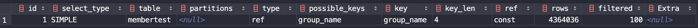
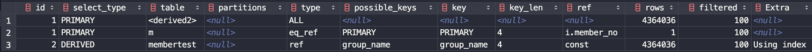

# 커버링 인덱스

 커버링 인덱스는 쿼리의 조건을 충족시키는데 필요한 모든 데이터들을 인덱스에서만 추출할 수 있는 인덱스를 의미합니다. 커버링 인덱스는 B-Tree 인덱스를 스캔하는 것만으로도 원하는 데이터를 가져 올 수 있으며, 컬럼을 읽기 위해 디스크에 접근하여 데이터 블록을 읽지 않아도 됩니다. 인덱스는 행 전체의 크기보다 훨씬 작으며, 인덱스의 값에 따라 정렬이 되기 때문에 Sequential Read 접근이 가능해집니다. 따라서 커버링 인덱스를 활용하면 쿼리의 성능을 비약적으로 향상시킬 수 있습니다.

 먼저 커버링 인덱스의 성능에 대해 테스트를 해보겠습니다.

#### 테이블 생성

 테이블은 아래와 같은 스키마로 생성하였습니다.

```
create table membertest
(
	member_no int auto_increment,
	member_id varchar(50) not null,
	group_no int not null,
	name varchar(30) not null,
	created_date datetime default now() not null,
	constraint membertest_pk
		primary key (member_no)
);
```

 인덱스는 **(group\_no, name)** 컬럼으로 생성하였고, 데이터는 약 1000만 건을 입력해두었습니다.

 그리고 아래와 같이 쿼리를 각각 수행해보았습니다.

<일반 쿼리>

수행 속도 : 40s 835ms

```
select *
from membertest
where group_no = 1
limit 5000000, 1000;
```

<커버링 인덱스 쿼리>

수행 속도 : 776ms

```
select * from (
        select member_no
        from membertest
        order by member_no
        limit 5000000, 100
    ) as i
    inner join membertest as m
on i.member_no = m.member_no;
```

 위의 두 쿼리는 같은 결과값을 반환하지만 수행 속도면에서 엄청난 차이를 보이고 있습니다. 커버링 인덱스가 어떤 역할을 하기에 속도 차이가 극적으로 나타나는 걸까요? 우선 두 쿼리의 실행 계획을 살펴보겠습니다.

<일반 쿼리의 실행 계획>



<커버링 인덱스 실행 계획>



 커버링 인덱스의 실행 계획을 보면 3번째 row의 extra에서 Using index를 확인할 수 있습니다. 이는 쿼리 수행에 커버링 인덱스가 사용되었다는 뜻입니다.

#### 두 쿼리의 성능 차이가 나는 이유

 일반 쿼리의 실행 계획을 보면 group\_name이라는 인덱스가 사용되었지만 select 절의 컬럼을 완성하기 위해서 데이터 블록에 접근(디스크에 접근)하게 됩니다.

 커버링 인덱스의 실행 계획을 보면 extra 항목에 Using index가 나타납니다. 이 쿼리는 인덱스에 포함된 컬럼(group\_no)만으로도 select 절의 컬럼(서브 쿼리의 select 절)을 완성할 수 있습니다. 즉, 디스크에 접근하지 않고도 검색하고자 하는 row의 인덱스를 추출해올 수 있습니다. **결과적으로 추출된 인덱스만으로 데이터 블록에 접근하여 원하는 데이터를 가져올 수 있게 됩니다.** 위의 경우 서브 쿼리에서 1000건의 인덱스를 추출한 후에 데이터 블록에 접근하게 됩니다.

## 클러스터드 인덱스(Clustered Index)와 넌 클러스터드 인덱스(Non Clustered Index)

### Clustered Index

-   Primary Key를 대상으로 생성합니다.
-   Primary Key가 없을 경우 Unique Key를 대상으로 생성합니다.
-   Primary Key 또는 Unique Key 둘 다 없을 경우에는 6 Byte의 Hidden Key를 생성합니다. (rowid)
-   Clustered Index를 기준으로 데이터 레코드를 물리적으로 정렬합니다. (**이는 Primary Key가 변경되면 그 레코드의 물리적 위치까지 변경되어야 한다는 의미입니다. 즉, Primary Key에 대한 의존도가 상당하기 때문에 신중하게 결정해야합니다.**)
-   테이블 당 1개만 존재 가능합니다.

### Non Clustered Index

-   데이터를 물리적으로 재배열하지 않습니다.
-   일반적인 인덱스를 말합니다.
-   테이블 당 여러 개 생성할 수 있습니다.
-   별도의 공간에 인덱스 테이블을 생성하여 데이터를 정렬합니다.

 다음 그림은 Non Clustered Index와 Clustered Index를 활용하여 데이터를 탐색하는 과정을 보여줍니다.

[##_Image|kage@cHgPGN/btqE4rqZWzr/Yc1IJ6zPS1dDuELIxU2DGK/img.png|alignCenter|data-origin-width="0" data-origin-height="0" data-ke-mobilestyle="widthContent"|https://jojoldu.tistory.com/476||_##]

 age 컬럼을 인덱스로 생성하였고, Non Clustered Index에서 age를 기준으로 정렬되어 있습니다. 그리고 Non Clustered Index에 인덱스의 컬럼 값과 Clustered Index의 값을 포함하고 있습니다. 이는 Non Clustered Index에는 실제 데이터 레코드가 없고 Clustered Index만이 해당 데이터 레코드를 알고 있기 때문입니다.

 여기서 앞서 살펴보았던 커버링 인덱스의 개념을 이해할 수 있습니다. **즉, 실제 데이터의 접근이 없이 인덱스의 컬럼만으로 쿼리를 완성하는 것입니다.**

---

## 참고자료

[https://gywn.net/2012/04/mysql-covering-index/](https://gywn.net/2012/04/mysql-covering-index/)

[https://jojoldu.tistory.com/476](https://jojoldu.tistory.com/476)

[https://mozi.tistory.com/320](https://mozi.tistory.com/320)

[https://12bme.tistory.com/149](https://12bme.tistory.com/149)

[https://lng1982.tistory.com/144](https://lng1982.tistory.com/144)

[https://denodo1.tistory.com/306](https://denodo1.tistory.com/306)