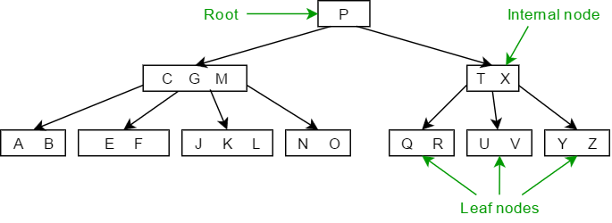

## 인덱스란?

 인덱스란 select의 성능을 향상하기 위해 지정한 컬럼들을 기준으로 일종의 목차를 생성하는 것입니다. 책의 찾아보기를 보면 내용을 쉽고 빠르게 찾아갈 수 있도록 "ㄱ", "ㄴ", "ㄷ"과 같이 순서대로 정렬되어 있는데, DBMS의 인덱스도 마찬가지로 컬럼의 값을 주어진 순서로 미리 정렬해서 보관합니다. 인덱스는 select에 대해서는 성능 향상을 보이지만, insert, update, delete에 대해서는 성능에 불리합니다.

#### 인덱스의 세 가지 분류

-   B-Tree 인덱스
-   비트맵 인덱스
-   해시 인덱스

---

## B-Tree 인덱스

 B-Tree 인덱스는 이름 그대로 데이터를 트리 구조로 저장하는 형태의 인덱스입니다. 앞의 B는 Balanced 를 의미하며, 이름 그대로 균형 잡힌 뛰어난 범용성을 인정받아 가장 많이 사용됩니다.



 위 그림과 같이 B-Tree는 최상위에 Root 노드가 존재하고, 최하위에는 Leaf 노드가 존재합니다. 그리고 Root 노드와 Leaf 노드의 사이에 존재하는 중간 노드를 Internal 노드 또는 Branch 노드라고 합니다. **인덱스와 실제 데이터는 따로 관리되는데, 인덱스의 Leaf 노드는 항상 실제 데이터를 찾아가기 위한 주소값을 가지고 있습니다.**

 인덱스 탐색은 Root -> Branch -> Leaf 노드 순으로 진행됩니다. 예를 들어 탐색 대상이 E라고 가정해보겠습니다.

1.  처음에 루트 노드는 값이 P이므로 E보다 값이 큽니다. 따라서 왼쪽 자식 노드로 탐색합니다.
2.  중간 노드에는 C, G, M이 있습니다. E는 C와 G 사이이므로 자식 노드들 중 두 번째 노드로 이동합니다.
3.  마지막인 Leaf 노드에 도달했고, E라는 Leaf노드는 E에 대한 실제 데이터가 저장되어 있는 주소를 알고 있으므로 데이터를 조회할 수 있게 됩니다.

 인덱스는 테이블의 키 컬럼만 가지고 있으므로 나머지 컬럼을 읽으려면 데이터 파일에서 해당 레코드를 읽어야 합니다. 데이터 파일은 디스크에 저장되는데, 디스크에서 읽는 것은 메모리에서 읽는 것보다 성능이 훨씬 떨어집니다. 결국 **인덱스 성능을 향상시키기 위해서는 디스크 저장소에 얼마나 덜 접근하게 만드느냐, 인덱스 Root에서 Leaf까지 오고 가는 횟수를 얼마나 줄이느냐에 달려있습니다.**

 인덱스의 개수는 3 ~ 4개 정도가 적당합니다. 너무 많은 인덱스는 새로운 Row를 저장할 때마다 인덱스를 추가해야 하고, 수정/삭제마다 인덱스 수정이 필요하여 성능상의 이슈가 발생합니다. 또한, **인덱스 역시 저장공간을 차지합니다.** 많은 인덱스는 그만큼 많은 저장 공간을 필요로 하게 됩니다. 특히, 많은 인덱스들로 인해 **옵티마이저가 잘못된 인덱스를 선택할 확률이 높습니다.**

---

## 인덱스 키 값의 크기

 **InnoDB 스토리지 엔진은 디스크에 데이터를 저장하는 기본 단위를 Page 또는 Block이라고 하며, 디스크의 모든 읽기 및 쓰기의 최소 작업 단위가 됩니다.** 또한 Page는 InnoDB 스토리지 엔진의 버퍼풀에서 데이터를 버퍼링하는 기본 단위이기도 합니다. 인덱스도 결국 Page 단위로 관리되며, B-Tree의 Root, Branch, Leaf를 구분하는 기준이 바로 Page 단위입니다. **InnoDB의 모든 페이지 크기는 16KB로 크기가 고정되어 있습니다.**

 만약 설정된 인덱스 키의 크기가 16 Byte이고, 자식 노드의 주소가 담긴 크기가 12 Byte라면, 16 \* 1024 / (16 + 12) = 585 이므로 하나의 페이지에는 585개가 저장될 수 있습니다. 여기서 인덱스 키의 크기가 32 Byte로 커지면 16 \* 1024 / (32 + 12) = 372가 되어 한 페이지에 372개가 저장됩니다. 즉, 조회 결과로 500개의 row를 읽을 때, 인덱스 크기가 16 Byte이면 1개의 페이지에서 모두 조회가 가능하지만 인덱스의 크기가 32 Byte이면 2개의 페이지를 읽어야 하므로 성능 저하가 발생하게 됩니다. 따라서 **인덱스의 키는 길면 길수록 성능상 이슈가 발생합니다.**

## B-Tree 깊이

 B-Tree 인덱스의 깊이는 상당히 중요하지만 직접적으로 제어할 방법은 없습니다. 하지만 그렇다고 해서 B-Tree의 깊이에 대해서 간과해서는 안됩니다. B-Tree 깊이가 어떻게 성능에 영향을 미치는지 알아보겠습니다. 만약 B-Tree의 깊이가 3이라고 가정해보겠습니다. 인덱스의 키 값이 16 Byte라면 최대 2억(585 \* 585 \* 585) 개 정도의 키 값을 담을 수 있지만 키 값이 32 Byte로 늘어나면 5천만(372 \* 372 \* 372) 개로 줄어듭니다. **B-Tree의 깊이는 데이터베이스에서 값을 검색할 때 몇 번이나 랜덤하게 디스크를 읽어야 하는지와 직결됩니다. 결론적으로 인덱스의 키값의 크기가 커질수록 하나의 인덱스 페이지가 담을 수 있는 인덱스 키값의 개수가 적어지고, 그로 인해 더 많은 디스크 접근이 발생하게 됩니다.**

## 기수성 (Cardinality)

 기수성은 모든 인덱스 키 값 가운데 유니크한 값의 수를 의미합니다. 전체 인덱스 키 값은 100개 이고, 그중에서 유니크한 값의 수가 10개라면 기수성은 10입니다. 인덱스의 키 값 가운데 중복된 값이 많아지면 많아질수록 기수성은 낮아집니다. 즉, **기수성은 해당 컬럼의 중복된 수치를 나타냅니다.** 예를 들어 성별, 학년 등은 기수성이 낮습니다. 주민등록번호, 계좌번호 등은 기수성이 높습니다. 인덱스를 통해 검색 성능 향상을 이끌어내려면 검색 대상을 줄여야 합니다. 만약 성별을 인덱스로 잡았다면, 남/녀 중 하나를 선택하기 때문에 인덱스를 통해 50% 밖에 걸러내지 못합니다. 하지만 기수성이 높은 주민등록번호 같은 경우, 인덱스를 통해 데이터의 대부분을 걸러내기 때문에 빠르게 검색이 가능합니다.

** 여러 컬럼으로 인덱스를 구성하는 경우에는 기수성이 높은 컬럼부터 낮은 순으로 구성하는 게 성능이 뛰어납니다.** 성능에 대한 비교는 아래의 링크를 참조하시면 쉽게 이해하실 수 있습니다.

[https://jojoldu.tistory.com/243](https://jojoldu.tistory.com/243)

#### 인덱스 컬럼 구성

 여러 컬럼으로 인덱스 시, 조건식에 누락된 컬럼이 있는 경우는 어떻게 될까요? 꼭 인덱스의 컬럼을 모두 사용해야만 인덱스가 사용되는 것은 아닙니다. 그렇다면 인덱스의 컬럼 중 어떤 것들이 누락되어도 되고, 누락되면 안 되는 것일까요?

만약 인덱스를 아래와 같은 컬럼으로 생성했다고 가정해보겠습니다.

```
group_no, from_date, is_bonus
```

이때, **조회 쿼리 사용 시 인덱스를 태우려면 최소한 첫 번째 인덱스 컬럼은 조회 조건에 포함되어야만 합니다. 첫 번째 인덱스 컬럼이 조회 쿼리에 없으면 인덱스를 타지 않습니다.**

#### 인덱스 조회 시 주의 사항

 between, like, <, > 등 범위 조건은 해당 컬럼은 인덱스를 타지만, 그 뒤 인덱스 컬럼들은 인덱스가 사용되지 않습니다. 즉, group\_no, from\_date, is\_bonus 컬럼으로 인덱스가 구성되어 있는데 조회 쿼리를 아래와 같이 사용하면 is\_bonus는 인덱스가 사용되지 않습니다.

```
where group_n o= XX and is_bonus = YY and from_date > ZZ
```

반대로 =, in은 다음 컬럼도 인덱스를 사용합니다. in은 결국 =을 여러 번 실행시킨 것이기 때문입니다. 단, **in은 인자값으로 상수가 포함되면 문제없지만, 서브 쿼리를 넣게 되면 성능상 이슈가 발생합니다.** in의 인자로 서브쿼리가 들어가면 서브 쿼리의 외부가 먼저 실행되고, in은 체크 조건으로 실행되기 때문입니다.

 and 연산자는 각 조건들이 읽어와야할 row 수를 줄이는 역할을 하지만, **or 연산자는 비교해야할 row가 더 늘어나기 때문에 풀 테이블 스캔이 발생활 확률이 높습니다.** 따라서 where 절에서 or 연산자를 사용할 때는 주의가 필요합니다.

 인덱스가 사용된 컬럼 값은 그대로 사용해야만 인덱스가 사용됩니다. 인덱스는 가공된 데이터를 저장하고 있지 않기 때문입니다. 예를 들어, where salary \* 10 > 150000; 은 인덱스를 사용하지 못하지만, where salary > 150000 / 10; 은 인덱스를 사용합니다.

 null 값의 경우, is null 조건으로 인덱스 레인지 스캔이 가능합니다.

---

## 참고자료

[https://jojoldu.tistory.com/243](https://jojoldu.tistory.com/243)

[https://12bme.tistory.com/138](https://12bme.tistory.com/138)

[https://zorba91.tistory.com/292](https://zorba91.tistory.com/292)

[https://zorba91.tistory.com/293](https://zorba91.tistory.com/293)