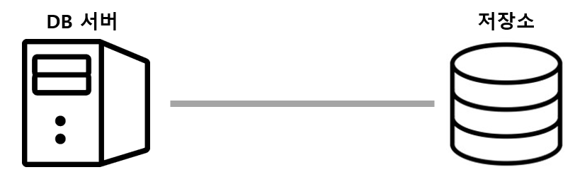
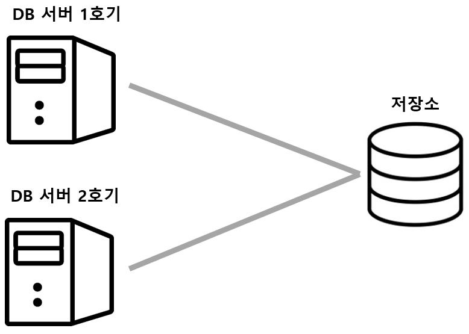
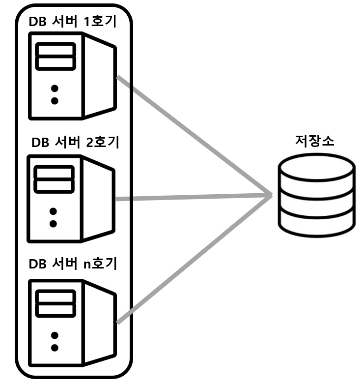
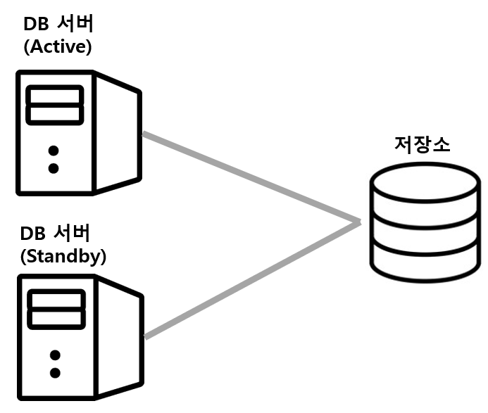
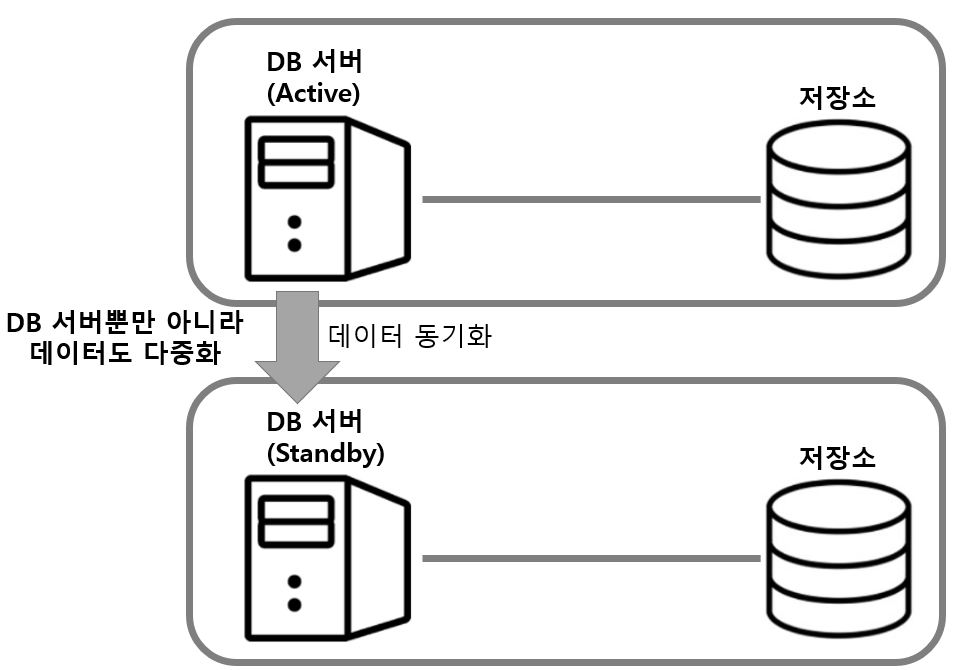
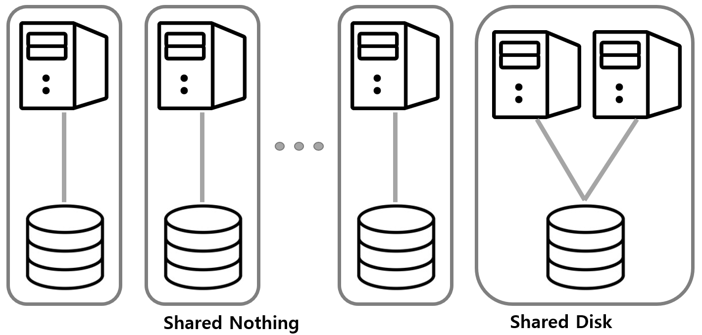

고가용성(High Availability)을 위한 세 가지 데이터베이스 아키텍처에 대해 살펴보겠습니다.

## DB 서버의 다중화 - 클러스터링
- **DB 서버와 저장소의 관계**
    - 
    - 웹 서버나 애플리케이션 서버는 데이터를 일시적으로 보존하는 반면에 데이터베이스는 대량의 데이터를 영구적으로 보존해야 하고, 매체에 필요한 요건이 높아 전용의 외부 저장소를 사용함
    - 따라서 **DB 서버의 아키텍처는 저장소와 묶어서 생각**
    - DB 서버는 영속 계층의 사명으로 다중화 문제를 어렵게 한다.
    - 항상 갱신되는 데이터 사이에서 **다중화를 유지하면서 데이터 정합성**도 의식이 요구됨

- **기본적인 다중화**
    - 
    - DB 서버만 다중화하고 저장소는 하나를 두고 있음
    - 데이터가 보존되는 저장소가 하나라서 정합성을 신경 쓰지 않아도 됨
    - DB 서버가 2대 있지만, 2대가 동시 동작하는 것을 허락할지에 따라 **Active-Active**와 **Active-Standby**로 나뉨
        - **Active-Active** 클러스터를 구성하는 컴포넌트를 동시에 가동
            - 
            - 복수의 DB 서버가 동작하고 있어 한 대가 동작 불능이 되어도 남은 서버가 처리를 계속하고 있어 **시스템 다운을 방지**할 수 있음
            - 복수의 DB **서버의 자원(CPU, Memory)을 사용하여 성능을 향상**시키지만, **저장소가 병목**이 되기 때문에 생각한만큼 성능 향상이 되지 않는 경우도 있음
        - **Active-Standby** 클러스를 구성하는 컴포넌트 중 실제 가동하는 것은 Active, 남은 것은 대기(Standby)
            - 
            - 보통 Standby 상태의 DB 서버는 사용되지 않다가 Active DB 서버에서 장애가 일어나면 사용됨
            - Standby DB 서버가 Active로 전환되기 까지의 **시간 소모가 있고, 이동안은 시스템 다운 상태**
            - Standby DB는 일정 간격마다 Active DB에 이상이 없는지 조사를 위한 통신(Heartbeat)을 하여 **장애 여부를 조사**
        - **Active-Standby 구성의 종류**
            - **Cold-Standby** 평소에는 Standby DB가 작동하지 않다가 Active DB가 다운된 시점에 작동하는 구성
            - **Hot-Standby** 평소에도 Standby DB가 작동하는 구성
                - 항상 2대의 DB 서버를 사용하고 있기에 전환 시간이 더 짧지만, 그만큼 비용이 비싸며 실제로 작동하는 것은 Active DB 1대 뿐이기에 사치스러운 구성이라고 볼 수 있음

## DB 서버와 데이터의 다중화 - 리플리케이션
앞서 본 클러스터 구성에서는 DB 서버를 다중화했지만, 저장소는 다중화할 수 없어 데이터를 다중화하지 않는 단점이 있다.
만약 저장소에 결함이 생겨 부서진다면 데이터를 잃게 된다.

물론 저장소도 보통 내부 컴포넌트가 다중화되어 있지만, 데이터 센터 전체가 재난 등으로 말소된다면 더는 방법이 없다.
이런 상황을 예방하기 위한 클러스터 구성이 **리플리케이션**이며, 이는 **DB 서버와 저장소 세트를 복수로 준비**하는 것을 의미한다.

리플리케이션은 데이터베이스 서버와 저장소가 함께 죽어도 다른 세트로 대체하여 **서비스를 지속 가능**하다는 부분에서 가용성이 매우 높은 아키텍처이다.

### 리플리케이션 트레이드 오프
- 리플리케이션에서는 Active DB 서버에서 갱신된 데이터를 일정 주기로 Standby DB 서버로 복제한다. 여기서 데이터 정합성과 성능 사이에 트레이드 오프가 존재한다.
- 엄밀히 Standby DB 서버에 기록이 성공한 것을 확인하는 단계에 Active 갱신을 완료시킨다면 데이터 보호 관점에서는 아름답지만, 이 처리를 어느 정도 생략한다면 성능을 향상시킬 수 있기 때문이다.

> MySQL 리플리케이션 동작 원리
> 1. Master 서버에서 쿼리를 처리하고 바이너리 로그 스레드를 사용해 변경 내역을 바이너리 로그에 저장
> 2. Slave 서버의 Replication I/O 스레드가 Master 서버에 접속해 변경 내역을 요청
> 3. Master 서버의 바이너리 로그 덤프 스레드가 바이너리 로그를 읽어 변경 내역을 Replcation I/O 스레드에 전달
> 4. 다시 돌아와 Slave 서버의 Replication I/O 스레드는 변경 내역을 Slave 서버의 릴레이 로그에 저장
> 5. 마지막으로 Replication SQL 스레드가 릴레이 로그를 읽어 Master의 SQL을 실행

## 성능을 추구하기 위한 다중화 - Shared Nothing

### Shared Disk
앞서 Active-Active 구성의 DB는 복수의 서버가 하나의 디스크(저장소)를 공유하도록 되어 있어 병목되는 경우가 있다. 이처럼 **복수의 서버가 단일 저장소를 사용**하는 구성을 **Shared Disk**라고 부른다.
Shared Disk 타입의 Active-Active 구성은 DB 서버를 늘려도 처리율이 계속해서 향상되지 못하고 어딘가에서 **한계점에 도달**해버린다. 이는 DB 서버의 수가 증가할수록 DB 서버 간의 정보공유를 위한 오버헤드가 크기 때문이다.

### Shared Nothing
Shared Nothing는 말 그대로 아무것도 공유하지 않는다라는 의미로 **네트워크 이외의 자원은 공유하지 않는 방식**이다.
DB 서버와 저장소의 세트를 늘려서 저장소가 **병목이 되는 것을 방지**하고 세트에 비례해서 **처리율이 증가**한다는 이점이 있다.

다만 Shared Nothing 에서 저장소를 공유하지 않는다는 것은 **각각의 DB 서버가 동일 세트의 저장소에만 접근이 가능**하다는 의미이다.
만약 타 세트와 데이터가 연관되어 있는 상황에서, 대상 DB 서버가 죽어버린다면 해당 세트의 데이터를 액세스하지 못하는 문제가 발생한다.
이를 대처하기 위해서는 다른 DB 서버가 이를 이어받아 계속 처리할 수 있게하는 **커버링** 구성 등을 고려해야 한다.
> MySQL에는 MySQL Cluster라는 Shared Nothing 타입의 클러스터 구성이 가능하고, 이런 이어받는 기능이 있다.

# 참조
- https://liasn.tistory.com/4
- http://www.kyobobook.co.kr/product/detailViewKor.laf?mallGb=KOR&ejkGb=KOR&barcode=9788968487316