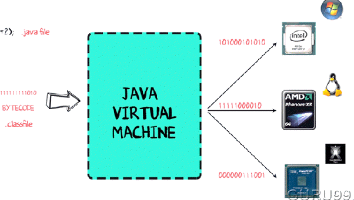
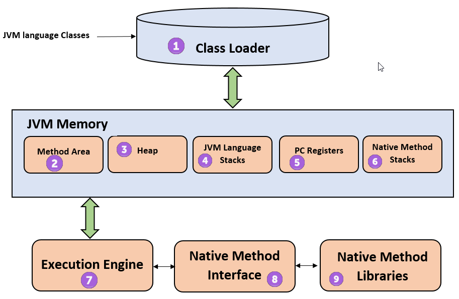

# 개요
- JVM 구조에 대해 살펴봅니다.
- JVM의 구성 요소와 각 요소들이 어떤 역할을 수행하는지에 대해 알아봅니다.

## JVM

JVM(Java Virtual Machine)은 자바 가상 머신으로 자바 코드 또는 애플리케이션을 구동하기 위한 런타임 환경을 제공하는 엔진입니다.

다른 운영체제를 사용하는 컴퓨터마다 JVM이 존재하고 `.class` 파일을 운영체제에 제출하면 JVM이 바이트 코드를 기계어 수준으로 해석하여 실행합니다.

따라서 JVM은 운영체제에 종속적이지 않고, Java 파일은 어느 기기에서든 JVM 위에서 실행될 수 있습니다.

## JVM Architecture

JVM은 크게 Class Loader, JVM Memory, Execution Engine로 나누어져 있습니다.

JVM Memory는 JVM이 프로그램을 수행하기 위해 운영체제로부터 할당받는 메모리 영역입니다. 각각의 목적에 따라 5개의 영역으로 나누어져 있습니다.
JVM Memory는 주로 Runtime Data Area라고도 불립니다.

### 1) Class Loader
클래스 로더는 JVM 안으로 클래스 파일들을 읽어들이는 역할을 하는 시스템입니다.

### 2) Method Area
프로그램 실행 중 클래스가 사용되면 JVM은 해당 클래스 파일을 분석하여 클래스의 클래스 변수, 인스턴스 변수, 메서드, 생성자 등을 Method Area에 저장합니다. 

Heap Area와 마찬가지로 Method Area의 자원들은 모든 쓰레드에 공유되어 쓰레드에 안전하지 않습니다.

### 3) Heap
new 키워드로 생성된 객체와 관련 인스턴스 변수 및 배열들이 저장됩니다.
내부에서는 인스턴스의 생명주기에 따라 공간이 나뉘며 모두 Garbage Collection의 대상이 되는 영역입니다. 

Method Area와 마찬가지로 Heap Area의 자원들은 모든 쓰레드에 공유되어 쓰레드에 안전하지 않습니다.  

### 4) JVM Language Stack
스레드 제어를 위해 사용되는 메모리 영역입니다. 스레드가 생성될 때마다 각 스레드는 스레드마다 하나의 스택을 할당받습니다.

메서드가 호출될 때마다 스택 안에서는 각각의 스택 프레임(해당 메서드만을 위한 고유한 공간)이 생성됩니다.
스택 프레임은 FILO(First In Last Out) 구조로 되어 있고, 해당 메서드 안에서 사용되는 지역변수들을 담고 있으며, 메서드 수행이 끝나면 프레임 별로 삭제됩니다. 

### 5) PC Registers
각 스레드에는 별도의 PC Register가 존재하며, PC Register는 현재 실행 중인 JVM 명령어의 주소를 저장합니다. 

### 6) Native Method Stacks
자바 외 언어에서 제공하는 메서드의 정보가 저장되는 공간입니다. JNI(Java Native Interface)을 통해 표준에 가까운 방식으로 구현이 가능합니다.

### 7) Execution Engine
클래스 로더를 통해 JVM Memory에 배치된 자바 바이트 코드들을 명령어 단위로 읽어서 실행하는 모듈입니다.

### 8) Native Method Interface
Native Applications(하드웨어와 운영체제에 종속된 프로그램), C, C++ 등의 다른 언어들로 작성된 라이브러리들을 호출하거나 호출되는 것을 가능하게 하는 프로그래밍 프레임워크입니다. 

### 9) Native Method Libraries
Execution Engine에 필요한  Native Libraries(C, C++) 모음입니다.

# 마무리
다음 포스팅에서는 JVM Memory의 영역들과 GC(Garbage Collector)에 대해 다뤄보겠습니다.

# 참고 자료
- https://en.wikipedia.org/wiki/Java_virtual_machine
- https://www.holaxprogramming.com/2013/07/16/java-jvm-runtime-data-area/
- https://www.guru99.com/java-virtual-machine-jvm.html
- https://hyoje420.tistory.com/2
