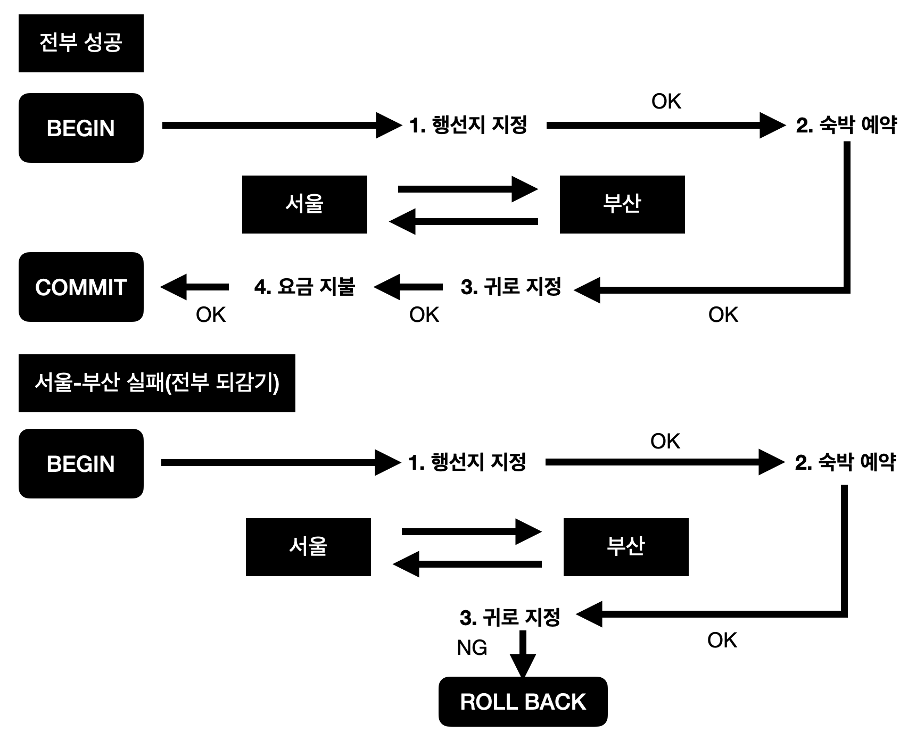
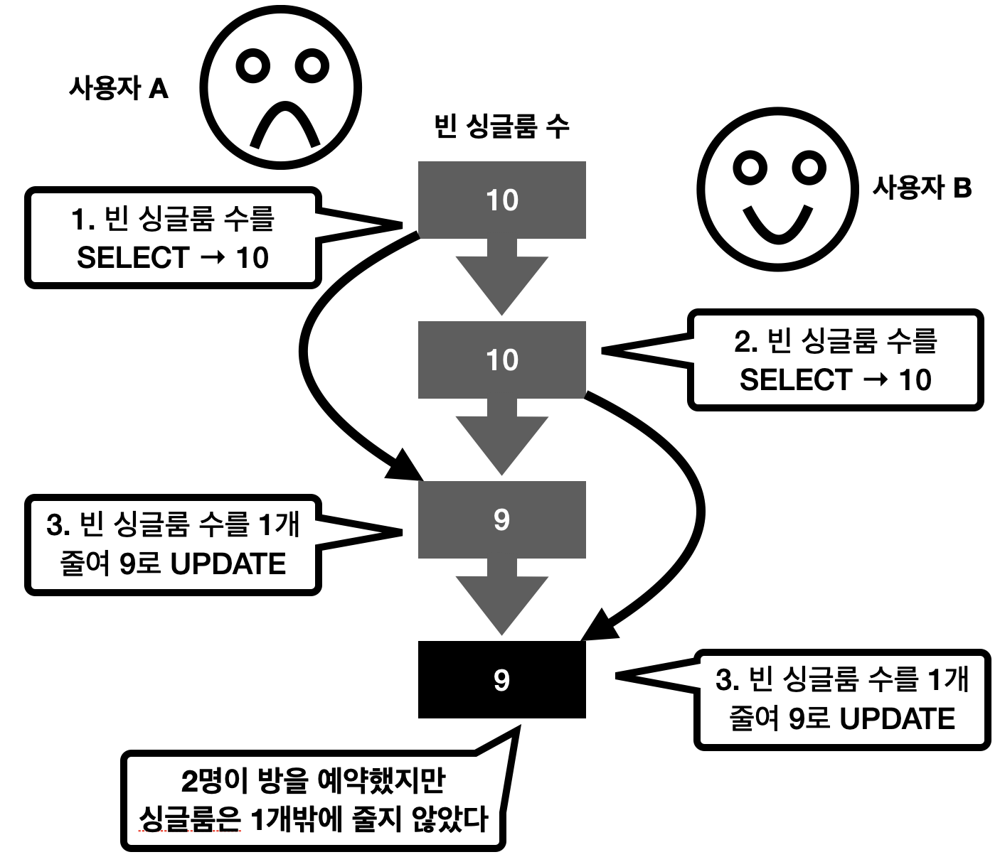
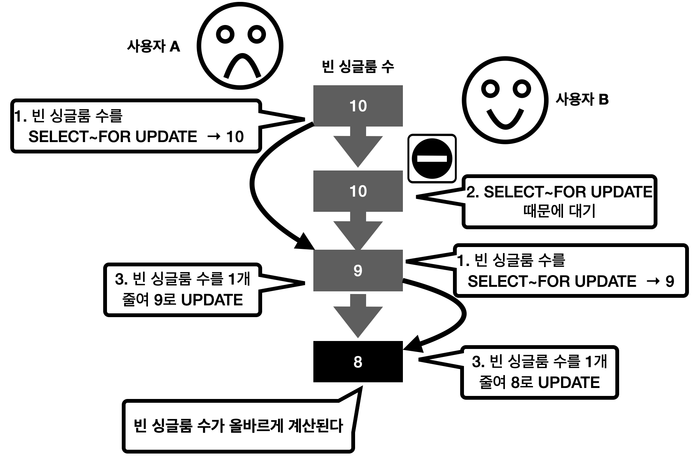

# 트랜잭션에 대해

## 트랜잭션이란

테이블 갱신을 수행하기 위해 `INSERT/DELETE/UPDATE`를 사용할 수 있지만, 갱신은 보통 복수의 쿼리를 연속적으로 수행하는 경우가 대부분이다.
또한, 갱신 전의 데이터로 조회를 할 때 이를 포함한 복수 쿼리들을 일관된 형태의 한 덩어리로 다뤄야 한다.
즉, **트랜잭션이란 복수 쿼리들을 한 단위로 묶은 단위**이다.

## ACID에 대해
트랜잭션은 다음과 같이 4가지 특성으로 정의되며, 앞글자를 따서 **ACID 특성**이라고 한다.

- Atomicity(원자성)
- Consistency(일관성)
- Isolation(고립성 또는 격리성)
- Durability(지속성)

### Atomicity(원자성)
**원자성**이란 데이터 변경을 수반하는 일련의 데이터 조작이 전부 성공할지 전부 실패할지를 보증하는 구조이다.

예를 들어, 서울에서 KTX로 부산까지 가서 일박하고 다음 날 서울로 돌아오는 경우를 가정해 보자. 아마 다음과 같은 순서를 밟을 것이다.

1. 서울 → 부산행 좌석을 예매한다
2. 부산에서의 숙박을 예약한다
3. 부산 → 서울행 좌석을 예매한다
4. 1~3의 대금을 지급한다

위 절차가 모두 정상적으로 진행되면 트랜잭션은 `COMMIT`을 실행해 처리를 확인한다. 이 경우 각 데이터 조작은 영구적으로 저장되어 결과가 손실되지 않는다.

만약 처리 도중에 오류가 발생하는 경우는 어떨까?
예를 들어, 3번에서 좌석을 예매할 수 없다든지 4번에서 보유한 돈이 부족한 경우가 있을 수 있다.

이런 경우에는 `ROLLBACK`을 실행해 1번부터 4번까지의 처리 과정 중 1의 직전 상태까지 되돌아갈 수 있다. 또한, 이렇게 시스템이 정상 동작하는 상황에서의 오류뿐 아니라 클라이언트의 통신 문제나 서버 다운 등의 경우에도 `COMMIT`된 것 외에는 `ROLLBACK`을 해야 한다.

###### 전부 성공하거나 전부 실패하거나

### Consistency(일관성)
데이터베이스에는 데이터베이스 오브젝트(테이블을 비롯해 데이터베이스 내에 정의할 수 있는 오브젝트)에 대해 각종 정합성 제약을 추가할 수 있다. 이는 일련의 데이터 조작 전후에 그 상태를 유지하는 것을 보증하는, 즉 **일관성**을 유지하기 위한 구조이다.

예를 들면, 시스템에 사용자를 등록할 때 사용자를 식별하기 위해 일련번호를 사용자에게 발급한다.
이때 이 번호에 유니크 제약을 설정하면 중복된 사용자 번호를 저장할 수 없다. 이는 복수 사용자가 동시에 사용자 번호를 취득하려는 경우에도 마찬가지이다.

### Isolation(고립성)
**고립성**이란 일련의 데이터 조작을 복수 사용자가 동시에 실행해도 **각각의 처리가 모순없이 실행되는 것을 보증한다**는 것이다. 예를 들면, 한 호텔에 남은 싱글룸 수가 10개였을 때 실제로 숙박한 흐름을 프로그래밍하듯 표현하면 다음과 같다.

1. 현재 빈 싱글룸의 수를 확인한다 `(SELECT)`
2. 빈 싱글룸 수에서 1을 빼고 결과를 빈 싱글룸 수로 되돌려 쓴다 `(UPDATE)`

이것을 사용자 A와 사용자 B가 동시에 수행하면 어떻게 될까? 2명이 박을 확보한다면 원래 빈 싱글룸 수는 2개가 줄어야 하지만, 같은 방을 동시에 확보하게 되면 빈 싱글룸 수는 1개만 줄어들게 된다.

###### 빈 싱글룸 수가 올바르지 않은 시나리오

이러한 사태가 발생함을 막기 위해 데이터베이스에는 테이블에 대해 **잠금(Lock)** 을 걸어 후속 처리를 **블록(Block)** 하는 방법이 있다. 잠금 단위에는 테이블 전체, 블록, 행 등이 있는데, MySQL에서는 트랜잭션 처리를 할 때 주로 행 단위의 잠금을 이용한다.

예를 들면, 앞의 두 가지 중 *1. 현재 빈 싱글룸 수를 확인한다* 를 처리할 때 `SELECT ~ FOR UPDATE`를 실행하면 SELECT한 행에 잠금이 걸린다. 이렇게 되면 후속 처리는 해당 잠금이 해제될 때(`COMMIT` 또는 `ROLLBACK`)까지 대기하게 되며 올바른 처리를 계속 할 수 있게 된다.

###### 빈 싱글룸 수가 바르게 처리되는 시나리오

또한, InnoDB형 테이블은 [**MVCC**](https://en.wikipedia.org/wiki/Multiversion_concurrency_control) 구조로 동작하기 때문에 이번 예에서 사용자 B가 단순히 값을 참조하는 경우에 SELECT에 FOR UPDATE는 불필요하며 이 경우 읽기는 블록되지 않는다.
테이블을 갱신하는 사용자가 소수가 참조하는 사용자가 많은 경우에는 사용자의 동시성, 병렬성이 높아진다.

그러면 앞에서 **고립성**을 설명하며 **각각의 처리가 모순 없이 실행되는 것을 보증한다**라고 말했다. 그러면 어떤 상태를 **모순 없다**라고 할 수 있을까?

이에 대한 답은 **복수의 트랜잭션이 순서대로 실행되는 경우와 같은 결과를 얻을 수 있는 상태**이다. 이건 병렬로 실행되는 처리를 생각하면 복잡하므로 좀 더 간단한 병렬로 실행되지 않는(직렬) 상태를 말하며, 이와 같으면 모순 없음을 보장할 수 있다.

이것을 DBMS에서 **격리 수준(Transaction Isolation Level)** 으로 구현하고 제공하는 것이 **직렬화 가능(Serializable)** 이라는 사양이다. 하지만 직렬화 가능의 고립성에서는 항상 동시 동작하는 트랜잭션이 1개의 이미지가 되어 성능면에서 실용적이지 않다. 이 때문에 직렬화 가능으로부터 격리 수준을 완화해 직렬화 가능 외 자신이 아닌 다른 트랜잭션의 영향받는 것을 허용하는 4개의 단계를 **ANSI**라는 규격 단체에서 정의했다. ANSI에서 정의하는 격리 수준은 다음과 같다.

1. 커밋되지 않은 읽기(Read Uncommited)
2. 커밋된 읽기(Read Commited)
3. 반복 읽기(Repeatable Read)
4. 직렬화 가능(Serializable)

이중 4번째 직렬화 가능이 가장 엄격하며 숫자가 작아질수록 완화되어 1번째 커밋되지 않은 읽기가 가장 완화된 격리 수준이다. 그러나 격리 수준이 완화되면서 직렬화 가능에서는 발생하지 않았던 현상이 생긴다.

###### 격리 수준 완화에 따라 일어나는 현상
|현상|개요|
|-----------|---|
|1. **더티 읽기(Dirty Read)**|어떤 트랜잭션이 커밋되기 전에 다른 트랜잭션에서 데이터를 읽는 현상이다. 예를 들면, 사용자 A가 값을 변경하고 아직 커밋하지 않아도 사용자 B가 변경한 후의 값을 읽는 것을 가리킨다. 사용자 A가 빈 싱글룸 수가 10인 레코드를 9로 변경한 경우 커밋 전이라 하더라도 사용자 B가 SELECT 한 결과는 9가 된다. 확정 전의 더럽혀진 데이터를 읽는 것에서 붙여진 이름이다.|
|2. **애매한 읽기(NonRepeatable Read)**|어떤 트랜잭션이 이전에 읽어 들인 데이터를 다시 읽어 들일 때 2회 이후의 결과가 1회 때와 다른 현상이다. 예를 들면, 최초에 사용자 A가 빈 싱글룸 수를 10을 읽고 그 후 사용자 B가 값을 9로 변경해 커밋했다고 하자. 계속해서 사용자 A가 SELECT를 다시 실행하면 최초에 SELECT했던 10이 아닌 변경 후의 9를 읽어 들이게 된다. 사용자 A가 최초에 읽은 값 10이 2회 이후의 SELECT에서 보증되지 못하고 애매하게 되는 것에서 붙여진 이름이다.|
|3. **팬텀 읽기(Phantom Read)**|어떤 트랜잭션을 읽을 때 선택할 수 있는 데이터가 나타나거나 사라지는 현상이다. 최초에 사용자 A가 범위 검색(*예를 들면, 빈 싱글룸 수가 10 이상의 호텔*)을 수행 후 3행을 읽었다고 가정하자. 계속해서 사용자 B가 금방 그 범위에 들어가는 데이터 1행을 INSERT 하고 커밋도 실행했다. 계속해서 사용자 A가 다시 같은 SELECT를 실행하면 최초에 SELECT해서 얻었던 3행이 아닌 4행이 선택된다. 이처럼 나타나거나 사라지는 데이터가 유령과 닮아서 붙여진 이름이다.|

###### 3가지 현상과 격리 수준의 관계
|**격리 수준**|더티 읽기|애매한 읽기|팬텀 읽기|
|---|---|---|---|
|커밋되지 않은 읽기|O|O|O|
|커밋된 읽기|X|O|O|
|반복 읽기|X|X|O|
|직렬화 가능|X|X|X|

### 지속성(Duration)
지속성은 일련의 데이터 조작을 완료(`COMMIT`)하고 완료 통지를 사용자가 받는 시점에서 그 조작이 영구적이 되어 **결과를 잃지 않는 것**을 나타낸다. 이것은 시스템이 정상일 때만 아니라 데이터베이스가 OS의 이상 종료, 즉 시스템 장애도 견딜 수 있다는 의미이다.

MySQL을 포함해 많은 데이터베이스 구현에서는 트랜잭션 조작을 하드 디스크에 **로그**로 기록하고 시스템에 이상이 발생하면 그 로그를 사용해 이상 발생 전의 상태까지 복원하는 것으로 지속성을 실현하고 있다.

# 참조
- 데이터베이스 첫걸음