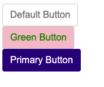

# 재사용 가능한 컴포넌트

프론트엔드에서 화면을 구현하기 많은 컴포넌트들이 만들고, 그 컴포넌트들을 조합하여 화면을 구성하게 됩니다.  
너무 많은 컴포넌트들이 만들어지게 되면 유지보수가 힘들어지게되고 중복된 코드가 많아지기에 재사용 가능한 컴포넌트를 만드는게 매우 중요한 일이 되었습니다.

## 추상화를 해라

예를들어 로그인 페이지에서의 버튼과 웹뷰에서 하단 cta 버튼을 만든다고 했을 때 둘은 비슷하지만 다른 컴포넌트입니다.
둘다 버튼이긴 하지만 로그인 페이지에서의 버튼은 단순한 버튼이고, cta 버튼은 floating 스타일도 추가되고 버튼 밖을 하나의 wrapper가 있을 겁니다.
이럴 때 추상화가 필요합니다. Button이라는 주요한 기능과 스타일을 모아 Base Component를 만들고 cta버튼에서는 이 Base Button을 바탕으로 다른 스타일을 조합해서 사용할 수 있습니다.
이처럼 Base Button Component를 바탕으로 파생적으로 많은 컴포넌트를 만들 수 있습니다. 객체지향에서 말하는 개방폐쇄원칙입니다.

## Inversion Of Control

웹뷰에서 사용할 cta 버튼을 만들었고 이 버튼을 다른 페이지에서도 사용하고 싶습니다. 그리고 버튼을 눌렸을 때의 동작도 달랐으면 좋겠습니다.
만약에 cta 버튼 컴포넌트안에 button click handler가 들어있다면 해당 컴포넌트를 재사용할 수 없습니다.
그래서 cta 버튼을 사용하는 페이지에서 handler를 만들고 이를 props로 cta 버튼으로 내려주면 해결이 가능한데 이를 IOC (Inversion Of Control)이라고 부릅니다.

### 무조건적인 IOC는 유지보수에 취약해진다.

sns 공유를 할 수 있는 공유하기 버튼이 만들고 공유하기 버튼이 여러 페이지에서 사용된다고 했을 때 IOC를 사용하게 되면 공유하기 버튼을 사용하는 페이지에 모두 handler를 만들어줘야 합니다.
이런 경우에는 IOC를 사용하기 보다 공유하기 버튼 컴포넌트를 따로 만들어 handler 혹은 비즈니스 로직을 컴포넌트안에 포함시키는게 유지보수하기 쉽습니다. 흔히 말하는 캡슐화를 사용하게 되는거죠.
공유하기 버튼은 항상 같은 같은 기능을 할꺼고 컴포넌트를 사용하는 개발자 입장에서는 공유하기에 관련된 로직이 어떤지 고민하지 않고 사용하게 될겁니다.

## 스타일

버튼을 공통 컴포넌트로 만든다고 생각할 때 가장 먼저 떠오르는 버튼의 기능은 click event, 버튼 text, type 정도가 될겁니다.
하지만 여기에 스타일을 추가해보겠습니다.
노란색 테두리에 배경은 흰색이고 글자색은 보라색, 포인터가 올려졌을 때 버튼의 배경은 회색이 되어야한다.
단순하다고 생각한 버튼이 매우 복잡한 버튼이 되었습니다.
이처럼 스타일이 컴포넌트와 합쳐지게 되면 컴포넌트가 매우 복잡해집니다.

이러한 문제점을 해결하기 위해 탄생한 것 중 하나가 styled-component입니다.
styled-component의 핵심은 스타일을 css 문서가 아닌 컴포넌트 레벨로 추상화하는 것 입니다.
(사실은 매우 많은 논란이 있는 주제이긴합니다.)



```jsx
import React from "react";
import styled, { css } from "styled-components";

const StyledButton = styled.button`
  padding: 0.375rem 0.75rem;
  border-radius: 0.25rem;
  font-size: 1rem;
  line-height: 1.5;
  border: 1px solid lightgray;

  color: ${(props) => props.color || "gray"};
  background: ${(props) => props.background || "white"};

  ${(props) =>
    props.primary &&
    css`
      color: white;
      background: navy;
      border-color: navy;
    `}
`;

function Button({ children, ...props }) {
  return <StyledButton {...props}>{children}</StyledButton>;
}

export default Button;
```

```jsx
import React from "react";
import Button from "./Button";

function Buttons() {
  return (
    <>
      <Button>Default Button</Button>
      <Button color="green" background="pink">
        Green Button
      </Button>
      <Button primary>Primary Button</Button>
    </>
  );
}

export default Buttons;
```
