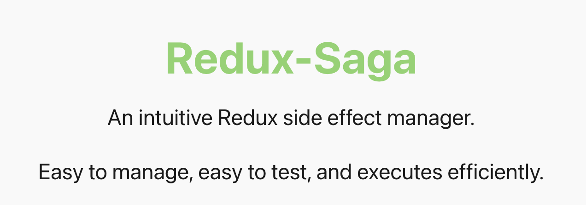

# React에서 side effect를 관리하는 법

요즘 `스칼라로 배우는 함수형 프로그래밍` 책을 읽고 있습니다.

아직 2장 밖에 읽지 않았지만, 기억에 남는 문장들이 몇 개 있습니다.

> 함수형 프로그래밍은 부수 효과가 없는 순수 함수들로만을 이용해 프로그램을 구축하는 것을 의미한다.  
> 부수 효과가 없다는 것은 주어진 값에 대해 이 함수는 항상 같은 값을 돌려주는 것을 보장한다. 그리고 그 이외의 일은 **전혀** 일어나지 않는다.  
> 순수함수는 하나의 블랙박스이다. 입력은 항상 함수에 대한 인수들로만 주어진다. 그리고 함수는 결과를 계산해서 돌려줄 뿐, 그것이 어떻게 쓰이는지는 신경 쓰지 않는다. 이러한 관심사의 분리 덕분에 계산 논리의 재사용성이 높아진다.

이 책에서는 순수함수를 만들기 위해 "어쩔 수 없이 사용하게 되는 부수효과들은 함수의 밖으로 밀어내고 함수가 하는 일을 최대한 작게 들어라. 그래야 함수를 재사용할 수 있고 테스트도 용이하다"고 말합니다.

이때 함수형 프로그래밍의 철학을 프론트엔드에 적용해보고 싶다는 생각이 들었습니다. 사실 React에서는 이미 `Pure Component`, `Container and Presentational Pattern`, `redux-saga`를 보면 알듯이 이미 순수에 대한 개념이 많이 들어와 있긴 합니다.

`React.memo`와 `Pure Component`를 만들어 불필요한 re-rendering를 막게 한다던가, Bussiness Logic과 View를 담당하는 Component를 분리한다던가 (유지보수성과도 연관이 있겠지만 View를 담당하는 Component에서 side effect를 일으키는 것들을 component 밖으로 밀어내 Container Component에서 관리하게 하는 역할도 있다고 생각합니다.) Redux에서는 상태관리만 하고 그 외의 비동기 작업, api 통신, 에러처리와 같은 부수효과를 일으키는 작업들은 redux-saga에서 따로 관리하도록 말이죠. (실제로 redux-saga 공식문서의 첫화면이 "An intuitive Redux side effect manager." 입니다.)

functional programming이 pure function들의 조합으로 프로그램을 구성한다고는 하지만 부수효과가 없는 프로그램은 없다고 생각합니다. functional programming은 코드문맥에서 발생하는 공통의 패턴을 함수로 만들어 재사용하게 함을 목적으로 둔다고 생각합니다. 이때의 함수는 순수함수겠죠.
그리고 프론트에서도 공통적으로 사용되는 컴포넌트를 pure component로 만듦으로써 재사용이 가능하게 하고 테스트하기 쉽게 만들기 위해 functional programming의 철학이 필요하다고 생각합니다.

## Pure Component를 만드는 법

책에서 나왔듯이 component에서 side effect가 발생하는 부분들 최대한 밖으로 밀어내야 합니다. container component로 side-effect를 모두 빼거나, custom hooks에서 처리하게 해야합니다. 만약 redux를 사용한다면 redux-saga에서 처리하게 해야합니다.

이렇게 하면 component는 props에 대해 component rendering이 어떻게 렌더링될지 예상할 수 있고 테스트하기도 쉬워집니다. props에 따라 글자나 style의 결과만 테스트하면 됩니다.
