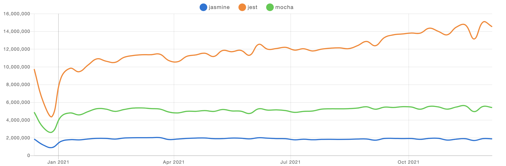
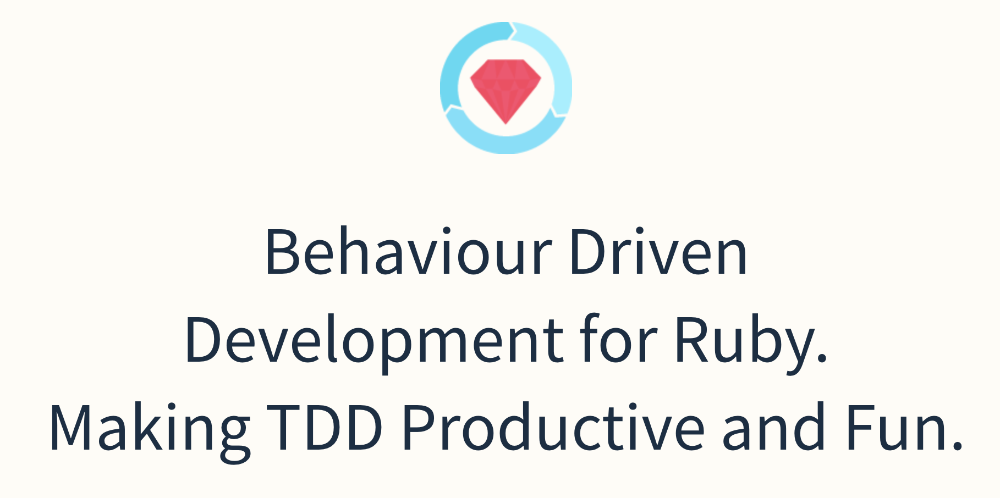
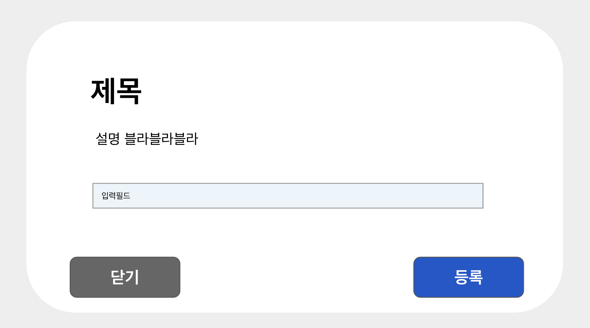

# 프론트엔드에서 테스트코드짜기

개발관련 서적들을 읽으면 공통적으로 테스트코드작성의 중요성들을 언급하고 있습니다. 하지만 많은 개발자들, 특히 프론트엔드 개발자들 중 테스트코드를 짜는 사람들은 많지 않은 것 같습니다. 그렇다면 왜 테스트코드를 짜지 않을까요? 그리고 테스트코드를 어떻게 짜야할까요?

> "테스트 코드가 가져다 주는 장점들을 알고 있지만 다른 단점들을 얘기하며 여전히 시도하려 하지 않고, 도입을 꺼리는 것은 테스트 주도 개발을 해보지 않았거나 제대로 운영해보지 못했기 때문이다."
>
> https://yorr.tistory.com/26

## 테스트코드를 짜는 이유

테스트코드는 리펙토링할 때 꼭 필요한 존재입니다. 테스트코드를 짜놓고 리펙토링을 하게되면 리펙토링 하기 전 과 후의 결과가 동일하다는 것을 보장할 수 있죠. 그래서 개발서적들에서는 좋은 코드로 리펙토링하는 법을 가이드하기 전에 테스트코드를 작성하라고 항상 당부하고 있습니다. 리펙토링 뿐 아니라 새로운 기능이 추가되거나 기존 기능이 변경되었을 때 다른 기능들이 제대로 동작한다는 것을 보장할 수 있기에 유지보수 측면에서도 매우 중요합니다. 예상치 못한 에러를 미리 방지할 수 있죠.

## TDD

테스트코드의 중요성이 높아지고 에자일이라는 개념이 들어오면서 TDD, BDD와 같은 방법론들이 생겨나기 시작했습니다. 짧은 개발 사이클을 반복하는 프로세스인 에자일을 개발방법론에 적용한 것 중 하나가 TDD 입니다. TDD는 요구사항을 검증하는 테스트 케이스를 먼저 작성한 후 테스트 케이스를 통과하기 위한 최소한의 코드를 생성하고, 코드에 대한 리펙토링을 진행하는 과정을 짧은 주기로 가져가는 방법론입니다. 어떤 기능을 추가했을 때 그 기능 뿐 아니라 다른 기능까지 또는 전체적인 프로세스가 잘 작동하지 않는 경우가 있기에 기능 하나를 추가할 때 테스트 코드를 작성하고 제대로 작동하는지 확인하면서 그 기능이 다른 기능에 영향을 미치는지 테스트 할 수 있습니다.

## 프론트엔드와 궁합이 잘 맞는 BDD

BDD는 Behavior Driven Development로 테스트를 시나리오 기반으로 작성하는 것을 말합니다. BDD에서는 여러 패턴들이 있으나 [JUnit5로 계층 구조의 테스트 코드 작성하기](https://johngrib.github.io/wiki/junit5-nested/) 와 [Better Specs. Testing Guidelines for Developers](https://www.betterspecs.org/)에 소개된 패턴으로 설명하겠습니다.

`Describe` - `Context` - `It` 세 키워드를 이용해서 행동기반 테스트를 작성하게 됩니다.

|  키워드  |              설명              |
| :------: | :----------------------------: |
| Describe |   설명할 테스트 대상을 명시    |
| Context  | 테스트 대상이 놓인 상황을 설명 |
|    It    |   테스트 대상의 행동을 설명    |

이렇게 테스트를 작성하게 되면 테스트코드를 계층화 시킬 수 있고 비즈니스 로직 혹은 유저의 행동의 분기에 따른 테스트 코드를 보기좋게 작성할 수 있습니다.

## Jest에서 BDD 적용하기

프론트엔드에서 Unit test를 할 때 사용할 수 있는 라이브러리는 jest, mocha, jasmin 이 있는데 가장 많이 사용하고 있는 Jest로 BDD를 구현하는 예시를 들어보겠습니다.



위에서 BDD를 Describe - Context - It 패턴을 이용한다고 했는데 Jest는 공식적으로 Describe It은 제공하고 Context는 제공하지 않습니다. 그래서 [jest-plugin-context](https://github.com/negativetwelve/jest-plugins/tree/master/packages/jest-plugin-context) 플러그인을 따로 설치해줘야 합니다. jest-plugin-context는 루비에서 사용하고 있는 BDD 형식의 TDD [RSpec](http://rspec.info/) 기반으로 만들어줬습니다.

> In RSpec, describe it used to wrap a set of tests against one functionality while context is to wrap a set of tests against one functionality under the same state.



### BDD로 Dialog 구현해보기

Style을 제외한 기능적인 요소들만 BDD로 Dialog를 구현해보겠습니다.

### 디자인



#### 기능 요구사항

- title을 props로 받아 보여줘야 한다.
- describtion을 props로 받아 보여줘야 한다.
- 닫기 버튼을 클릭하면 Dialog가 닫혀야 한다.
- 입력필드에 텍스트를 입력할 수 있어야 한다.
- 등록버튼을 누르면 입력필드에 입력한 내용이 api로 전달되어야 한다.
- 등록버튼을 눌렸을 때 입력필드에 입력한 내용이 없다면 console.error에 “에러가 발생했습니다.“ 로그가 찍혀야한다.

TDD 방법론에 따라 테스트 코드를 먼저 작성해보겠습니다.

```tsx
describe('Dialog', () => {

  const title = '제목'
  const description = '설명 블라블라블라'
  const handleClickClose = jest.fn();
  const handleClickSubmit = jest.fn();
  const spyOnConsoleError = jest.spyOn(global.console, 'error')

  const renderDialog = () => render((
    <Dialog
      title={title}
      description={description}
      onClickClose={handleClickClose}
      onClickSubmit={handleClickSubmit}
    />
  ));

  it('title과 description이 보여야 한다.', () => {
    const { container } = renderDialog();

    expect(container).toBeTextContain(title);
    expect(container).toBeTextContain(describtion);
  });

  context('입력필드에 텍스트를 입력하면', () => {
    const sampleText = 'sample-text'

    it('입력한 텍스트가 보여야 한다.', () => {
      const { container } = renderDialog();

      fireEvent.change(screen.getByLabel('내용'), { target: value: sampleText })

      expect(container).toBeTextContain(sampleText);
    });
  });

  context('닫기 버튼을 누르면', () => {
    it('handleClickClose가 호출되어야 한다.', () => {
      renderDialog();

      fireEvent.click(screen.getByText('닫기'));

      expect(handleClickClose).toBeCalled();
    });
  });

  context('등록버튼을 눌렀을 때', () => {
    context('입력된 텍스트가 없다면', () => {
      it('console.error에 "에러가 발생했습니다." 문구가 찍혀야 한다.', () => {
        renderDialog();

          expect(spyOnConsoleError).toBeCalledWith('에러가 발생했습니다.');
        });
      });

      context('입력된 텍스트가 있다면', () => {
        const sampleText = 'sample-text'

        it('handleClickSubmit에 입력값이 전달되어야 한다.', () => {
          renderDialog();

          fireEvent.change(screen.getByLabel('내용'), { target: value: sampleText })

          expect(handleClickSubmit).toBeCalledWith(sampleText);
        });
      });
    });
  });
```

모든 스펙에 대한 테스트코드 와 분기를 `Describe`, `context`, `It`을 이용해 작성했습니다.

테스트만 작성했지만 해당 컴포넌트에 어떤 props가 들어갈지, props에 대해 어떻게 내용이 보일지 개발자가 아닌 사람들도 추측할 수 있게 되었습니다.

```tsx
interface Props {
  title: string;
  description: string;
  onClickClose: MouseEventHandler;
  onClickSubmit: (value: string) => null;
}

function Dialog({ title, description, onClickClose, onClickSubmit }: Props) {
  const [state, setState] = useState({});

  function handleChange({ target }) {
    const { value, name } = target;

    setState({
      ...state,
      [name]: value,
    });
  }

  return (
    <div>
      <h2>{title}</h2>
      <div>{description}</div>
      <div>
        <label htmlFor="내용">내용</label>
        <input id="내용" name="contents" onChange={handleChange} />
      </div>
      <div>
        <button type="button" onClick={onClickClose}>
          닫기
        </button>
        <button type="button" onClick={() => onClickSubmit(state.contents)}>
          등록
        </button>
      </div>
    </div>
  );
}
```

## 마무리

unit test만 작성해도 리펙토링에 매우 자유로워지는 것 같습니다. 테스트코드를 작성하지 않았다면 작성해보는게 어떨까요? 프론트엔드에서 테스트코드 작성이 어렵게 느껴졌었다면 이번 기회에 쉽게 다가왔으면 좋겠습니다.

## Reference

- https://johngrib.github.io/wiki/junit5-nested/
- https://www.popit.kr/bdd-behaviour-driven-development%EC%97%90-%EB%8C%80%ED%95%9C-%EA%B0%84%EB%9E%B5%ED%95%9C-%EC%A0%95%EB%A6%AC/
- https://yorr.tistory.com/26
