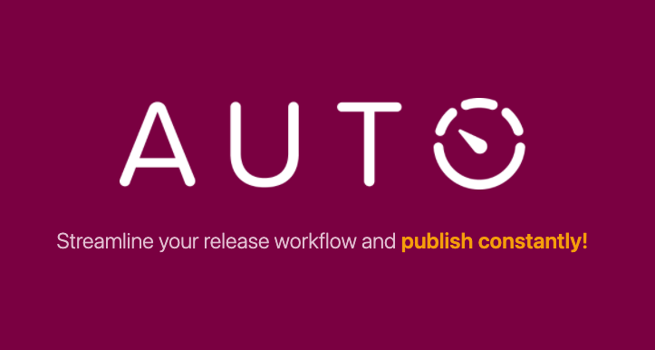
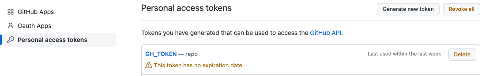
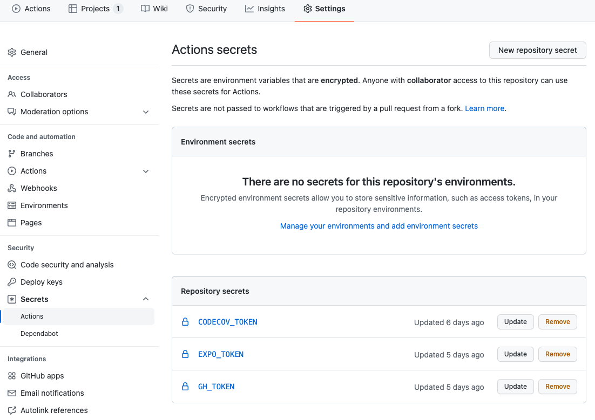
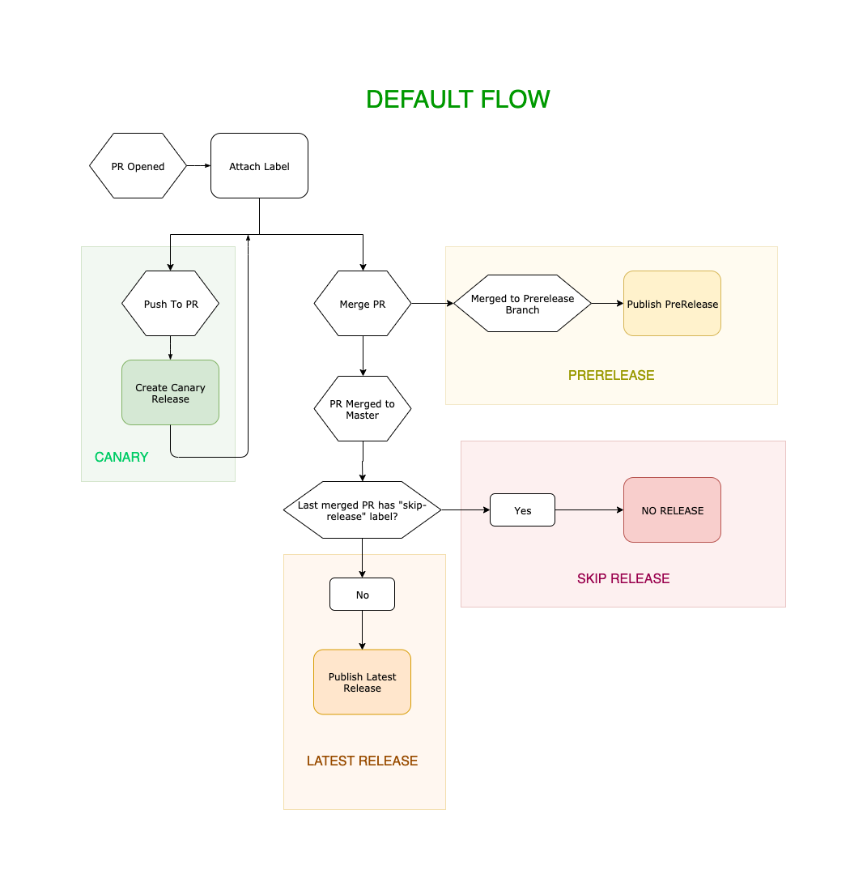
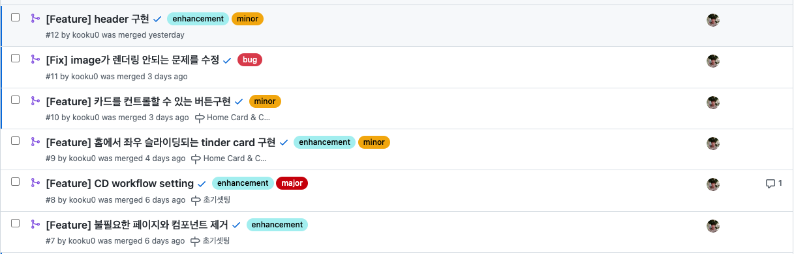
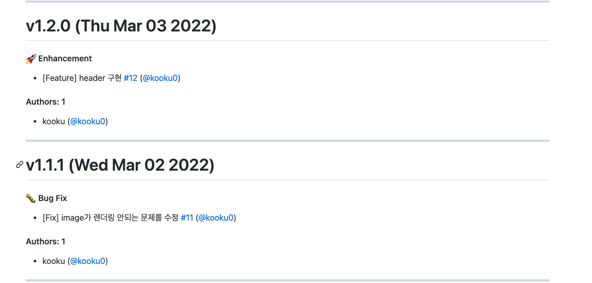
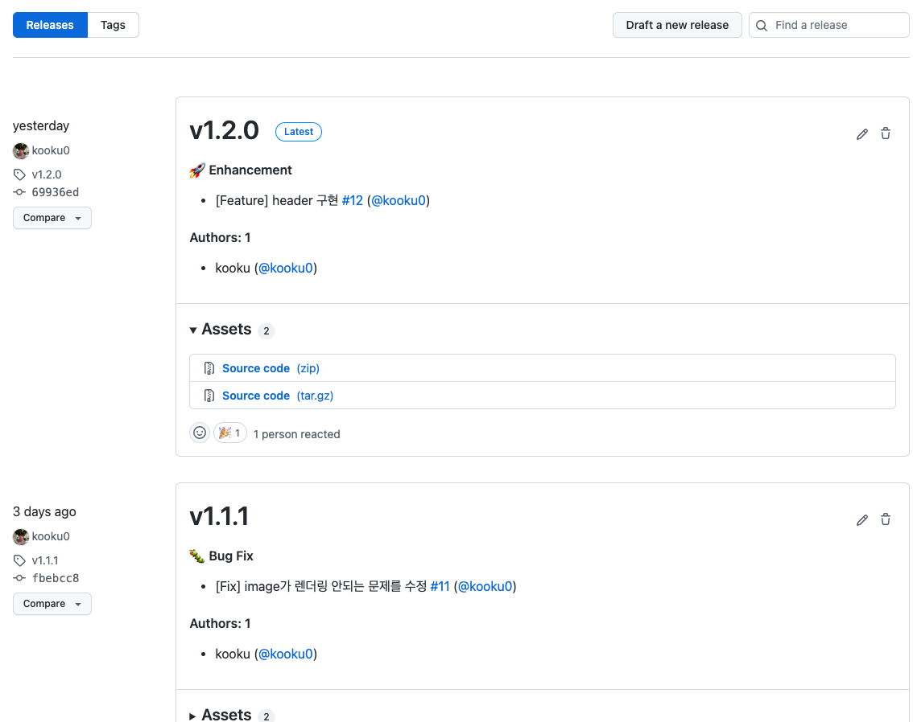

# auto로 버전관리와 배포관리하기

auto를 활용해 release 버전관리와 자동배포를 작업한 경험을 다루었습니다.

혹시 AUTO 라고 들어보셨나요?? 저는 storybook을 개발하며 auto를 처음 접했는데요 태깅과 CHANGELOG를 알아서 작성해주는 작업이 편리하여 개인프로젝트에서도 auto를 활용해 버전관리를 하고 있습니다.

## AUTO란?



https://intuit.github.io/auto/

auto는 `label`을 이용해 버전관리와 배포를 관리합니다.

<details>
  <summary>auto에서 기본적으로 제공하는 <code>label</code>들은 다음과 같습니다.</summary>

```jsx
[
  {
    name: "major",
    changelogTitle: "💥 Breaking Change",
    description: "Increment the major version when merged",
    releaseType: "major",
    color: "#C5000B",
  },
  {
    name: "minor",
    changelogTitle: "🚀 Enhancement",
    description: "Increment the minor version when merged",
    releaseType: "minor",
    color: "#F1A60E",
  },
  {
    name: "patch",
    changelogTitle: "🐛 Bug Fix",
    description: "Increment the patch version when merged",
    releaseType: "patch",
    color: "#870048",
  },
  {
    name: "skip-release",
    description: "Preserve the current version when merged",
    releaseType: "skip",
    color: "#bf5416",
  },
  {
    name: "release",
    description: "Create a release when this pr is merged",
    releaseType: "release",
    color: "#007f70",
  },
  {
    name: "internal",
    changelogTitle: "🏠 Internal",
    description: "Changes only affect the internal API",
    releaseType: "none",
    color: "#696969",
  },
  {
    name: "documentation",
    changelogTitle: "📝 Documentation",
    description: "Changes only affect the documentation",
    releaseType: "none",
    color: "#cfd3d7",
  },
  {
    name: "tests",
    changelogTitle: "🧪 Tests",
    description: "Add or improve existing tests",
    releaseType: "none",
    color: "#ffd3cc",
  },
  {
    name: "dependencies",
    changelogTitle: "🔩 Dependency Updates",
    description: "Update one or more dependencies version",
    releaseType: "none",
    color: "#8732bc",
  },
  {
    name: "performance",
    changelogTitle: "🏎 Performance",
    description: "Improve performance of an existing feature",
    releaseType: "patch",
    color: "#f4b2d8",
  },
];
```

</details>

description을 보면 알겠지만 `skip-release`나 `documentaion` 라벨을 달면 배포를 하지않고 `major`나 `minor`, `patch` 라벨을 달면 배포를 합니다.

### auto 설치

먼저 auto를 설치합니다.

```shell
yarn add -D auto
```

### GitHub Token 등록

다음으로 GitHub Token이 필요합니다. GitHub Token이 필요한 이유는 auto가 생성한 라벨들과 CHANGELOG를 GitHub에 푸시 & 커밋하고, GitHub에 tag를 fetch & push하기 위해 필요합니다.

https://github.com/settings/tokens 페이지로 들어가 token을 발급받으면 됩니다.



이후 발급받은 토큰을 CI Server의 Secrets에 등록합니다. 저는 GitHub Action을 사용하기에 GitHub Action Secrets에 등록하겠습니다.



### Labels 생성

```shell
GH_TOKEN=YOUR_TOKEN auto create-labels
# or with .env file
auto create-labels
```

GitHub repo에 labels를 셋팅해야 합니다. auto에서 사용하는 label의 타입들은 다음과 같습니다.

- Versioning Labels - 버전을 계산하고 release를 생성하는 라벨들

  ```json
  {
    "labels": [
      { "releaseType": "major", "name": "Version: Major" },
      { "releaseType": "minor", "name": "Version: Minor" },
      { "releaseType": "patch", "name": "Version: Patch" },
      { "releaseType": "skip", "name": "NO!" },
      { "releaseType": "release", "name": "Autobots, rollout!" }
    ]
  }
  ```

  - `major`: 버전의 첫 번째 숫자 증가 `v1._._`
  - `patch` `bug`: 버전의 두 번째 숫자 증가 `v_.1._`
  - `minor`: 버전의 세 번째 숫자 증가 `v_._.1`

- Changelog Labels - 버전에는 영향이 없지만 변경된 부분을 changelog에 반영하는 label들, 해당 라벨들은 커스터마이징이 가능합니다.
  ```json
  {
    "labels": [
      {
        "releaseType": "internal",
        "name": "Changes only affect the internal API"
      },
      {
        "releaseType": "documentation",
        "name": "Changes only affect the documentation"
      }
    ]
  }
  ```
  ```json title="커스터마이징 라벨 예시 (auto.config.js)"
  {
    "labels": [
      {
        "name": "typescript",
        "changelogTitle": "TypeScript Rewrite"
      }
    ]
  }
  ```

### 릴리즈

auto로 릴리즈를 할 수 있는 방법은 두가지가 있습니다.

1. `auto shipit` - `auto`로 모든 것을 한다.
2. Sub Commands - 각 명령을 직접 실행

#### `auto shipit`

version, changelog, publish, release 를 모두 알아서 해줍니다.



#### Sub Commands

`shipit`는 각 기능을 담당하고 있는 `auto`의 여러 command를 사용합니다. 하지만 이런 방식을 원하지 않을 수도 있기에
scripts를 통해 command를 custom할 수도 있습니다.

```json
{
  "scripts": {
    "release": "./scripts/release.sh"
  }
}
```

```shell title="release.sh"
export PATH=$(npm bin):$PATH

VERSION=`auto version`

## Support for label 'skip-release'
if [ ! -z "$VERSION" ]; then
  ## Fetch tags
  git fetch --tags
  ## Update Changelog
  auto changelog

  ## Publish App
  npm version $VERSION -m "Bump version to: %s [skip ci]"
  expo publish --non-interactive

  ## Create GitHub Release
  git push --follow-tags --set-upstream origin $branch
  auto release
fi
```

> 예시에서는 React-Native 배포 프로세스라 expo를 사용합니다.

## GitHub Actions

auto release 스크립트도 다 짰으니 GitHub Action의 CD script를 짜보겠습니다.

```yml
name: CD

on:
  push:
    branches:
      - main
jobs:
  publish:
    runs-on: ubuntu-latest
    steps:
      - name: 🏗 Setup repo
        uses: actions/checkout@v2

      - name: 🏗 Setup Node
        uses: actions/setup-node@v2
        with:
          node-version: 16.x
          cache: yarn

      - name: 🏗 Setup Expo
        uses: expo/expo-github-action@v7
        with:
          expo-version: latest
          token: ${{ secrets.EXPO_TOKEN }}

      - name: 📦 Install dependencies
        run: yarn install --immutable --immutable-cache

      - name: 🚀 Publish app
        env:
          GH_TOKEN: ${{ secrets.GH_TOKEN }}
        run: yarn release
```

## 끝 🎉

이제 끝났습니다!!!

제가 pr을 작성할 때 라벨만 달아주면 버전 업, changelog 작성, tag를 통한 release가 자동화됩니다.

#### pr with labels



#### Changelog



#### Release tags


