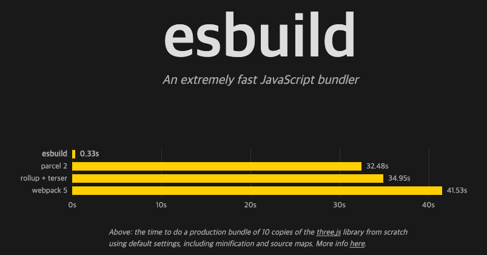

# Front-end 개발자가 Rust와 Go를 배우는 시대

## 복잡해지는 웹

웹이 복잡해지고 있다. 이유는 웹이 중요해지고 있다. 예전에는 JS를 기반으로 웹 프로그래밍을 개발했다. 그러다 node js가 나왔고 CommonJS 모듈 시스템이 나오게 되었다.

es6가 나오게 되면서 매우 많은 것들이 바꼈다. 하위 호완성 때문에 많은 것들을 바꾸지 못했지만 그래도 많은 것들이 개선되었고 개발하기 편해졌다. 클래스, import/export 등..

그런데 여기에 문제가 있다. 오래된 브라우저가 최신 문법을 이해하지 못했기 때문이다. 이를 위해 나온게 Babel이다.

개발할 때는 최신문법을 쓰고 툴을 이용해서 오래된 브라우저에서도 돌아가는 코드로 변환 시키는 것이다. 여기서 웹 프로젝트를 빌드한다는 개념이 나오게 되었다.

다음으로 React, Vue, Angular등 라이브러리와 프레임워크가 나오게 되었다. html을 직접치기 힘드니 새로운 문법을 도입하자는 건데 이게 여러모로 잘 먹혀서 지금은 react를 쓰는 곳이 많아졌다.

최신 문법이든, React를 사용할 때 브라우저가 이해할 수 있는 코드로 바꿔줘야 한다. 그럴려면 당연한 이야기이지만 Transpilling 하면 된다. 이 작업을 해주는게 babel이다.

또한 웹에서 자바스크립트가 하는 일이 많아지고 양이 늘어난만큼 자바스크립트 모듈들을 하나로 합치고 최종 자바스크립트 사이즈를 줄여 로딩속도를 빠르게할 필요가 있었다.

개발환경이 편해짐에 따라 초기 구성의 어려움은 넘어갈 수 있었다. 자료도 많고 자주 바뀌지 않았으니깐요.

그런데 빌드할 때 걸리는 시간이 문제다 엄청 느리다. 제대로 production 빌드를 할때는 분단위가 넘어간다.

## 빌드시간 문제 분석

왜 빌든는 느릴까? 빌드 툴들은 CPU를 많이 활용한다. 하지만 이벤트 루프는 CPU 위주의 작업에 맞는 모델이 아님. 다른 최적화 방식은 10% 20% 속도를 줄이면 최적화를 잘한거지만, 병렬은 기본적으로 몇 배씩 속도가 빨라진다. nodejs에서 js 코드는 기본적으로 한개의 CPU만 사용한다. nodeJS는 이벤트루프 기반이기에 cpu를 많이 사용하는 작업에는 맞지않다.

single tread라는 제약이 상당히 크다. 데이터의 의존성이 없어 병렬처리 할 수 있음에도 동시작업을 할 수 있음에도 한작업이 끝나야 다른 작업을 시작할 수 있다.

### Babel의 한계

- 자바스크립트 기반
- 1개의 CPU 코어만 사용
- 파싱, 코드 제너레이션은 시간을 특히 많이 먹음

## [SWC: Speedy Web Compiler](https://github.com/swc-project/swc)

목표는 웹빌드 툴을 고성능 구현체로 대체하는 것

문제를 해결하기 위해 언어를 바꾸었다.

- 러스트로 작성됨
- 바벨을 포함한 여러가지 웹 빌드 툴들을 대체하는 것이 목적

### 러스트를 선택한 이유

- 성능: 병렬처리를 고려하여 설계한 언어
- FFI(Foreign Function Interface) 편의성: nodejs에서 rust코드를 불러와 사용하기 위해 사용한다.
- GC: rust에는 gc가 없다. 일반적으로 gc가 있으면 프로그램을 개발하는게 쉬워진다. 그런데 여러 언어가 섞이는 프로젝트에서는 반대이다. 두 언어에 gc가 있으면 한 언어에서는 참조가 가능한데 다른 언어에서는 참조가 없는경우 메모리가 해제되지 않도록 처리해줘야하고 코드가 복잡해진다.
- 제너릭: rust에는 제너릭이 있다. 제너릭이 있으면 개발이 편해진다.

### Benchmarks

밴치마크 결과를 보면 babel보다 20배 빨라졌다.

https://swc.rs/docs/benchmarks

https://nextjs.org/blog/next-12

## [esbuild](https://esbuild.github.io/)

- Webpack의 대체제 (번들러)
- Go 언어로 작성됨 (Go, JS/TS)
- 코드 파싱, 출력과 소스맵 생성을 모두 병렬로 처리함

## Reference

- https://www.youtube.com/watch?v=4RJxyGJQe4o
