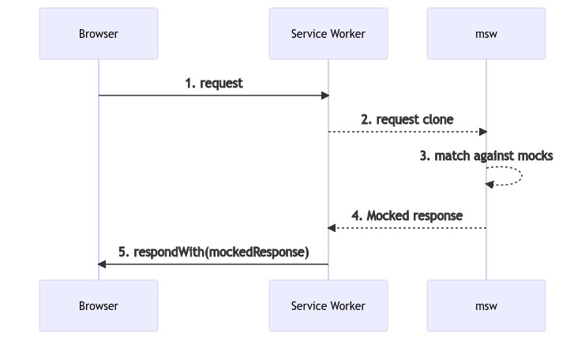

# MSW

Mock Server Worker는 Service Worker API를 사용하여 실제 요청을 가로채는 API mocking library이다.

Service Worker의 실제 능력은 캐싱의 목적으로 request를 가로채는 것이다.

Service Worker는 모든 최신 브라우저에서 제공하는 표준 API이기 때문에 추가 구성없이 mock 파일만으로 테스트가 가능합니다.

## 언제 API mocking이 필요한가?

### 개발

소프트웨어는 병렬로 개발되는 경우가 많다. 때떄로 API가 완료되기를 기다리는 경우가 있다. 아마도 static 파일이나 하드코딩된 값을 이미 사용하고 있을 수도 있을 것이다.

### 디버깅

대부분의 클라이언트의 에러는 데이터와 관련이 있습니다. 잘못된 API 호출, 오류 처리 누락 또는 예상치 못한 응답 수신등의 시나리오는 개발과 프로덕션 모두에서 매일 발생합니다.

API mocking을 통해 개발자는 문제를 일으키는 정확한 API 를 모델링 할 수 있습니다. 성공적인 시나리오도 쉽게 mocking할 수 있으므로 문제를 디버깅하고 수정하는데 효율적입니다.

## 왜 서비스 워커인가?

Mocking Service Worker는 네트워크 수준에서 요청을 가로채도록 설계된 표준화된 Service Worker API를 활용하여 mocking을 완벽하게 만듭니다. DevTools의 Network 탭에서도 api를 확인할 수 있어 mocking 했다는 사실을 까먹을 수도 있습니다.

## 어떻게 동작하는가?

Mock Service Worker는 선언된 request handler로 URL, 정규표현식, 커스텀 기준으를 바탕으로 요청을 가로채 mocked response를 반환합니다.

`POST /login` request:

```js
// src/mocks.js
import { setupWorker, rest } from 'msw'

const worker = setupWorker(
  rest.post('/login', (req, res, ctx) => {
    const isAuthenticated = sessionStorage.getItem('username')

    if (!isAuthenticated) {
      return res(
        ctx.status(403),
        ctx.json({
          errorMessage: 'Not authenticated',
        }),
      )
    }

    return res(
      ctx.json({
        firstName: 'John',
      }),
    )
  }),
)

// Register the Service Worker and enable the mocking
worker.start()
```

### Request flow diagram

#### Browser

fetch 이벤트를 통해 application에서 나가는 request를 수신 대기하는 Service worker를 등록하고 request가 worker에 있는 경우 mocked response를 반환합니다.



#### Node

Service Worker가 브라우저가 아닌 환경에서는 돌아가지 않으므로 Node에서 동일하게 사용하기 위한 API를 제공합니다. (테스트할 때 사용할 수 있습니다)

> Node 지원은 [node-request-interceptor](https://github.com/mswjs/node-request-interceptor) 라이브러리를 사용하여 `http`, `https`, `XMLHttpRequest`를 확장시켜 구현되었습니다.


## Node 환경구성

### Configure server

`mocks/server.js` 파일에 서버 인스턴스를 만듭니다.

```js
// src/mocks/server.js
import { setupServer } from 'msw/node'
import { handlers } from './handlers'

// This configures a request mocking server with the given request handlers.
export const server = setupServer(...handlers)
```

### Setup

test setup에 API mocking을 구성하면 테스트를 작성할 때 mocking에 시간을 쏟지않고 test에 집중할 수 있습니다.

테스트를 돌리기전에 server를 실행시키고 테스트가 끝나면 server를 종료시킵니다.

```js
// src/setupTests.js
import { server } from './mocks/server.js'
// Establish API mocking before all tests.
beforeAll(() => server.listen())

// Reset any request handlers that we may add during the tests,
// so they don't affect other tests.
afterEach(() => server.resetHandlers())

// Clean up after the tests are finished.
afterAll(() => server.close())
```
