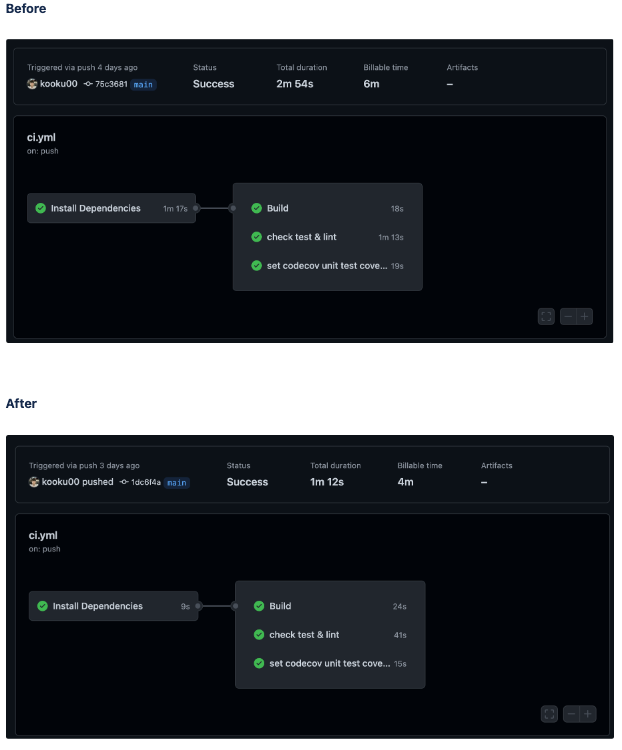

# GitHub Actions Cache 사용하기

> ci 단계에에서 Install Dependencies step을 캐싱하여([actions/cache](https://github.com/actions/cache)) 시간을 줄이는 방법을 다루어 보았습니다.

CI 단계에서 테스트 & 린트 & 빌드를 돌리기 전에 dependencies를 설치해주는 작업이 필요해요. Install dependencies의 작업이 생각보다 시간이 많이 걸리는데 card-registration-webclient 레포에서는 1m 30s 정도 걸려요. pr에 ci의 step을 통과해야 merge를 시킬 수 있는 룰이 있을때 ci가 다 돌기전까지 기다려야 하는 시간낭비도 있을 수 있고, GitHub action time이 과금 대상이라 금전적인 문제로 이어질 수도 있어요. 

GitHub actions/cache를 이용해서 yarn berry zero-install시 설치되는 `/.yarn/unplugged` 를 캐싱하여 새로운 dependency가 설치되지 않았다면 Install dependencies 과정을 건너뛰는 방법을 소개할꺼에요.

전체적인 코드는 다음과 같아요.

```yml
env:
  CACHED_DEPENDENCY_PATHS: ${{ github.workspace }}/.yarn/unplugged
  DEFAULT_NODE_VERSION: '16.16.0'

jobs:
  install_dependencies:
    name: Install Dependencies
    runs-on: ubuntu-latest
    timeout-minutes: 15
    steps:
      - name: Check out current commit (${{ github.sha }})
        uses: actions/checkout@v2
      - name: Set up Node
        uses: actions/setup-node@v2
        with:
          node-version: ${{ env.DEFAULT_NODE_VERSION }}

      - name: Compute dependency cache key
        id: compute_lockfile_hash
        run: echo "::set-output name=hash::${{ hashFiles('yarn.lock') }}"

      - name: Check dependency cache
        uses: actions/cache@v3
        id: cache_dependencies
        with:
          path: ${{ env.CACHED_DEPENDENCY_PATHS }}
          key: ${{ steps.compute_lockfile_hash.outputs.hash }}

      - name: Install dependencies
        if: steps.cache_dependencies.outputs.cache-hit == ''
        run: yarn install --immutable
    outputs:
      dependency_cache_key: ${{ steps.compute_lockfile_hash.outputs.hash }}

  continuous-integration:
    needs: [install_dependencies]
    runs-on: ubuntu-latest
    steps:
      - uses: actions/checkout@v2
      - name: Use Node.js ${{ env.DEFAULT_NODE_VERSION }}
        uses: actions/setup-node@v2
        with:
          node-version: ${{ env.DEFAULT_NODE_VERSION }}

      - name: Check dependency cache
        uses: actions/cache@v3
        with:
          path: ${{ env.CACHED_DEPENDENCY_PATHS }}
          key: ${{ needs.job_install_dependencies.outputs.dependency_cache_key }}

      - name: Check Unit Test
        run: yarn test:unit

      - name: Check Lint
        run: yarn lint
```

22번줄에서 `yarn.lock` 을 hashing 하여 새로운 denpendency가 설치되었는지 유무를 확인할 key 값으로 쓸꺼에요. hash 값이 동일하면 새로운 denpendency가 설치되지 않은거기 때문에 캐싱된 값을 쓰면 되고, 다르다면 캐싱된 값을 지우고 새로 denpendencies를 설치해줘야 할꺼에요.



