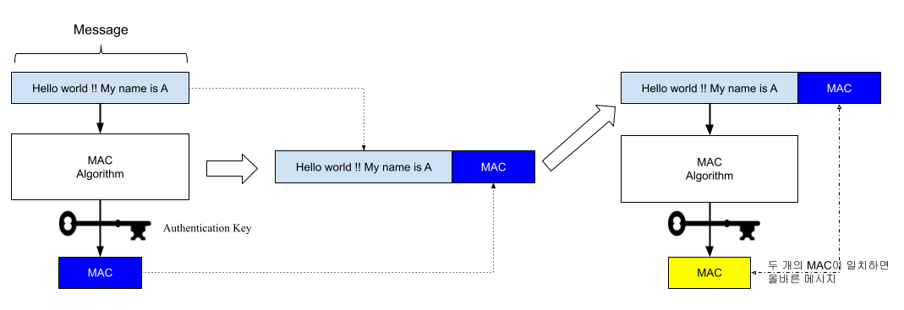

## CSP

CSP는 Content-Security-Policy 의 약자로 HTTP 보안 정책입니다.

XSS 공격을 완화하는데 도움이 되는 추가 보안 계층으로 HTTP 응답 헤더에 추가하고 user-agent가 해당 페이지에 대해 로드할 수 있는 리소스를 제어합니다.

브라우저는 XSS공격에 매우 취약한데요. 공격할 수 있는 포인트가 너무 많습니다. 예를들어 chrome-extension, npm으로 설치한 script 등 나쁜 개발자가 chrome extension에 외부 스크립트를 주입받도록하는 코드를 삽입하고 해당코드가 실행되어 공격을 하게될 수 있습니다. 또는 개발자들이 개발을 할 때 npm module을 그냥 믿고 사용하게 되는데요. 유명하지 않은 모듈들도 막 가져다 사용하게 됩니다. 이때 npm module을 무조건 신뢰하게 됩니다. 하지만 해당 Module에 외부 서버로 데이터를 전송하는 코드가 있다거나 공격 코드가 있을 수 있습니다.

CSP는 이런 공격을 차단합니다. 브라우저에서 실행 가능한 스크립트의 유효한 소스 도메인을 지정하여 XSS가 발생할 수 있는 여지를 줄입니다. 그리고 허용된 도메인에서 받은 소스 파일에서 로드된 스크립트만 실행하고 HTML 속성을 포함한 인라인 스크립트 및 이벤트 처리 등의 다른 모든 스크립트는 무시합니다.

https 통신만 허용하도록도 할 수 있고 이미지 소스는 모든 곳에서 받을 수 있게하되 동영상 파일은 허용한 도메인에서만 받을 수 있게도 할 수 있습니다.

```
Content-Security-Policy: default-src 'self'; img-src *; media-src example.org example.net; script-src userscripts.example.com
```

csp에 report-to 속성에 리포트 받을 url을 넣게 되면 csp를 위반할 때 해당 url에 POST method로 report도 보내줍니다. 

```
{
  "csp-report": {
    "blocked-uri": "http://example.com/css/style.css",
    "disposition": "report",
    "document-uri": "http://example.com/signup.html",
    "effective-directive": "style-src-elem",
    "original-policy": "default-src 'none'; style-src cdn.example.com; report-to /_/csp-reports",
    "referrer": "",
    "status-code": 200,
    "violated-directive": "style-src-elem"
  }
}
```

대부분 sentry를 사용하고 있을테니 report-to도 sentry로 발송하면 되고 sentry report-to uri를 받는 방법은 https://docs.sentry.io/product/security-policy-reporting/ 참고하면 됩니다.


이곳에서 페이지에 security header를 잘 설정하고 있는지 확인도 가능합니다. https://securityheaders.com/

### CSP 셋팅

참고자료 https://docs.aws.amazon.com/ko_kr/AmazonCloudFront/latest/DeveloperGuide/creating-response-headers-policies.html

CloudFront > Policy > response header 부분에 정의하면 됩니다.


## HMAC

hmac은 hashed-message-authentication-code의 약자이다.
가장 기본적인 보안 방법은 HTTPS 방법이다. HTTPS를 사용하면 메세지 자체를 암호화하기에 해킹으로 위험을 줄일 수 있다. 하지만 HTTPS를 사용하더라도 메세지를 낚아 변조할 수 있는데 이런 방법을 중간자 공격 (Main In The Middle Attack)MIMA 이라고 한다.
해커가 중간에서 인증서를 가지고 메세지를 해독한 후 메세지를 변조하는 건데 자세한 내용은 생략한다. (해커가 인증서 2개 - 본인이 발급한 인증서 + 실제 서버클라 인증서 2개를 가지고 중간에서 논다.)

MIMA가 얼마나 위험한지 예시로 들자면 A 계좌 -> B 계좌로 송금할 때 송금액을 변조하여 1만원 송금해야할걸 100만원 송금하게 할 수도 있고 A -> B 송금을 A -> C로 송금하게 변조할 수도 있다.

이런 메시지 조작을 막기위해서 메세지 무결성을 보장하기 위해 HMAC을 사용하는데 클라이언트, 서버에 비공개 대칭키를 저장하고. 이 대칭키를 이용해 request body (+ optional header)를 hashed 한다. 이 hash 값을 authentication-code라 부르고 이 해시값을 header에 넣어 보낸다. (ex. X-Credential) 서버는 api request를 받아 request body (+ optional header)로 다시 hash값을 만든후 X-Credential 값과 비교하여 메세지가 변조되었는지 확인한다.




## 참고자료

- https://developer.mozilla.org/ko/docs/Web/HTTP/CSP
- https://web.dev/csp/
- https://web.dev/i18n/ko/strict-csp/
- https://dongwooklee96.github.io/post/2021/03/28/%EB%84%A4%ED%8A%B8%EC%9B%8C%ED%81%AC-%EB%A9%94%EC%8B%9C%EC%A7%80-%EC%95%94%ED%98%B8%ED%99%94-%EB%B0%8F-%EB%B0%A9%EC%8B%9D-%EC%A4%91%EA%B0%84%EC%9E%90-%EA%B3%B5%EA%B2%A9-hmac-%EB%8C%80%EC%B9%AD-%EB%B9%84%EB%8C%80%EC%B9%AD-%ED%82%A4/
