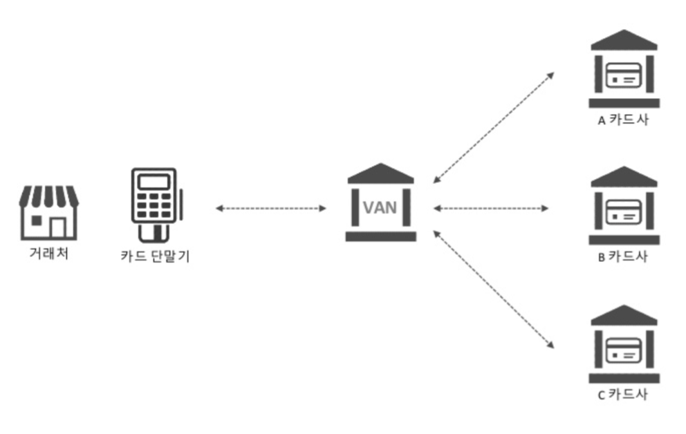
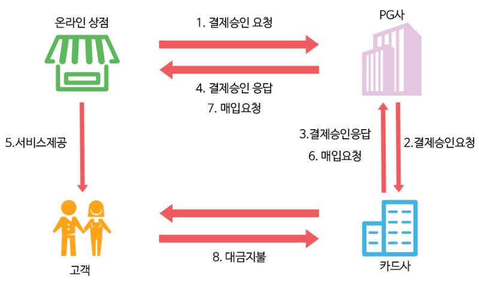

# 결제 도메인 이해하기

## 기초 용어 이해하기
### VAN (value added network)

- VAN은 부가가치 통신망(Value Added Network)이다. 사전적인 의미는 회선을 소유하는 사업자로부터 통신회선을 빌려 독자적인 통신망을 구성하고, 거기에 어떤 가치를 부가한 통신망을 이야기한다. 
- 결제 도메인에서 말하는 VAN은, 카드사와 가맹점 간의 결제 및 승인 등을 위한 네트워크를 VAN이라고 한다.
- VAN사는 결제 과정에서 거래처-카드사의 연결과 인증의 기능을 수행한다.
  - 오프라인 : 결제 단말기 제공 → 카드 식별 후 카드사에 전달
  - 온라인 : PG 사의 인증요청 → 카드사로 전달
- VAN사는 결제 과정에서 발생하는 수수료 약 0.28%를 가져가는 것이 주요 수입원이다.
- 국내에는 약 11개의 주요 VAN사가 있다.

### PG (payment gateway)

- 전자지급 결제대행 서비스
- 전자적 방법으로 재화의 구입 또는 용역의 이용에 있어서, 지급결제 정보를 송신하거나 수신하는 것 또는 그 대가의 정산을 대행하거나 매개하는 업무를 뜻한다.
  - => 요약 : 온라인 결제 정보 송수신 및 정산 업무 중계
- PG사는 결제 시스템을 제공하며, 전자(온라인) 결제에서 승인 및 정산이라는 핵심적인 역할을 수행한다. 
  - 오프라인 결제에서는 역할이 없다.
- PG사의 사업 영역(제공하는 가치)

| | |
|---|---|
| 결제 수단 | 8개의 신용카드사, 가상계좌, 휴대폰 간편결제 등 모든 결제수단에 대응하는 수단을 제공하는 플랫폼 역할을 함 |
| 데이터 관리 | 거래 데이터 및 정산 데이터를 모두 관리하기에, 한 번에 클라이언트에게 제공할 수 있음 |
| 취소 포함한 정산 | 결제와 취소를 포함한 정산을 제공함. 정산 주기가 일정해지니 대사가 간편해짐 |
| 매입 | 결제 전표를 별도로 카드사에 요청하는 것이 아니라 PG사를 통하면, 자동으로 카드사에게 청구가 됨 |

- PG사는 결제 과정에서 발생하는 수수료 약 2.4%를 가져가는 것이 주요 수입원이다.
- PG 업무를 수행하기 위해선 금융감독원에 [전자금융업자] 등록을 해, 승인을 받아야 한다(= 라이센스를 취득해야 한다.)
- 국내 PG사는 2023년 9월 15일자로 185개사가 존재한다. 현황은 [금감원 홈페이지](https://www.fcsc.kr/B/fu_b_06.jsp)에서 확인 가능하다.

## 간편결제

여러 서비스들에서 카드는 1회 등록하고, 다음 번 결제에서는 카드 정보를 다시 입력할 필요없이 인증만으로 결제를 진행하는데 이를 간편결제라고 부른다. 간편결제를 제공하기 위해서는 카드정보와 매칭되는 고유한 키를 서비스의 DB에 저장하게 된다. 카드정보와 매칭되는 고유한 키를 DB에 저장하기 위해서는 전자금융업자 라이센스를 발급받아야만 한다. 만약 이 라이센스가 없다면 DB에 카드정보를 저장할 수 없다. 하지만 PG를 이용한다면 이 라이센스를 발급받지 않아도 되는데, 카드사가 발급한 카드 고유식별정보를 PG사가 한 번 더 암호화한 키를 서비스에 전달해주고 이를 서비스 DB에 저장하면 된다. PG가 한 번 더 암호화한 키를 보통 빌링키(Billing Key)라고 부른다.

- 예시
  - 당근이가 A라는 카드를 갖고 있다고 하자.
  - 카드사는 A 카드와 매칭되는 고유식별정보를 PG 사에 전달한다.
  - PG사는 전달받은 고유식별정보를 다시 한 번 암호화해 사업자에게 전달한다.

이로 인한 문제점은 PG사에 강한 종속이 생긴다는 점이다.

예를 들어 당근이의 카드 A의 고유식별번호가 DDFG-2343 이라고 하자. 이를 PG사 각각이 자신들만의 암호화 방식으로 Billing Key를 생성하기 때문에, PG사 A는 342D@#F 로, PG사 B는 DfWEF234#로 각각 다르게 빌링키를 생성한다.

향후 PG사를 변경하는 Needs가 생길 때, 같은 카드에 대해 PG사가 변경 됐다는 이유만으로 새로운 빌링키를 발급 받고 저장해야 한다. 사용자 입장에서는 이미 등록한 카드를 또 등록해야 하는 결과를 초래한다.

이를 해결하기 위해 우리가 아는 페이 회사들은 대부분 PG 라이센스를 취득하였다.

PG 라이센스를 취득하면 빌링키가 아닌, 카드사가 발급한 고유식별정보를 저장할 수 있는 법적 권한이 생기게 된다. 

PG 라이센스를 취득을 하게 되었다고 해서 모든 페이사들이 PG를 사용하지 않는 것은 아니다. PG를 사용하지 않게 되면 여러 카드사들과 계약을 맻고 카드사 서버스펙에 맞게 개발하고 대응을 해야하는데 PG사들이 이를 대신해주기 때문에 PG라이센스가 있더라도 PG를 사용하는 경우가 많다. 이렇게 되면 일반 PG사들을 1차 PG, 페이 회사들을 2차 PG라고 부른다.

추가로 카드사별로 PG를 통하던가 카드사와 직접 통신한다던가 할 수도 있다. 이렇게 되면 해당 카드로 결제할 때는 PG 수수료가 들지 않겠지만 해당 카드사에 새로운 카드가 나오거나 문제가 발생할 때는 매번 대응해줘야 한다.
