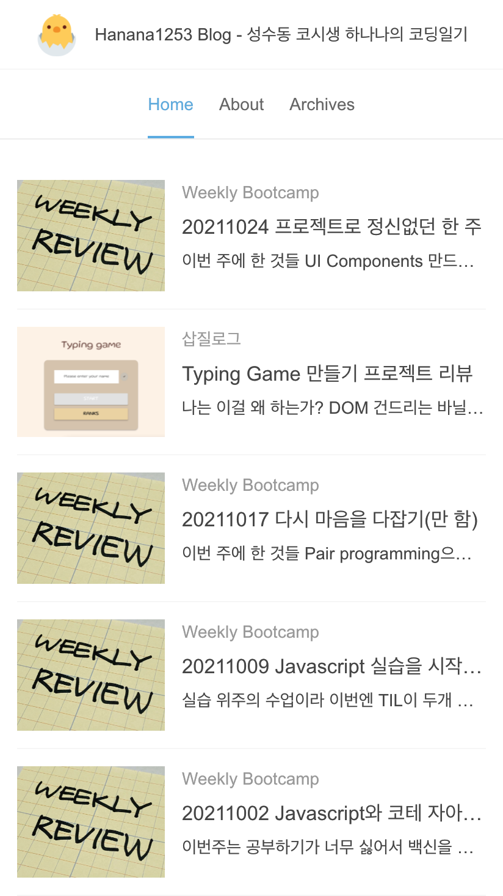

# 헤드리스 브라우저(Headless Browser)

## 헤드리스 브라우저란?

- 헤드리스 브라우저는 GUI(Graphical User Interface)을 제공하지 않는 브라우저이다. 
- 일반 브라우저와 동일하게 웹페이지에 접근하여 HTML을 인식하여 모든 컨텐츠, 심지어 스타일링 정보(레이아웃, 폰트, 색상 등)와 JavaScript로 동적 변경되는 정보들까지도 제공되지만 시각적으로 보여주는 화면은 없다. 
- GUI가 없으므로 CLI(Command Line Interface)에서의 정확하고 순차적인 명령어 입력을 통해 상호작용할 수 있는데, 페이지를 탐색하며 링크를 통해 다른 곳으로 이동하거나, 해당 웹페이지에서 제공하는 파일을 다운로드 하는 등의 동작도 수행할 수 있다.


### 헤드리스 브라우저의 의의

- GUI로 쉽게 상호작용할 수 있는데 왜 굳이 이런 브라우저가 있는 것일까? GUI가 필요 없거나, GUI를 쓸 수 없는 상황 때문일 것이다. 
  - 전자의 경우는 웹크롤링이 대표적이다. 해당 웹페이지가 제공하는 데이터만이 관심사일 뿐, 그 데이터가 어떤 모양으로 렌더링되는지는 내 알 바가 아니기 때문에 헤드리스 브라우저를 사용하여 더 빠르게 데이터만을 가져올 수 있다. 
  - 후자는 GUI가 없는 기계에서 웹에 접근해야 하는 경우이다. 데스크탑이 아니라 서버사이드에서 별도의 화면 없이 웹 화면 상의 작업을 해야 할 때는 헤드리스 브라우저를 통해 가능하다.

- 뿐만 아니라 헤드리스 브라우저는 Javascript로 동적 생성되는 정보나 AJAX로 변경된 정보에도 접근할 수 있다. 
  - 구글은 서치엔진이 헤드리스 브라우저를 통해 AJAX 상호작용 결과를 비롯하여 최종 state를 반영한 HTML 코드를 크롤링한다고 하기도 했다.

### 헤드리스 브라우저의 사용
- 브라우저 테스트를 돌리거나 웹페이지의 스크린샷을 뜨는 등의 자동화 작업을, 화면을 필요로 하지 않거나 화면이 없는 상황에서 수행하는 경우
- 동적으로 생성된 정보를 크롤링하거나 검색하는 경우
  - 동적으로 생성하여 제공된 데이터를 반영한 화면을 크롤링해야, 보다 정확히 해당 내용을 가진 웹페이지를 찾아내고 유저에게 제공할 수 있다. 
  - 이 때문에 Chrome Search 팀에서는 [서치엔진이 헤드리스 브라우저를 통해 AJAX 페이지도 효과적으로 크롤링하도록](https://developers.google.com/search/blog/2009/10/proposal-for-making-ajax-crawlable) 했다.

### 헤드리스 브라우저의 종류
- PhantomJS가 대표적이었으나 지금은 Chrome이나 Firefox에서 자체적인 헤드리스 브라우저를 제공하면서, 2017년 이후 지원되지 않는다.
- [이 곳](http://dhamaniasad.github.io/HeadlessBrowsers/)에서 현존 헤드리스 브라우저 목록(by username 'dhamaniasad')을 확인할 수 있다.

### 헤드리스 브라우저 활용해보기
- 크롬을 실행시키는 shell command에 --headless 라는 플래그를 붙이고 실행할 명령어를 또다른 플래그로 입력한다. 
  - 크롬 실행 command를 아래와 같이 alias로 만들어두면 편하다.
```
# .zrcsh 파일에 alias 등록하고 source한다.

alias chrome = "/Applications/Google\ Chrome.app/Contents/MacOS/Google\ Chrome"
```
  - 스크린샷을 찍어 파일로 만드는 명령(`--screenshot`)을 실행해보자.
```console
$ chrome --headless --screenshot={파일경로.png} {웹주소}
```
  - 파일명 없이 `--screenshot`만 하면 'screenshot.png'로 저장된다.
  - 화면 뷰 너비 설정하는 플래그 `--window-size=412,732`나, 스크롤바를 숨기는 플래그 `--hide-scrollbars` 등으로 원하는 형태로 스크린샷을 찍을 수 있다.
  - windows 환경에서 실행할 때는 `--disable-gpu`를 플래그로 작성해야 한다.
  - 아래는 헤드리스 브라우저로 찍은 스크린샷이다. 



- Chrome 팀이 개발한 Node 라이브러리 Puppeteer을 통해서도 Node.js 환경에서도 헤드리스 브라우저를 통한 작업을 수행할 수 있다.
  - 프로젝트 폴더에 puppeteer 패키지를 설치하고 import한다.
  - 아래와 같은 코드(Puppeteer에서 제공하는 튜토리얼과 동일)를 입력한다. 
```js
const puppeteer = require('puppeteer');

(async () => {
  const browser = await puppeteer.launch();
  const page = await browser.newPage();
  await page.goto('https://hanana1253.github.io/');
  await page.screenshot({path: 'screenshot.png'});

  browser.close();
})();
```
  - `$ node {파일명}`을 실행하면, path로 설정한 파일경로에 스크린샷 파일이 생성된다. 

### 느낀 점
- 다양한 상황을 위한 웹 환경이 있다는 것이 신기했다.
- 아직은 스크린샷 말고는 할 게 없었지만... 나중에 다른 작업들에 활용해보면 좋겠다.


### 참고자료
- [Wikipedia: Headless Browser](https://en.wikipedia.org/wiki/Headless_browser)
- [Andrew R H Girdwood의 블로그, WHAT IS A HEADLESS BROWSER?](https://blog.arhg.net/2009/10/what-is-headless-browser.html)
- [myservername.com의 글, What is a headless browser and headless browser testing](https://myservername.com/what-is-headless-browser)
- [개발자 Outsider님의 블로그, Headless Chrome의 사용방법](https://blog.outsider.ne.kr/1291)
- [Chrome developers의 Headless Chrome 및 Puppeteer 사용법 안내 아티클 - Getting Started with Headless Chrome (2017)](https://developers.google.com/web/updates/2017/04/headless-chrome)
- [Google Search Central Blog의 서치엔진 작동 원리 관련 아티클 - A proposal for making AJAX crawlable (2009)](https://developers.google.com/search/blog/2009/10/proposal-for-making-ajax-crawlable)
- [현존 헤드리스 브라우저 목록(by username 'dhamaniasad')](http://dhamaniasad.github.io/HeadlessBrowsers/)