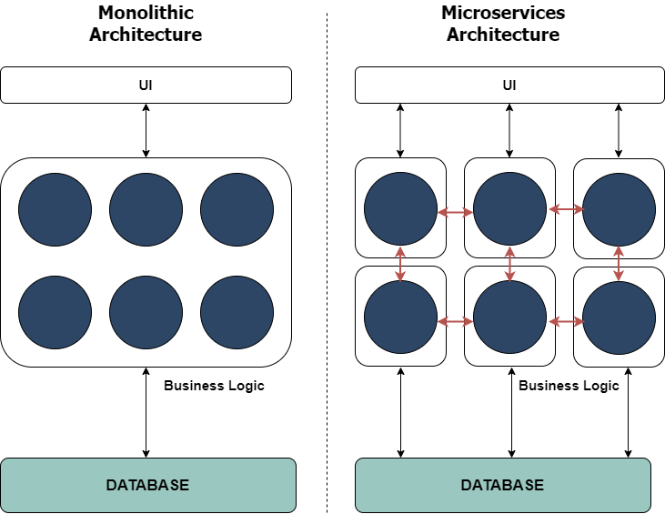
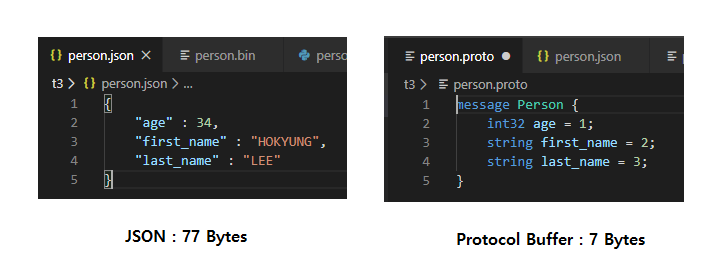
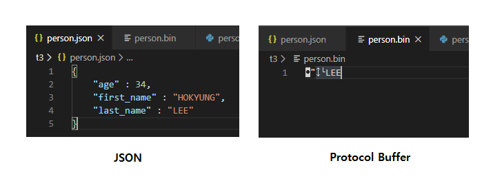

# **gRPC: A modern open source high performance RPC framework**

## 1. Monolithic to Microservices : Data Exchange

 Monolthic Architecture 시대에서 바야흐로  MSA(Microservices Architecture) 시대가 도래했다 .기존에 거대하게 존재했던 하나의 프로젝트(서비스)를, 단독으로 작동할 수 있는 작은 단위의 서비스로 분리를 의미한다. 기존 Monolithic Architecture에서 데이터는 큰 관심사가 아니었다. 언제든 서비스내에서 데이터를 참조할 수 있기 때문이다. 하지만 MSA에서 다양한 서비스들 간의 데이터 교환, 데이터의 무결성이 주요 관심사 중 하나이다. 본 글에서는 데이터 교환에만 촛점을 맞추기로 한다. 




 

데이터 교환에는 다양한 프로토콜이 있다. 전통적으로 Restful API 방식이 있다. 또한, RabbitMQ, Kafka등을 활용한 Pub-Sub 구조도 활용할 수 있다. 이 글에서는 HTTP 프로토콜을 활용한 데이터 교환 방식에 대해 다룰 것이다. 앞에서 말했듯이 Restful API는 HTTP프로토콜을 활용한 대표적인 방식이다. 하지만, Restful 방식에는 단점들이 존재했고, 이에 구글은 기존 RPC(Remote Procedure Calls) 개념과, HTTP/2를 결합해 gRPC를 탄생시켰다. gRPC의 개요, 장/단점, Restful과의 비교, 간단한 예제 코드를 살펴보자.


## 2. gPRC 톺아보기

### 1. Overview

[gRPC](https://grpc.io/) (**gRPC Remote Procedure Call**) 는 구글이 만든 고성능 RPC(원격 프로시저 호출) 프레임워크이다. HTTP/2와 IDL (Interface Description Language)인 프로토콜 버퍼(Protocol Buffers)를 기반으로 한다. 

 gPRC 클라이언트 어플리케이션은 다른 서버 어플리케이션의 메소드를 로컬 메소드처럼 호출할 수 있다. 다른 RPC 시스템처럼, gRPC는 서비스를 정의하는 것에 기반한다. 서버 측에서는, 이 서비스를 구현하고, gPRC 서버를 실행시켜, 클라이언트의 요청을 처리한다. 클라이언트는 Stub을 가지고 있는데, Stub을 통해서, 서버처럼 동일한 메소드를 제공해준다. 


 gPRC 클라이언트와 서버는 다양한 환경에서 서로 통신할 수 있으며, gRPC에서 지원하는 어떠한 언어로든 작성할 수 있다. 마이크로 서비스 환경에서 다양한 서비스간 통신 프로토콜로 유용하다.

 gRPC는 요청과 응답이라는 측면에서 봤을 때, REST와 비슷하다. 하지만, 비슷하면서도 차이점이 있다.

- REST와 마찬가지로 gRPC는 언어에 종속 되지 않는다. 
- gPRC는 `.proto` 파일을 사용하여 서비스를 정의 한다. 프로토 파일로부터 다양한 언어의 클라이언트 코드를 쉽게 생성할 수 있다.
- gRPC는 [Protocol Buffer (Protobuf)](https://en.wikipedia.org/wiki/Protocol_Buffers) 바이너리 직렬화를 사용한다..반면, REST는 JSON를 사용한다. 일반적으로 바이너리가 용량이 더 작고, 빠르다.
- gRPC는 HTTP/2를 사용하며, REST는 HTTP 1.1을 사용한다.
- HTTP 1.1 은 매 요청마다 TCP 연결 과정이 필요하지만 HTTP/2 연결을 유지한다.
- HTTP/2는 병렬 Stream 처리가 가능하다
- gRPC는 양방향 Stream도 가능하다.


### 2. gRPC Strength over REST

#### Performance

위에서 잠깐 살펴봤듯이, gRPC 는 프로토콜 버퍼를 이용해 메세지를 교환하는데, 프로토콜 버퍼는 JSON에 비해서 용량도 작으며 훨씬 빠르다. 속도에 제한적인 모바일 환경에서 더욱 효율적이다. 또한, 바이너리이기 때문에 직렬화/역직렬화 하는데, CPU 등 자원 소모가 적다.

아래는 이미지는 동일한 내용의 JSON과 Protocol Buffer를 통해 생성 된 바이너리의 용량 비교이다. Protocol Buffer의 용량이 훨씬 작음을 알 수 있다. Protocol Buffer의 Byte 크기를 구하려면, 해당 언어의 API문서를 참고하자.  참고로 Golang에서는 Size(m Message) 함수를 통해 크기를 구할 수 있다.



 또한, gPRC는 HTTP/2 프로토콜로 디자인 되었다. 데이터 교환에 있어 훨씬 효율적이다. HTTP 1.1과 HTTP/2의 자세한 차이는 [여기서](https://medium.com/@factoryhr/http-2-the-difference-between-http-1-1-benefits-and-how-to-use-it-38094fa0e95b) 확인할 수 있다.

#### Code generation

gRPC는 .proto 파일을 기반으로 코드를 자동으로 만들어준다. 서비스 기반의 클래서, 메세지, 완전한 클라이언트 코드를 생성한다.

아래처럼 메세지와 서비스를 정의하기만 하면 된다.

> **Greet.proto**

```
syntax = "proto3";

// The greeting service definition.
service Greeter {
    // Sends a greeting
    rpc SayHello (HelloRequest) returns (HelloReply);
}
  
// The request message containing the user's name.
message HelloRequest {
    string name = 1;
}
  
// The response message containing the greetings
message HelloReply {
    string message = 1;
}
```

컴파일러가 우리를 대신해서 자동으로  코드를 생성해줄 것이다. 우리는 그저 import해서 사용하기만 하면 된다. 개발자들의 생산성을 높여주는 큰 장점이 된다. 

#### Strict specification

HTTP를 통한 API 통신에는 엄격한 SPEC이 없다. 단지, 여러 개발자들이 Best Practice를 만들었을 뿐이다. [이 링크](https://stackoverflow.blog/2020/03/02/best-practices-for-rest-api-design/)를 보면 여러가지 주의점들이 있다. 하지만 모든 개발자들이 해당 내용에 동의 하는 것이 아니다.

 반면, gRPC는 명확한 [SPEC](https://github.com/grpc/grpc/blob/master/doc/PROTOCOL-HTTP2.md)을 가지고 있으며, 모두 따라야 한다. 이는, 개발자들 간의 소모적인 논쟁을 줄일 수 있게 해준다.

#### Streaming

gPRC는 HTTP/2를 통해 Stream을 지원한다. 단순한 요청/응답이 아닌 연결을 맺고 지속적으로, 데이터를 교환할 수 있다. 이는 실시간 처리 등에 도움이 된다. gRPC는 모든 조합의 스트리밍을 지원한다.

- Unary (no streaming)
- Server to client streaming
- Client to server streaming
- Bi-directional streaming


여기까지가 필자가 생각한 가장 중요한 장점이다. 반면, gRPC는 몇 가지 단점도 가지고 있다.

 첫째, gRPC 서비스를 브라우저에서 호출 할 수 없다는 점이다. REST같은 경우는 브라우저에서 즉시 URL을 호출 해 어떤 응답이 오는지 확인 할 수 있다. 브라우저에서 직접 호출할 수 없다는 것은, 어쨌든 응답을 확인하기 위해서, 코드가 작성 돼야 한다는 점이다.

 둘째, REST에 일반적으로 사용되는 JSON은 쉽게 읽을 수 있는 반면에, 프로토콜 버퍼는 쉽게 읽을 수 없다는 점이다. 아래 이미지를 보자.



 동일한 내용을 담고 있는 JSON과 Protocol Buffer로 생성된 바이너리이다. 이처럼 한 눈에 볼 수 없는 것이 개발 및 디버깅시 단점으로 작용한다. 혹시라도, 오른쪽 이미지를 쉽게 읽을 수 있다면, 당신은 그저 컴..퓨...터. 

 지금까지 gRPC의 장점과 단점을 살펴봤다. 그러면 gRPC는 언제 사용하면 좋을까? 


### 3. WHEN TO USE

Microservices : 바이너리를 통해 통신하기 때문에, 데이터는 용량이 작으며, 높은 처리량을 보여준다. 서비스들 간의 통신이 많이 일어나기 때문에, gRPC를 통해 효율성을 높일 수 있다.

Realtime communication : 웹은 일반적으로 클라이언트에서 서버로 가는 단방향이다. 따라서, 채팅과 같은 실시간 양방향 애플리케이션을 구현하기 위해서 다양한 방식들이 고안 되었다. 대표적으로 Polling 방식이 있는데, Polling 방식은 주기적으로 메세지가 있는지 확인해야하는 단점을 가지고 있다. 반면에 gRPC는 Polling없이  실시간으로 메세지를 주고 받을 수 있기 때문에, Realtime 어플리케이션에 적합하다.

제한된 리소스 환경 : 앞서 살펴봤듯이 gRPC는 프로토콜 버퍼로부터 시작한다. 동일한 내용의 JSON보다 작고 가볍다. 최근 IOT기기들이 늘어나고 있는데, 이러한 제한된 리소스 환경에 적합하다.

 

## 4. Conclusion

  Microservice Architecture 시대에서, 수많은 Service 존재한다. 이뿐만 아니라 다양한 IOT Device들도 폭발적으로 늘어나고 있다. 다양한 Service, Device 간의 빠른 데이터 교환 및 성능은 필수불가결한 요소가 되었다. 또한, 빠른 개발도 중요해졌다. HTTP/2 및 프로토콜 버퍼 바이너리를 통해 속도/성능 향상, 개발자의 개발 생산성 향상을 통해,  gRPC가 이를 뒷받침 해줄 것이다. gRPC REST를 완전히 대체할 수 있다고 말하는 것은 아니다. 하지만 적절한 상황에 한번 쯤은 고려해볼만하지 않을까?   

--------


## **Appendix**

### 1. Protocol Buffer

### 2. 참고자료

https://michaelscodingspot.com/rest-vs-grpc-for-asp-net/

https://docs.microsoft.com/en-us/aspnet/core/grpc/comparison?view=aspnetcore-3.1

https://grpc.io