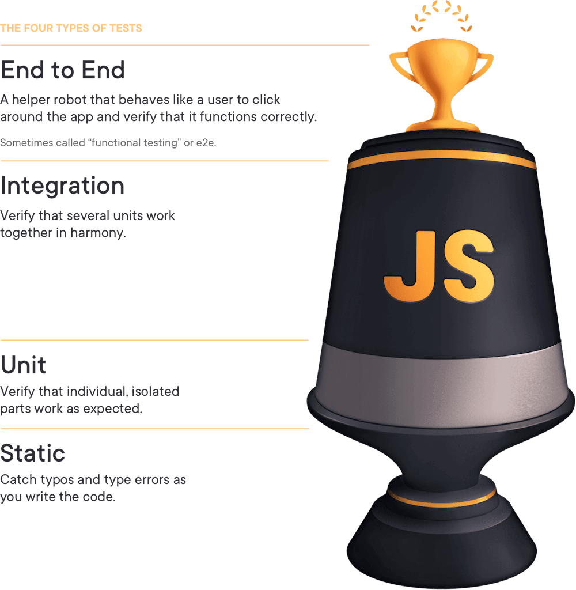

# 프론트엔드에서의  테스트 


- Kent C. Dodds 님의 [Static vs Unit vs Integration vs E2E Testing for Frontend Apps](https://kentcdodds.com/blog/static-vs-unit-vs-integration-vs-e2e-tests) 을 읽고 정리한 글입니다. 저의 이해도를 높이기 위해 보충 설명이 되어 있는 부분들도 있으므로 정확한 원서를 참고 부탁드립니다.  




이 테스트 트로피가 무엇인지, 왜 이 분류가 중요한지, 아니면 중요하지 않은지에 대해 이야기 합니다. 

테스트 트로피에는 4가지 유형의 테스트가 있습니다.

- End to End test : 사용자가 앱 주변을 클릭하고 제대로 작동하는지 확인하는 도우미 로봇입니다. "기능 테스트" 또는 e2e라고도 합니다.
- 통합 : 여러 단위 테스트들이 조화롭게 함께 작동하는지 확인합니다.
- 단위 : 개별 격리된 조그마한 단위로 작성되며 예상대로 작동하는지 확인합니다.
- 정적 : 코드를 작성할 때 오타 및 유형 오류를 포착합니다.

각 단계 에서의 트로피의 사이즈(면적)는 테스트를 하는데 얼마나 초점을 맞추는지에 대한 부분을 나타냅니다.


### End to End

종단간 테스트는 프론트엔드와 백엔드를 포함한 전체 어플리케이션을 실행하며, 실질적인 일반 사용자 처럼 앱과 상호작용을 합니다. 아래의 코드는 Cypress로 작성되었으며, 로그인 하는 과정입니다. ```visitApp()``` 이란 함수를 사용하여 실제 사용자의 행동양식처럼 앱을 방문합니다.  

```jsx

import {generate} from 'todo-test-utils'
describe('todo app', () => {
  it('should work for a typical user', () => {
    const user = generate.user()
    const todo = generate.todo()
    // here we're going through the registration process.
    // I'll typically only have one e2e test that does this.
    // the rest of the tests will hit the same endpoint
    // that the app does so we can skip navigating through that experience.
    cy.visitApp()
    cy.findByText(/register/i).click()
    cy.findByLabelText(/username/i).type(user.username)
    cy.findByLabelText(/password/i).type(user.password)
    cy.findByText(/login/i).click()
    cy.findByLabelText(/add todo/i)
      .type(todo.description)
      .type('{enter}')
    cy.findByTestId('todo-0').should('have.value', todo.description)
    cy.findByLabelText('complete').click()
    cy.findByTestId('todo-0').should('have.class', 'complete')
    // etc...
    // My E2E tests typically behave similar to how a user would.
    // They can sometimes be quite long.
  })
})
```
---

### Integration 

아래의 테스트는 전체 앱을 렌더링 합니다. 전체앱을 렌더링하는 것은 통합테스트의 요구사항은 아닙니다. 사실 통합테스트의 이면에는 mock 을 가능한 적게 사용하는 것입니다.
여기 코드에서는 "test/app-test-utils" 모듈의 render를 사용합니다.     

원문과는 별개입니다만 여기서 이용한 테스팅 툴은 testing-library 라고 이 글을 쓰신분이 만든 리액트를 위한 통합 테스트 라이브러리 입니다. 
```jsx
import * as React from 'react'
import {render, screen, waitForElementToBeRemoved} from 'test/app-test-utils'
import userEvent from '@testing-library/user-event'
import {build, fake} from '@jackfranklin/test-data-bot'
import {rest} from 'msw'
import {setupServer} from 'msw/node'
import {handlers} from 'test/server-handlers'
import App from '../app'
const buildLoginForm = build({
  fields: {
    username: fake(f => f.internet.userName()),
    password: fake(f => f.internet.password()),
  },
})
// integration tests typically only mock HTTP requests via MSW
const server = setupServer(...handlers)
beforeAll(() => server.listen())
afterAll(() => server.close())
afterEach(() => server.resetHandlers())
test(`logging in displays the user's username`, async () => {
  // The custom render returns a promise that resolves when the app has
  //   finished loading (if you're server rendering, you may not need this).
  // The custom render also allows you to specify your initial route
  await render(<App />, {route: '/login'})
  const {username, password} = buildLoginForm()
  userEvent.type(screen.getByLabelText(/username/i), username)
  userEvent.type(screen.getByLabelText(/password/i), password)
  userEvent.click(screen.getByRole('button', {name: /submit/i}))
  await waitForElementToBeRemoved(() => screen.getByLabelText(/loading/i))
  // assert whatever you need to verify the user is logged in
  expect(screen.getByText(username)).toBeInTheDocument()
})

```

---

### Unit 

원문에는 없는 저의 설명입니다. 리액트에서의 단위 테스트입니다. 단위 테스트에는 주로 브라우저의 DOM과 연관된 코드가 없는 순수함수로 쓰이는 것과는 다르게 리액트에서는  ```render()``` 함수로 DOM을 사용 하여 컴포넌트가 렌더링 되는 것이 단위테스트의 한 예로 포함됩니다.

```jsx

import '@testing-library/jest-dom/extend-expect'
import * as React from 'react'
// if you have a test utils module like in the integration test example above
// then use that instead of @testing-library/react
import {render, screen} from '@testing-library/react'
import ItemList from '../item-list'
// Some people don't call these a unit test because we're rendering to the DOM with React.
// They'd tell you to use shallow rendering instead.
// When they tell you this, send them to https://kcd.im/shallow
test('renders "no items" when the item list is empty', () => {
  render(<ItemList items={[]} />)
  expect(screen.getByText(/no items/i)).toBeInTheDocument()
});

```

---
### Static 

TypeScript and ESLint와 같은 정적 분석 툴은 기본적인 문법에서의 실수를 줄여 주긴 하지만 비즈니스 로직에 대한 확신을 보장할 수 없습니다. 따라서 좋은 테스트 스위트로 코드에 대한 확신을 높일 수 있습니다.


```jsx
// can you spot the bug?
// I'll bet ESLint's for-direction rule could
// catch it faster than you in a code review 😉
for (var i = 0; i < 10; i--) {
  console.log(i)
}
const two = '2'
// ok, this one's contrived a bit,
// but TypeScript will tell you this is bad:
const result = add(1, two)
```


---

## 트레이드 오프


각 단계에서의 트레이드 오프에 대해 이야기를 하자면, 

비용, 속도, 확신성 세가지 요소가 있습니다. 

비용 : 위의 트로피 이미지에서 트로피의 윗단계로 올라갈 수록 테스트 비용이 더 많이 듭니다. 엔지니어들이 각 개별 테스트를 작성하고 유지하는데 걸리는 시간이기도 합니다. 또한 트로피가 위로 올라갈수록 테스트에서 더 많은 실패지점 들이 있습니다. 그래서 테스트를 분석하고 수정하는데 더 많은 시간이 소요 됩니다. 

속도 : 트로피 윗단계로 올라갈 수록 테스트는 일반적으로 느리게 실행됩니다. 그 이유는 트로피에서 더 높을수록 테스트에서 더 많은 코드가 실행되기 때문입니다.단위 테스트는 일반적으로 종속성이 없거나 해당 종속성을 mocking 작은 것을 테스트합니다. (수천 줄의 코드를 몇 줄로 효과적으로 교체)

확신성: 

비용과 속도가 트로피의 위로 올라갈 수록 더 많은 비용이 들고 더 테스트 작성/실행 부터 유지보수 까지 많은 상당 부분이 소요됩니다. 하지만 피라미드 위로 올라갈 수록 테스트 형식의 신뢰도가 증가합니다. E2E 테스트는 단위 테스트보다 느리고 비용이 많이 들지만 애플리케이션이 의도한 대로 작동한다는 확신을 훨씬 더 많이 줍니다.


## 정리

정리에서 Kent님은 모든 레벨에서 존재 되는 트레이드 오프를 언급하며  E2E 테스트의 경우를 이야기 했는데, E2E테스트는  실패케이스를 일으키는 문제의 코드를 찾기도 힘들지만, 이 테스트가 더 많은 확신을 준다고 말합니다. 그래서 이것은 시간이 많지 않은 경우에 특히 유용 하다고 합니다. 또한 자신감/확신 가지고 처음부터 테스트 실패 이유를 추적하는데 직면하는 것이 문제를 찾으려고하지 않는것 보다 더 낫다고 말합니다. 

그리고 그는 사람들이 그의 단위테스트를 보고 통합테스트 혹은 E2E 테스트라 부르고 싶다면 그렇게 하라고 합니다. 즉 구분에 대해 별 관심을 가지지 않는다고 합니다. 하지만 그가 관심을 가지는 부분은, 변경사항이 있는 그의 코드가 비즈니스 요구 사항을 충족하고 그 목표를 달성하기 위해 다양한 테스트 전략을 사용하는 것이라며 글을 마쳤습니다.


--
참고자료
 [Write tests. Not too many. Mostly integration-Kent C. Dodds](https://kentcdodds.com/blog/write-tests)


