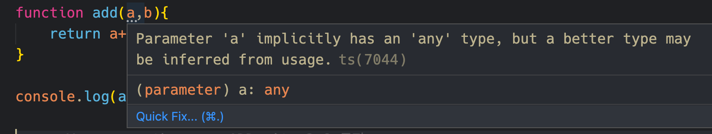
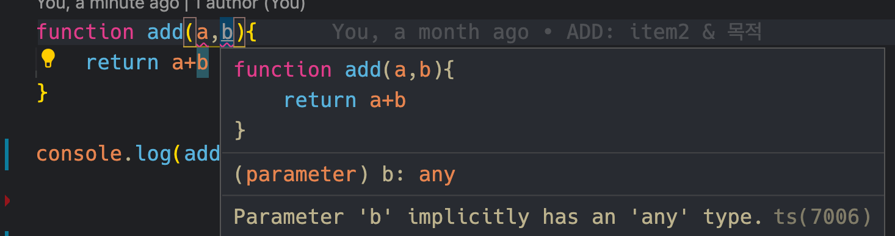
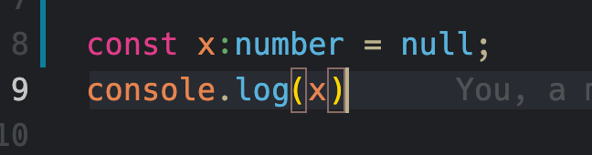
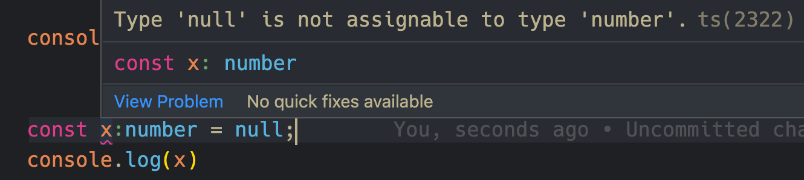
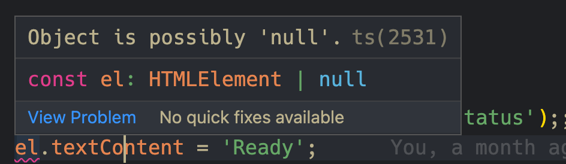
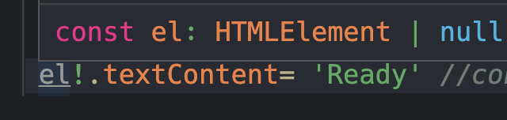
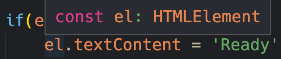

# 아이템 2. 타입스크립트 설정 이해하기 

- 댄 밴더캄의 이펙티브 타입스크립트 도서의 아이템2.타입스킓트 설정 이해하기 파트를 읽고 정리한 내용입니다. 

```typescript
function add(a,b){
    return a+b;
}

add(10,null);

```
오류없이 타입 체커를 통과할 수있을까 ? 

tsconfig에서 설정이 어떻게 되어 있는지 모른다면 대답할 수 없을 것입니다.

타입스크립트 컴파일러의 설정은 현재 거의 100개에 이르며, 설정을 어떻게 하느냐에 따라 완전히 다른 언어로 느껴질 수 있습니다. 그래서 제대로 사용하려면 noImplicitAny와 stricNullCheck을 이해해야 합니다.

## ✔️ noImplicitAny

noImplicitAny는 변수들이 미리 정의된 타입을 가져야 하는지 여부를 제어합니다. 

타입을 지정하지 않으면 암묵적으로 any라는 타입을 지정하는데, 타입체커는 속절없이 무력해진다. 타입스크립트는 타입정보를 가질 때 가장 효과적이기 때문에 되도록이면 noImplicitAny를 true로 설정해야 한다.

no + implicitAny ⇒ 설정 : 암묵적인 any를 쓰지 않는다. true/ false 

**`noimplicitAny :false`**


실행결과 : NaN

**`noimplicitAny :true`**



컴파일 오류를 미리 vscode에서  타입스크립트가 추론한 함수의 타입으로 
코드 편집기에서 미리 컴파일 오류를 확인할 수 있습니다.

실행결과:

명시적으로 :any 라고 선언하거나 다른 더 분명한 타입을 사용하면 타입체커의 오류를 해결할 수 있습니다.

```typescript
function add(a:number,b:number){
    return a+b;
}

add(10,2); // 12

```

어느 상황에 설정 또는 비설정이 좋을까?

- 새 프로젝트를 시작할 때 설정하는 것을 추천- 가독성, 생산성 향상
- 자바스크립트를 타입스크립트로 전환하는 상황에는 설정해제

(뒷부분에도 나오겠지만 참고로 any의 지양성에 대해 다루고 있는데, any타입을 지양해야한다는 관점에서는 아마 noImplicitAny를 true 로 하는게 좋은것 같습니다.)

## ✔️ strictNullChecks


`null`과 `undefined` 가 모든 타입에서 허용하는가? 에 대한 여부를 확인 하는 설정입니다.

```typescript 
const x : number = null; 
```

- **`strictNullChecks :false`**




- **`strictNullChecks :true`**


undefined 또한 같은 오류를 냅니다.

`strictNullChecks :true`설정으로 개발하기로 선택했음에도 불구하고 null을 허용해야 할 일이 있다면, 명시적으로 null타입을 사용 할 수 있습니다.
```typescript
const x:number | null = null;
```

null을 절대로 허용하지 않을 경우,
null/undefined를 체크하는 코드나 단언문(assertion) 을 추가합니다.

예제)

```typescript
const el = document.getElementById('status');
el.textContent = 'Ready';

```



타입스크립트가 추론한 `el` 의 타입은,
- status라는 id를 가진 엘리먼트가 없으면 `null`,
- status라는 id를 가진 엘리먼트가 있다면 `HTMLElement`.  
입니다.

타입이 null이 될 수 있기 때문에, 타입추론에서 에러를 내줍니다.

해결 접근 방안: 
* null 타입을 체크하는 코드를 추가합니다.

```typescript

if(el){ 
    el.textContent = 'Ready'; // ✅
}

```


* Non-null assertion 사용으로 el은 확실히 null 또는 undefined 가 아님을 가정합니다.

```typescript


el.!textContent = 'Ready'; //✅

```



`.!` 에 대해 궁금하시다면,
[Non-null assersion operator 도입 TypeScript 2.9 공식문서](https://www.typescriptlang.org/docs/handbook/release-notes/typescript-2-0.html#non-null-assertion-operator) 
[Non-null Assertion Operator (Postfix!) 개선안 TypeScript 3.9 공식문서](https://www.typescriptlang.org/docs/handbook/release-notes/typescript-3-9.html#parsing-differences-in-optional-chaining-and-non-null-assertions) 참고입니다.

`strictNullChecks` 은 `undefined는 객체가 아닙니다`라는 런타임오류를 방지하기 위해 사용하는 것이 좋습니다. 

`strict:true`라는 설정을 하게되면 noImplicitAny와 strictNullChecks 설정으로 대체 할 수 있습니다. 

---
참고자료  

* [도서 - 댄 밴더캄, 이펙티브 타입스크립트, O'REILLY /프로그래밍 인사이트](https://blog.insightbook.co.kr/2021/06/10/%e3%80%8a%ec%9d%b4%ed%8e%99%ed%8b%b0%eb%b8%8c-%ed%83%80%ec%9e%85%ec%8a%a4%ed%81%ac%eb%a6%bd%ed%8a%b8-%eb%8f%99%ec%9e%91-%ec%9b%90%eb%a6%ac%ec%9d%98-%ec%9d%b4%ed%95%b4%ec%99%80-%ea%b5%ac%ec%b2%b4/)

