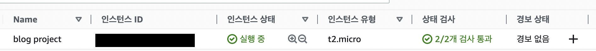
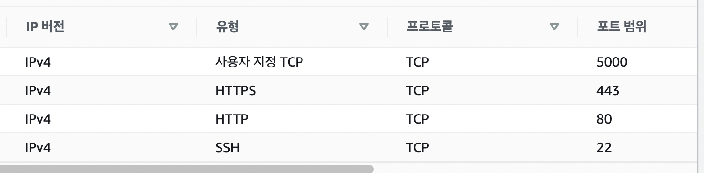
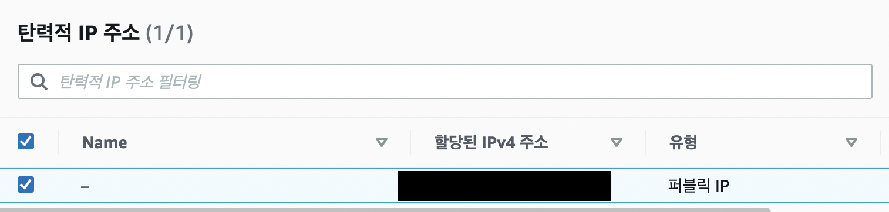
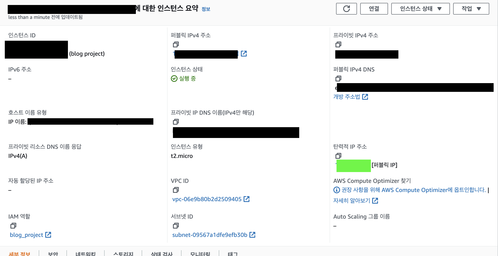
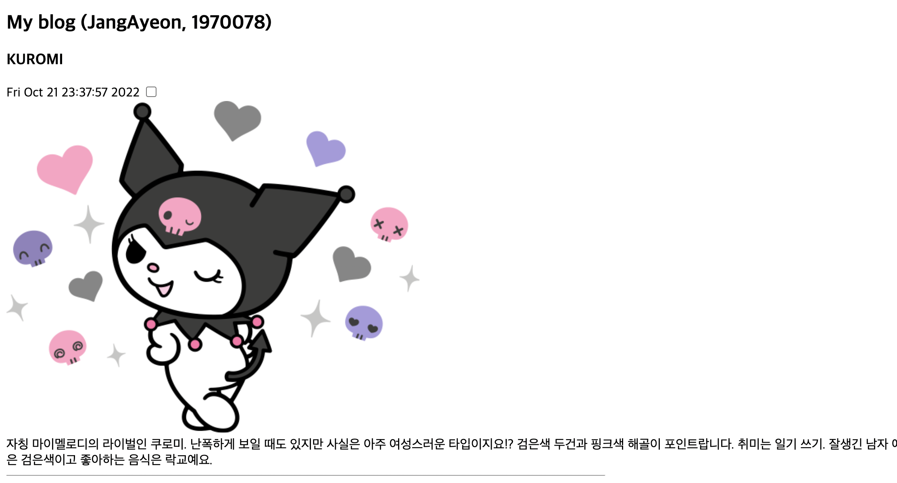
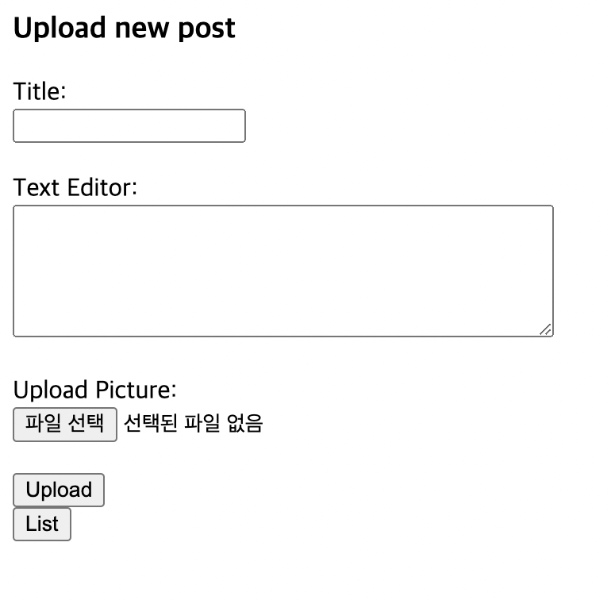
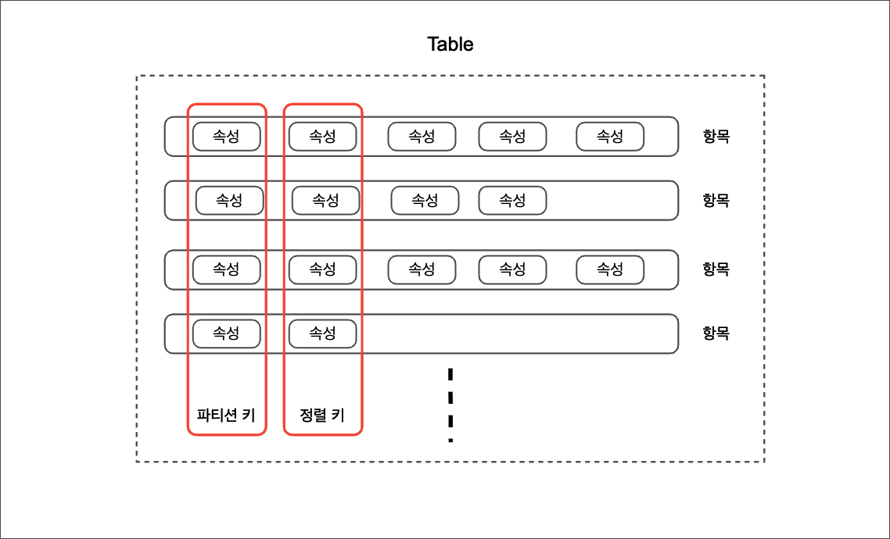
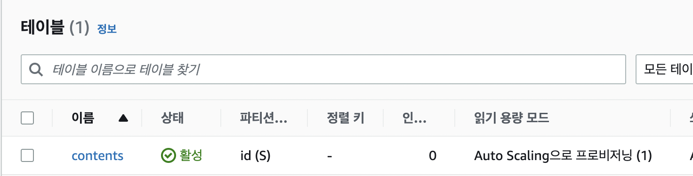
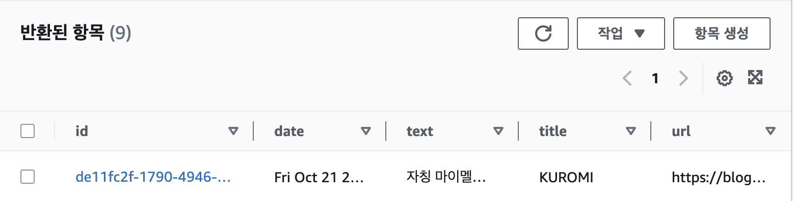

## Severless Simple Blog
 AWS EC2, S3, DynamoDB, boto3 파이썬 라이브러리 활용

### 글 (post) 구성
* 제목, 내용, 사진, 이미지, 날짜/시간<br>
* 이미지의 경우 필수 항목 아님

### 기능
1. post 생성 : creat
2. 등록된 post 리스팅 : read
3. 체크 박스에 선택된 post 삭제 : delete

### EC2 서버 생성 

다음과 같이 인스턴스 상태가 실행 중이면 됨. AMI는 **Ubuntu Server 22.04 LTS**를 사용함.

### EC2 인바운드 규칙 추가

인터넷 주소 URL로 접속되도록 하기 위해 **inbound 규칙**에 HTTP와 HTTPS를 추가함. 또, `ip 주소:{포트번호}` 형태로 커스텀 포트 번호 할당해 연결해주기 위해 **사용자 지정 TCP에 포트 범위를 지정**하는 규칙을 추가함. 맥OS에서는 **포트 5000번을 이미 airplay가 사용**하고 있어 접속이 거부 당하는 경우가 발생할 수 있으니 해당 서비스 연결을 종료하고 사용해야 함.

### 탄력적 ip 생성

EC2는 인스턴스를 재시작할 때마다 퍼블릭 DNS와 IP 주소가 변경됨을 볼 수 있는데 고정적인 ip할당을 위해 탄력적 ip를 생성했다. 

### EC2 인스턴스 실행과 EIP 연결
 
**무료 사용 범위에 해당하는 경우**
* 한 인스턴스에 하나의 EIP 할당
* 해당 인스턴스가 실행 중
두 항목이 동시에 충족 되어야만 무료로 사용 가능함

**비용 부과되는 경우**
* 인스턴스 실행이 꺼진 경우
* 탄력적 ip를 생성만 해두고 EC2 인스턴스에 연결하지 않은 경우


### FE : post 리스트 페이지 마크업

 
```html
<!DOCTYPE html>
<html>
  <head>
    <title>My blog</title>
  </head>
  <body>
    <div class="content">
        <div>
          <h2>My blog (JangAyeon, 1970078)</h2>
          <form method="POST" action="/delete" enctype="multipart/form-data">
            
           <h3>{{content.title}}</h3>
            {{content.date}} <input type="checkbox" name="deletecheck" value={{ content.id }}> <br>
              <br>   
              {{content.text}}
              <hr width="50%" align="left" size="1px" />
            
                <input type="button" value="Upload" onClick="location.href='post'">
          <input type="submit" value="Delete">
          </form>
        </div>
    </div>
  </body>
</html>
                                                   
```
### FE : post 업로드 페이지 마크업
 

```html
<!DOCTYPE html>
<html>
  <head>
  </head>
  <body>
    <div class="content">
      <h3>Upload new post</h3>
      <div>
        <form method="POST" action="/upload" enctype="multipart/form-data">
          Title:<br>
          <input type="text" name="title"><br><br>
                Text Editor:<br>
                <textarea name="text" cols="40" rows="5"></textarea><br><br>
                Upload Picture:<br>
                <input type="file" name="file"><br><br>
          <input type="submit" value="Upload">
        </form>
              <input type="button" value="List" onClick="location.href='/'">
      </div>
    </div>
  </body>
</html>
                                                           
```

### DB : dynamoDB 

```
DynamoDB란?
규모에 상관없이 빠르고 유연한 완전관리형 NoSQL 데이터베이스 서비스
```
dynamoDB는 nosql로 속성에 대한 자유도가 높다는 장점이 있고, AWS에서 운영하는 serverless 플랫폼의 DB로 클러스터링, 백업정책, 성능상향, 다중리젼 지원 등의 Full-managed임.

 

 * table : 데이터가 저장되는 테이블됨
 * item : 테이블에 Insert, Update, Delete 하게 될 속성들의 집합
 * attribute : 항목을 구성하는 각각의 데이터들
 * partition Key : 테이블 생성 시 필수로 설정 해야하는 기본키
 * sort Key : 테이블 생성 시 선택적으로 설정 가능한 기본키. 이를 이용해 동일한 파티션 키를 가진 데이터를 정렬함.

### DB : 테이블 생성 및 샘플 데이터 추가

 
post들이 담길 table명을 contents로 지정해 테이블 생성함

 
post인 item에 항목을 설정하고 예시 데이터 한개를 추가함 

### DB : python boto3 SDK 활용한 dynamoDB와 S3 리소스 연결

```python

// dynamoDB에서 테이블 명으로 테이블 불러오기
def get_table(TABLE):
    DB = boto3.reasource("dynamodb", region_name="us-west-1")
    table  = DB.Table(TABLE);
    return table

// aws s3 버킷 불러오기
def get_s3():
    try:
        s3 =  boto3.resource(service_name = "s3")
    except Exception as e:
        print(e)
    else:
        return s3
```


### DB : 테이블에서 item을 Read해서 반환

```python
def get_items(TABLE):
    table = get_table(TABLE)
    data = table.scan()
    return data["item"]
```
* `scan()` 메서드를 활용해 해당 테이블의 데이터 정보 전체를 받아오고 그 중 "item" 속성을 활용해 화면에 렌더링할 값만 선정해 반환함

### DB : 업로드 페이지에서 입력한 값을 기반으로 테이블에 item을 create 하기

```python
def upload_post(file, title, text, BUCKET, TABLE):
    table = get_table(TABLE)
    date = datatime.now().strftime("%c")
    key = str(uuid4())

    if(file):
        url = upload_image_s3(file, key, BUCKET)
        if (url):
            table.put_item(
                Item = {"id":key, "title" : title, "text":text, "date" : date, "url":url})
        else:
            table.put_item(
                Item = {"id":key, "title" : title, "text":text, "date" : date})

```

이미지 파일이 있는 경우 s3 버킷에 해당 포스팅의 id 값으로 정적 데이터를 저장하고 그 결과로 이미지 URL을 반환받음. 테이블의 해당 post의 url 속성으로 이미지 URL 값으로 저장함. 이미지가 존재하지 않는 경우에는 url 속성을 사용하지 않음.

### s3 : s3 버킷에 이미지 저장과 삭제

```python
def upload_image_s3(file, key, BUCKET):
    s3 = get_s3()
    data = open(file, "rb")
    try:
        s3.Bucket(BUCKET).put_object(Key = "uploads/"+key, Body = data, ContentType = "jpg")
        return "{버킷URL}"+key
    except Exception as e:
        print(e)

def delete_image_s3(key, BUCKET):
    s3 = get_s3()
    s3.Object(BUCKET, "uploads/"+key).delete()

```

### DB : post id 값을 사용하여 post 아이템 삭제

```python

def delete_post(key, BUCKET, TABLE):
    table = get_table(TABLE)
    table.delete_item(Key = {"id" : key})
    delete_image_s3(key, BUCKET)

```