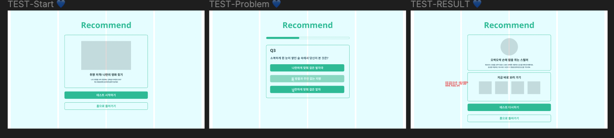

## 선호 영화 장르 테스트 [1]

### 프로젝트 소개
* PHP + MYSQL + MARIADB + JS + HTML + CSS 활용 
* 영화를 사랑하는 시네필을 위한 영화 커뮤니티를 개발하는 토이 프로젝트 중 일부 기능
* 장르에 대한 정보로 구성된 단편적인 문항이 아닌 흥미로운 문항으로 질문을 만들어서 유저에게 적합한 영화 장르와 그에 맞는 영화를 추천하자!

### 피그마를 활용한 프로토타입 제작

* 테스트 시작/안내 페이지
* 짧은 문제, 3개의 버튼, 질문에 대한 답변 프로그래스바로 구성된 문항 페이지
* 선택을 바탕으로한 사용자 선호 장르 산출 보여줄 결과 페이지

### 개발 단계
1. 대략적인 문항과 선지 & 장르 설명 문구 작성
2. 대략적인 페이지 마크업
3. 선택에 따른 장르 산출 로직 + 프로그래스바 진행률 계산 작성
4. 유저의 선호 장르 결과 BE 전달
5. PHPH 해당 장르 설명 + 추천 영화 받아와 결과 페이지 보이기  

이번 글은 3번까지의 과정을 담고 있습니다! 
