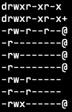

# Linux File Permission

이 글의 주제인 `File Permission` 에 대해 이야기 하기 전에 글을 작성하게 된 계기를 먼저 이야기해보고자 합니다.

<br/>

서버 개발을 하다보면 직접 원격 Linux 서버에 들어가 작업을 하는 경우가 많습니다. 그러던 중 File permission이 없어 작업을 진행할 수 없던 경우가 종종 있었는데요.

<br/>

그럴 때마다 어떤 권한이 부족하고, 어떤 것이 원인인지 확실히 파악하지 못하니 답답했었습니다. Permission을 풀기 위해 그냥 구글링으로  `chmod ~` 명령어를 가져와 사용하곤 했죠.

<br/>



위와 같은 외계어(라고 생각했던 것)를 보면서 ‘File Permission 정보인 건 알겠는데, 어떻게 해석하고/어떻게 수정되는거지?’라는 궁금증이 들었습니다. 그래서 이 글에서 이 궁금증을 해소해보고자 합니다.

---

Linux, Unix 계열의 운영체제는 Multi-user OS(Operating System)로서 동시에 많은 사용자들이 접근 및 사용(access) 할 수 있습니다. 목적만 생각하면 당연히 편리하고 좋은 시스템입니다. 하지만 다수의 사용자가 사용할 수 있다보니 악의적인 사용자가 특정 파일들을 수정하고, 제거하는 보안 문제가 발생할 수 있습니다. 

<br/>

이러한 문제를 막기 위해서 Linux, Unix 계열의 운영체제에서는 권한(Authorization)을 2가지. `Ownership`과 `Permission`으로 나누어 관리하고 있습니다. 이 글에서는 이 2가지에 대해 더 알아보도록 하겠습니다.

<br/>

이후 글에서는 ‘Linux, Unix 계열의 운영체제’를 ‘Linux’로 줄여 이야기합니다. 너무 길어 글의 가독성을 높이기 위함이니 착오 없으시길 바랍니다.

---

# File Ownership

모든 파일과 디렉토리에는 세 가지 타입의 Owner가 할당됩니다.

<br/>

## User

`User`는 파일의 주인(개인)입니다. 

기본적으로 파일을 생성한 User가 해당 파일의 주인이 됩니다.

<br/>

## Group

`Group`은 다수의 User를 가질 수 있습니다. 그리고 특정 Group에 속한 모든 User는 같은 Linux group permission을 가지게 됩니다. 즉, Group마다 원하는 Permission을 적용해 관리할 수 있습니다.

여러 많은 User에게 특정 파일의 access 권한을 주어야 하는 상황을 가정해봅시다. 그런 경우, 해당 User 하나 하나 권한을 설정하는 것은 너무 비효율적입니다. 이런 경우, 특정 Group에 해당 User들을 추가한 후, Group permission을 할당하면 됩니다.

<br/>

## Other

`Other` 는 해당 파일을 만든 이(`User`)도 아니고 파일에 권한이 있는 `Group`에 속해있지도 않은 이를 나타냅니다. 즉, `User` / `Group` 에 속하지 않은 모든 이를 의미합니다.

그럼 다시 돌아와서, User `A` 가 User `B` 의 파일을 읽고, 수정하는 등 권한을 어떻게 설정하는 것일까요? 이는 `File Permission` 에서 관리하게 됩니다.

---

# File Permission

모든 파일과 디렉토리는 세 가지 Owner에 대해 세 가지 Permission을 가지게 됩니다.


<br/>

1. Read
    - 파일: 열고, 읽을 수 있는 권한입니다.
    - 디렉토리: 내부 파일/디렉토리 리스트를 출력할 수 있는 권한입니다.
2. Write
    - 파일: 수정할 수 있는 권한입니다.
    - 디렉토리: 내부 파일/디렉토리를 추가/이름 수정/제거 할 수 있는 권한입니다.
    - 파일에 대해서는 Write 권한이 있으나, 디렉토리에 대해서 Write 권한이 없는 경우는 어떻게 될까요? 단순합니다. 파일 내부 컨텐츠를 수정할 수는 있으나 파일을 이동, 이름 수정, 제거 등의 행동은 하지 못합니다.
3. Execute
    - 파일: Program을 구동(run) 할 수 있는 권한입니다.
    - 디렉토리: 해당 디렉토리에 접근할 수 없습니다.
    - 만약 이 권한이 없고 Write 권한만 있다면, 코드는 수정할 수 있되 구동하지는 못합니다.

---

# Example

`File Ownership` 과 `File Permission` 을 알아보았으니, 실제로 이에 대해 확인해볼까요?

- 모든 동작은 MacOS에서 수행하였습니다.

<br/>

CLI에서 `ls -al` 로 현재 디렉터리의 파일 리스트를 출력해봅시다.

- `-a` : 모든 파일을 출력합니다. 숨김파일까지 출력합니다.
- `-l` : 리스트 형태로 파일의 상세 정보까지 출력합니다.

<br/>

제 결과는 다음과 같습니다.

```bash
$ ls -al
drwxr-xr-x    9 bobaekim  staff      288 Apr  4 23:33 .
drwxr-xr-x+ 106 bobaekim  staff     3392 Apr  4 23:33 ..
drwxr-xr-x    2 bobaekim  staff       64 Apr  4 23:33 cards
-rw-r--r--    1 bobaekim  staff     2508 Apr  4 23:33 deck.go
-rw-r--r--    1 bobaekim  staff      782 Apr  4 23:33 deck_test.go
-rw-r--r--    1 bobaekim  staff       22 Apr  4 23:33 go.mod
-rwxr-xr-x    1 bobaekim  staff  1873616 Apr  4 23:33 main
-rw-r--r--    1 bobaekim  staff      866 Apr  4 23:33 main.go
-rw-r--r--    1 bobaekim  staff        0 Apr  4 23:23 test.yaml
```

<br/>

여기서 첫 번째 열 데이터들이 `Permission` 을 나타내고 있습니다.

이에 대해 자세히 나타내면 다음 그림과 같습니다.


- 첫 번째 코드는 디렉토리/파일 종류를 나타냅니다.
    - 파일인 경우 `-`, 디렉토리인 경우 `d` 를 가집니다.

<br/>

- 다음부터는 3개의 코드 씩 `User`, `Group`, `Other` Ownership에 대한 Permission을 나타냅니다.
    - `r`, `w`, `x` 순서대로 Read, Write, Execute Permission을 나타내고, 권한이 없는 경우 `-` 을 가집니다.
    - 예를 들어 `r-x` 인 경우, Read/Execute 권한은 가지되 Write 권한은 없음을 나타냅니다.

<br/>

그럼 위 예제의 Permission 코드 `drwxr-xr-x`를 해석해볼까요?

- Directory 입니다.
- User ownership에 대해 모든 권한(Read/Write/Execute)을 가집니다.
- Group ownership에 대해 Read, Execute 권한을 가집니다.
- Other ownership에 대해 Read, Execute 권한을 가집니다.

이제 처음에 외계어로 다가오던게, 잘 이해가 되시죠 😊 ?

---

# Change ownership

파일/디렉토리에 대한 Ownership을 변경할 수도 있습니다.

즉, 파일을 생성한 사용자가 User ownership이었다면 이를 수정할 수 있다는 것입니다.

<br/>

## `chown`

`chown` 명령어를 사용하면 ownership을 변경할 수 있습니다. 다음과 같이 사용될 수 있습니다.

```bash
$ chown <user> <filename> # file user ownership change

$ chown <user>:<group> <filename>  # file user/group ownership change
```

<br/>

직접 사용해볼까요?

```bash
$ ls -al
--wxr-x--x    1 bobaekim  staff  1873616 Apr  4 23:33 main

$ chown foo main # foo user가 존재해야 합니다

$ ls -al
--wxr-x--x    1 foo       staff  1873616 Apr  4 23:33 main

$ chown foo:barGroup main # barGroup group이 존재해야 합니다

$ ls -al
--wxr-x--x    1 foo       barGroup  1873616 Apr  4 23:33 main
```

 `chown` 명령어는 ownership을 수정하는 것이다 보니 현재 사용자 또는 root 권한이 필요할 수 있습니다. 이에 맞게 `sudo` 를 조심히 사용해가며 변경하면 됩니다.

---

# Change permission

Permission 코드를 해석하는 것으로 끝을 내면 반쪽짜리라고 생각합니다. 이를 수정할 줄 알아야 추후 권한이 없을 때 문제를 해결해 나갈 수 있을 것이라 생각합니다.

<br/>

Permission을 수정하기 위해서는 `chmod` 명령어가 사용됩니다.

```bash
$ chmod
usage:	chmod [-fhv] [-R [-H | -L | -P]] [-a | +a | =a  [i][# [ n]]] mode|entry file ...
	      chmod [-fhv] [-R [-H | -L | -P]] [-E | -C | -N | -i | -I] file ...
```

`chmod` 를 사용하는 방법으론 2가지가 있습니다.

<br/>

## Absolute mode

Absolute mode는 Numeric mode라고도 불립니다. Permission type에 맞게 특정 숫자를 정해두고 있어 이를 사용하는 방식이기 때문이죠.

<br/>

아래 테이블대로 이미 정의되어있습니다.

| Number | Permission Type |
| --- | --- |
| 0 | No Permission |
| 1 | Execute |
| 2 | Write |
| 3 | Execute + Write |
| 4 | Read |
| 5 | Read + Execute |
| 6 | Read +Write |
| 7 | Read + Write +Execute |

<br/>

그럼, 이를 어떻게 사용할 수 있을까요?

- 3가지 Ownership에 대한 Permission type을 명시해 수정할 수 있습니다.

```bash
$ ls -al
-rwxr-xr-x    1 bobaekim  staff  1873616 Apr  4 23:33 main

$ chmod 700 main

$ ls -al
-rwx------    1 bobaekim  staff  1873616 Apr  4 23:33 main
```

<br/>

변경된 것이 보이시나요? `User` Ownership은 모든 Permission을 가지도록, `Group`, `Other` Onwership의 경우, 어떠한 Permission도 허용하지 않도록 수정한 것입니다.


즉, 위 사진처럼 첫 번째부터 `User`, `Group` , `Other` Ownership의 `Permission` 을 나타냅니다.

<br/>

## Symbolic mode

Symbolic mode는 말 그대로 특정 symbol을 통해 Permission을 설정할 수 있습니다. 또한, 특정 Ownership에 대해서만 Permission을 수정할 수도 있습니다.

<br/>

Symbolic mode에서는 `Operator`, `Symbol` 이 나뉘게 됩니다.

| Operator | Description |
| --- | --- |
| + | Adds a permission |
| – | Removes the permission |
| = | Sets the permission and overrides the permissions. |

| Symbol | Ownership |
| --- | --- |
| u | User |
| g | Group |
| o | Other |
| a or blank | All |

<br/>

이것도 바로 사용해봅시다.

```bash
$ ls -al
-rwx------    1 bobaekim  staff  1873616 Apr  4 23:33 main

$ chmod g+r main # accept group read permission

$ ls -al
-rwxr-----    1 bobaekim  staff  1873616 Apr  4 23:33 main

$ chmod u-r main # restrict user read permission

$ ls -al
--wxr-----    1 bobaekim  staff  1873616 Apr  4 23:33 main

$ chmod +x main # accept all ownership execute permission

$ ls -al
--wxr-x--x    1 bobaekim  staff  1873616 Apr  4 23:33 main

```

<br/>

이제 눈에 좀 익숙해졌을 것 같은데요. 이것도 해석해보면 다음 그림과 같습니다.


---

# References

- [https://www.wikiwand.com/en/File-system_permissions](https://www.wikiwand.com/en/File-system_permissions)
- [https://www.tutorialspoint.com/unix/unix-file-permission.htm](https://www.tutorialspoint.com/unix/unix-file-permission.htm)
- [https://www.guru99.com/file-permissions.html](https://www.guru99.com/file-permissions.html)