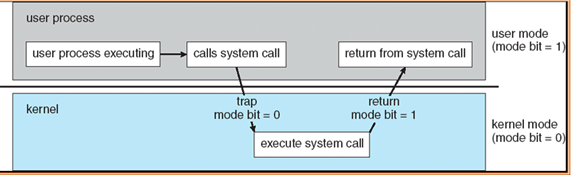
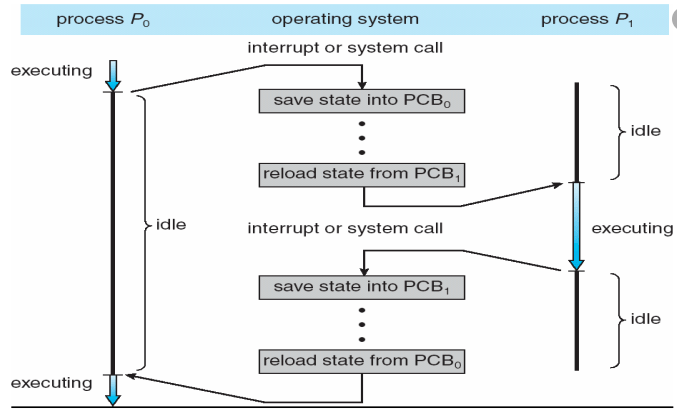

# Operating System(운영체제)
대학교 수업 때 운영체제를 알려주던 교수님이 해주시던 말이 생각난다.  
"운영체제는 컴퓨터 세계의 절대신이다. 컴퓨터안에서 일어나는 모든일은 운영체제를 통하게 되있다"  
라는 말이었다.
컴퓨터는 4가지 구성으로 바라볼수 있다  
-  Hardware
    - 기본적인 컴퓨터의 리소스 공급
    - CPU, memory, I/O devices     
- Operating System
    - 다양한 어플리케이션 및 사용자 간의 하드웨어 사용제어 및 조정 
- Application Programs
    - Complier, Word Processors, Web Browses
- Users
    - People, machines, other computers

여기서 운영체제에 대해서 알아보고자 한다.

## 운영체제
운영체제는 다음과 같이 설명 할 수 있다.  

"컴퓨터 유저와 하드웨어 간의 매개체 역할을 하는 프로그램"  

여기서 프로그램이란 CPU에서 실행되는 일련의 작업(Instructions)를 말한다.  

운영체제의 목적은
- 사용자 프로그램 실행 및 사용자 문제 해결
- Computer System을 사용하기 편하게 만든다, 그리고 효율적인 방법으로 컴퓨터의 하드웨어를 사용한다.  

## Dual mode = Kernel Mode & User Mode
운영체제는 두가지의 모드가 존재 한다 Kernel mode와 User mode 두가지가 존재 한다.  
그리고 이 둘을 합쳐 Dual mode라고 한다.  
이유를 설명하기 전에 Kernel mode와 User mode를 설명하면,  
- Kernel mode = CPU, memory등등 모든 자원에 접근 할 수 있는 mode  
- User mode = 프로세스 혹은 코드 작성을 할 수 있는 mode ( 프로그램의 자원에는 접근 하지 못한다. )  

이렇게 두가지 mode로 사용하는 이유는 자원 접근의 제한을 두지 않으면 잘못된 프로그램, 혹은 유저의 잘못된 행동이 프로그램의 자원을 훼손할 수 있기 때문이다.  
그래서 OS는 두가지 mode를 통해 프로그램의 자원에 영향을 주는지 안주는지 파악하여 안전하게 보호 및 접근 할 수 있도록 Kernel mode와 User mode로 나누어 운영된다.
  
그러면 이 두 모드가 어떻게 사용되는지 알아보자  

## System call
우리가 코드를 작성하고 있다고 가정해보자.  
코드의 로직은 다음과 같다.  

1. .txt 파일을 열어 학생의 정보를 얻어온다.  
2. 얻어온 정보중 25살 이상의 사람수를 확인한다.  

라는 로직의 코드가 있고 이를 실행 했을 때 간단하게 어떻게 수행되는지 보면  
1. 일단 코드가 실행되면 User mode에서 실행이 된다.  
2. .txt파일을 여는 수행을 해야한다. 이때 메모리에 있는 .txt파일을 열어야 하는데 이는 프로그램 자원에 접근해야만 가능하다.  
그래서   User Mode -> Kernel mode 로 전환이 일어나고 Kernel mode에서 .txt파일을 여는 작업을 수행한다.  
3. 그리고 작업이 마무리가되면 User mode로 전환되어 나머지 로직을 수행한다.

간단하게 설명하면 위 과정과 같다.  

위 설명에서는 어떻게 User mode에서 Kernel mode로 변환하는지 설명이 안되어 있다.  
컴퓨터가 사람도 아니고 어떻게 User mode에서 Kernel mode로 바뀌는 것을 알 수 있을까?  
컴퓨터가 mode를 바꿔야 하는것을 알게 해주는것이 System call의 역할이다.

위 과정을 그림을 통해 좀 더 상세히 말하자면  

1. 일단 코드가 실행되면 User mode에서 실행이 된다.  
2. .txt파일을 여는 수행을 해야한다. 이때 메모리에 있는 .txt파일을 열어야 하는데 이는 프로그램 자원에 접근해야만 가능하다.  
그래서 User Mode에서 파일을 여는 작업에 대한 매개변수를 사용하여 System call을 요청한다.  
3. 요청을 받게되면 user application 상태는 저장이되고 kernel mode로 변경된후 요청된 작업을 OS가 수행한다.
4. mode가 변경될때 mode의 상태를 나타내는 값인 Mode Bit의 값이 1(user mode) -> 0(kernel mode)로 바뀐다.
5. 그리고 작업이 마무리가되면 요청한 작업을 매개변수로 사용한 System call 이 return 되며 Mode Bit의 값이 0(kernel mode) -> 1(user mode) 로 전환되면서 user mode로 전환된다.

## Interrupt
Interrupt는 다음과 같이 설명 할 수 있다.  
- CPU가 프로그램을 실행하고 있을 때, 입출력 하드웨어 등의 장치나 예외상황이 발생하여 처리가 필요할 경우에 마이크로프로세서에게 알려 처리할 수 있도록 하는 것을 말한다.
Interrupt는 크게 hardware interrupt와 software interrupt로 나뉜다.  

Interrupt는 hardware interrupt, software interrupt가 있다.  
- hardware interrupt
    - 하드웨어가 발생시키는 interrupt로, CPU가 아닌 다른 하드웨어 장치가 cpu에 알려주거나 cpu 서비스를 요청할 때  발생시킨다.  
- software interrupt
    - 소프트웨어가 발생시키는 interrupt이다. 소프트웨어(사용자 프로그램)가 스스로 interrupt 라인을 설정한다.
    예외 상황, system call등이 software interrupt이다.

Interrupt는 위에서 본것처럼 여러가지 형태의 Interrupt가 있는데 이는 Interrupt Vector라는 곳에서 테이블 형태로 0~255번 까지 총 256개의 Interrupt들을 처리하는 루틴인 Interrupt Handler의 주소들을 관리 한다.  

간단한 예시를 통해 정리하면
우리가 프로세스를 하나 실행하고 있는 와중에 키보드 입력으로 Interrupt를 발생시켰다고 가정하면 다음과 같은 흐름으로 처리가된다.
1. 키보드 입력 인터럽트 발생
2. 현재 실행중인 프로세스 정보 저장
3. Interrupt Vector에서 해당 InterruptHandler 주소를 찾음
4. Interrupt 처리를 위해 OS memory PC값을 3번에서 찾은InterruptHandler 주소값으로 변경
5. Interrupt 처리 후 Interrupt 발생 이전 로직으로 돌아감 

## Context_Switching
Context Switching은 다음과 같이 설명 가능하다.
- 하나의 프로세스가 CPU에서 사용중일때 다른 프로세스가 CPU를 사용하도록 하기 위해 이전의 프로세스를 보관하고 새로운 프로세스를 적재 하는 작업    
그림을 보자  
  
양쪽에 프로세스가 있고 중간에 system call 또는 Interrupt가 있는것을 볼 수 있다.  
순서대로 설명하면
1. P0의 Process가 실행 되고 있다.
2. Interrupt 혹은 System call이 발생하여 P1의 Process를 실행해야하는 상황이 만들어진다.  
3. P0 Process의 정보가 담긴 PCB0를 메모리에 저장하면서 P0 Process는 아무것도 수행하지 않는다.  
4. 그리고 P1 Process의 정보가 담긴 PCB1을 로딩 한다. 
5. 로딩이 완료되면  P1의 Process가 실행된다.
6. P1 Process의 작업이 완료가 됬다
7. P1 Process의 정보가 담긴 PCB1을 메모리에 저장하고, 저장을 하는 순간 P1은 아무것도 하지 않는 상태가 된다.  
8. P0 Process가 로딩되며 로딩이 완료되면 P0 Process가 실행된다.

여기서 한가지 볼만한것은 P0,P1 Process가 둘다 아무것도 하지 않는 시간(idle)이 있다는 것이다.  
양쪽 프로세스가 아무것도 하지 않는 순간을 Overhead라고 말한다.  
그리고 저장하고 로딩하는 과정을 Context Swtiching이라고 하며 위 사진에서는 2번의 Context Switching이 일어나는 것을 확인 할 수 있다.   