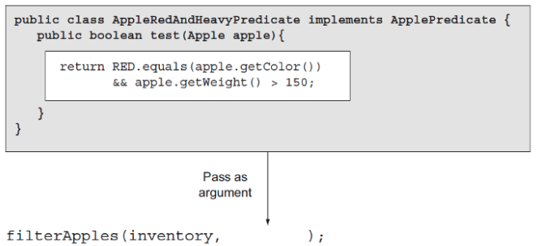

# 동작 파라미터 부터 람다 표현식 까지 

## 동작파라미터화
동작 파라미터화란 아직은 어떻게 실행할 것인지 결정하지 않은 코드 블록 이라고 말한다. 
이제 코드를 통해서 알아보자.
```java
    public static List<Apple> filterGreenApples(List<Apple> inventory) {
        List<Apple> apples = new ArrayList<>();
        for (Apple apple : inventory) {
            if("green".equals(apple.getColor())) {
                apples.add(apple);
            }
        }
        return apples;
    }
```
위 코드는 사과 객체중 초록색이 사과만 저장한다.

그런데 초록색이 아니라 빨간색, 노란색 등 다양한 색들을 구분하고 싶다면?

```java
    public static List<Apple> filterGreenApples(List<Apple> inventory, String color) {
        List<Apple> apples = new ArrayList<>();
        for (Apple apple : inventory) {
            if(color.equals(apple.getColor())) {
                apples.add(apple);
            }
        }
        return apples;
    }
```
다음과 같이 구별하고 싶은 색을 매개변수로 받아서 구분하면된다.  

그런데 이제는 색뿐만아니라 무게로도 구분하고 싶다면?  
```java
    public static List<Apple> filterGreenApples(List<Apple> inventory) {
        List<Apple> apples = new ArrayList<>();
        for (Apple apple : inventory) {
            if(apple.getWeight() < 150) {
                apples.add(apple);
            }
        }
        return apples;
    }
```
이런식으로 특정 무게를 기준으로 구별 하도록 구현 할 수 있다.  

하나의 조건은 조건 분기를 통해 쉽게 구현할 수 있지만 상황에 따라 대부분의 코드가 중복 된다.  
그리고 조건이 많아질 수록 조건 분기의 코드는 점점 길어지고 복잡해질것이다.  

결국 우리는 점점 거대해지는 조건 분기에 대해서 유연하게 대처할 방법을 생각하게 된다.  
그리고 이는 동작 파라미터화를 통해 좀 더 유연 하게 대처 할 수 있다.  

  코드를 다시 보면 변하는 부분은 if()부분인 것을 바로 알 수 있다.  
그리고 이 if는 boolean의 결과를 통해 조건분기를 통하기도 안통하기도 한다.  
그럼 Apple 객체를 받아 boolean을 반환하는 인터페이스를 만들고 인터페이스를 상속하면서 내가 원하는 조건에 맞는 클래스를 생성함으로써 더 유연하게 대처 가능하도록 구현 할 수 있다.

```java
interface ApplePredicate {
    boolean test(Apple apple);
}

class AppleLightWeightAndRedColorPredicate implements  ApplePredicate {

    @Override
    public boolean test(final Apple apple) {
        return "red".equals(apple.getColor()) && 150 < apple.getWeight();
    }
}

public class Apple {
    private final String color;
    private final int weight;

    public Apple(final String color, final int weight) {
        this.color = color;
        this.weight = weight;
    }

    public static void main(String[] args) {
        List<Apple> apples = Collections.singletonList(new Apple("green", 10));
ApplePredicate predicate = new AppleLightWeightAndRedColorPredicate();

        filterApples(apples,predicate);
    }

    public static List<Apple> filterApples(List<Apple> inventory, ApplePredicate p) {
        List<Apple> apples = new ArrayList<>();
        for (Apple apple : inventory) {
            if(p.test(apple)) {
                apples.add(apple);
                System.out.println("장바구니에 담겼습니다.");
            }
        }
        return apples;
    }
}
```

이렇게 수정하면 이전에는 조건에 따라서 if의 조건을 계속 해서 바꿔야 했지만  
지금은 조건을 결정하는 인터페이스와 인터페이스를 상속받는 클래스를 생성하여 조건이 변경될 때 인터페이스를 상속 받는 클래스를 생성하거나 
이미 생성되있는 클래스를 수정하면되니 더 많은 상황에 대해서 이전보다 유연하게 대처 할 수 있게 됐다.  
인터페이스를 상속받은 클래스의 조건에 따라 메서드가 다르게 동작 하는 것을 알 수 있는데 이를 디자인 패턴 중 전략 패턴이라고 한다.

그리고 추가로 색이 초록색이면서 150g보다 가벼운 사과를 고르고 싶을 경우 인터페이스를 상속받아서  
```java
class AppleLightWeightAndGreenColorPredicate implements  ApplePredicate {

    @Override
    public boolean test(final Apple apple) {
        return "green".equals(apple.getColor()) && 150 > apple.getWeight();
    }
}
```
이런식으로 클래스를 생성해주고 상황에 따라서  
```java
    public static void main(String[] args) {
        List<Apple> apples = Collections.singletonList(new Apple("green", 10));

        AppleLightWeightAndRedColorPredicate predicate = new AppleLightWeightAndRedColorPredicate();
        AppleLightWeightAndGreenColorPredicate lightGreenApple = new AppleLightWeightAndGreenColorPredicate();

        filterApples(apples,predicate);
        filterApples(apples,lightGreenApple);
    }
```

이런식으로 동일한 메서드에 원하는 조건에 맞는 인스턴스를 생성하여 파라미터에 넣어주면 된다.  
결국 메인 메서드에 있는 filterApples는 우리가 전달한 ApplePredicate를 상속 받은 객체를 파라미터로 받고 파라미터로 인해 filterApples메서드의 동작이 결정된다.  
즉 위의 코드를 통해 우리는 filterApples 메서드의 동작을 파라미터화 했다고 말할 수 있다.  

  
그림을 보면 AppleRedAndHeavyPredicate 안에 return 부분이 filterApples의 동작을 결정하는 코드이고 나머지 어두운 부분은 파라미터에 전달하기 위한 방법으로 쓰여졌다고 볼수 있다.  
메서드는 객체만 파라미터로 받기 때문이다.  
결국 한개의 파라미터에 다양한 동작을 넣을 수 있는 장점이 생겼지만 다양한 동작을 넣기 위해선 동작을 전달하기 위한 객체가 계속해서 만들어지는 단점 또한 남아 있다.  

  이런 단점을 보완하기 위해서 익명 클래스를 통해서 리팩토링을 해보면  
```java
    public static void main(String[] args) {
        List<Apple> apples = filterApples(apples,new ApplePredicate() {
            public boolean test(Apple apple) {
                return "green".equals(apple.getColor()) && 150 > apple.getWeight();
            }       
    });
}
```  

위 코드와 같은 형태로 리팩토링 할 수 있다.  
그러나 익명클래스로 인해 하나의 기능을 구현하는데 코드가 장황해졌고, 코드의 장황함은 구현하고 유지보수하는데 시간, 효율이 많이 떨어진다.  

그래서 Java8에서 추가된 람다를 통해서 더 간단하게 표현 할 수 있다.  
```java
    public static void main(String[] args) {
        List<Apple> apples = filterApples(apples,(Apple apple) -> "green".equals(apple.getColor()) && 150 > apple.getWeight());
    }
```  

추후에 람다에 대해서 설명하겠지만 일단 리팩토링 된 코드를 보면 이전에는 filterApples메서드의 동작을 결정하기 위해서 동작을 결정하는 코드를 담은 객체를 만들어줘서 보내줘야 했다.  
그러나 지금은 동작에 대한 코드만 넘겨줘서 따로 객체를 생성하지 않아도 filterApples의 동작을 결정하게 되니 불필요한 객체의 생성을 피할 수 있고 더불어 익명클래스의 문제였던 코드의 장황함을 해결 할 수 있다.  

다음에는 람다를 작성하는 방식을 위 예제를 통해 알아보자  


### 출처
Java 8 In Action 2장 - 동작 파라미터화 코드 전달하기
