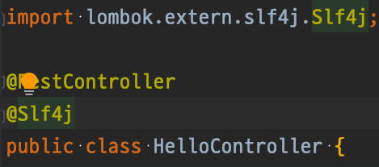
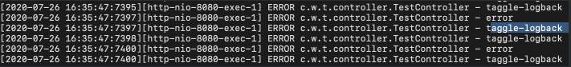
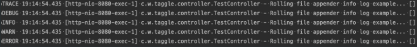
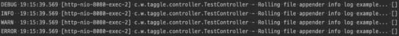
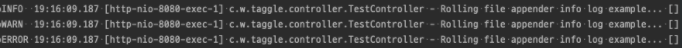
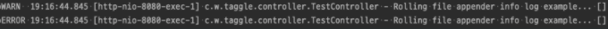
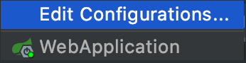

# Logging 적용기

Slf4j에 대해 설명하기 전에 다음 글을 읽어 보는걸 추천합니다.

[https://gmlwjd9405.github.io/2019/01/04/logging-with-slf4j.html](https://gmlwjd9405.github.io/2019/01/04/logging-with-slf4j.html)



lombok에는 기본적으로 @Slf4j 를 지원합니다.

lombok에서 제공하는 @Slf4j 의경우 logback을 기본 로깅 프레임워크로 의존하고 있는 Slf4j-api와 bridge 모듈을 함께 포함하고 있습니다.

그래서 따로 로그 처리 관련 모듈을 추가 하지 않아도 됩니다..


- Spring boot Logback 모듈


- Spring Boot Slf4j 모듈
### 설명
slf4j-api → Gradle: org.slf4j:slf4j-api:1.7.30  
slf4j-binding → Gradle: ch.qos.logback:logback-classic:1.2.3 // Gradle: ch.qos.logback:logback-core:1.2.3

( Gradle: ch.qos.logback:logback-access:1.2.3의 경우 logback-classic만 받아도 자동적으로 내부에서 등록됩니다. 

이 모듈은 Tomcat이나 Jetty같은 서블릿 컨테이너와 통합돼 HTTP-access로그 기능을 제공합니다 /

logback-access 내용 출처 [https://velog.io/@hanblueblue/번역-logback](https://velog.io/@hanblueblue/%EB%B2%88%EC%97%AD-logback))

slf4j-bridge →Gradle: org.slf4j: jul-to-slf4j:1.7.30

→ 인스턴스생성이 무한루프에 빠지는경우 (Slf4j Binding의 여러 바인딩 중 하나만 쓰지 않을경우 발생)

[https://blog.outsider.ne.kr/561](https://blog.outsider.ne.kr/561)

이후 다음과 같이 사용 가능하고 
### 예제
```java
@RestController
@Slf4j
public class TestController {

    @GetMapping
    public String logTest() {
        for (int i = 0; i < 51; i++) {
            log.info("Rolling file appender example...");
            try {
                Thread.sleep(1);
            } catch (InterruptedException e) {
                e.printStackTrace();
            }
            if (i % 2 == 0) {
                log.error("error");
            }
        }
        return "html";
    }
}
```

실행하면


다음과 같이 콘솔에 출력되는 것을 확인 할 수 있다.

### 로그 파일 생성 및 xml 파일 작성


위 내용은 log level에 대한 표입니다.

아래 xml 파일에서 level을 설정할 때 참고 하면 좋습니다.

## yml 파일 설정

```yaml
spring:
  application:
    name: taggle-logback
  profiles:
    active: local

---
spring:
  profiles: local

logging:
  config: classpath:logback-local.xml

---
spring:
  profiles: prod

logging:
  config: classpath:logback-prod.xml
```

properties가 아닌 yml로 한 이유

[https://kingbbode.tistory.com/10](https://kingbbode.tistory.com/10)

spring.application.name을 설정하면 다음과 같은 방식으로 로그에 출력 할 수 있습니다.

```java
@RestController
@Slf4j
public class TestController {

    @Value("${spring.application.name}")
    private String name;

    @GetMapping
    public String logTest() {
        for (int i = 0; i < 51; i++) {
            log.info("Rolling file appender example...");
            try {
                Thread.sleep(1);
            } catch (InterruptedException e) {
                e.printStackTrace();
            }
            if (i % 2 == 0) {
                log.error("error");
            }
            log.error(name);
        }
        return "html";
    }
}
```

이에 대한 로그 출력 내용은 다음과 같습니다.

(Rolling file appender example의 경우 xml 파일 설정을 통해 console에 찍히지 않도록 설정)



## XML 설정

### 1. console log 설정

```xml
  <!-- console 출력 -->
<?xml version="1.0" encoding="UTF-8"?>
<configuration scan="true" scanPeriod="20 seconds">

    <appender name="console" class="ch.qos.logback.core.ConsoleAppender">
        <encoder class="ch.qos.logback.classic.encoder.PatternLayoutEncoder">
            <pattern>hello%-5level %d{HH:mm:ss.SSS} [%thread] %logger{36} - %msg [%mdc]%n</pattern>
        </encoder>
    </appender>

    <appender name="async" class="ch.qos.logback.classic.AsyncAppender">
        <queueSize>4096</queueSize>
        <includeCallerData>false</includeCallerData>
        <appender-ref ref="console"/>
    </appender>

    <root level="INFO">
        <appender-ref ref="async"/>
    </root>

    <logger level="DEBUG" name="web"/>

    <logger level="INFO" name="org.springframework"/>
    <logger level="DEBUG" name="org.hibernate.tool.hbm2ddl"/>
    <logger level="DEBUG" name="org.hibernate.stat"/>
    <logger level="DEBUG" name="org.hibernate.SQL"/>
    <logger level="TRACE" name="org.hibernate.type"/>
    <logger level="TRACE" name="org.hibernate.type.descriptor.sql.BasicBinder"/>
    <logger level="WARN" name="org.hibernate.type.BasicTypeRegistry"/>

    <logger level="INFO" name="org.apache.http"/>

    <!--실시간 TRACE-->
    <logger name="TRACE" level="trace" additivity="false">
        <appender-ref ref="console"/>
    </logger>
    <!-- 애플리케이션 예외 -->
    <logger name="APP_ERROR" level="info" additivity="false">
        <appender-ref ref="console"/>
    </logger>
    <!-- 느린 로직 -->
    <logger name="SLOW_LOGIC" level="info" additivity="false">
        <appender-ref ref="console"/>
    </logger>

</configuration>
```

설명 

```xml
  <!-- console 출력 -->
<?xml version="1.0" encoding="UTF-8"?>
<configuration scan="true" scanPeriod="20 seconds">
-> 20초 마다 설정파일을 확인함(변경내용 확인 default = 1분)

    <appender name="console" class="ch.qos.logback.core.ConsoleAppender">
		-> ConsoleAppender 설정한 log 내용을 콘솔에 출력하도록 설정 
        <encoder class="ch.qos.logback.classic.encoder.PatternLayoutEncoder">
            <pattern>%-5level %d{HH:mm:ss.SSS} [%thread] %logger{36} - %msg [%mdc]%n</pattern>
		-> 출력 내용 패턴 설정 
			-> %-5level -> 로그 출력의 폭 값을 설정 합니다 (-5)는 고정폭 값입니다.
			-> %d -> 로그의 기록시간을 출력
			-> %thread -> 현재 Thread name
			-> %logger{36} -> Logger name의 이름을 축약 36은 최대 자릿수
			-> %msg -> log message
        </encoder>
    </appender>

    <appender name="async" class="ch.qos.logback.classic.AsyncAppender">
        <queueSize>4096</queueSize>
		-> queueSize 설정
        <includeCallerData>false</includeCallerData>
		-> includeCallerData - false 설정시 로그 발생 위치 정보를 무시하게 됩니다.
														true시 caller 쪽으로 데이터를 출력 할 수 있습니다.
        <appender-ref ref="console"/>
		-> console에 출력 하도록 설정
    </appender>

    <root level="INFO">
		-> 기본 레벨 설정
        <appender-ref ref="async"/>
    </root>

    <logger level="DEBUG" name="web"/>

    <logger level="INFO" name="org.springframework"/>
		-> name은 logger를 사용하고자 하는 package를 설정하고 level은 log 의 레벨을 설정합니다.
    <logger level="DEBUG" name="org.hibernate.tool.hbm2ddl"/>
    <logger level="DEBUG" name="org.hibernate.stat"/>
    <logger level="DEBUG" name="org.hibernate.SQL"/>
    <logger level="TRACE" name="org.hibernate.type"/>
    <logger level="TRACE" name="org.hibernate.type.descriptor.sql.BasicBinder"/>
    <logger level="WARN" name="org.hibernate.type.BasicTypeRegistry"/>

    <logger level="INFO" name="org.apache.http"/>

    <!--실시간 TRACE-->
    <logger name="TRACE" level="trace" additivity="false">
		-> additivity = false로 설정하면 로깅메세지가 중복 출력되는것을 방지 합니다.
        <appender-ref ref="console"/>
    </logger>
    <!-- 애플리케이션 예외 -->
    <logger name="APP_ERROR" level="info" additivity="false">
        <appender-ref ref="console"/>
    </logger>
    <!-- 느린 로직 -->
    <logger name="SLOW_LOGIC" level="info" additivity="false">
        <appender-ref ref="console"/>
    </logger>

</configuration>
```

---

### log level에 대한 설명

위 내용중 level 설정에 따라 어떻게 나오는지 확인해보면

다음과 같이 log 출력 코드를 설정 했을때 

```java
@RestController
@Slf4j
public class TestController {

    @GetMapping
    public String logTest() {
        log.trace("Rolling file appender info log example...");
        log.debug("Rolling file appender info log example...");
        log.info("Rolling file appender info log example...");
        log.warn("Rolling file appender info log example...");
        log.error("Rolling file appender info log example...");
        return "html";
    }
}
```

```xml
<root level="INFO">
     <appender-ref ref="async"/>
</root>
```

root의 레벨 설정에 따라 나오는 값을 확인해보면 다음과 같이 나오는것을 알 수 있습니다.

설정 레벨에 따라 나타나는 결과는 다음 표를 참고하여 보면됩니다.


1. level="TRACE"

    

1. level="DEBUG"

    

1. level="INFO"

    

1. level="WARN"

    

1. level="ERROR"

    

logger의 level 또한 같다고 생각 하면 됩니다.

```xml
<!-- 실시간 TRACE -->
    <logger name="TRACE" level="trace" additivity="false">
        <appender-ref ref="STDOUT" />
    </logger>
    <!-- 애플리케이션 예외 -->
    <logger name="APP_ERROR" level="info" additivity="false">
        <appender-ref ref="STDOUT" />
    </logger>
    <!-- 느린 로직 -->
    <logger name="SLOW_LOGIC" level="info" additivity="false">
        <appender-ref ref="STDOUT" />
    </logger>

```

위 코드에 대한 부분은 다음 링크를 참고해주시기 바랍니다.

[https://github.com/holyeye/spring-trace](https://github.com/holyeye/spring-trace)

### 2. file log 설정

```xml
<!-- 로그 파일 생성 -->
<?xml version="1.0" encoding="UTF-8"?>
<configuration scan="true" scanPeriod="30 seconds">
    <property name="LOGS_ABSOLUTE_PATH" value="./logs"/>
    <timestamp key="dailyLog" datePattern="yyyyMMdd"/>
    <appender name="ROLLING" class="ch.qos.logback.core.rolling.RollingFileAppender">
        <file>${LOGS_ABSOLUTE_PATH}/taggle_logbacks_${dailyLog}.log</file>
        <encoder>
            <pattern>[%d{yyyy-MM-dd HH:mm:ss}:%-3relative][%thread] %-5level %logger{35} - %msg%n</pattern>
        </encoder>
        <rollingPolicy class="ch.qos.logback.core.rolling.TimeBasedRollingPolicy">
            <fileNamePattern>${LOGS_ABSOLUTE_PATH}/logback.%d{yyyy-MM-dd}.%i.log</fileNamePattern>
            <timeBasedFileNamingAndTriggeringPolicy                  class="ch.qos.logback.core.rolling.SizeAndTimeBasedFNATP">
                <maxFileSize>100MB</maxFileSize>
            </timeBasedFileNamingAndTriggeringPolicy>
        </rollingPolicy>
    </appender>

    <root level="error">
        <appender-ref ref="ROLLING"/>
    </root>

</configuration>
```

설명 

```xml
<!-- 로그 파일 생성 -->
<?xml version="1.0" encoding="UTF-8"?>
<configuration scan="true" scanPeriod="30 seconds">
    <property name="LOGS_ABSOLUTE_PATH" value="./logs"/>
		-> "./logs/"의 값을 "LOGS_ABSOLUTE_PATH"의 값으로 매핑 합니다
    <timestamp key="dailyLog" datePattern="yyyyMMdd"/>
		-> "dailyLog"의 값을 "yyyyMMdd"의 날짜 형태의 값으로 매핑합니다.
    <appender name="ROLLING" class="ch.qos.logback.core.rolling.RollingFileAppender">
		-> RollingFileAppender를 사용할 경우 로그 파일을 만들수 있고 설정한 값에 따라 새로운 로그 파일을 만들 수 있습니다.
        <file>${LOGS_ABSOLUTE_PATH}/taggle_logbacks_${dailyLog}.log</file>
		-> 출력하는 파일명을 지정합니다
        <encoder>
            <pattern>[%d{yyyy-MM-dd HH:mm:ss}:%-3relative][%thread] %-5level %logger{35} - %msg%n</pattern>
        </encoder>
        <rollingPolicy class="ch.qos.logback.core.rolling.TimeBasedRollingPolicy">
		-> 시간을 기준으로 파일을 생성합니다.
           <fileNamePattern>${LOGS_ABSOLUTE_PATH}/logback.%d{yyyy-MM-dd}.%i.log</fileNamePattern>
		-> 백업 파일의 패턴입니다. %i 로 인덱스가 들어가는 영역을 지정합니다.
           <timeBasedFileNamingAndTriggeringPolicy                  class="ch.qos.logback.core.rolling.SizeAndTimeBasedFNATP">
              <maxFileSize>100MB</maxFileSize>
		-> maxFileSize 는 분할할 용량을 설정 합니다 .
           </timeBasedFileNamingAndTriggeringPolicy>
					<maxHistory>30</maxHistory>
		-> 로그 저장 기한을 설정합니다 (위코드는 30일)
        </rollingPolicy>
    </appender>

    <root level="error">
        <appender-ref ref="ROLLING"/>
    </root>

</configuration>
```

## Intellij에서 xml 파일 실행 설정 하는법

설정을 할 때는 yml 에서 작성한 코드를 보고 설정 해야 합니다.

```yaml

spring:
  application:
    name: taggle-logback
  profiles:
    active: local

---
spring:
  profiles: local

logging:
  config: classpath:logback-local.xml

---
spring:
  profiles: prod

logging:
  config: classpath:logback-prod.xml

```

intellij 설정을 통해 원하는 xml 파일을 실행 하도록 할 수 있습니다.


- WebApplication 클릭

    

- Edit Configurations 클릭
- ultimate 를 사용할경우

    Active profiles에 profiles 값을 넣어주면됩니다( 아래 사진은 prod값을 넣어줌)

    

- ultimate를 사용하지 않을 경우

    

추가로 yml 파일에서 [profiles.active](http://profiles.active) 값을 local로 설정 했기 때문에 위 설정에 아무값도 넣지 않을경우 local로 설정한 logback-local.xml이 설정 됩니다. 

## 참고

정리하면서 참고했던 사이트의 목록 입니다.

- Lombok @Slf4j: Spring boot: [https://medium.com/@moztiq/lombok-slf4j-in-spring-boot-5ba85ccd7a25](https://medium.com/@moztiq/lombok-slf4j-in-spring-boot-5ba85ccd7a25)
- Spring Boot 로그 설정 - Logback: [https://goddaehee.tistory.com/206](https://goddaehee.tistory.com/206)
- logback 적용 팁: [https://gubok.tistory.com/440](https://gubok.tistory.com/440)
- properties → yml 적용 및 사용 이유: [https://kingbbode.tistory.com/10](https://kingbbode.tistory.com/10)
- logback 시간 용량 기준 로그 파일 분할: [https://kimpaper.github.io/2015/10/30/logback-config/](https://kimpaper.github.io/2015/10/30/logback-config/)
- Slf4j 란: [https://gmlwjd9405.github.io/2019/01/04/logging-with-slf4j.html](https://gmlwjd9405.github.io/2019/01/04/logging-with-slf4j.html)
- Spring Framework에서 Slf4j 설정 문제(binding 설정으로 인한 오류): [https://blog.outsider.ne.kr/561](https://blog.outsider.ne.kr/561)
- spring-trace: [https://github.com/holyeye/spring-trace](https://github.com/holyeye/spring-trace)
- log4j설정: [http://blog.daum.net/anim24/50](http://blog.daum.net/anim24/50)