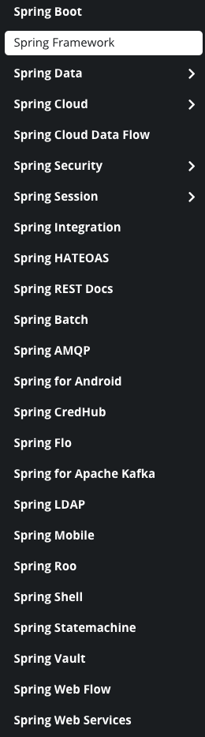

# Spring Framework
스프링 프레임워크는 자바 플랫폼을 위한 오픈 소스 어플리케이션 프레임워크 인데 앞으로 스프링에 대해서 글을 쓰기 전에
어플리케이션 프레임워크와 스프링 프레임워크에 대해서 알아보려한다.

## Framework
프레임워크 설계의 대가 랄프 존슨은 프레임워크를 다음과 같이 설명한다  
"프레임워크란, 소프트웨어의 구체적인 부분에 해당하는 설계와 구현을 재사용이 가능하게끔 일련의 협업화된 형태로 클래스들을 제공하는 것"  
즉 소프트웨어 설계에 기반이 되는 확장 가능한 기반 코드와 사용자가 확장하기 위해 필요한 라이브러리들을 제공 해주는 것 생각 할 수 있다.  

Framework를 Frame + work로 나누면 틀 + 일하다 로 해석 할 수 있다.  
즉 틀에서 일하다 라는 의미인데 틀은 위해서 말한것처럼 기반 코드, 라이브러리이고
일하는것은 이 틀을 가지고 가지고 사용자가 원하는 방향으로 만들어 나가는 행위로 볼 수 있다.

정리하면 틀안에서 일을 할 수 있도록 해주는 것을 프레임워크라고 생각했다.  

## Application Framework
위키백과의 글을 보면
```
애플리케이션 프레임워크(application Framework)[1]는 소프트웨어 개발자가 응용 소프트웨어의 표준 구조를 구현하기 위해 사용하는 소프트웨어 프레임워크로 구성된다.  
[2] 즉, 프로그래밍에서 특정 운영 체제를 위한 응용 프로그램 표준 구조를 구현하는 클래스와 라이브러리 모임이다. 간단하게 프레임워크라고도 부른다.

재사용할 수 있는 수많은 코드를 프레임워크로 통합함으로써 개발자가 새로운 애플리케이션을 위한 표준 코드를 다시 작성하지 않아도 같이 사용된다.
애플리케이션 프레임워크는 그래픽 사용자 인터페이스(GUI)의 구현에 일반화되었다. 그 까닭은 GUI 응용 프로그램의 기본 구조의 표준화를 촉진하는 경향이 있기 때문이다.
응용 프로그램의 기본 코드 구조가 명백하므로 표준 프레임워크를 사용하면 자동으로 GUI 툴을 만드게 된다.
프레임워크의 구현은 객체 지향 프로그래밍 기법이 사용되고 있는 응용 프로그램 고유의 클래스가 프레임워크의 기존 클래스를 상속할 수 있다.
```
정리 해보면 어플리케이션 프레임워크는 응용 소프트웨어(프로그램)를 구현하기 위해 제공해주는 클래스와 라이브러리 모임이라고 말 할 수 있을거같다.  

이런 틀(클래스, 라이브러리)을 제공하고 이 틀을 기반으로 사용자가 원하는 응용 프로그램을 만들어내는(일을 한다)것 이라고 생각했다.  
  
프레임워크는 사용하지 않을때와 비교해보면, 기반 코드를 만들 필요가 없기 때문에, 사용자는 구현하는것에 집중하여 빠른시간내에 효율적으로 구현 및 유지보수 할 수 있는 장점이 있다고 한다..  
그러나 새로운 프레임워크 사용할 때 마다 학습을 해야 하고, 프레임 워크 제작자의 의도에 따라 제약 되는 상황이 발생하는 단점도 있다고 한다.  

## Spring Framework
The Spring Framework provides a comprehensive programming and configuration model for modern Java-based enterprise applications - on any kind of deployment platform.

A key element of Spring is infrastructural support at the application level: 
Spring focuses on the "plumbing" of enterprise applications so that teams can focus on application-level business logic, without unnecessary ties to specific deployment environments.

스프링 공식 홈페이지를 들어가면 첫 페이지에 이런 글이 있는데 이걸 다음과 같이 해석했다  
```  
Spring Framework는 모든 종류의 배포 플랫폼에서 최신 Java 기반 엔터프라이즈 애플리케이션 개발을 위한 모든 프로그래밍 및 구성 모델을 제공합니다.

Spring의 핵심 요소는 어플리케이션 레벨의 인프라 지원입니다.:
Spring은 엔터프라이즈 애플리케이션의 "연결"에 중점을 두어 팀이 특정 배포 환경에 대한 불필요한 연결없이 애플리케이션 수준의 비즈니스 로직에 집중할 수 있도록합니다.
```  

첫문장을 보면 "Java 기반 엔터프라이즈 애플리케이션 개발을 위한 모든 프로그래밍 및 구성 모델을 제공합니다".  
라고 되있는데 프로그래밍 및 구성모델이 프레임워크에서 말하는 틀이라고 생각한다.  

이 내용에서 생각하는 중요한 부분은 마지막부분인데, "팀이 특정 배포 환경에 대한 불필요한 연결없이 어플리케이션 수준의 비즈니스 로직에 집중 할 수 있도록합니다".  
위에서 프레임워크에 대해 설명했던 것처럼 스프링 프레임워크는 사용자가 구현하고자 하는 비즈니스 로직에 집중 할 수 있도록 해준다고 설명하고 있다.  

스프링 프레임워크는 자바 객체를 직접 담고 관리한다.  
우리가 Java로 구현을 할 때는 직접 인스턴스를 생성하면서 객체의 생명주기를 직접 다뤘는데 스프링 프레임워크는 자바 객체를 직접관리 하기 때문에 사용자는 객체의 생명주기를 다루지 않는다.  
사용자의 객체 생명 주기의 권한이 스프링 프레임워크에게 가게되는데 이를 제어의 역전(IOC)라고 하고 Spring Framework는 IOC기반의 Framework를 의미한다.  


## Spring Framework 에서 제공하는 기능
스프링에서 제공하는 기능들은 다음과 같다  


## 출처
[어플리케이션 프레임워크 위키백과](https://ko.wikipedia.org/wiki/%EC%95%A0%ED%94%8C%EB%A6%AC%EC%BC%80%EC%9D%B4%EC%85%98_%ED%94%84%EB%A0%88%EC%9E%84%EC%9B%8C%ED%81%AC)  
[스프링 프레임워크 위키백과](https://ko.wikipedia.org/wiki/%EC%8A%A4%ED%94%84%EB%A7%81_%ED%94%84%EB%A0%88%EC%9E%84%EC%9B%8C%ED%81%AC)  
[랄프 존슨](https://architecture101.blog/2008/09/15/evolvingframeworks/)  
[스프링 프레임워크 란?](https://khj93.tistory.com/entry/Spring-Spring-Framework%EB%9E%80-%EA%B8%B0%EB%B3%B8-%EA%B0%9C%EB%85%90-%ED%95%B5%EC%8B%AC-%EC%A0%95%EB%A6%AC)  