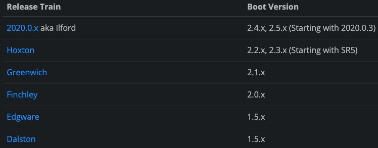

# Feign 적용기
** 개인 프로젝트를 조금씩 하고 있는데 riot api를 요청 기능을 만들면서 적용했던 과정, 알았던 것들에 대해서 정리 했습니다 **  
아래 출처를 통해 다양한 설정들에 대해서 알아보실 수 있습니다.  

## Feign?
공식 문서를 보면 Feign을 다음과 같이 설명한다.  
```
Feign은 선언적 웹 서비스 클라이언트이다.  
웹 서비스 클라이언트를 더 쉽게 작성 할 수 있다.  
Feign은 인터페이스와 어노테이션을 통해 사용할 수 있다.  
...
```
그리고 [다음 글](https://techblog.woowahan.com/2630/) 에선 아래와 같이 설명한다.  
 - Netflix에서 개발된 Http client binder 입니다.

## 웹 서비스 클라이언트
Feign에 대한 글을 읽으면서 `웹 서비스 클라이언트` 라는 단어를 봤다.  
먼저 웹 서비스, 클라이언트에 대한 설명을 찾아봤다.       
 - 웹 서비스 = 네트워크 상에서 서로 다른 종류의 컴퓨터들 간에 상호작용을 하기 위한 소프트웨어 시스템  
 - 클라이언트 = 네트워크로 연결된 서버로 부터 정보를 제공 받는 컴퓨터

그리고 이를 토대로 내가 이해한 것은
`웹 서비스 클라이언트`는 네트워크 상에서 서로 다른 종류의 컴퓨터들 간에서 정보를 제공받는 컴퓨터고, 여기서 컴퓨터는 서버로 정보를 요청 하는 쪽을 의미 하겠구나.  
라고 이해 했다.

추가로 선언적은 선언형 프로그래밍과 연관지어서 이해 했다.  
선언형 프로그래밍은 컴퓨터가 무엇을 해야할지(What) 프로그래밍 하는 것을 말하는데.  

그렇다면 feign은 클라이언트가 다른 컴퓨터, 서버로 원하는 요청을 할 수 있도록 도와주는 도구구나.  
라고 이해했다.  

## 적용 

### gradle
```
    dependencyManagement {
        imports {
            mavenBom "org.springframework.cloud:spring-cloud-dependencies:2020.0.3"
        }
    }
    
    dependencies {
        implementation 'org.springframework.cloud:spring-cloud-starter-openfeign'
    }
```
gradle 의존성을 추가 해야하는데 여기서 중요한것은 springframework-cloud-dependencies 의 버전은 스프링 부트의 버전에 따라 다르다.  
  
[버전 바로가기 클릭](https://spring.io/projects/spring-cloud)

만약 스프링 부트 버전에 맞지 않은 spring-cloud 버전을 설정 후 스프링을 실행하면  
  
다음과 같은 에러가 발생한다.  
### application.yml
``` yaml
feign:
    client:
        config:
            default: # @FeignClient 에서 name 값, 전역으로 설정하려면 default
                connectTimeout: 5000
                readTimeout: 2000
                loggerLevel: FULL
``` 
application.yml에 다음과 같이 feign에 대한 설정을 했다.  
 - connectionTimeout: 접근 시도 시간 제한
 - readTimeout: 응답 대기 시간
 - loggerLevel: feign 로그 레벨 설정
loggerLevel은 아래와 같은 단계로 이루어져 있다고 한다.
``` 
   - NONE, 로깅 없음( DEFAULT ).
   - BASIC, 요청 방법 및 URL, 응답 상태 코드 및 실행 시간만 기록합니다.
   - HEADERS, 요청 및 응답 헤더와 함께 기본 정보를 기록합니다.
   - FULL, 요청과 응답 모두에 대한 헤더, 본문 및 메타데이터를 기록합니다.
``` 

### 설정
일단 feign을 사용하려면 @SpringBootApplication을 붙인 class에 @EnableFeignClients를 붙여야한다.  
``` java
@SpringBootApplication
@EnableFeignClients
public class Application {

	public static void main(String[] args) {
		SpringApplication.run(Application.class, args);
	}

}
```

그러면 스프링이 실행 될 때 @FeignClient를 찾아 구현체를 만들어 준다.  

다음은 기본값 설정을 했는데 
``` java
import anylol.all.about.lol.domain.Summoner;
import org.springframework.cloud.openfeign.FeignClient;
import org.springframework.web.bind.annotation.GetMapping;
import org.springframework.web.bind.annotation.PathVariable;

@FeignClient(value = "riotApi", url = "https://kr.api.riotgames.com", configuration = {FeignConfiguration.class})
public interface RiotApi {

    @GetMapping(value = "/lol/summoner/v4/summoners/by-name/{summonerName}?api_key=")
    Summoner getSummoner(@PathVariable("summonerName") String summonerName);
}
```
다음과 같이 interface를 만들고
@FeignClient를 붙여 value, url, configuration을 설정 했다.  
그리고 소환사 정보를 요청할 GetMethod를 하나 만들었다.  
@FeignClient 에서 configuration을 통해 요청에 대한 다양한 설정들을 할 수 있다.  

``` java
import feign.Retryer;
import org.springframework.context.annotation.Bean;

public class FeignConfiguration {
    @Bean
    public Retryer retryer() {
        return new Retryer.Default(1500, 2000, 2);
    }
}
```
일단 riot에 api를 요청 할 경우 1초에 20번, 2분에 100번까지 요청 할 수 있다(rate limit)
그래서 FeignConfiguration.class를 만들어서  
위와 같이 Retryer 설정을 했다.  
1.5초 ~ 2초안에 재요청 하고 최대 2번을 요청 하도록 설정 했다.  
위 class를 보면 @Configuraion을 붙이지 않았는데 붙일경우 해당 configuration을 설정하지 않은 @FeignClient가 적용된 인터페이스에도 설정 되기 떄문에  
의도하지 않은 설정이 발생 하기 때문에 붙이지 말아야 한다고 한다.  

일단 다른 설정(header, BasicAuthRequestInterceptor)에 관한 내용도 있었지만 현재 필요한 부분은 아니라고 생각하여 설정 하진 않았다.  

그리고 Controller를 만들었다.  
``` java
@RestController
 public class SummonerController {

    @Autowired
    RiotApi riotApi;

    @GetMapping("/summoner/{summonerName}")
    public Summoner getSummoner(@PathVariable String summonerName) {

        return riotApi.getSummoner(summonerName);
    }
}
```

### 테스트
설정한 Feign이 잘 작동하는지 테스트 하기 위해
``` java
import anylol.all.about.lol.domain.Summoner;
import org.junit.jupiter.api.Test;
import org.springframework.beans.factory.annotation.Autowired;
import org.springframework.boot.test.context.SpringBootTest;

import static org.assertj.core.api.Assertions.assertThat;
import static org.junit.jupiter.api.Assertions.*;

@SpringBootTest
class RiotApiTest {
@Autowired
RiotApi riotApi;

    @Test
    void getSummonerInfo() {
        //when
        Summoner summoner = riotApi.getSummoner("큰고모부");
        
        //then
        assertThat(summoner.getName()).isEqualTo("큰고모부");
    }

}
```
다음과 같이 테스트 코드 작성을 했다.  

## 추가로 작업 할 만한 요소들
설정 후에 추가로 @FeignClient에서 설정 할 수 있는 요소 들을 알게되었는데 아래와 같았다.  
 1. decode404 : 404응답이 올 때 FeignExeption을 발생시킬지, 아니면 응답을 decode할 지 여부
 2. fallback : hystrix fallback class 지정
 3. fallbackFactory : hystrix fallbak factory 지정
```
Hystrix란?
spring-cloud의 서비스 중 하나. Circuit Breaker Pattern을 사용.  
뒷단 API 서버가 장애 발생 등의 이유로 일정 시간(Time window) 내에 여러번 오류 응답을 주는 경우(timeout, bad gateway 등), 해당 API 서버로 요청을 보내지 않고 잠시 동안 대체(fallback) method를 실행. 일정 시간이 지나서 다시 뒷단 API 서버를 호출하는 등의, 일련의 작업을 제공해준다.  
Circuit Breaker Pattern(마틴 파울러)
```
fallback, fallbackFactory의 경우 configuration과 같이 class를 만들어서 적용해주면 됬는데 rate limit에 걸리게 되면 rate limit의 시간을 기다릴수 있는 api를 호출 할 수 있게 만들어주면 서비스 관점에서 좋을거같다는 생각을 했다.    
Hystrix는 현재 넷플릭스에서 지원을 중단한 상태라고 한다.  
Hystrix보단 resilience4j를 사용 하도록 권고하고 있는데 아래 글을 보면서 공부하면 좋을듯 하다.  
[resilience4j](https://dlsrb6342.github.io/2019/06/03/Resilience4j%EB%9E%80/)  

### 출처
[선언형 프로그래밍](https://codechaser.tistory.com/81)  
[웹 서비스](https://ko.wikipedia.org/wiki/%EC%9B%B9_%EC%84%9C%EB%B9%84%EC%8A%A4)  
[우아한 feign 적용기](https://techblog.woowahan.com/2630/)  
[connect - read timeout](https://inyl.github.io/programming/2017/12/02/timeout.html)  
[Feign Client 적용](https://055055.tistory.com/93)  
[resilience4j](https://dlsrb6342.github.io/2019/06/03/Resilience4j%EB%9E%80/)  
