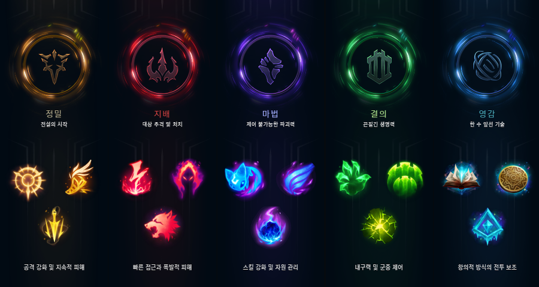
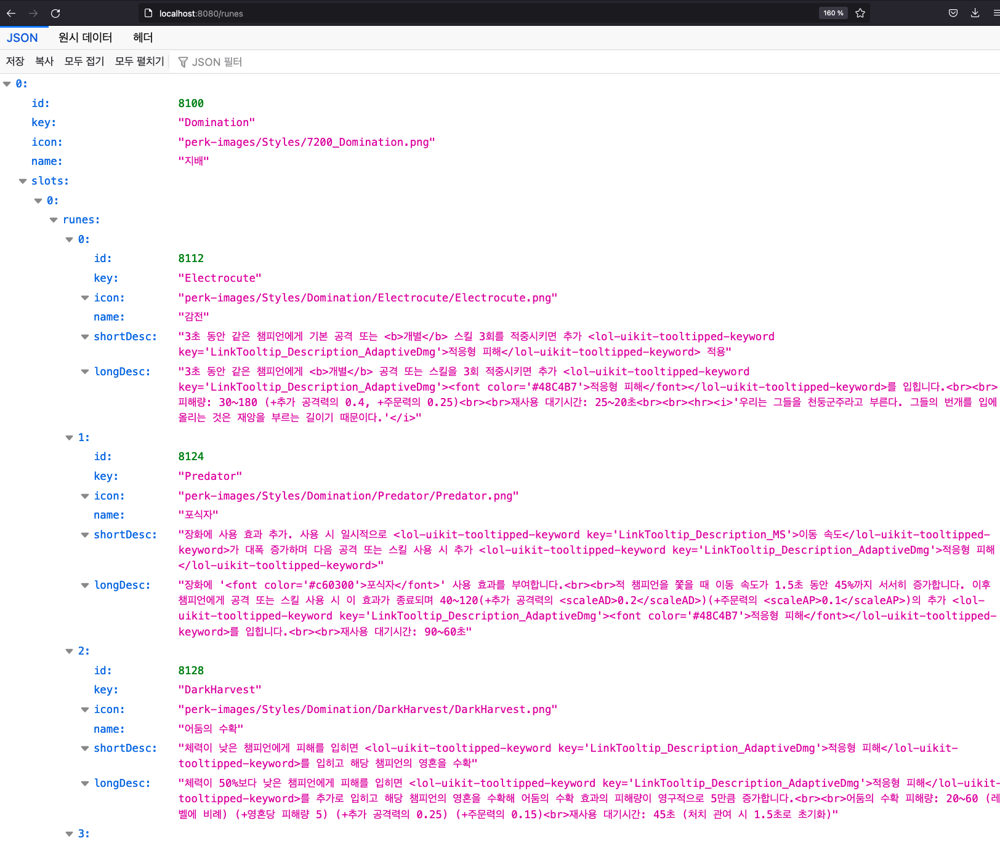

## All LOL Project
이전에 Feign을 통해 소환사 정보를 가져오는 글을 쓰고나서 한동안 "롤과 관련된 프로젝틑 하겠다고 했는데, 컨셉이 없으니까 다음 작업으로 뭘해야 하지?" 라는 생각에 잠겼었다.  
고민 하던 중 프로젝트 이름인 allol-project를 보고 "롤에 모든 정보를 보여주는 프로젝트를 만들자!" 라고 결정 했다.

## data dragon
Riot은 [riot api page](https://developer.riotgames.com/apis) 를 통해 게임에 관련된 정보들을 내준다.  
그러나 해당 페이지에서 게임에 관련된 모든 정보를 얻을 수는 없다.  
예를 들어 Summoner Spell, Runes, Items, Tier등등의 이미지, 설명과 같은 정보들은 얻을 수 없다.  
대신 data dragon을 통해 제공하고 있다.  
```
Data Dragon

Data Dragon is our way of centralizing League of Legends game data and assets, including champions, items, runes, summoner spells, and profile icons. 
All of which can be used by third-party developers.
 You can download a compressed tarball (.tgz) for each patch which will contain all assets for that patch. 
 Please be aware that updating Data Dragon after each League of Legends patch is a manual process, so it is not always updated immediately after a patch.
 
번역(feat. papago)
데이터 드래곤

Data Dragon은 챔피언, 아이템, 룬, 소환사 주문 및 프로필 아이콘을 포함한 리그 오브 레전드 게임 데이터와 자산을 중앙 집중화하는 방법입니다. 
이 모든 기능을 타사 개발자가 사용할 수 있습니다. 각 패치에 대해 압축된 타르볼(.tgz)을 다운로드할 수 있습니다. 
이 타르볼에는 해당 패치에 대한 모든 자산이 포함됩니다. 
각 리그 오브 레전드 패치 후 Data Dragon 업데이트는 수동 프로세스이므로 패치 후 즉시 업데이트되는 것은 아닙니다.
```

## 프로젝트 적용
data dragon은 .tgz, .zip 형태의 파일로 제공하기도 하지만 Url을 통해 서도 받을 수 있다.  
[소환사 룬 정보 가기](https://ddragon.leagueoflegends.com/cdn/11.15.1/data/ko_KR/runesReforged.json)
그리고 난 여기서 위 링크에 있는 소환사 룬 데이터를 프로젝트 화면에 Json 형태로 보여주는 것을 목표로 했다.  

소환사 룬에 대한 Json형태는 다음과 같이 되있었고 일단 Json형태와 같은 class를 만들고 Feign을 통해 받아왔다.  
```java
@FeignClient(value = "DataDragon", url = "https://ddragon.leagueoflegends.com/cdn/11.15.1/data/ko_KR")
public interface DataDragon {

    @GetMapping(value = "/runesReforged.json")
    List<Build> getAllRunes();
}
```

```java
package anylol.all.about.lol.domain;

import lombok.Getter;

import java.util.List;

@Getter
public class Build {
    private long id;

    private String key;

    private String icon;

    private String name;

    private List<Slot> slots;

    @Getter
    public static class Slot {
        private List<Rune> runes;
    }

    @Getter
    public static class Rune {
        private long id;

        private String key;

        private String icon;

        private String name;

        private String shortDesc;

        private String longDesc;
    }
}
```


class명을 Build로 한 이유는 위 사진에서 정밀, 지배, 마법, 결의, 영감을 빌드라고 말하기 때문에 Build라고 명명 했다.  

```java
@RestController
public class RuneController {
    @Autowired
    DataDragon dataDragon;

    @GetMapping("/runes")
    public Object getRunes() {
        List<Build> runes = dataDragon.getAllRunes();

        return runes;
    }
}
```
그리고 Controller를 통해 json형태로 나오는 것을 확인 했다.  


## 간단했지만...나는 왜 헤맸는가?
처음엔 Url을 통해 받은 Json값을 String으로 받아서 jackson, gson을 통해 class에 mapping 해줘야 한다고 생각했다.  
```java
@RestController
public class RuneController {
    @Autowired
    DataDragon dataDragon;

    @GetMapping("/runes")
    public Object getRunes() {
        String runes = dataDragon.getAllRunes();

        return runes;
    }
}
```
이렇게 받아서
```java
@RestController
public class RuneController {
    @Autowired
    DataDragon dataDragon;

    @GetMapping("/runes")
    public Object getRunes() {
        String runes = dataDragon.getAllRunes();
        Gson gson = new Gson();
        List<Build> runes = gson.fromJson(runes, new TypeToken<List<Build>>() {}.getType());
        
        //or
                
        ObjectMapper objectMapper = new ObjectMapper();
        List<Build> runes = objectMapper.readValue(runes, new TypeToken<List<Build>>(){}.getType());
        
        return runes;
    }
}
```
물론 이렇게 해도 값은 나오지만 dataDragon.getAllRunes()를 List<Build>로 받기만 하면 되기 때문에 굳이 이렇게 할 필요는 없었다고 생각한다.  
물론 한번 해봤으니까 경험치+1은 된건 좋았다.  

@Getter를 붙여주자
이전에 위처럼 했을때는 에러가 났었는데 직렬화, 인식에 대한 에러 메세지가 발생했다.  
처음에는 구문을 잘못 적었나 했지만 @Getter를 붙이니 화면에 나왔고, 찾아보니 
Json을 객체에 파싱할 때 객체의 프로퍼티 정보를 얻기 위해서는 객체 생성을 위한 기본생성자가 반드시 필요하고
접근 제한자에 따라 Getter / Setter / Field의 조건을 하나라도 만족해야 한다는 것을 알았다.  
[ObjectMapper는-Property를-어떻게-찾을까/](https://bactoria.github.io/2019/08/16/ObjectMapper%EB%8A%94-Property%EB%A5%BC-%EC%96%B4%EB%96%BB%EA%B2%8C-%EC%B0%BE%EC%9D%84%EA%B9%8C/)  

## 정리
처음에는 json을 String으로 받아서 Gson, ObjectMapper를 생성하여 class에 파싱해야 한다고 생각했다.  
좀 삽질도 해보고 이리저리 해보니 결론적으론 jackson이 알아서 다 해주니까 뭐 하려고 하지 말고 일단 Json형태의 맞는 class를 만들고 바로 class type으로 받아 보자 라고 생각했다.  
간단하다고 생각한 작업에서 이리저리 헤맨 것은 조금 그랬지만 그랬지만 어쩃든 하면 된거고 나중에 같은 작업이 생긴다면 다신 이러진 않을 것이라 생각한다.  (왜나면 글을 썼으니까)

## 출처
[ObjectMapper는-Property를-어떻게-찾을까/](https://bactoria.github.io/2019/08/16/ObjectMapper%EB%8A%94-Property%EB%A5%BC-%EC%96%B4%EB%96%BB%EA%B2%8C-%EC%B0%BE%EC%9D%84%EA%B9%8C/)
[소환사 룬 정보 가기](https://ddragon.leagueoflegends.com/cdn/11.15.1/data/ko_KR/runesReforged.json)
