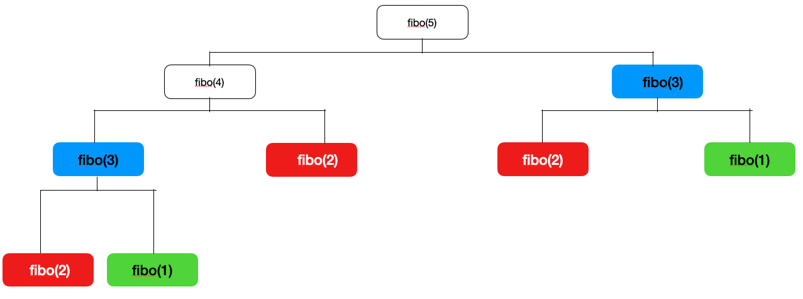
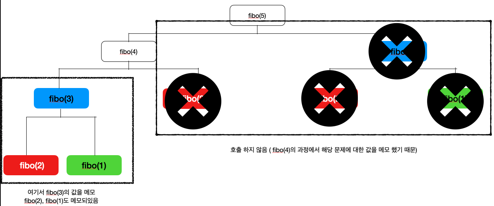

# Dynamic Programming
DP는 프로그래밍 알고리즘 중 하나로 한글로는 동적 프로그래밍 이라고도 이야기 한다.  
wikipedia를 보면  
"DP는 복잡한 문제를 간단한 여러개의 문제로 나누어 푸는 방법을 말한다."  라고 DP를 설명 하고 있고,  
역사 부분을 보면 DP라는 말이 만들어진 역사에 대해서도 나와있는데  
"수학자인 리처드 벨만이 이 알고리즘이 시가변적이며, 동적이다 라는 개념이 전달되길 원했다고 한다."라고 설명 하고있다.   
[위키피디아 보러가기](https://ko.wikipedia.org/wiki/동적_계획법#참고문헌)

그러나 Dynamic이라는 말이 멋있어보여서 사용했다 라는 설도 있긴하다.  (근데 이게 더 맞는말 같다.)

정리하면
DP는 
1. 복잡한 문제를 작은 문제로 나눌 수 있다.  
2. 같은 문제의 정답은 항상 같다. 

이 2가지 조건이 충족하면 DP로 문제를 풀 수 있다.  

## 예시
DP의 대표적인 예제는 피보나치 수열을 통해 설명할 수 있다.    
피보나치 수열이란
```
수학에서, 피보나치 수(영어: Fibonacci numbers)는 첫째 및 둘째 항이 1이며 그 뒤의 모든 항은 바로 앞 두 항의 합인 수열이다. 
처음 여섯 항은 각각 1, 1, 2, 3, 5, 8이다.

1, 1, 2, 3, 5, 8, 13, 21, 34, .....
```
를 말한다.  
이를 DP를 통하여 n번째 피보나치 수열을 구해보자  

일단  피보나치 수열은 첫째 및 둘째 항이 1이고 이 후 모든 항은 바로 앞 두 항의 합인 수열이라고 했으므로
피보나치 수열값을 저장할 배열을 arr이라고 했을때  
```
arr[n] = 1 if(n == 1 or n ==2)
arr[n] = arr[n-1] + arr[n-2] if(n > 2)
```
이렇게 표현이 가능하고 이를 코드로 표현 해보면  
```java
int fibonacci(int n) {
        if(n <= 2) {
            return 1;
        }
        return fibonacci(n-1) + fibonacci(n-2);
}
```

이런식으로 표현 할 수 있다.  
위 코드를 보면 n번째의 피보나치 수(큰문제)를 구하기 위해 n-1, n-2번째의 피보나치 수(큰 문제보다 작은 문제)를 구한다.  

위 코드가 실행 되는 것을 그림으로 그려보면

이렇게 재귀적으로 함수가 호출 되는 것을 볼 수 있는데 같은 값을 parameter로 받는 함수가 여러번 호출 되는 것을 확인 할 수 있다.
그림에서 보면 이미 정답을 계산한 문제르 또 호출 하고 있는 것을 볼 수 있다.  (fibo(3), fibo(2), fibo(1), fibo(0))  
이미 알고 있는 정답의 문제를 또 호출 하여 값을 계산하고 있는 것이다.  

만약 구하고자 하는 값(위 함수에선 파라미터 n)이 크다면 불필요한(이미 알고 있는 정답) 문제를 호출 하는 횟수가 증가 할것이다.  
이런 불필요한 문제 호출이 일어 나지 않기 위해서 이미 알고 있는 정답을 기억하는 방법이 있는데 이를 메모이제이션이라고 한다.  

## 메모이제이션
메모이제이션의 개념은 간단하다 이미 구한 정답은 어딘가에 저장 해놓는다! 라는 것이 메모이제이션의 개념이다.  

위 피보나치 수를 구하는 메서드에 메모이제이션을 적용하면 다음과 같다.  
```java
    public static void main(String[] args) {
        int n = 5;
        int[] memo = new int[n+1];
        memo[1] = 1;
        memo[2] = 1;
        System.out.println(fibonacci(n, memo));
    }
    int fibonacci(int n, int[] memo) {
        if(n <= 2) {
            return 1;
        } else if(memo[n] > 1) {
            return memo[n];
        }
        return memo[n] = fibonacci(n-1, memo) + fibonacci(n-2, memo);
    }
```
일단 첫번째, 두번째 수열의 값이 1이라는 것을 알고 있기 때문에 초기값을 설정 하고 이후의 값을 구할때 마다 배열에 저장한다.
이미 구한 정답의 경우 memo array에 저장했기 떄문에 memo array에서 값을 가져와 더 빠르게 수행 할 수 있다.  

## Top - Down, Botton - Up
DP를 사용할 떄는 Top - Down, Botton - Up 두 방법이 있는데  
위에서 구현한 방법은 Top - Down은 방식으로 맨위 값부터 값을 하나씩 아래로 풀어나간다.  
Botton - Up의 경우 아래 부터 하나씩 위로 올라가는 방법인데 피보나치 수열을 Botton - Up으로 풀면 다음과 같다.  
```
 int fibonacci(int n, int[] memo) {
        for(int i=3; i<memo.length; i++) {
            memo[i] = memo[i-1] + memo[i-2];
        }
        return memo[n];
    }
```
Top - Down방식과는 다르게 Botton - Up의 경우 재귀 호출이 아닌 간단한 for문으로 작성 할 수 있다.  
Top - Down방식은 메모이제이션을 했다는 가정하게 Botton - Up과 시간 복잡도 가 같다고 하지만 일반적으로는 Top - Down이 좀 더 길다고 한다.  
그러나 Top - Down의 경우 점화식이 그대로 호출되기 때문에 순서에 얽매이지 않는다고 한다.  
Botton - Up은 시간이 조금더 적게 걸린다는 장점이 있어서  결론적으로 둘다 할 줄 알아야 좋을거같다.  

## 그래서 DP를 이해 했나요?  
사실 개념은 이해했지만 DP에 관련된 문제마다 다양한 점화식을 찾는 것(작은 문제로 나누는것)이 어렵기 때문에 DP문제는 그냥 풀지! 라고 말하는것은 어려운것같다. (BFS, DFS는 형식이라도 같아서 빠르게 실력을 올릴 수 있었다.)
만약 코딩테스트를 보다가 DP에 관련된 문제가 나온다면 처음부터 도전하지 말고 다른문제를 먼저 풀고 남은 시간에 여유롭게 푸는 것을 추천한다.  (개인적인 의견이다)

## 출처
[동적 계획법](https://coding-all.tistory.com/2)  
[[알고리즘] 제18-1강 동적계획법 (Dynamic Programming)](https://www.youtube.com/watch?v=K15qLnKKrow)  
[제로초 블로그](https://www.zerocho.com/category/Algorithm/post/584b979a580277001862f182)

