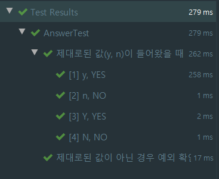
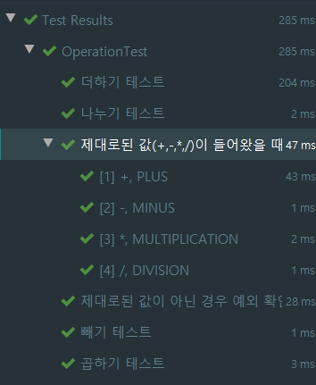

# java를 이용해 콘솔로 문자열 계산기 구현하고 단위 테스트 진행하기 - 2

## 요구사항
- 사용자가 입력한 문자열 값에 따라 사칙연산 수행
- 계산 우산순위는 입력 값에 따라 순서가 결정(사칙연산 계산 우선순위 무시)
- 사칙연산(+, -, *, /)만 가능
- 예를들어 "2 + 3 * 4 / 2"를 입력할 경우 10을 출력

### 실행 화면


## 이전 포스팅 정리
- 객체에 대해 설계를 진행했습니다.
- Operation과 Number가 많은 역할을 하게 됩니다.
- 이번 시간에는 객체들을 이용해 실제 구현을 해보도록 하겠습니다.

## 객체 변경
- 몇개의 객체들이 추가된 사항이 있습니다.

### Operation
```java
package calculator.domain;

import java.util.Arrays;
import java.util.NoSuchElementException;
import java.util.function.BiFunction;

public enum Operation {
...
    public static Operation of(String operationInput) {
        return Arrays.stream(values())
            .filter(operation -> operation.getSymbol().equals(operationInput))
            .findFirst()
            .orElseThrow(() -> new NoSuchElementException("연산자를 찾을 수 없습니다."));
    }
...
}
```
- 연산자 입력값을 받아서 연산자를 찾아야 하는데, Answer Enum과 동일하게 스트림을 이용해 연산자 입력값을 받아서 찾습니다.

### Number
```java

public class Number {
    ...
    
    public Number getTotalResult(final Number number) {
        return new Number(number.getNumber() + this.getNumber());
    }
}
```
- 연산을 한 후에 새로운 결과를 반환하기 위한 메서드입니다.
 
## Calculator
- 사실 여기서는 Controller라고 적어놨지만, 콘솔이다 보니 Controller라는 단어가 맞지 않을 수도 있습니다.
- 저는 Application과 통신하는 중간 레이어 역할을 뒀지만, 굳이 의미는 존재하지 않는 것 같습니다.
- 이부분에 대해서는 좀 더 리팩토링을 진행해야 될 것 같습니다.
```java
package calculator.controller;

import java.util.Arrays;

import calculator.domain.Answer;
import calculator.domain.Number;
import calculator.domain.Operation;
import calculator.view.InputView;
import calculator.view.OutputView;

public class CalculatorController {
    public void calculator(){
        String input = InputView.enterOperation().replace(" ", "");
        String[] splitedInput = input.split("");
        Number totalResult = new Number(splitedInput[0]);

        for (int i = 1; i < splitedInput.length; i += 2){
            Operation operation = Operation.of(splitedInput[i]);
            Number operand = new Number(splitedInput[i + 1]);
            totalResult = totalResult.getTotalResult(operation.calculate(totalResult, operand2));
        }

        OutputView.outputResult(totalResult);

        if(InputView.inputRestart() == Answer.YES){
            calculator();
        }
    }
}
```
- 입력을 받아서, for문을 돌면서 각 계산을 진행합니다.
- 처음에 Operation을 찾고 그 다음 operand를 찾아서 진행합니다.
- 결과를 출력해주고, 다시 진행하고 싶다면 메소드 자체를 다시 실행합니다.

## CalculatorApplication
- 실제 실행하는 곳으로 main 메서드를 이용해 실행합니다.

```java
package calculator;

import calculator.controller.CalculatorController;

public class CalculatorApplication {
    public static void main(String[] args) {
        CalculatorController calculatorController = new CalculatorController();
        calculatorController.calculator();
    }
}
```

## 테스트

### AnswerTest
```java
package calculator.domain;

import static org.assertj.core.api.Assertions.*;

import java.util.NoSuchElementException;

import org.assertj.core.api.Assertions;
import org.junit.jupiter.api.DisplayName;
import org.junit.jupiter.api.Test;
import org.junit.jupiter.params.ParameterizedTest;
import org.junit.jupiter.params.provider.CsvSource;
import org.junit.jupiter.params.provider.ValueSource;

class AnswerTest {

    @DisplayName("제대로된 값(y, n)이 들어왔을 때 제대로 반환하는지 확인하는 테스트")
    @ParameterizedTest
    @CsvSource(value = {"y:YES", "n:NO", "Y:YES", "N:NO"}, delimiter = ':')
    void ofTest(String AnswerInput, Answer expected) {
        Answer answer = Answer.of(AnswerInput);
        assertThat(answer).isEqualTo(expected);
    }

    @DisplayName("제대로된 값이 아닌 경우 예외 확인 테스트")
    @Test
    void inCorrectOfTest() {
        assertThatThrownBy(() -> Answer.of("A")).isInstanceOf(NoSuchElementException.class);
    }
}
```

- 제대로된 값이 들어왔을 때 반환하는 테스트와 제대로된 값이 아닌 경우 두가지를 테스트 했습니다.
- `CsvSource`를 이용해 한번에 입력값에 대한 테스트를 진행했습니다.
 

## Operation Test
```java
package calculator.domain;

import static org.assertj.core.api.Assertions.*;

import java.util.NoSuchElementException;

import org.junit.jupiter.api.DisplayName;
import org.junit.jupiter.api.Test;
import org.junit.jupiter.params.ParameterizedTest;
import org.junit.jupiter.params.provider.CsvSource;

class OperationTest {

    @DisplayName("제대로된 값(+,-,*,/)이 들어왔을 때 제대로 반환하는지 확인하는 테스트")
    @ParameterizedTest
    @CsvSource(value = {"+:PLUS", "-:MINUS", "*:MULTIPLICATION", "/:DIVISION"}, delimiter = ':')
    void ofTest(String operationInput, Operation expected) {
        Operation operation = Operation.of(operationInput);
        assertThat(operation).isEqualTo(expected);
    }

    @DisplayName("제대로된 값이 아닌 경우 예외 확인 테스트")
    @Test
    void inCorrectOfTest() {
        assertThatThrownBy(() ->Operation.of("=")).isInstanceOf(NoSuchElementException.class);
    }

    @DisplayName("더하기 테스트")
    @Test
    void plusTest() {
        Number one = new Number(1);
        Number two = new Number(2);
        Number result = Operation.PLUS.calculate(one, two);
        assertThat(result.getNumber()).isEqualTo(3);
    }

    @DisplayName("빼기 테스트")
    @Test
    void minusTest() {
        Number one = new Number(1);
        Number two = new Number(2);
        Number result = Operation.MINUS.calculate(two, one);
        assertThat(result.getNumber()).isEqualTo(1);
    }

    @DisplayName("곱하기 테스트")
    @Test
    void multiplicationTestMULTIPLICATIONTest() {
        Number one = new Number(1);
        Number two = new Number(2);
        Number result = Operation.MULTIPLICATION.calculate(one, two);
        assertThat(result.getNumber()).isEqualTo(2);
    }

    @DisplayName("나누기 테스트")
    @Test
    void divisionTest() {
        Number one = new Number(1);
        Number two = new Number(2);
        Number result = Operation.DIVISION.calculate(two, one);
        assertThat(result.getNumber()).isEqualTo(2);
    }
}
```
- 위와 동일하게 제대로된 값이 들어왔는지, 또한 제대로 된 값이 아닌 경우 예외를 확인하는 테스트를 작성하였습니다.
- 추가로 각 연산자에 대한 테스트를 진행하였습니다.



## 정리 
- 한번더 강조 하지만, 여기서 가장 배워야 할점은 전략패턴 방식인 다형성을 이용한 enum 구현입니다.
- 사칙연산에 따라서 각각의 패턴을 가지고 있고 그에 맞춰 전략을 구현합니다.
- 손쉽게 단위 테스트를 할 수 있는 예제인 것 같습니다.
- 아직 설계에 대해서나, 테스트에 대해서 부족한 부분이 많지만 계속 배워갈 예정입니다.
- TDD를 익히기 전에 한 번 해보시면 좋으실꺼 같습니다!
