> 지난 번 첫 pull request를 겪으며 많은... 당황을 했다. 
> 이번 기회에 Pull Request가 뭔지, 왜 필요한지, 어떻게 하는건지 차근차근 진행해보려고 한다.

 
# Pull Request란?

- 깃허브 레포지토리에 있는 브랜치에 푸시한 내역들, 변경된 사항들을 다른 사람들에게 알리는 것
- 마스터 브랜치에 merge되기 전, 변경 사항에 대해 다른 사람들과 논의, 검토할 수 있음
 
<br/>

## 1. Fork

만약 PR을 작성할 레포지토리가 내 레포지토리가 아니라면 fork를 통해 내 레포지토리로 복사하자.
원본 레포지토리의 우측에 `fork 버튼`을 누르면 내 레포지토리로 생성된 것이 보인다.
fork를 마쳤으면 개발에 사용하는 툴(ex: IntelliJ, Eclipse, ...)에서 프로젝트를 pull 하자.
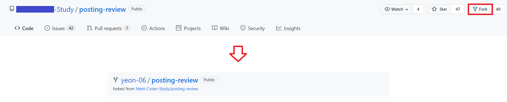

<br>

#### 1-1) 'Invalid path: 경로...' 오류
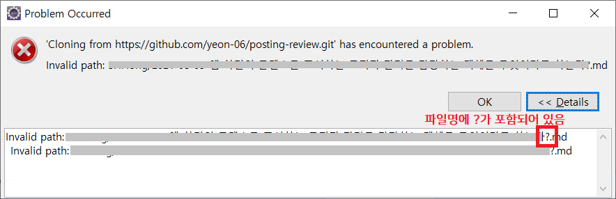
**유효하지 않은 경로** 라서 나타난 것으로 해당 경로에 파일이 포함되어있나 확인해야 한다.
또는 맥에서는 상관없지만 윈도우에서는 **파일명에** '?'와 같은 **특수 문자가 포함**되어 있을 수 있다.

<details>
<summary>🔻 해결 방법</summary>
<div markdown="1">
해결 방법에는 크게 2 가지가 있다.

1. 특수 기호가 들어간 파일명 수정하기
2. 특수 기호가 들어간 파일을 제외하고 pull 받기
 
일단 첫 번째 방안에 대해서는 내가 관리하는 레포지토리가 아니고, 다른 사람의 파일을 막 건드리기 꺼려졌다.
수많은 파일 중에서 잘못된 파일명들을 하나하나 찾아낼 자신도 없었다...

2의 경우는 아래 과정을 따른다.

1. git clone 진행 (오류 발생)
2. 생성된 폴더로 접근해 아래 명령어 실행

```
> git config core.protectNTFS false 	// NTFS 설정 변경
> git checkout -f HEAD 			// conflict 났거나 clone이 완료되지 않은 파일들이 checkout됨
```

위 과정을 거치면 문제 되는 파일을 제외한 모든 파일이 존재하는 것을 볼 수 있다.
다만 해당 명령어를 이용하면 **파일의 손상 위험성** 이 있다고 한다.
가능하면 애초부터 파일명에 특수 기호를 넣지 않는 방향으로 작업하면 좋을 것 같다.
<br/>
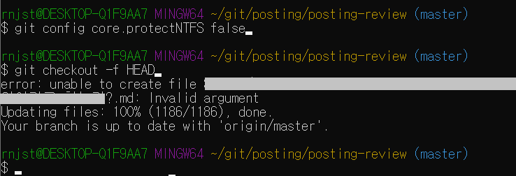
</div>
</details>


#### 1-2). fork한 레포지토리 업데이트 하기

예전에 fork 해놨더니 새로 올라온 파일들이 반영되지 않았다.
<details>
<summary>🔻 해결 방법</summary>
<div markdown="1">
1. 원본 repo를 remote repo로 추가하기
fork한 repo에서 동기화하고 싶은 원본 repo를 upstream이라는 이름으로 추가해줬다.

```
> git remote add upstream https:~~깃헙주소
```
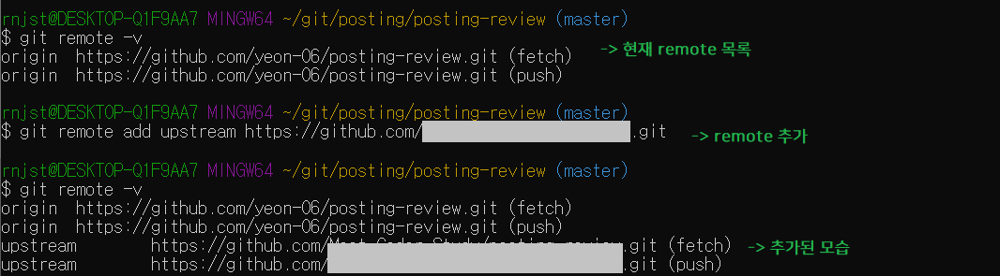
<br/>

2. upstream repo에서 최신 데이터 가져오기

```
> git fetch upstream
```

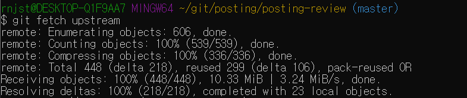
+ pull은 fetch와 merge를 한 작업으로 만든 명령어와 같이 작동한다.
병합할 목적이라면 fetch 말고 pull을 사용해도 되긴 하지만 비교적 안전한 절차를 거치기 위해 fetch를 사용한다.

<br/>

3. upstream repo -> 로컬 repo merge & push
matser 브랜치에 바로 merge했지만 이외에도 특정 브랜치 선택이 가능하다.

```
> git merge upstream/master
> git push origin master
```

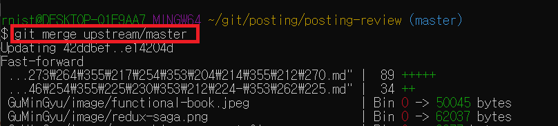

<br/>
</div>
</details>

<br/>

## 2. Create Branch

Pull Request를 하려면 브랜치가 존재해야 한다.
브랜치를 새로 생성하려면 레포지토리에서 아래 버튼을 누르거나, 사용하는 툴(ex: Eclipse)에서 생성할 수 있다.

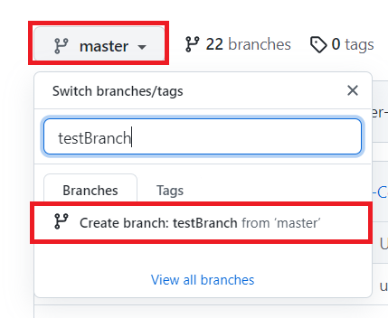

<br/>

## 3. Commit & Push

중요한 점은 2에서 **새로 생성한 브랜치에 commit, push** 를 진행해야 한다.
마스터에 바로 변경사항을 적용시키면 pull request의 의미가 없다.

<br/>

## 4. Create Pull Request

push한 내역이 있으면 GitHub에 상단에 노란색 칸이 생성되어 있다.
`Compare & pull request` 버튼 클릭
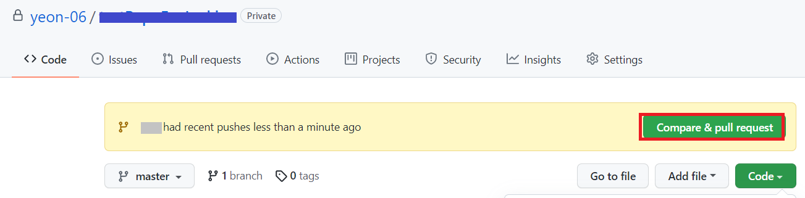

제목, 내용 작성 후 `Create pull request` 클릭
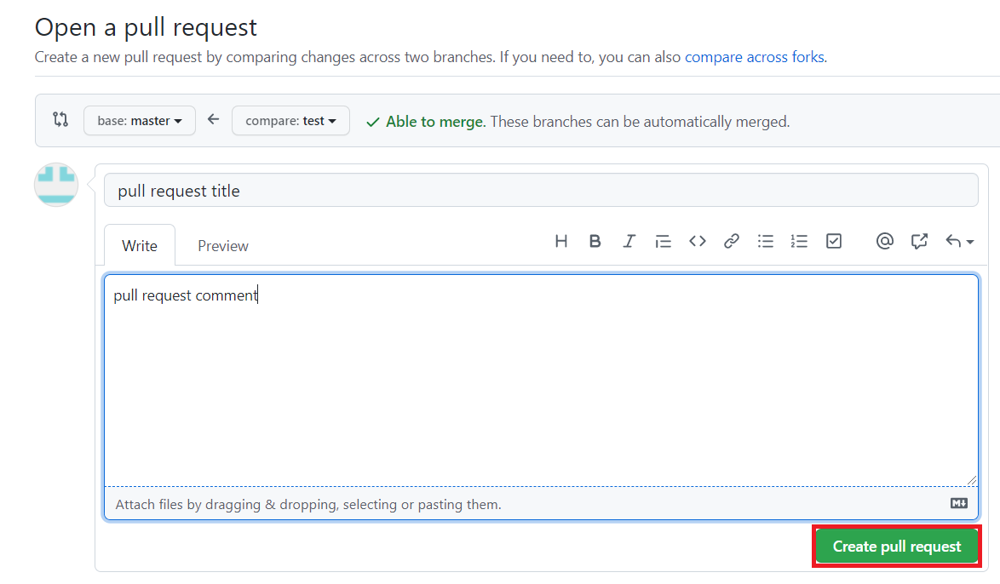

pull requests에서 추가한 PR를 확인할 수 있다.
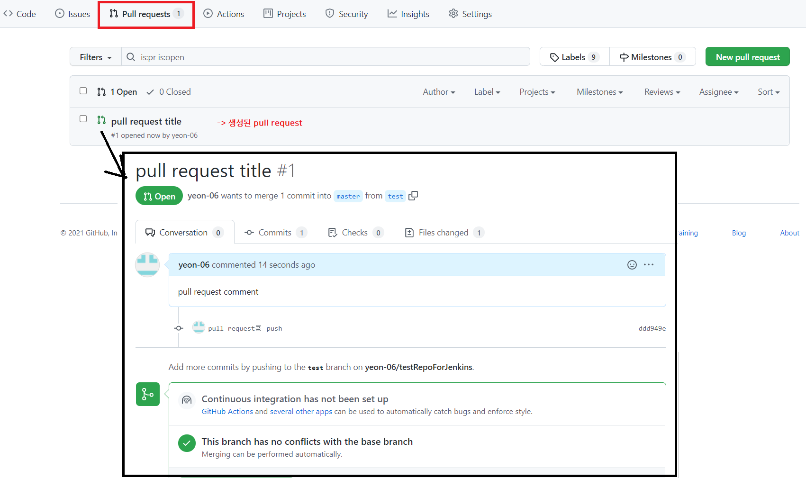

 <br/>

#### 4-1. Pull Request 생성 후 수정사항이 생긴다면?

같은 브랜치에 수정사항을 push한다면, Pull Request에도 자동으로 반영이 된다.
별도로 Pull Request를 추가로 만들 필요가 없다.

<br/>
 
## 5. Review

pull request 하단에 보면 코멘트를 달 수 있는 공간이 존재한다.
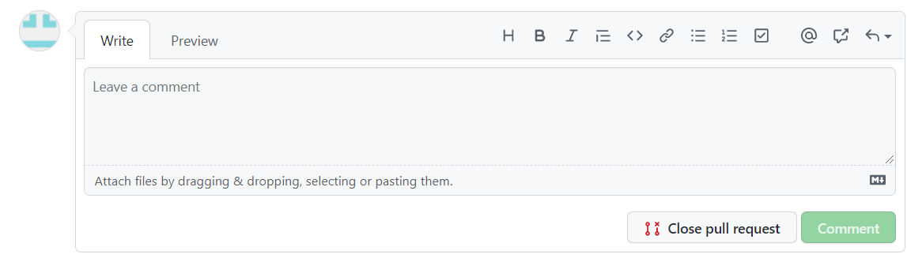

또는 Files changed 탭에 들어가 코드 한줄한줄에 코멘트 등록이 가능하다.
이 곳에서 단 코멘트도 Conversation 탭에서 확인 가능하다.
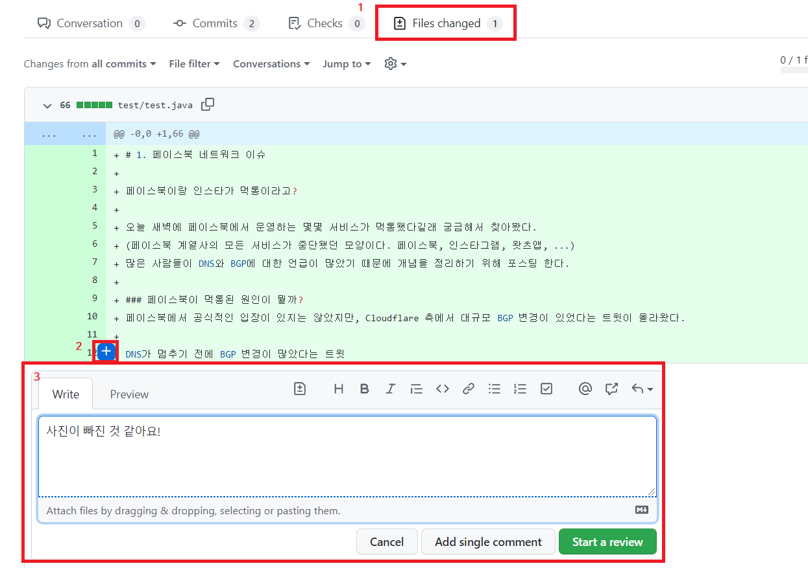

 <br/>

## 6. Merge

레포지토리 관리자가 merge를 승인해야 최종적으로 원본 레포지토리에도 반영이 된다.
승인하는 과정은 아래와 같다.
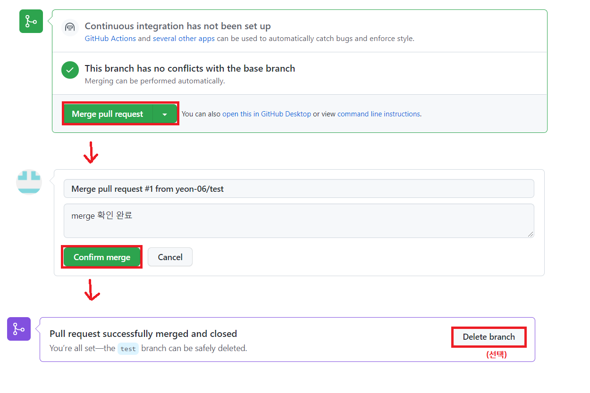

 
***
참고
1. [깃허브]( https://docs.github.com/en/pull-requests/collaborating-with-pull-requests/proposing-changes-to-your-work-with-pull-requests/about-pull-requests)
2. [fork한 repository 업데이트하기](https://codermun-log.tistory.com/223)
3. [깃헙에서 코드리뷰 하기](https://velog.io/@eunjeong/GitHub%EC%97%90%EC%84%9C-%EC%BD%94%EB%93%9C%EB%A6%AC%EB%B7%B0%EB%A5%BC) 
