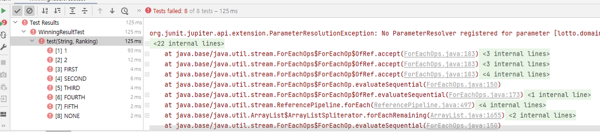
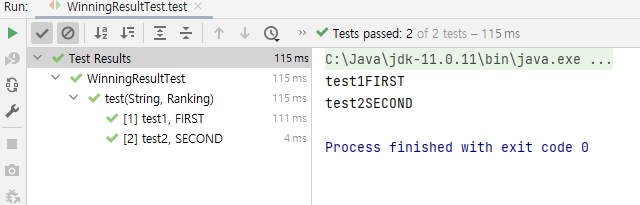
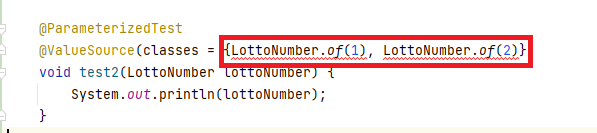
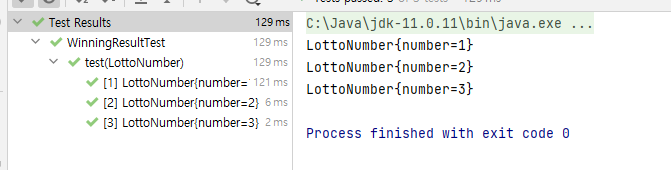
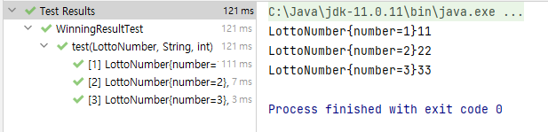

## 개요

테스트 코드를 작성하다 보면 코드가 반복되는게 느껴질 때가 있다.  
개인적으로 나는 객체가 잘 생성되는지 확인할 때도 경계값 중간값까지 최소 3개의 값으로 테스트하는 편이다.  
값이 바뀔때마다 코드를 복붙하는게 불필요하게 느껴져서 테스트 코드 내부에 메소드를 따로 만들기도 했었는데 @ParameterizedTest라는 어노테이션을 알게 되었다.

## @ParamaterizedTest

- 다양한 인수로 테스트를 여러번 실행할 수 있도록 해주는 어노테이션
- `@Test` 어노테이션 대신 사용
- source 어노테이션 필요  
  ex: `@ValueSource`, `@CsvSource`, `@MethodSource`, ...

### 예제 코드 - @ValueSource

```java
@ParameterizedTest
@ValueSource(strings = {"a", "b"})
public void test(String strring){
    System.out.println(string);
}
```

### ❓ 파라미터를 여러개 받고 싶다면?
여러 파라미터를 동시에 받고 싶은 경우가 있을 수 있다.

source 어노테이션을 동시에 쓰면 되지 않을까? 라는 생각에 아래와 같은 코드를 작성해보았다.
```java
// bad code
@ParameterizedTest
@ValueSource(strings = {"1", "2"})
@EnumSource(Ranking.class)
public void test(String str, Ranking ranking) {
    System.out.println(str);
    System.out.println(ranking);
}
```



org.junit.jupiter.api.extension.ParameterResolutionException: No ParameterResolver registered for parameter [파라미터 타입 arg1] in method [메소드(파라미터 타입)]. 에러가 발생한다.


이런 경우에는 `@CsvSouce` 어노테이션을 활용하면 된다.
```java
// good code
@ParameterizedTest
@CsvSource(value = {"test1:FIRST", "test2:SECOND"}, delimiter = ':')
public void test(String str, Ranking ranking) {
    System.out.println(str + ranking);
}
```



### ❓ 사용자 정의 클래스를 파라미터로 넣고 싶다면?
`@ValueSource`에는 strings, ints 뿐만 아니라 classes도 존재한다.  
아, 이걸 이용해서 사용자 정의 클래스를 파라미터로 받는건가? 하고 단단히 착각했다.



실행이고 뭐고 빨간줄 부터 없애봐...

<br>

사용자 정의 클래스를 사용하고 싶다면 다른 방법을 이용해야 한다.

`@MethodSource`를 활용한 예제를 보자.
```java
@ParameterizedTest
@MethodSource("parameterProvider")
void test(LottoNumber lottoNumber) {
    System.out.println(lottoNumber);
}

private static Stream<Arguments> parameterProvider() {
return Stream.of(
    Arguments.arguments(LottoNumber.of(1)),
    Arguments.arguments(LottoNumber.of(2)),
    Arguments.arguments(LottoNumber.of(3))
  );
}
```



뿐만 아니라 **여러개의 파라미터**를 정의할 수도 있다.
```java
@ParameterizedTest
@MethodSource("parameterProvider")
void test(LottoNumber lottoNumber, String str, int num) {
  System.out.println(lottoNumber + str + num);
}

private static Stream<Arguments> parameterProvider() {
  return Stream.of(
    Arguments.arguments(LottoNumber.of(1), "1", 1),
    Arguments.arguments(LottoNumber.of(2), "2", 2),
    Arguments.arguments(LottoNumber.of(3), "3", 3)
  );
}
```


### @ValueSource의 classes
```java
@ParameterizedTest 
@ValueSource(classes = {String.class, Integer.class}) 
void test(Class<?> argument) {
    System.out.println(argument);
}
```
특정 인스턴스가 아닌 class를 파라미터로 넣을 수 있다.

***
## 참고
- [JUnit5 docs](https://junit.org/junit5/docs/current/user-guide/#writing-tests-parameterized-tests)
- 우테코 문서 - 자동차 경주 / 학습테스트를 통한 JUnit 학습하기
- [stackoverflow](https://stackoverflow.com/questions/56691782/what-is-the-use-of-valuesourceclasses)
- [baeldung](https://www.baeldung.com/junit-testinstance-annotation)
