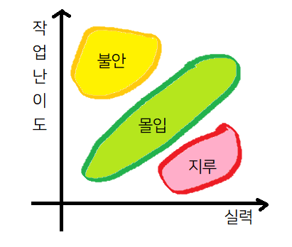

# 함께 자라기
#### 인사이트 출판사 / 김창준 지음  
#### http://www.yes24.com/Product/Goods/67350256

> 이번에는 기술적으로 알아본 것이 없어서 최근 읽은 책 중에 감명깊게 읽었던 책에 대해서 가져와보았습니다.  
> 다른 개발자 분에게서 추천 받은 책인데 '협업', '애자일', '학습 방법'에 대해 나와있습니다.

## 책을 읽으며..
 평소 학습 방법에 대해서는 큰 고민을 하지 않았던 나인데 내 상태를 쏙 뽑아놓듯 글로 표현해두신걸 보고 깜짝 놀랐다.
 이래서 학습하는 방법을 배우는 도서들도 많구나 싶었다. 네이버 완결 웹툰 중에 가담항설이라는 웹툰이 있다. 
 초반에는 이상해보이는 만화지만 그걸 견디고 보다보면 명대사들이 정말 많은 웹툰인데.. 아래와 같은 대사가 생각나서 가져와보았다.

> "소소한 슬픔도, 아련한 슬픔도, 잊혀가는 슬픔도, 문득 기억이 떠올라 때때로 가슴이 아파지는 슬픔까지, 같은 슬픔조차도 사실은 전부 달라요. 책을 읽고 풍부한 단어를 알게 된다는 건, 슬픔의 저 끝에서부터 기쁨의 저 끝까지. 자신이 가지고 있는 수많은 감정들의 결을 하나하나 구분해내는 거예요. 정확히 그만큼의 감정을 정확히 그만큼의 단어로 집어내서 자신의 마음을 선명하게 들여다보는 거죠. (중략) 같은 단어를 알고 있다면 감정의 의미를 공유할 수 있고 같은 문장을 이해할 수 있다면 감정의 흐름을 공유할 수 있어요. 그리고 그건 서로를 온전히 이해할 수 있게 만들죠."

내가 설명할 수 없었던 지식이나 감정, 의식 상태를 설명할 수 있게 되는 순간이 너무 좋다.
이미 알고 있던 지식이 어떠한 연결고리로 이어질 때, 그리고 그걸 남에게 설명이 가능할 때 그 때가 학습에서 가장 뿌듯하고 짜릿한 것 같다.

## 정리
이제 본 책에서 인상 깊었던 부분 몇 개를 정리해보겠다.

### 학습은 서로 상반된 의견 속에서 스스로 생각하는 힘을 기르는 것이다.
👉 이 책의 도입부이자 가장 감명 깊었던 부분이다. 
대학 생활 4년간 괜찮은 성적으로 졸업하면서도 왜 실무에서는 그 지식을 하나도 활용하지 못했을까? 
왜 기억에 남는 공부가 없을까? 라는 생각을 몇 번 한 적이 있다. 
생각해보니 족보를 둘둘 외우고 약간의 공부만 하면 쉽게 맞는게 A+인데 나는 학습을 한게 아니구나 라는 생각이 든다. 
대학 다닐 때 밤 새며 시험 공부를 하는건 늘 힘이 들었는데 새벽 3시까지 우테코 과제를 리팩토링하는건 왜 재밌을까? 에 대한 해답이 된 것 같다. 
여러가지 의견 속에서 나 혼자 스스로 생각할 수 있는 힘을 기르고, 이런 힘을 내야만 비로소 지식이 내 머릿속에 남는 것 같다.

### 안데쉬 에릭손의 1만 시간 법칙
👉 의도적인 수련이란 자신의 기량 향상을 위해 의도적으로 반복하는 수련이다. 
나는 공부한 시간이 길면 열심히 했다고 생각했다. 이 말은 맞지만 틀렸다. 
내가 공부한 시간이 의도적인 수련인가?에 대해서이다. 
예를 들어 공부한 내용을 포스팅하는 것은 정말 공부가 되는가? 
남의 것을 복붙한 것이 아니라 진심으로 내가 이해한 내용이 맞는가? 
공부하는 시간 자체를 늘리기 위해 이미 아는 것을 반복하는 행위는 아닌가? 
여러 의심이 필요하다.

### 성장에 중요한 요소는 '동기'와 '피드백'
👉 저자가 비유한 양치질 전문가가 인상 깊었다. 
우리는 아주 어릴 때부터 양치질을 해왔을 것이다. 
하지만 우리는 양치질 전문가로 자부할 수 있는가? 
굉장히 오랜 시간을 투자해왔을텐데 왜 우리는 양치질 전문가가 아닐까? 
첫번째로 우리는 보통 양치질을 의무감에 하는 것에 가깝지 열심히 양치질을 해서 하얀 이빨을 가져야지! 같은 동기를 갖고 있지는 않다. 
두번째는 피드백 텀이 문제다. 텀이 아무리 짧아야 한 달에 한번은 치과에 갈까? 
가면 의사 선생님이 내 이빨 상태에 대해서 피드백을 해주지만 이 몇 달에 한 번 꼴의 피드백은 잊히기 쉽상이다.

### 적절한 작업 난이도를 조정하는 법

👉 위 그림은 실력과 작업 난이도에 따른 심리 상태를 나타낸다. 
실력과 작업 난이도가 일정해야 즐겁게 몰입을 하며 학습을 할 수 있고 난이도에 비해 실력이 너무 높으면 지루하게 느껴질 수 있다. 
이럴때는 작업 난이도를 높여야 한다. (ex: 단축키를 사용하지 않는다던가 언어를 바꿔본다던가 등) 
작업난이도가 실력에 비해 너무 높으면 진행하기 어려워하고 불안하다. 
이럴 때는 작업 난이도를 낮추는게 좋다. 
Spring Security를 도입해 로그인 기능을 만들어라! 가 너무 어렵다면 RDB와 연동해서 로그인 기능을 구현한다던가 더 낮춰서 id와 password라는 String 두개만을 이용해 로그인 로직을 구현한다던가 등의 방법이 있다.

### 실수 방지보다는 실수 관리
👉 실수를 완벽히 방지하는건 불가능하다. 
그보다는 실수를 어떻게 더 잘 관리할 수 있을지, 어떻게 더 빠르게 효율적으로 복구할 수 있을지에 대해서 생각하는 방면으로 접근하는 것이 좋다.

### 품질은 상대적인 개념이다
👉 품질이란 누군가에게 가치가 되는 것이다. 
주목해야할 점은 '누구'에게 가치가 되는가이다. 
품질에 대한 객관성을 정의할 수 있을까? 이 객관성을 정의하는 것 역시 사람이기 때문에 이 자체가 매우 주관적이다. 
이 책에서 설득을 위해서는 상대방과의 신뢰감이 중요하다고 말한다. 
아무리 좋은 제안이라도 상대방과의 신뢰가 낮다면 아무리 '객관적으로' 좋은 자료와 뒷받침 근거가 있더라도 받아들여지기 쉽지 않다.

### 심리적 안전감
👉 이 책에서는 심리적 안전감을 내 생각이나 의견, 질문을 말해도 처벌받거나 놀림 당하지 않을 거라는 믿음이라고 정의하고 있다. 
나는 이게 매우 중요한 요인이라고 생각한다. 
예전에 있던 곳에서는 질문을 하면 항상 핀잔을 듣고는 했다. 
이런걸 왜 물어보냐, 이런 것도 모르냐는 식으로? 내가 결정한건 입을 다물기였다. 
직접 물어보면 5분 걸릴 것을 직접 찾아보느라 하루이틀을 꼬박 다 쓰기도 했다. 
우테코에서는 아낌없이 마음껏 질문하고 있다.(ㅎㅎ) 
그래서 더욱 즐겁게 수업에 참여하고 있다.

### 학습과 실행은 하나다
👉 주변을 바꾸기에 내 영향력이 너무나도 작다면 자신의 학습 환경부터 구성하라고 한다. 
일하는 방식에 대해 여러 시도를 해보고 의도하지 않은 결과가 나오더라도 실망하지 말아라. 
실패 그 자체로도 학습이 된다. 
학습과 일을 분리하지 말아라. 
언제 시작할지 계획을 짜는 중이라면 그만두고 당장 시작하라.

## 마무리...
부제목에 애자일로 가는 길이라고 적혀 있어서 솔직히 초반엔 좀 쫄았다.  
애자일을 전혀 몰라서... 어떠한 이론적인 개념을 설명하는 책일까봐...😓  
내 학습 태도나 주변을 대하는 태도에 대해 생각해볼 계기가 되었다 :)

책이 얇고 작은 편이라 지하철 같은 곳에서도 부담없이 읽을 수 있으니 다른 분들께도 추천합니다.