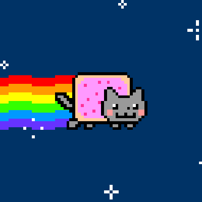
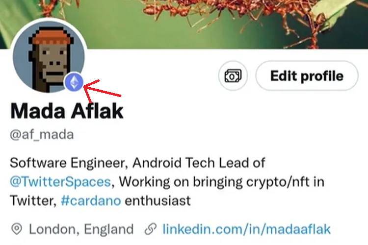
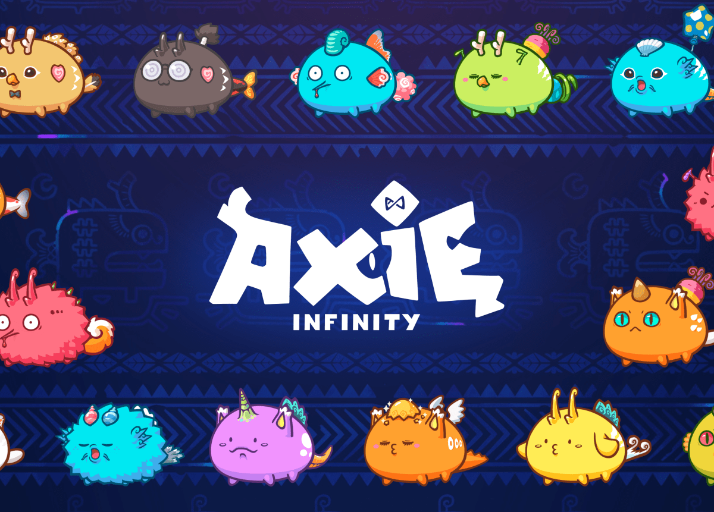

## 서론

내 주변에는 게임을 좋아하는 사람이 많다. 그런 친구들과 대화하다 보면 자연스레 게임 이야기를 많이 한다. 그 중 NFT에 대한 이야기가 꽤 흥미로웠다. 이게 뭔지 왜 적용했는지 개발자로서의 호기심이 동해 글을
작성하게 되었다.

## NFT란?

- = Non-Fungible Token = 대체 불가 토큰
- 블록체인에 등록된 고유한 디지털 인증서
- 예술 작품이나 수집품 같은 자산의 소유권을 기록하는 데 사용

> ❓ 대체 불가 토큰  
> Fungibility: 한 물체가 다른 물체로 대체 가능함 (ex: 돈)  
> Non-Fungible: 동일한 경제적/정서적 가치로 대체될 수 없음 (ex: 엄마가 사준 지갑 != 길 가다 아무거나 산 지갑)
>
> ❓ 블록 체인  
> :데이터를 네트워크에 연결된 여러 컴퓨터에 저장하는 분산형 데이터 저장 기술

블록 체인이 누가 언제 NFT를 소유했는지 기록되고 소유에 대한 권리를 영원히 보존해준다. 인터넷에 돌아다니는 똑같아보이는 수많은 짤방들.. 어떤게 원본인지 구분할 수 있는가? NFT에 등록되면 이미지가 ⭐유일하고
희소성 있는⭐ 디지털 자산으로 인정 받는다. 블록 체인 기술을 통해 이미지가 갖는 고유번호가 장부처럼 등록되어 똑같아 보이는 이미지가 아무리 많아도 원본으로 인정받는 이미지는 NFT로 발행되는 이미지 하나 뿐이다.

### 이 냥캣 이미지는 얼마일까요?

위의 냥캣 gif 이미지는 약 6억 원에 낙찰되었다.😻 뿐만 아니라 무한도전의 '무야호' 클립, 복면가왕 '상상도 못한 정체 ㄴㅇㄱ' 클립도 NFT로 출시하며 각 950만원, 300만원에 낙찰되었다. 모두 온라인에
이미 널리 퍼진 밈들이다. 누가 소유하겠다고 구매해봤자 다른 사람은 여전히 그 밈을 사용 가능하다. 그걸 왜 NFT로 사고 파는걸까? 그걸 왜 돈 주고 사는거지?🤔 라는 의문이 들었다.

사실 NFT 이미지를 구매한다고 해당 이미지 자체를 구입하는건 아니다. 내가 주인이다!! 라는 데이터가 있는 링크를 이미지에 넣은 것이다. 이미지를 다른 사람이 저장할 수도 있고 구매했던 이미지를 다시 판매할 수도
있다. NFT를 통해 구매하는건 이미지 자체가 아니라 내가 주인이다!!라는 데이터가 있던 링크를 구매하는 것이라는걸 기억해두자.

이 링크를 왜 구매할까? 첫 번째로 단순히 예술가를 후원하고자 하는 마음일 수 있다. 두 번째로는 소유욕이다. 예를 들어 ✨엄청나게 유명한 월드 슈퍼 스타✨가 NFT를 구매했다가 재판매했다. 그러면 해당 NFT에는
해당 스타가 소유했던 기록을 그대로 갖고 있다. 그렇다면 NFT는 소장 가치가 생겨난 것이고 해당 스타의 팬들이 이 NFT를 구매하기 위해 엄청나게 몰려들 것이다.😏 이를 Provenance라고 하는데 예술 작품을
소장한 오너들의 기록이다. 어떤 작품이 유명한 사람에 의해 구매되고 소장 됐다면 그 자체로 가치가 생겨난 것이다.

하지만 위와 같은 Provenance가 발생하려면 ✌유명한 사람✌이 필요하다. 아직까지는 NFT 시장이 그렇게 크지는 않다. 그럼 NFT의 가치를 증명하는 또 다른 예시를 가져와보자. 트위터에는 프로필에서 자신의
NFT를 자랑할 수 있는 기능이 있다. 프로필 사진을 NFT로 변경하면 블록체인 검증 체크 마크를 추가해주기도 한다. 이제 여러 SNS가 NFT와 관련된 기능을 점점 더 많이 추가하게 된다면? 예를 들어 인스타
스토리에 NFT 필터를 껴서 올린다던가? NFT 스티커를 붙일 수 있게 해준다던가? 사람들은 카카오톡 이모티콘이 유료임에도 불구하고 이모티콘의 도입에 열광하지 않았는가? NFT의 도입과 SNS의 조합은 단기적이든
장기적이든 어떠한 유행을 만들 수 있을거라 생각한다.

## P2E; Play to Earn

그렇다면 NFT가 게임 업계에서 유행하게 된 이유는 뭘까? P2E가 이와 관련이 있다. P2E란 게임을 하면서 돈을 버는 일을 가리킨다. 게임 안에서 번 아이템이나 사이버 머니를 암호화폐로 거래하고 이를 통해 수익을
얻는 기술에 NFT가 적용된다.

우리나라에서는 NFT 게임이 불법이라 아직까지는 해외에서 많이 이루어지고 있다. NFT 시스템을 이용하는 것 자체가 불법인건 아니고 디지털 아트를 NFT로 발행하는 정도는 가능한 것 같다. 🍪 쿠키런 킹덤 같이
우리가 아는 몇몇 유명한 게임에서는 이미 NFT 시스템을 적용 예정이거나 이미 적용한 경우도 많다.

게임 업계에서 이를 도입하게 된 계기는 ❗탈중앙화❗가 크지 않을까 싶다. 기존에는 게임의 모든 관리가 당연하게도 게임사에서 이루어진다. 게임사가 마음만 먹으면 ~~넥슨의 확률 조작처럼~~ 데이터를 조작할 수 있다. 하지만 NFT로
존재하는 아이템이라면 서버가 게임사가 아닌 블록체인에 존재한다. 내 아이템을 게임사 마음대로 조작할 수 없다는 보장이 된다. 또 섭종하면 게임을 플레이할 수 없다. 하지만 NFT를 적용한다면? 내 아이템을 보존시킬
수 있다. 왜냐면 내 아이템은 게임사에 있는게 아니라 블록체인 속에 존재하니까!

그렇다면 이 게임사의 NFT를 구매한 유저들은 뭘 할 수 있을까? NFT는 public인, 허락이 필요없는 DB임을 기억하자. 공개된 DB라는건? 접근할 때 아무런 허락도 필요없다는 뜻이다. 그렇다면 이 공개된
NFT로는 나만의 게임, 앱을 또다시 만들어서 돌릴 수 있게 된다! 내가 좋아하는 젤다와 포켓몬이 모두 NFT였다면? 젤다가 피카츄를 소환해 ⚡백만볼트!⚡를 시키는 게임을 만들 수 있게 된다. (그럴 리 없지만)
젤다와 포켓몬이 망하더라도 이는 NFT로 계속 존재하기 때문에 사용할 수 있다.

필리핀에서는 이 P2E 게임으로 돈을 버는 사람들도 있다. 아래의 Axie라는 캐릭터는 환경이나 기후 변화 같은 다양한 요인으로 인해 다양한 형태를 띈다. 이 Axie를 키우고 이를 다른 사람에게 판매함으로써 수익을
낼 수 있다. 코로나의 타격이 컸기 때문에 더 빨리 발생할 수 있던 케이스라는데 부업 삼아 게임하는 사람들이 많다는 것 같다.

***

### 참고

- https://www.inflearn.com/pages/weekly-inflearn-43-20220315
- https://youtu.be/OfYhbX8mCE4
- https://www.youtube.com/watch?v=niwEnPA8gp4
