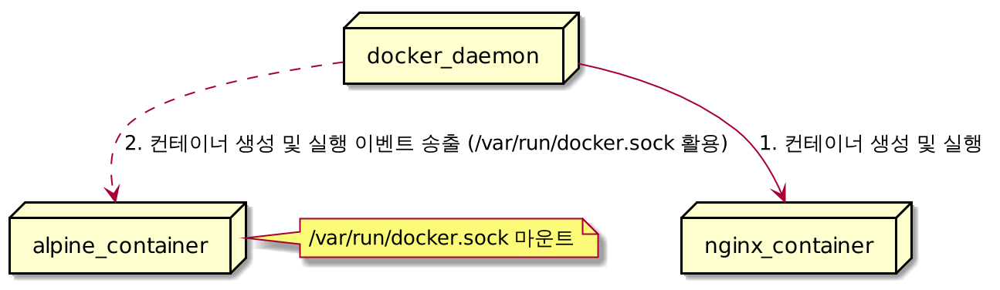

# Docker Tips: `/var/run/docker.sock`에 대하여

- 이 글은 [Docker Tips: about /var/run/docker.sock](https://medium.com/better-programming/about-var-run-docker-sock-3bfd276e12fd) 를 번역하였습니다. 


Docker Hub에서 컨테이너를 실행해본 경험이 있다면 일부 컨테이너에서 `/var/run/docker.sock` 파일을 바인드 마운트(bind mount)하는 것을 본 적이 있을 것입니다. 이 파일은 무엇이고 왜 특정 컨테이너에서만 사용되는 것일까요? 간단한 답은 이것입니다: Docker daemon이 기본적으로 수신(listen)하고 있는 Unix socket이고 컨테이너 내부에서 Docker daemon과 통신하는 데에 사용됩니다.  
* 역주: 여기서 바인드 마운트(bind mount, 이하 마운트)란 도커 컨테이너 실행시 `-v ${source}:${target}`과 같이 특정 볼륨을 컨테이너에 연결하는 것을 의미합니다.

---

Docker host 혹은 Docker Swarm cluster의 관리도구(manager interface) 오픈소스인 [Portainer](https://www.portainer.io/)을 살펴보겠습니다. 로컬 Docker host를 관리하기 위한 Portainer를 실행하는 방법은 다음과 같으며, 실행시 host Docker의 Unix socket을 마운트합니다.

```bash
docker container run -d -p 9000:9000 -v /var/run/docker.sock:/var/run/docker.sock portainer/portainer:latest
```

이제 Portainer에 9000 포트를 통해서 접속하여 컨테이너, 이미지, 볼륨 등을 관리할 수 있게 됩니다.
* 역주: 여기서의 관리란 도커 관련 자원의 생성, 삭제, 변경 작업을 의미합니다.


이러한 관리작업을 수행하기 위해서는 Portainer와 로컬 Docker daemon과 마운트된 `/var/run/docker.sock` 파일을 매개로 통신할 수 있어야 합니다.

## Docker Daemon API
Docker를 호스트에 설치하였을 때, Docker를 daemon은 기본적으로 `/var/run/docker.sock` Unix socket을 통해서 이벤트를 수신합니다. 이는 Docker daemon의 다음 옵션을 통해서 확인할 수 있습니다.
```bash
-H unix:///var/run/docker.sock
```
> Note: 다른 `-H` 추가하여 Docker daemon은 tcp host/port 혹은 다른 Unix socket을 통하여 이벤트를 수신할 수 있습니다.

모든 HTTP 엔드포인드는 [Docker engine API](https://docs.docker.com/engine/api/v1.41/) 에 정의되어 있고, `/var/run/docker.sock`을 통해서 요청을 받을 수 있습니다.
* 역주: 원문의 Docker engine API는 v1.27 버전 기준으로 작성되었으나 2021년 2월 기준으로 Docker engine API의 latest 버전은 [v1.41](https://docs.docker.com/engine/api/v1.41/) 이며 아래의 모든 예제는 v1.41로 동작하는 것을 확인하였습니다.  

### 컨테이너 생성
Portainer UI를 통해서 우리는 쉽게 컨테이너를 실행할 수 있습니다. 그러나 내부적으로는 HTTP 요청은 `docker.sock`을 통해서 Docker daemon으로 전달됩니다. Docker engine API에 [curl](https://curl.se/) 을 활용하여 Nginx 컨테이너 생성을 요청하는 예제를 통해서 좀 더 자세히 살펴보겠습니다. 

> Note: HTTP API하여 컨테이너를 실행하기 위해서는 2개의 작업으로 나누어서 진행해야합니다: 먼저 컨테이너를 생성한 후에 컨테이너를 시작할 수 있씁니다.  
* 역주: `docker run` 명령어는 `docker create`와 `docker start`를 동시에 수행하는 명령어이지만 HTTP API를 사용할 경우 `docker create`와 `docker start`를 나누어서 수행해야합니다.


#### Nginx 컨테이너 생성
아래의 명령어는 `curl` 명령어를 통해서 `{"Image": "nginx"}` 전송 데이터(payload)를 unix socket을 통해서 Docker daemon의 `/containers/create` 엔드포인트(endpoint)에 전달합니다. 이 명령어는 Nginx 기반의 컨테이너를 생성하고 컨테이너 ID를 반환합니다.
* 역주: 여기서 Nginx 기반의 컨테이너란 Nginx Docker image를 기반으로 생성된 컨테이너를 의미합니다. 모든 컨테이너는 image를 기반으로 생성됩니다.

```bash
> curl -XPOST --unix-socket /var/run/docker.sock -d '{"Image":"nginx"}' -H 'Content-Type: application/json' http://localhost/containers/create
{"Id":"85956c99d45b2310e2da8284997ceb377daf67f651ea59eae552d32dff17812d","Warnings":[]}
```

* 역주: `docker ps -a` 명령어를 통해서 컨테이너가 생성만 되고 실행되지 않은 것을 확인할 수 있습니다.
```bash
> docker ps -a
CONTAINER ID   IMAGE     COMMAND                  CREATED              STATUS    PORTS     NAMES
85956c99d45b   nginx     "/docker-entrypoint.…"   About a minute ago   Created             elastic_ganguly
```

#### Nginx 컨테이너 시작
컨테이너 생성 요청의 결과로 반환된 ID를 활용하여 `/containers/<ID>/start` 엔드포인트에 컨테이너 실행 요청을 보낼 수 있습니다.
```bash
> curl -XPOST --unix-socket /var/run/docker.sock http://localhost/containers/85956c99d45b2310e2da8284997ceb377daf67f651ea59eae552d32dff17812d/start
```

이제 Nginx 컨테이너가 실행되고 있는지 확인할 수 있습니다.
```bash
> docker container ls
CONTAINER ID   IMAGE     COMMAND                  CREATED         STATUS         PORTS     NAMES
85956c99d45b   nginx     "/docker-entrypoint.…"   4 minutes ago   Up 4 seconds   80/tcp    elastic_ganguly
```

이 예시는 컨테이너가 Docker socket(`/var/run/docker.sock`)을 활용하여 어떻게 생성될 수 있는지를 보여줍니다. 물론 실제로는 `curl`을 사용하여 컨테이너를 생성하지는 않지만 그 원리는 이해할 수 있습니다.


## Docker daemon으로부터 이벤트 송출하기
Docker API는 `/events/` 엔드포인트를 통하여 Docker daemon이 생성하는 이벤트를 전부 송출(streaming)합니다. 예를 들어 컨테이너의 생성 혹은 삭제 이벤트를 전달받고 동적으로 설정을 업데이트 하는 용도로 로드 밸런서가 사용할 수 있습니다.

간단한 컨테이너를 실행하고 어떻게 우리가 도커 데몬 이벤트를 확인할 수 있는지 알아보겠습니다.

### Alpine 컨테이너 실행
아래의 명령어는 Alpine 컨테이너를 대화식(interactive) 모드로 실행하고 `docker.sock`을 바인드 마운트(bind mount)합니다.
* 역주: 여기서 Alpine 컨테이너란 가볍고 간단한, 보안성을 목적으로 개발한 리눅스 배포판인 Alpinx Linux를 기반으로 하는 컨테이너입니다.

```bash
docker run -v /var/run/docker.sock:/var/run/docker.sock -ti alpine sh
```

#### 도커 데몬의 이벤트 수신하기
Alpine 컨테이너 내에서 우리는 먼저 apk 패키지 매니저를 통해서 `curl`을 설치합니다.
```bash
apk update && apk add curl
```

Docker socket(`/var/run/docker.sock`)을 통해서 HTTP 요청을 `/events` 엔드포인트에 보낼 수 있습니다. 이 명령어는 별도의 응답이 없으며(hang on) 새로운 이벤트가 Docker daemon으로부터 수신되기를 기다립니다. Docker daemon은 새로운 이벤트가 발생할 때마다 송출(straeming)을 진행할 것입니다.

```bash
curl --unix-socket /var/run/docker.sock http://localhost/events
```

### 이벤트 관찰하기
새로운 Nginx 기반의 컨테이너를 생성하고 Alpine 컨테이너의 표준출력(standard ouput)을 통해서 Docker daemon이 내보내는 이벤트를 관찰할 수 있습니다.

```bash
docker container run -p 8080:80 -d nginx
```

이 요청을 통해서 발생된 이벤트는 다음과 같이 확인할 수 있습니다.
```bash
curl --unix-socket /var/run/docker.sock http://localhost
t/events
{
   "status":"create",
   "id":"ce3ffa672cc532b13f939f1a013941587e99d97cde1bffebb10e8560848048d7",
   "from":"nginx",
   "Type":"container",
   "Action":"create",
   "Actor":{
      "ID":"ce3ffa672cc532b13f939f1a013941587e99d97cde1bffebb10e8560848048d7",
      "Attributes":{
         "image":"nginx",
         "maintainer":"NGINX Docker Maintainers \u003cdocker-maint@nginx.com\u003e",
         "name":"flamboyant_bouman"
      }
   },
   "scope":"local",
   "time":1613045560,
   "timeNano":1613045560484793084
}
{
   "Type":"network",
   "Action":"connect",
   "Actor":{
      "ID":"615a314a7946b603a2a7ebc3365f59e9a10aad1ba44d2f2902808251dba95411",
      "Attributes":{
         "container":"ce3ffa672cc532b13f939f1a013941587e99d97cde1bffebb10e8560848048d7",
         "name":"bridge",
         "type":"bridge"
      }
   },
   "scope":"local",
   "time":1613045560,
   "timeNano":1613045560558316202
}
{
   "status":"start",
   "id":"ce3ffa672cc532b13f939f1a013941587e99d97cde1bffebb10e8560848048d7",
   "from":"nginx",
   "Type":"container",
   "Action":"start",
   "Actor":{
      "ID":"ce3ffa672cc532b13f939f1a013941587e99d97cde1bffebb10e8560848048d7",
      "Attributes":{
         "image":"nginx",
         "maintainer":"NGINX Docker Maintainers \u003cdocker-maint@nginx.com\u003e",
         "name":"flamboyant_bouman"
      }
   },
   "scope":"local",
   "time":1613045560,
   "timeNano":1613045560861523597
}
```

여기서 세 가지의 이벤트를 확인할 수 있습니다:
1. 컨테이너 생성(create)
2. default bridge network에 컨테이너 연결(connect)
3. 컨테이너 시작(start)

* 역주: 위의 이벤트를 도식화하면 다음과 같습니다.


## 요약
이 글이 `/var/run/docker.sock` 파일과 이 파일의 마운트가 컨테이너에서 어떻게 사용될 수 있는지에 대해 좋은 설명이 되었기를 바랍니다. 물론 실제 어플리케이션은 `curl`을 사용하기 보다는 특정 라이브러리를 활용하여 HTTP 요청을 보낼 것입니다.

Note: Docker daemon socket(`/var/run/docker.sock`)을 마운트하는 것은 컨테이너에게 큰 권한(power)을 제공합니다. 따라서 주의하여 사용해야 하고 반드시 신뢰할 수 있는 컨테이너에서만 사용해야 합니다.


## 참고
- [var/run/docker.sock](https://www.educative.io/edpresso/var-run-dockersock)
  
- [dockered](https://docs.docker.com/engine/reference/commandline/dockerd/)
- [Can anyone explain docker.sock](https://stackoverflow.com/questions/35110146/can-anyone-explain-docker-sock/35110344)

