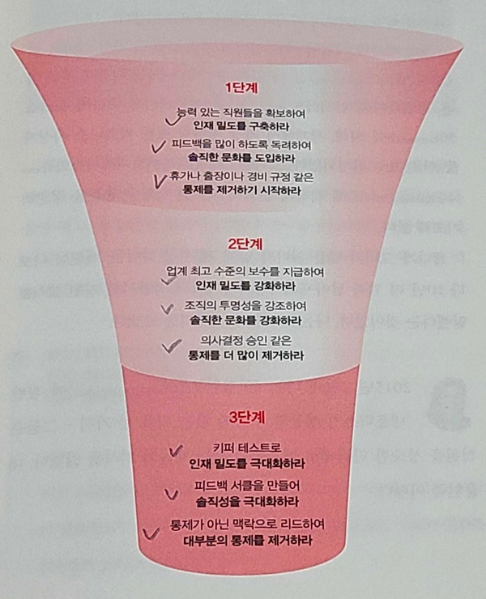

# 무중단 배포 전략

배포란 "빌드가 완성된 실행 가능한 파일을 사용자가 접근할 수 있는 환경에 배치시키는 일"이다.

무중단 배포란 서버를 실제로 서비스할 때 서비스적 장애와 배포에 있어서 부담감을 최소화할 수 있게끔 서비스가 중단되지 않고도 코드를 배포할 수 있는 기술이다.

무중단 배포의 반대는 중단 배포이다. 가끔 어떤 홈페이지 접속하면 작업중이니 사이트 이용이 불가하다는 안내창을 본 적이 있을 것이다. 장애상황일 수도 있겠지만 배포의 관점에서 보면 중단 배포 현상으로 볼 수 있다.

생각보다 무중단 작업은 우리의 일상생활에 깊숙히 스며들어 있다.

위의 사진은 도로공사 현장이다. 자동차를 사용자의 요청이라고 한다면 공사(업데이트)중인 상황에서도 요청을 받을 수 있는 받을 수 있다. 도로에는 항상 일정한 트래픽이 보장되어야 하기 때문에 무중단으로 작업해야하는 것이다.

운영환경에서 서버는 장애상황을 대비하여 이중화가 되어 있다. 

서버 이중화란 로드밸런서를 앞에 두고 한 대 이상의 동일한 서버가 트래픽을 분산하는 것을 말한다. 

## Rolling Updates

구 버전에서 신 버전으로 하나씩 교체하는 방식
롤백이 느리다.

## Blue/Green 

구 버전과 신 버전을 동시에 배포한 상태에서 "일제히" 신 버전을 바라보게 하는 방식
롤백이 빠르지만 시스템 자원이 최소 두배 이상 필요하다.

`Red/Black` 배포라고도 불린다.

## Canary

새로운 버전이 운영환경에 적합한지 시험하는 배포 전략. 카나리 버전에 일부의 트래픽을 주어서 검증후에 트래픽을 늘려서 업데이트가 가능하다.

## A/B Testing 
배포 전략이라기 보다는 테스트이다. 새로운 버전이 사용자에 어떠한 반응을 유도하는지 테스트하기 위한 테스팅 방법론.
카나리 배포와 유사하나 목적이 사용자 테스트에 있는 것이기 때문에 배포전략이라기 보다는 테스팅 방법론이라고 보아야 한다.

## 참고
- https://blog.christianposta.com/deploy/blue-green-deployments-a-b-testing-and-canary-releases/
- https://thefif19wlsvy.tistory.com/22
- https://reference-m1.tistory.com/211
- https://jason-lim.tistory.com/3
- https://itwiki.kr/w/%EC%B9%B4%EB%82%98%EB%A6%AC_%EB%B0%B0%ED%8F%AC

