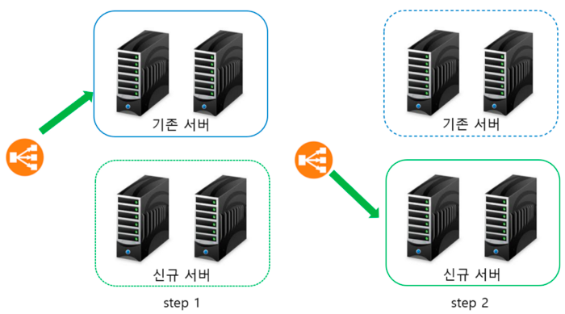

# 도커를 활용한 무중단 배포 (2) - Blue/Green

[도커를 활용한 Rolling Updates 무중단 배포](./2021-02-25-docker-non-stop-deploy-rolling-updates.md)에 이어서 이번에는 Blue/Green 배포를 구현해보겠습니다.

## 준비사항
1. 본인의 환경에 맞추어서 [docker-compose](https://docs.docker.com/compose/install/) 명령어를 설치합니다.
2. 프로젝트 폴더를 생성하고 아래와 같이 `docker-compose.yml`, `nginx.conf` 파일을 생성합니다.
```
docker-non-stop-deploy
├── docker-compose.yml
└── proxy
    └── nginx.conf
```
3. `docker-compose.yml` 파일을 작성합니다.
- nginx와 app 서비스(컨테이너)로 구성합니다.
- nginx만 클라이언트에서 접근할 수 있게 포트가 노출되어 있고 app은 nginx을 통해서 로드밸런싱된 트래픽을 수신합니다.
- app 이미지로 [bithavoc/hello-world-env](https://github.com/bithavoc/hello-world-env) 를 사용합니다. 실제로는 어플리케이션 서버가 사용되겠지만 예시를 단순화하기 위해서 간단한 이미지를 사용하였습니다. app 서비스에 `GET /`으로 요청을 보낼 경우 `Hi there, I love ! ${MESSAGE}`와 같이 환경변수 `MESSAGE`가 응답본문에 나타납니다. 환경변수를 변경하는 작업으로 버전 업그레이드를 표현하겠습니다.
- [bithavoc/hello-world-env](https://github.com/bithavoc/hello-world-env) 어플리케이션은 기본적으로 3000번 포트로 기동됩니다.
```yml
version: '3.8'
services:
  # nginx
  nginx:
    image: nginx:latest
    container_name: nginx
    ports:
      - "80:80"
    volumes:
      - ./proxy/nginx.conf:/etc/nginx/nginx.conf
  # nginx을 통해서 로드밸런싱되는 app
  # 기동시 3000번 포트로 listen
  app1:
    image: bithavoc/hello-world-env
    environment:
      - 'MESSAGE=app1,v1'
  app2:
    image: bithavoc/hello-world-env
    environment:
      - 'MESSAGE=app2,v1'
```
4. nginx의 설정 파일인 `nginx.conf`를 작성합니다.
- 설정 수정 후 `service nginx reload` 명령어를 실행하면 nginx을 중단하지 않고 설정을 반영 할 수 있습니다.
- `listen 80`, `location /`을 통해서 요청을 받고 `proxy_pass` 설정을 통해서 `upstream` 부분에 정의된 서비스에 로드밸런싱을 진행합니다.
```
user  nginx;
worker_processes  1;

error_log  /var/log/nginx/error.log warn;
pid        /var/run/nginx.pid;

events {
    worker_connections  1024;
}

http {
    include       /etc/nginx/mime.types;
    default_type  application/octet-stream;
    # load balancing
    upstream apps {
        server app1:3000;
        server app2:3000;
    }
    server {
        listen 80;
        server_name localhost;
        location / {
            # proxy pass
            proxy_pass http://apps;
            proxy_http_version 1.1;
            proxy_redirect off;
            proxy_set_header X-Real-IP $remote_addr;
            proxy_set_header X-Forwarded-For $proxy_add_x_forwarded_for;
            proxy_set_header Upgrade $http_upgrade;
            proxy_set_header Connection 'upgrade';
            proxy_set_header Host $host;
            proxy_cache_bypass $http_upgrade;
        }
    }
    log_format main '$remote_addr - $remote_user [$time_local] "$request" '
                      '$status $body_bytes_sent "$http_referer" '
                      '"$http_user_agent" "$http_x_forwarded_for"';
    access_log /var/log/nginx/access.log  main;
    sendfile on;
    keepalive_timeout 65;
    include /etc/nginx/conf.d/*.conf;
}
```
5. 요청을 지속적으로 날릴 `request.sh`를 작성합니다.
- 이 스크립트를 실행해 놓으면 지속적으로 응답을 하는지 확인할 수 있습니다.
- `sleep` 부분을 수정하여 요청주기를 변경할 수 있습니다.
```shell
#!/bin/bash
while true; do curl localhost:80; echo ""; sleep 1; done
```

## Blue/Green 배포

- 출처: [Nginx, Docker를 활용한 무중단 배포맛보기](https://medium.com/sjk5766/nginx-docker%EB%A5%BC-%ED%99%9C%EC%9A%A9%ED%95%9C-%EB%AC%B4%EC%A4%91%EB%8B%A8-%EB%B0%B0%ED%8F%AC%EB%A7%9B%EB%B3%B4%EA%B8%B0-8b4f8571ab24)

Blue/Green 배포란 두 버전을 모두 올리고 요청을 라우터(로드밸런서)에서 중계하여 새 버전으로 옮기는 전략입니다.

Blue/Green 배포의 핵심은 두 버전을 모두 올리는 것입니다. 구버전에서 신버전으로 전환할 때 한 번에 전환하거나 서서히 트래픽을 변경하는 것은 각자의 선택입니다.

이로 인해서 다른 Rolling Updates와 다르게 신규 버전 배포시 인프라 자원이 2배 이상 필요합니다.

[Red/Black 배포라고 불리는 경우가 있으나 같은 의미입니다.](https://octopus.com/blog/blue-green-red-black)

Blue/Green 배포는 다음의 순서로 진행됩니다.
- step1: 배포 전 상태입니다. 기존 서버 2대가 로드밸런서 뒤에서 동작합니다. 배포가 완료된 신규 서버를 준비합니다.
- step2: 배포 할 신규 서버가 준비되면 신규 서버를 로드밸런서에 추가하고 기존 서버를 로드밸런서에서 제거합니다.
- 여기서 `서버=서비스(컨테이너)`로 가정합니다.

### 준비
nginx와 v1인 app1, app2를 실행합니다.
```bash
> docker-compose up -d nginx app1 app2 
Creating nginx ... 
Creating docker-non-stop-deploy_app1_1 ... 
Creating docker-non-stop-deploy_app2_1 ... done
```
다른 터미널을 열어서 `request.sh`를 실행합니다. 연결된 app1, app2에서 v1 응답이 오는 것을 확인할 수 있습니다.
```shell
Hi there, I love ! app1,v1
Hi there, I love ! app2,v1
Hi there, I love ! app1,v1
Hi there, I love ! app2,v1
```

### Step 1
docker-compose.yml 파일에 신규버전 v2인 app3와 app4를 추가합니다.
```yaml
# 생략
  app1:
    image: bithavoc/hello-world-env
    environment:
      - 'MESSAGE=app1,v1'
  app2:
    image: bithavoc/hello-world-env
    environment:
      - 'MESSAGE=app2,v1'
  app3:
    image: bithavoc/hello-world-env
    environment:
      - 'MESSAGE=app3,v2'
  app4:
    image: bithavoc/hello-world-env
    environment:
      - 'MESSAGE=app4,v2'
```
docker-compose 명령어로 app3, app4만 실행합니다.
```bash
docker-compose up -d app3 app4
Creating docker-non-stop-deploy_app3_1 ... done
Creating docker-non-stop-deploy_app4_1 ... done
```
`docker-compose ps`로 조회를 해보면 app1~4까지 실행된 것을 볼 수 있다.
```bash
> docker-compose ps
            Name                           Command               State         Ports       
-------------------------------------------------------------------------------------------
docker-non-stop-deploy_app1_1   /root/app                        Up                        
docker-non-stop-deploy_app2_1   /root/app                        Up                        
docker-non-stop-deploy_app3_1   /root/app                        Up                        
docker-non-stop-deploy_app4_1   /root/app                        Up                        
nginx                           /docker-entrypoint.sh ngin ...   Up      0.0.0.0:80->80/tcp                                
```
그러나 요청은 여전히 v1인 app1, app2에서만 온다. 그 이유는 nginx에 app1~2만 연결되었기 때문입니다.
```bash
Hi there, I love ! app1,v1
Hi there, I love ! app2,v1
```

### Step 2
nginx.conf 파일을 다음과 같이 수정하여 v2인 app3~4를 바라보도록 수정합니다.
```
# 생략
    # 기존
    upstream apps {
        # v1
        server app1:3000 down;
        server app2:3000 down;
        # v2
        server app3:3000;
        server app4:3000;
    }
# 생략
```

nginx에 무중단 리로드 명령을 보냅니다.
```bash
> docker-compose exec nginx service nginx reload
[ ok ] Reloading nginx: nginx.
```

이제 app3~4에서 v2 응답이 오는 것을 확인할 수 있습니다.
```
Hi there, I love ! app3,v2
Hi there, I love ! app4,v2
```

v2 응답이 잘 나오는 것을 확인하면 기존 v1인 app1 app2를 내립니다.
(물론 자원이 넉넉하면 내리지 않아도 됩니다.)
```bash
> docker-compose rm -s app1 app2
Going to remove docker-non-stop-deploy_app1_1, docker-non-stop-deploy_app2_1
Are you sure? [yN] y
Removing docker-non-stop-deploy_app1_1 ... done
Removing docker-non-stop-deploy_app2_1 ... done
```

`docker-compose ps` 명령어로 현재 nginx, app3, app4만 떠 있는 것을 확인할 수 있습니다.
```bash
> docker-compose ps
Name                           Command               State         Ports
-------------------------------------------------------------------------------------------
docker-non-stop-deploy_app3_1   /root/app                        Up                        
docker-non-stop-deploy_app4_1   /root/app                        Up                        
nginx                           /docker-entrypoint.sh ngin ...   Up      0.0.0.0:80->80/tc
```

### Rollback
물론 예상치 못하게 v2 버전에 버그가 있거나 예상과는 다르게 응답에 이상이 있을 수 있습니다.

그렇다면 다음과 같이 nginx.conf를 수정하여 다시 app1,app2를 바라보고 v1으로 롤백할 수 있습니다.
(app1,app2 서비스를 내렸다면 `docker-compose up -d app1 app1`으로 다시 기동해야 합니다)

nginx.conf에서 구 버전을 바라보도록 다음과 같이 수정합니다.
(혹은 수정하기 전의 파일을 백업했다가 이름을 바꾸어서 재활용할 수 있습니다.)
```
# 생략
  upstream apps {
    # v1
    server app1:3000;
    server app2:3000;
    # v2
    server app3:3000 down;
    server app4:3000 down;
  }
# 생략
```
nginx에 무중단 리로드 명령을 보냅니다.
```bash
> docker-compose exec nginx service nginx reload
[ ok ] Reloading nginx: nginx.
```

다시 app1~2에서 v1 응답이 오는 것을 확인할 수 있습니다.
```
Hi there, I love ! app1,v1
Hi there, I love ! app2,v1
```

위와 같이 신규 버전으로 트래픽이 일제히 전환된 후에 중대한 결함이 발견되는 경우가 있습니다.

이러한 상황을 방지하고자 신규 버전으로 한번에 트래픽을 전환하기 보다는 중간에 아래와 같이 기존 버전과 신규 버전이 동시에 서비스되는 구간을 두고 v1, v2 모두 응답을 받다가 v1을 내리는 방법도 있습니다.
```
# 생략
  upstream apps {
    # v1
    server app1:3000;
    server app2:3000;
    # v2
    server app3:3000;
    server app4:3000;
  }
# 생략
```

## 참고
- [Nginx, Docker를 활용한 무중단 배포맛보기](https://medium.com/sjk5766/nginx-docker%EB%A5%BC-%ED%99%9C%EC%9A%A9%ED%95%9C-%EB%AC%B4%EC%A4%91%EB%8B%A8-%EB%B0%B0%ED%8F%AC%EB%A7%9B%EB%B3%B4%EA%B8%B0-8b4f8571ab24)
- [Docker-compose로 Node Express 환경 구축하기](https://medium.com/sjk5766/docker-compose%EB%A1%9C-node-express-%ED%99%98%EA%B2%BD-%EA%B5%AC%EC%B6%95%ED%95%98%EA%B8%B0-7c9ab4544172)
- [hello-world-env docker image](https://github.com/bithavoc/hello-world-env)

