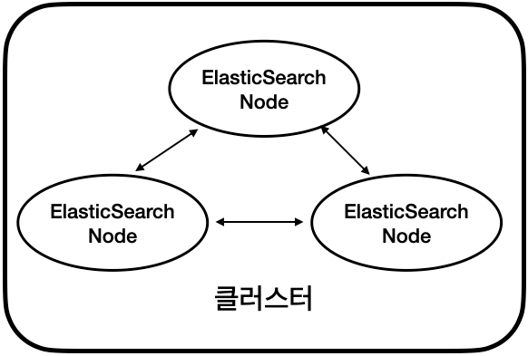
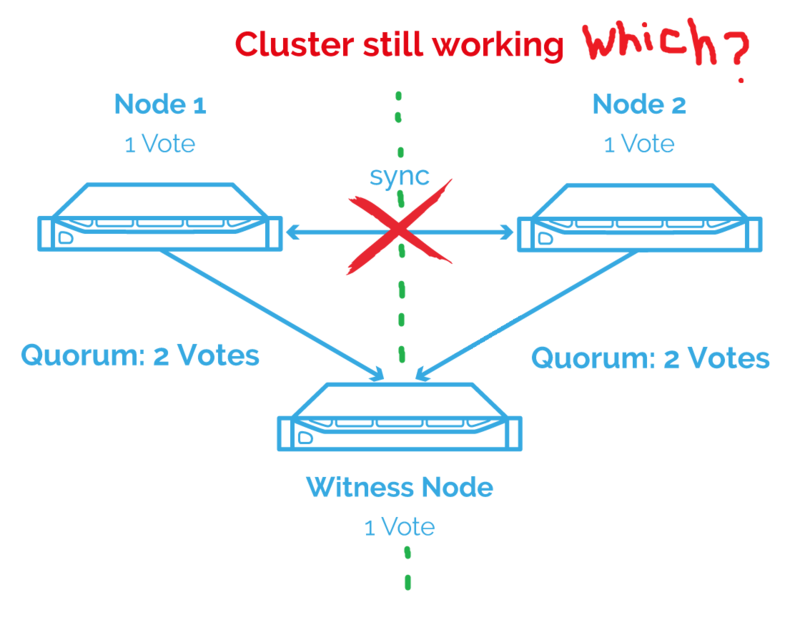
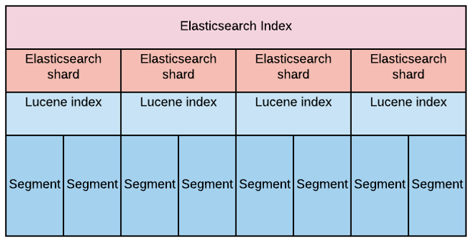
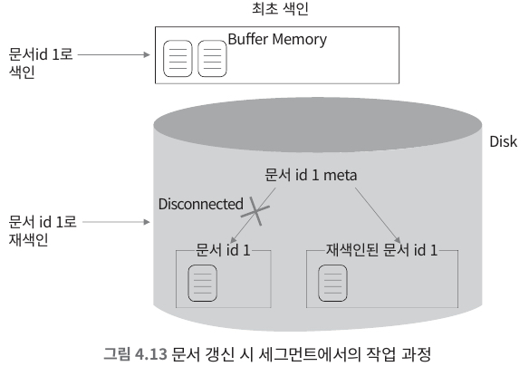
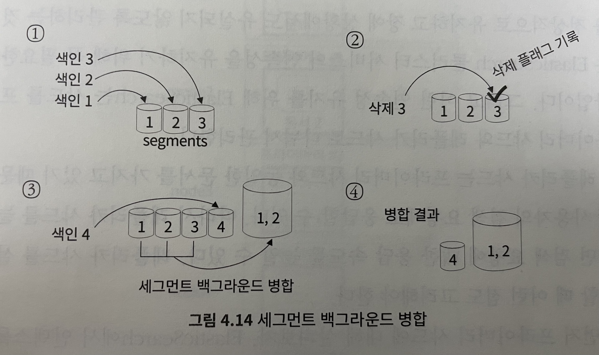
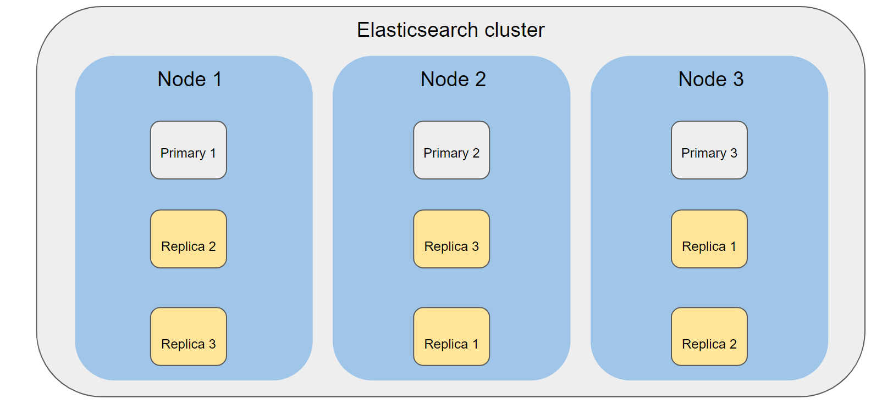

# Elasticsearch를 구성하는 기본 개념  

## 1. 클러스터와 노드의 의미

- 클러스터와 노드
  - 클러스터(cluster): 여러 대의 컴퓨터 혹은 구성 요소들을 논리적으로 결합하여 전체를 하나의 컴퓨터, 혹은 하나의 구성 요소처럼 사용하 수 있게 해주는 기술. 여러 개의 Elasticsearch를 하나의 Elasticsearch 처럼 동작하게 함.
  - 노드(node): 클러스터를 구성하는 하나의 Elasticsearch 프로세스
- 3개 이상의 노드로 구성해야 고가용성(High Availability)를 보장받을 수 있음
  - 홀수로 구성해야 split brain 문제를 방지할 수 있음
  - split brain은 마스터 후보 노드(master eligible node) 사이의 네트워크가 단절되었을 때 각 마스터 후보 노드가 마스터 노드로 승격하여 두 개의 클러스터로 나뉘어 독립적으로 동작하는 현상 ~~(누가 여기 짱이야!?)~~

- 각 노드는 하나 이상의 역할을 가질 수 있음

| 노드 역할 | 설명 |
| --- | --- |
| 마스터(Master) | 클러스터 구성에서 중심이 되는 노드. 클러스터의 상태 등 메타 데이터 관리. 실제 마스터 노드는 1개이고 나머진 마스터 후보 노드이다. |
| 데이터(Data) | 문서를 저장하는 노드. 검색 요청 처리 |
| 인제스트(Ingest) | 문서가 저장되기 전 문서 내용을 전처리하는 노드 |
| 코디네이트(Coordinate) | 사용자의 요청을 데이터 노드로 전달하고 다시 데이터 노드로부터 결과를 취합하는 노드 |
- 이외에도 [여러가지 역할](https://www.elastic.co/guide/en/elasticsearch/reference/current/modules-node.html#node-roles) 이 있지만 검색엔진과 관련이 있는 기본적인 역할만 나열

## 2. 인덱스와 타입
- Elasticsearch와 RDBMS 비교
  - Elasticsearch와 6.x 이후로는 1개의 인덱스에 1개의 타입(`_doc)만 허용
  - 인덱스명이 같을 경우 서로 다른 타입의 문서가 검색될 수 있기 때문

|Elasticsearch | RDBMS|
|--- | ---|
|인덱스 | 데이터베이스|
|타입 | 테이블|

## 3. 샤드와 세그먼트
- 샤드와 세그먼트의 관계

- 샤드: 인덱스에 색인되는 문서들이 저장되는 '논리적'인 공간
- 세그먼트: 샤드의 데이터들을 가지고 있는 '물리적'인 파일
  - 세그먼트는 불변의 특성을 가짐
  - Elasticsearch에서 update/delete는 실제로 데이터롤 변경/삭제하는 것이 아니라 기존 데이터를 불용처리를 하는 것

  - 삭제하지 않고 불용처리하기 때문에 세그먼트의 크기는 커짐
  - 백그라운드에서 세그먼트를 병합(merge)하고 불용처리한 데이터를 삭제 (세그먼트 병합 작업)

    

## 4. 프라이머리 샤드와 레플리카 샤드
- 프라이머리 샤드(Primary Shard): 원본 샤드
  - 한 번 정하면 변경 불가
  - 변경하려면 reindex(=인덱스를 다시 생성하거나 복사) 해야 함
  - ex) 3으로 설정할 경우 3개로 나누어서 저장
- 레플리카 샤드(Replica Shard): 복제본 샤드
  - 운영 중에도 변경 가능
  - ex) 1로 설정할 경우 원본에 추가로 복제본 1개를 생성 (원본+복제본=총2개)
```bash
PUT /${index-name}/_settings
{
  "index" : {
    "number_of_shards" : 3 # 인덱스 생성 후에는 변경 불가 
    "number_of_replicas" : 2 # 인덱스 생성 후에도 변경 가능
  }
}
```
- 위와 같이 실행시 아래와 같은 형태로 인덱스의 샤드 설정이 적용됨 

- 문서가 들어갈 샤드 결정 방법
```yaml
프라이머리 샤드 번호 = Hash(문서의 id) % 프라이머리 샤드 개수
```
- 장애 복구를 위해 위와 같이 프라이머리와 레플리카는 다른 노드에 저장
- 장애 발생시 레플리카가 프라이머리로 승격되고 새로운 레플리카를 생성

## 5. 매핑
- [Elasticsearch 데이터 타입의 종류](https://www.elastic.co/guide/en/elasticsearch/reference/current/mapping-types.html)

| 코어 데이터 타입 | 설명 | 종류 |
| --- | --- | --- |
| String | 문자열 데이터 타입 | text, keyword |
| Numeric | 숫자형 데이터 타입 | long, integer, short, byte, double, float, half\_float, scaled\_float |
| Date | 날짜형 데이터 타입 | date |
| Boolean | 불 데이터 타입 | boolean |
| Binary | 바이너리 데이터 타입 | binary |
| Range | 범주 데이터 타입 | integer\_range, float\_range, long\_range, double\_range, date\_range |

- 매핑(Mapping): Elasticsearch에 저장될 JSON 문서들이 어떤 키와 어떤 데이터 타입으로 저장될지 정의한 것. RDBMS의 스키마와 유사.
  - 정적 매핑(Explicit Mapping): 미리 데이터 타입을 정의하고 인덱스를 사용하는 것. ~~(규칙은 내가 정한다.)~~
    - 인입되는 문서의 데이터 타입이 예측 가능하거나 엄격하게 제한하고 싶을 경우
    - 다음과 같이 정적 매핑 설정 가능
```bash
PUT /${index-name}
{
  "mappings": {
    "properties": {
      "age":    { "type": "integer" },  
      "email":  { "type": "keyword"  }, 
      "name":   { "type": "text"  }     
    }
  }
}
```
  - 동적 매핑(Dynamic Mapping): 데이터 타입을 정의하지 않고 색인(인입)시 데이터 타입을 결정하는 것. ~~(아몰랑~ 일단 데이터 넣고 생각해볼래~)~~
    - 인입되는 문서의 데이터 타입의 필드의 예측이 어려울 때. ~~(혹은 귀찮을 때?)~~ 
  - 정적 매핑이 동적 매핑보다 색인 성능이 더 좋다. (데이터 인입에 소요되는 시간이 더 적다.)

## 참고
- [기초부터 다지는 ElasticSearch 운영 노하우](http://www.yes24.com/Product/Goods/96520155)
- [Elasticsearch 공식 문서](https://www.elastic.co/guide/en/elasticsearch/reference/current/index.html)