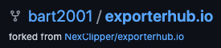
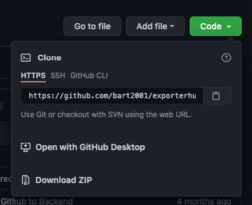
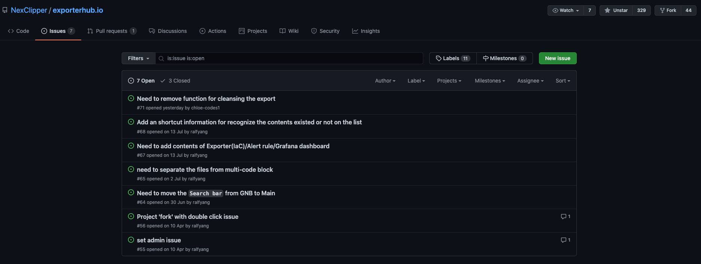
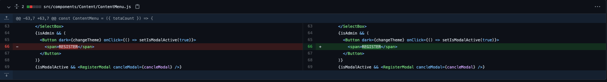
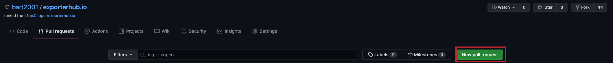
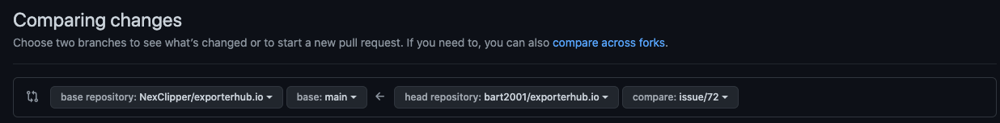
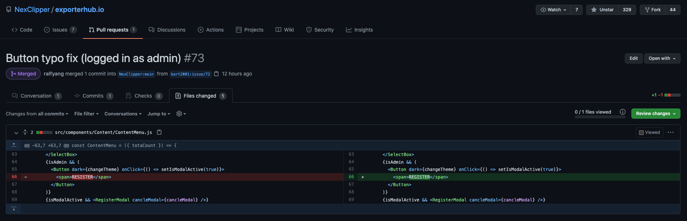

# 야, 너두 오픈소스 기여할 수 있어 (feat. 야나두)

> 💡 이 글은 오픈소스 기여 활동을 폄하하거나 희화하하려는 목적이 아니라 오픈소스 기여 활동에 좀 더 쉽게 다가갈 수 있도록 그 과정을 단순화하여 작성한 글입니다.

## 오픈소스 생태계와 기여
우리는 현재 오픈소스의 혜택을 받는 시대에 살고 있습니다. 소프트웨어 개발 경력이 쌓일수록 그리고 오픈소스 생태계와 가까워질수록 자주 듣거나 하는 말이 있이 있습니다.

> 오픈소스에 기여하자. ~~(유튜브 시작하자.)~~

[물론 사람마다 오픈소스에 기여하려는 이유는 다양합니다.](https://haksung.gitbook.io/oss/research/contribution/why-devoloper-contribute)

실력을 향상시키거나 평판/경력을 키울 목적으로 할 수도 있고 다른 사람들과 교류하기 위해서 참여할 수 있습니다.

아니면 단순히 개발이 즐겁고 오픈소스 세계가 흥미로워서 기여하는 사람도 있습니다.

그 동기가 무엇이 되었든 오픈소스 생태계 발전에 기여한다는 것은 매우 칭찬 받을 일이자 개인의 발전에도 도움이 되는 활동입니다.

## 오픈소스 기여의 장벽
'오픈소스 기여'라고 검색하면 다음과 같은 결과가 나옵니다.

좋았어! 시작해보자...

일단 오픈소스 기여를 위해서 필요한 사전지식과 기여할 수 있는 방법들이 검색 결과로 나옵니다.

일단 git을 공부해야 한다고 나오고 github에서 가장 많은 오픈소스 프로젝트가 진행되고 있으니 github에 익숙해져야 한다고 나옵니다.

그리고 웬만한 오픈소스들은 영어로 되어 있으니 영어 공부를 하면 됩니다... 하아...

물론 앞서 언급한 사전지식과 기여방법은 오픈소스 기여활동을 하는 데에 중요한 지침이 되지만 원론적인 사례가 많다고 생각합니다.

좀 과장하면 지구를 지키기 위해서 길에 있는 쓰레기 좀 줍고 분리수거를 잘 하는 걸로 시작하고 싶은데 마치 기후변화나 환경생태학과 관련된 자료를 찾아봐야할 것 같은 느낌입니다.

그래서 이번 [2021 오픈소스 컨트리뷰션 아카데미](https://contributionacademy.oopy.io/)에 참여하면서 배운 오픈소스 기여 방법과 생애 최초(?)로 github로 오픈소스에 기여한 경험을 공유하여 좀 쉽게 풀어내고자 합니다. ~~(오픈소스 기여한 썰 푼다.)~~ 

저도 했으니깐... 여러분도...

야, 너두 할 수 있어

## 오픈소스를 위한 최소한의 GitHub 사전 지식
### 기능
- Fork: 다른 사람의 원격 저장소를 그대로 복사해 내 계정의 원격 저장소로 만드는 것을 의미. ~~🍴Fork로 집어 간다.~~
- Issue: 버그 리포트, 기능 제안, 질문 등 프로젝트를 진행하면서 발생하는 모든 이슈
- Pull Request: 내 저장소의 변경 내용을 다른 사람의 저장소에 반영하도록 요청하는 것.

### 저장소

#### 원격 저장소 (Remote Repository)
- upstream: 오픈소스의 저장소
  - ex) https://github.com/NexClipper/exporterhub.io
- origin: 내가 fork한 오픈소스 저장소
  - ex) https://github.com/bart2001/exporterhub.io/tree/main
#### 로컬 저장소 (Local Repository)
- local: 내가 origin 저장소를 clone(원격 저장소를 로컬 저장소에 복제)한 후에 로컬에서 작업하는 저장소 

## 오픈소스 기여 방법
GitHub를 활용한 오픈소스 기여는 다음의 4단계로 이루어집니다.

## 1. Fork하기

관심이 있거나 기여하고 싶은 프로젝트(upstream)를 찾아서 우측의 `🍴Fork`로 내 계정의 원격 저장소(origin)로 복제합니다.

내가 fork한 저장소는 이렇게 표시됩니다.

마음에 드는 프로젝트다 싶으면 돈이 드는 것도 아니니 우측 상단의 ⭐Star를 눌러서 오픈소스 개발자에게 감사를 표시합니다. (~~구독 좋아요 알람설정까지~~)

(여러분은 이미 ⭐Star를 눌러준 것만 해도 오픈소스에 기여한 것입니다.)

우측 상단의 👁Watch를 누르면 본 프로젝트의 변경사항과 관련된 알림을 받을 수 있습니다.

대부분 처음 시작할 때 기여하고자 하는 오픈소스 프로젝트를 고르느라 시간을 많이 할애하는 것 같습니다.

(입사할 회사를 선택하거나 인생의 동반자를 찾는 것이 아닙니다...)

반드시 유명하고 규모가 큰 오픈소스일 필요도 없으니 너무 신중하지 않아도 됩니다.

(규모가 클수록 contributor와 issue가 너무 많고 프로젝트 구조를 파악하는 데에 오래 걸리기 때문에 처음에는 작은 프로젝트가 좋은 것 같습니다.)

언제든지 바꿀 수 있는 것이기 때문에 관심이 생기는 프로젝트면 일단 fork해서 들여다 보는 것을 추천합니다. 

나의 원격 저장소(origin)로 fork한 후에는 내가 원하는 대로 수정을 해도 본래의 저장소(upstream)에는 영향을 주지 않으니 마음껏 건드려보고 아니다 싶으면 저장소(origin)를 삭제하면 됩니다.

## 2. Issue 들여다보기
프로젝트는 fork했으면 이제 본격적으로 프로젝트를 들여다볼 차례입니다.

`Code`를 눌러서 나오는 저장소(origin) 주소를 git clone 명령어로 내려받거나 `Download ZIP`을 눌러서 나의 로컬에 내려받습니다.

프로젝트 메인에 있는 `README.md`을 통해서 어떠한 프로젝트인지 대략 파악합니다. 여유가 된다면 `contributing.md` 파일을 참고하여 오픈소스 기여할 수 있는 방법을 확인합니다.

영어라서 읽기 지루하면 본 프로젝트(upstream)로 가서 Issue를 확인합니다. Issue에는 오픈소스를 사용하면서 발생한 버그나 문제 혹은 제안하고 싶은 기능이나 개선사항들이 올라옵니다.

개발하는 것뿐만 아니라 사용하면서 생기는 질문도 Issue에 포함됩니다. 

(그리고 Issue를 작성하는 것 자체로도 오픈소스에 기여한 것입니다.)

여기 Issue를 들여다보는 것도 영어라서 어렵고 지루하다 싶으면 가장 쉽게 접근할 수 있는 오탈자 찾기를 진행합니다. (음?)

앞서 로컬에 clone한 프로젝트에서 오탈자가 있는지 찾아봅니다. 오탈자뿐만 아니라 들여쓰기가 이상한 곳을 수정하거나 어색한 표현을 바꾸는 것으로도 기여를 할 수 있습니다.

수정하고 싶은 파일을 GitHub에서 클릭하면 우측에 있는 🖊️(edit) 버튼을 눌러서 수정이 가능하며 git에 익숙할 경우 직접 파일을 수정하여 git commit & push로 내 원격 저장소(origin)에 반영합니다.

저는 버튼 텍스트의 오탈자를 찾아서 고쳤습니다... ㅎㅎ 

## 3. Pull Request
내 원격 저장소(origin)에서 반영을 했으면 메인 저장소(upstream)에 반영할 차례입니다.

메인 저장소(upstream)에 반영을 하기 위해서는 Pull Request(PR)을 작성해야합니다.

너에게 밥 말고 PR을 보낸다

먼저 나의 저장소(origin)에서 `Pull Request` 버튼을 누릅니다.

나의 저장소(origin)의 브랜치에서 PR을 받을 메인 저장소(upstream) 브랜치를 선택합니다.

저는 `bart2001/exporterhub.io` 저장소(origin)의 `issue/72` 브랜치에서 `NexClipper/exporterhub.io` 저장소(upstream)의 main 브랜치로 PR을 보냈습니다.

(PR을 받는 메인 저장소의 브랜치는 각 오픈소스의 가이드라인에 따라서 상이할 수 있습니다.)

이제 메인 저장소(upstream)의 Pull Request 메뉴를 클릭하면 작성한 PR을 확인할 수 있습니다.

PR 과정에서 오픈소스 메인테이너 혹은 다른 사람들이 여러가지 코멘트와 요구사항을 댓글로 작성할 수 있습니다. 

요구사항에 대해서 수정이 필요할 경우에는 PR을 진행하고 있는 나의 저장소(origin)의 브랜치(저의 경우는 `bart2001/exporterhub.io` 저장소의 `issue/72` 브랜치)에서 파일을 GitHub에서 수정하거나 변경된 파일을 git commit & push로 반영해주면 됩니다.

요구사항을 모두 충족했다면 오픈소스 메인테이너가 `Confirm Merge` 버튼을 누르고 드디어 메인 저장소(upstream)에 반영이 됩니다! 

무야호! Merged!

## 4. Fetch
하나의 오픈소스 프로젝트에는 여러 사람들이 기여합니다.

다시 말해서 내가 PR로 본 저장소(upstream)에 변경사항을 반영하는 것뿐만 아니라 다른 사람들의 PR에 의해서 나의 저장소(origin)와 본 저장소(upstream)의 형상은 계속 달라질 수 있습니다.

따라서 fetch 기능을 통해서 지속적으로 본 저장소(upstream)와 나의 저장소(origin)의 상태를 맞추어 주어야 나의 변경사항을 충돌없이 PR을 통해서 보낼 수 있습니다. 

나의 저장소(origin)의 우측에 있는 `🔄Fetch upstream`을 눌러서 본 저장소(upstream)와 나의 저장소(origin)의 상태를 맞추어 줍니다. 

물론 git 명령어가 익숙하다면 git fetch & merge 명령어로 동일하게 수행할 수 있습니다.

(여기서 충돌이 생기는 경우는 git에 대한 어느 정도의 이해가 필요하고 이 글의 범위를 벗어나므로 다루지는 않겠습니다.)

## 마무리
조금은 장난스럽게 표현한 감이 있지만 제가 오픈소스 프로젝트에 생애최초(?)로 기여한 경험을 짧게 공유하였습니다.

오해가 소지가 있을 것 같아서 다시 한 번 말씀드리면 오픈소스 기여가 단순히 오탈자를 찾아 고치는 행위는 아닙니다.

이 글을 통해서 오픈소스 프로젝트 기여가 어렵고 막연하다고 느끼지 않고 작은 개선사항부터 반영하는 것부터 시작할 수 있다는 것을 알아가셨으면 좋겠습니다.

(갑자기 마무리가 진지해져서 어색합니다.)  

## 참고
- [깃허브 오픈소스 프로젝트 참여하기](https://cselabnotes.com/kr/2021/03/26/46/)
- [오픈소스 입문을 위한 아주 구체적인 가이드](https://velog.io/@ppp3195/%EC%98%A4%ED%94%88%EC%86%8C%EC%8A%A4-%EC%9E%85%EB%AC%B8%EC%9D%84-%EC%9C%84%ED%95%9C-%EC%95%84%EC%A3%BC-%EA%B5%AC%EC%B2%B4%EC%A0%81%EC%9D%B8-%EA%B0%80%EC%9D%B4%EB%93%9C)
- [[Git] Fork를 이용해 외부 git 프로젝트 가져오기](https://ourcstory.tistory.com/131)