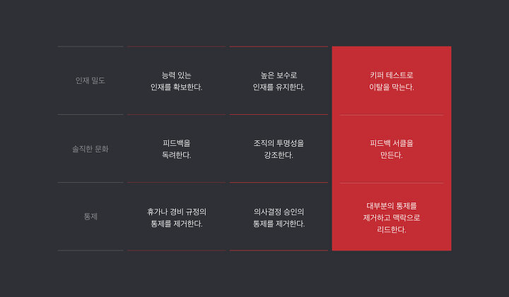

# 규칙 없음: 넷플릭스, 지구상 가장 빠르고 유연한 기업의 비밀 (No Rules Rules: Netflix and the Culture of Reinvention)

# 넷플릭스
넷플릭스를 모르는 사람은 없을 것이다. 넷플릭스는 전 세계 190개국 이상의, 2.1억 명의 회원을 보유한 스트리밍 엔터테인먼트 기업이다. 드라마 '하우스 오브 카드'로 상승세를 타기 시작하였고 한국에는 2016년 1월에 진출하였으며 최근에는 한국의 '오징어 게임'이 전 세계적으로 흥행을 하면서 큰 성과를 거두었다. ("Netflix and chil?~~(라면 먹고 갈래?)~~"이라는 표현이 유행할 정도면 이미 일상 속에 깊이 들어와버렸다고 볼 수 있다.)

소프트웨어 엔지니어의 관점에서 [넷플릭스는 2018년 미국 기술직 근로자들이 뽑은 ‘가장 일하고 싶은 회사’ 1위, ‘직원이 가장 행복한 기업’ 2위를 기록하고 있다.](https://shindonga.donga.com/3/search/13/2223857/1) 전 세계에 비디오를 끊김없이 스트리밍하기 위해서느 높은 수준의 기술이 요구되고 실제로 넷플릭스는 기존 Legacy 시스템을 MSA로 모두 전화하여 운영/개발상의 효율을 극대화한 사례로 평가받고 있다. [Netflix OSS](https://netflix.github.io/)라는 이름으로 오픈소스에도 기여하고 있으며 Spring Boot 커뮤니티에서도 오히려 Netflix의 오픈소스를 적극적으로 사용하고 통합하려는 움직임을 보인 결과 [Spring Cloud Netflix](https://spring.io/projects/spring-cloud-netflix)가 탄생하였다.

'규칙없음'은 넷플릭스의 현CEO인 리드 헤이스팅스와 인시아드 경영대 교수 에린 마이어가 대담하는 방식으로 넷플릭스의 경영 방식과 기업문화에 대해서 소개하는 책이다. 실제 직원의 사례와 인터뷰를 중간중간 삽입하였고 오늘날 콘텐츠와 기술의 혁신을 이루어낸 넷플릭스의 원동력은 무엇인지 알 수 있다. 현CEO인 리드 헤이스팅스가 직접 집필에 참여했다는 점에서 넷플릭스를 홍보하려는 목적도 어느정도 보이지만 세계적인 IT기업 FAA'N'G의 N이 어떻게 일하고 있는지 간접적으로 체험할 수 있다는 점에서 의의가 있고 내용 자체도 어렵지 않으니 시간이 된다면 직접 읽거나 서평을 읽어보는 것을 추천한다.

오징어 게임... 아니... 넷플릭스에 오신 여러분을 환영합니다.

## 책의 구성

이 책의 구성은 총 4부로 이루어져 있다. 위의 그림에 나오는 3단계가 1-3부에 해당하며 1-3단계는 3개의 핵심 가치로 이루어져 있다. 마지막 4부는 세계에 진출해 있는 넷플릭스가 그 문화를 정착시키면서 겪었던 경험을 컬쳐맵으로 표현하면서 마무리한다.

## 핵심가치와 문화
### 1. 인재밀도와 키퍼 테스트
넷플릭스는 2001년 경영이 어려워지면서 전체 직원 120명 중 40명을 정리해고 했다. 정리해고 과정을 거쳤기 때문에 회사의 분위기가 암울할 것이라는 예상과는 달리 오히려 직원들의 분위기와 열정/집중력이 높아졌다고 한다. 다시 말해서 '인재밀도'가 높아진 것이다. 이 경험을 통해 넷플릭스는 평범한 10명 보다는 뛰어난 1명의 인재를 데리고 있는 것이 더 성과에 좋다는 것을 알게 되었으며 뛰어난 인재를 보유하는 것이 곧 뛰어난 인재를 유치하는 최고의 방법이라는 것을 알게 되었다. (최고의 복지는 동료?) 더불어 넷플릭스 직원들은 업계 최고의 연봉으로 대우를 받는데 그 이유는 그 인재가 여러명의 평범한 직원을 고용해서 평균적인 연봉을 주는 것보다 더 이득이라고 판단하기 때문이다.

넷플릭스는 오히려 평범한 사람이 팀의 성과를 떨어뜨린다고 경계하였고 그 이유는 다음과 같았다.
  - 매니저의 기운을 빼 최고의 성과를 내지 못하게 만든다.
  - 그룹 토의의 질을 떨어뜨려 팀의 전반적인 IQ를 낮춘다.
  - 사람들이 싫어할 일을 하게 만들어 능률을 떨어뜨린다.
  - 남보다 탁월한 능력을 발휘하고 싶은 직원을 회사에서 나가게 만든다.
  - 평범한 사람도 받아준다는 사실을 보여줌으로써 문제를 복잡하게 만든다.

넷플릭스는 인재밀도를 유지하기 위해 6개월에 한번씩 '키퍼 테스트'를 진행한다. 키퍼 테스트란 나의 팀원들이 모두 다른 회사에서 스카우트 제안을 받는다고 했을 때 누구를 붙잡고 누구를 붙잡지 않을 것인지 관리자에게 물어보는 것이다. 어떻게 보면 가혹한 성과주의처럼 볼 수 있지만 실제로는 100% 성과를 기준으로 구분하지는 않는다고 한다. 여기에는 팀원의 잠재력 혹은 성과가 조금 떨어져도 팀에 도움이 되는 직원은 관리자가 남기기 위함이다.

보통 다른 기업은 저성과자로 분류가 되면 재교육을 통해서 다시 팀에 합류시키는 절차을 밟게 하는데 키퍼 테스트를 통과하지 못한 직원, 즉 저성과자도 아닌 평범한 직원 자체를 '두둑한 퇴직금'으로 내보내는 것이 오히려 효율적이고 인재밀도를 유지하는 데에 도움이 된다고 생각하는 것이다. (아마존에서 여름에 에어컨을 설치하는 비용보다 앰뷸런스를 부르는 것이 더 싸다는 일화가 갑자기 생각닌다.) 물론 넷플릭스에서 평범한 직원은 외부에서도 평범한 직원은 아닐테니 큰 걱정은 되지 않지만 이러한 제도는 해고가 어렵지 않은 미국이기에 가능한 제도가 아닐까 생각한다.

인재밀도와 관련하여 인상 깊고 마음에 들었던 비유는 회사를 가족이 아닌 스포츠 팀으로 보는 것이었다. 가족이라 함은 큰 일이 없는 한 평생을 같이하며 성과에 관계없이 유대감이 있는 집단이기에 평생직장이 아닌 오늘날의 회사를 가족으로 보기에는 적절하지 않다고 본다. 오히려 스포츠 팀이 적절하다고 볼 수 있는데 좋은 성과를 내기 위해 서로 협력하지만 팀의 성과를 높이기 위해 끊임없이 훈련하고 서로에게 피드백을 제공한다. 가족만큼은 아니지만 끈끈한 유대감이 있고 서로의 노하우를 공유하며 함께 성장한다. 성과에 따라서 서로 다른 대우를 받으며 연봉이나 문화가 맞지 않을 경우 서로의 앞길을 응원하며 떠나보낸다.

### 2. 솔직한 피드백, 션샤이닝, 피드백 서클
2014년 젠거포크먼의 피드백에 관한 컨설팅에 따르면 응답자의 57%가 긍정적 피드백보다 오류 수정 피드백을 더 선호하고 응답자의 92%가 전달 방법만 적절하다면 부정적인 피드백이 성과를 향상시킬 것이라는 데에 동의했다. 솔직하고 잦은 피드백은 성과에 도움이 된다는 것을 알기에 피드백 제도를 적극적으로 활용하고 있다. 

넷플릭스는 솔직한 피드백과 함께 모든 정보를 투명하게 공개하는 '션샤이닝'을 강조한다. 여기서 정보는 기업의 기밀정보부터 퇴사자의 퇴사 사유까지를 포함한다. 물론 민감한 정보를 공개하는 것이 위험해 보일 수 있겠지만 이후에 언급되는 자유와 책임과 연결지어서 민감한 정보를 함부로 유출하거나 남용할 경우 이에 대한 제재를 받는 것에 직원들이 동의하는 것까지 포함하고 있다.

넷플릭스에서는 성과평가 시즌에 진행되는 정기적 피드백이 아닌 수시로 피드백을 진행하는 '피드백 서클' 문화를 가지고 있다. 처음에는 익명에서 시작하였고 현재는 실명으로 진행하고 있다. 리드 헤이스팅스는 "솔직함은 치과에 가는 것과 같다"라고 표현한다. 다시 말해서 매일 양치를 해도 관리가 안되는 부분은 수시로 치과에 방문해서 해결하는 것처럼 솔직한 피드백을 수시로 받을 수 있어야 개인의 성장과 기

물론 피드백과 함께 나타나는 '왕재수'를 경계하고 있다. 피드백이라는 명목하에 상대방을 무시하는 사람들을 일컫는 말이다. 넷플릭스는 아무리 능력이 뛰어난 사람일지라도 '똑똑한 왕재수'라면 오히려 성장에 방해된다고 보고 있다.

'똑똑한 왕재수'가 나오는 것을 방지하기 위해 넷플릭스는 4A 피드백을 가이드로 제시하고 있다. 피드백을 주는 사람은 1. 도움을 주겠다는 생각으로 (Aim to assist) 2. 실질적인 조치를 포함해야 하며 (Actionalbe) 피드백을 받는 사람은 3. 일단 피드백을 감사히 받아들이고 (Appreciate) 피드백을 4. 받아들이거나 거부할 수 있다. (Accept or discard) 

개인적으로 '똑똑한 왕재수'를 경계해야하는 것에 전적으로 동의하다. 그리고 나 자신도 솔직한 피드백이라는 명목하에 '~~똑똑한~~ 왕재수' 역할을 하고 있는지 돌아보고 있다. (똑똑하지 않은 왕재수는 무쓸모 아닌가?...)

### 3. 자유와 책임(Freedom and Responsibility), 통제가 아닌 맥락으로 리드하라
넷플릭스의 경영 방식의 또 다른 큰 철학 중 하나는 자유와 책임(Freedom and Responsibility)이다. 자유와 책임에 반대하는 개념은 규칙과 절차(Rules and Process)이며 보통의 조직들은 시간이 지나고 규모가 커지면서 규정과 절차를 만들어 직원들이 안전한 선택을 하도록 유도한다. 그러나 넷플릭스는 자유와 책임에 더 큰 가치를 두고 휴가와 비용에 대한 규정이 없고 승인도 필요없다. 다시 말해서 각자 원하는 만큼의 휴가와 비용을 사용할 수 있다.

무제한적인 휴가를 준다고 할 경우 우려되는 현상은 두 가지인데 남용하거나 혹은 (서로 눈치를 봐서) 제대로 사용하지 못하거나이다. 여기에 등장하는 개념이 '맥락'이다. 각 팀별로 논의를 통해서 맥락을 정하는 것이다. 모두가 동시에 휴가가는 경우가 최악의 상황일 경우 이 최악의 상황만은 피하기 위해서 휴가 기간을 서로 협의하여 '맥락'을 만들 수 있다. 그리고 상사는 반드시 휴가를 사용하여 직원들이 휴가를 사용하는 방식의 하나의 모범으로서의 '맥락'을 만들어 주어야 한다.

비용의 경우도 마찬가지이다. 비용에 대한 규정이 없는 경우 오용하는 경우를 우려할 수 있는데 여기서도 '맥락'의 개념을 적용할 수 있다. 다시 말해서 회사에 이익이 되는 방향으로 사용하는 것이다. 예를 들어 해외 출장시 도착 직후의 프레젠테이션을 위해서 비즈니스석을 이용하는 것은 넷플릭스에 득이 된다고 볼 수 있다. 회사의 이익이 되는 방향을 잡기가 어렵다면 본인의 지출을 상사에게 설명한다고 상상을 해보라고 권유한다. 그럼에도 불구하고 어렵다면 상사와 의논한 다음 좀 더 저렴한 방식을 선택하도록 권유한다. 비용의 경우 정기적으로 전체의 10%에 해당하는 지출을 무작위로 검사하고 당사자에게 사유를 설명하는 제도를 두어 최소한의 안전장치를 확보하고 있다.

지출이나 비용을 다루는 직급/직책이 아니기도 하고 큰 금액의 지출을 사용하는 부서가 아닌지라 와닿지는 않지만 회사에 득이 되는 방향으로 사용하는 것을 좋은 방향성은 맞는 것 같다. 자유와 책임이라는 가치에 기반한 제도가 쉬운 결정은 아니고 그리고 부작용을 제어하는 데에 오히려 비용이 더 들수도 있다고 생각한다. 그리고 자유와 책임이라는 말이 어찌보면 멋있고 선구적인 가치처럼 보이지만 사실 규칙과 절차를 중시하는 문화가 그렇게 낡은 가치도 아니고 오늘날 대부분의 조직을 안전하게 지탱해주고 있는 것이기 때문에 자유와 책임이라는 단어에 꽂혀서 어설프게 넷플릭스를 따라하는 것은 좋지 않다고 생각한다. 

## 후기
넷플릭스가 워낙 특별한 문화를 가지고 있기 때문에 책을 읽고나서 넷플릭스가 내세우는 가치보다는 오히려 넷플릭스가 가장 경계하고 우려하는 최악의 상황이 무엇인지에 대해서 생각해보았다. 내가 하나의 기업을 운영한다는 가정하에 기업문화와 경영 방식을 설계한다면 다음의 관점에서 접근하고자 한다.

첫번째로 뛰어난 인재들로 채우려는 넷플릭스는 평범한 사람들로만 구성된 상황을 우려한 것이다. 따라서 내가 만약 CEO라면 모든 구성원들을 인재로 만들 수는 없지만 모든 구성원들이 평범해지지 않도록 해야 성장의 원동력을 얻을 수 있다고 생각한다.   

두번째 솔직함을 강조하는 넷플릭스는 극도의 폐쇄성으로 인한 직원들이 불안해 하고 성장의 동력을 잃는 것을 우려한 것이다. 모든 정보를 공개할 수는 없지만 가급적 공개할 수 있는 정보는 공개하고 주기적인 피드백 문화를 설립하는 것이다.

마지막으로 넷플릭스는 규칙과 절차에 너무 얽매이는 상황을 경계하였다. 많은 규정에 대한 제한을 없애기는 힘들지만 규정이 신속한 의사결정과 성과를 저해하는 요소가 있다면 규정을 좀더 유연하게 수정하거나 없앨 수 있는 여지는 항상 두어야한다고 생각한다.

## 참고
- https://content.v.daum.net/v/5f5f27e95803646c206786cd
- https://bravenamme.github.io/2020/07/21/msa-netflix/
- https://www.samsungsds.com/kr/insights/msa_and_netflix.html
- https://bravenamme.github.io/2020/07/21/msa-netflix/
- http://www.yes24.com/Product/Goods/92275597
- https://brunch.co.kr/@pliossun/170
- https://sangmusang.tistory.com/193
- https://www.futurekorea.co.kr/news/articleView.html?idxno=139427
- https://hellohyunil.tistory.com/2260
- http://www.casenews.co.kr/news/articleView.html?idxno=3945
- https://m.blog.naver.com/mindlikewind/222118817928
- https://3rdscholar.tistory.com/78