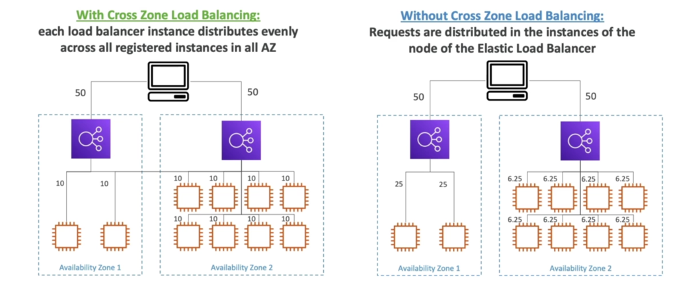
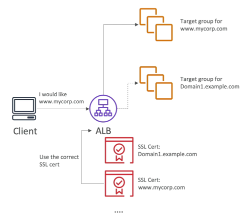

# AWS Elasitc Load Balancer (ELB)

## 로드밸런싱과 관련된 주요 개념
### 확장성 (Scalability)
#### 수직 확장성 (Vertical Scalability)
- 인스턴스 유형/사이즈를 변경하는 것 (scale-down/up)
- t2.micro -> t2.large
- ex) RDS, ElasticCache
#### 수평 확장성 (Horizontal Scalability)
- 인스턴스의 수를 늘리는 것 (scale-in/out)
- 2개 -> 4개

### 고가용성 (High Availiability, HA)
- 어플리케이션/시스템을 최소한 2개 이상의 데이터 센터(=Availability Zone)에서 운영하는 것
- 고가용성의 목적은 데이터 센터에 피해가 있더라도 서비스에 주는 영향을 최소화하는 것  

## 로드밸런서 (Load Balancer)
- 연결된 여러 서버에 트래픽/부하를 분산해주는 서버

### 왜 로드밸런서를 사용해야 하나요?
- 부하 분산
- 외부에 단일 접근 지점 제공 (single access point)
- 연결된 서버(인스턴스)의 불능 상태를 핸들링
- 연결된 서버들에 대한 헬스체크 
- HTTPS 통신을 HTTP로 변환 (SSL Termination)
- 고정세션 기능 (stickiness with cookies)
- 서비스 지역 간의 고가용성 확보 (HA across zones)
- 공인 트래픽과 사설 트래픽의 분리 (LB만 공인/외부에 노출)

### 왜 AWS ELB를 사용해야 하나요?
- 관리형 로드밸런서
  - 동작여부를 보장
  - 업데이트, 유지보수, 고가용성
  - 복잡한 LB 설정을 단순화하여 제공
- 직접 구축하는 것이 저렴하지만 관리하기는 더 어려움
- AWS의 다른 서비스와의 연계
  - EC2, Auto Scaling Group
  - AWS Certificate Manager, CloudWatch
  - etc.

### 헬스체크 (Health Check)
- 로드밸런서에 반드시 필요한 기능
- 뒤에 연결된 서비스에 트래픽 전송 여부를 결정하는 역할 (ex. 응답코드가 200일 경우에만 전송)
- 헬스체크를 위해서는 포트, 프로토콜, 엔드포인트가 필요함
- ex) HTTP, 80, /health

## AWS ELB의 종류와 세대
- Classic Load Balancer (v1)
- Application Load Balancer (v2)
- Network Load Balancer (v2)
- Gateway Load Balancer (v2)
- [ELB 제품 상세 비교](https://aws.amazon.com/ko/elasticloadbalancing/features/#Product_comparisons)
- ELB 제품 간단 비교
  
> 출처: https://wisen.co.kr/pages/blog/blog-detail.html?idx=1926

### Classic Load Balancer (CLB)
- TCP(layer4), HTTP/HTTPS(layer7)에서 동작
- TCP, HTTP 기반 헬스체크
- 고정된 호스트명 제공: ex) XXX.region.elb.amazonaws.com
- EC2를 백엔드로 직접 연결
- **[2022.8.15에 서비스 종료 예정](https://aws.amazon.com/ko/blogs/korea/ec2-classic-is-retiring-heres-how-to-prepare)이므로 가급적 Application Load Balancer를 사용할 것**

### Application Load Balancer (ALB)
- Layer7(HTTP)에서 동작하며 HTTP/2, WebSocket도 지원
- [여러 Target Group(대상 그룹)을 백엔드로 연결하여 트래픽 전송](https://docs.aws.amazon.com/ko_kr/elasticloadbalancing/latest/application/load-balancer-target-groups.html#target-group-routing-configuration)
- 리다이렉션 제공 (ex. from HTTP to HTTPS)
- 다음의 규칙을 사용하여 라우팅
  - 경로 (ex. /user, /posts)
  - 호스트명 (ex. one.example.com, other.example.com)
  - 쿼리 스트링 (ex. ?id=123&order=false)
  - HTTP 헤더
- Application Load Balancer vs. Classic Load Balancer 
  - 여러 어플리케이션에 라우팅하려면 1개의 ALB로 가능
  - 여러 어플리케이션에 라우팅하려면 여러 개의 CLB가 있어야 함

#### ALB Target Group 종류
- EC2 인스턴스
- EC2 태스크 (ECS)
- 람다 함수
- 사설 IP 주소

### Network Load Balancer
- Layer4에서 동작 (TCP/UDP)
- 고성능이 필요할 때
  - 초당 백만 건 처리 가능
  - 100ms latency (vs. ALB 400ms latency)
- 가용영역(AZ) 당 고정IP 1개 제공
- Elastic IP 지원

#### NLB Target Group 종류
- EC2 인스턴스
- 사설 IP addresses
- ALB (NLB를 활용하여 고정IP를 외부에 노출할 수 있음)

### [Gateway Load Balancer](https://aws.amazon.com/ko/blogs/korea/introducing-aws-gateway-load-balancer-easy-deployment-scalability-and-high-availability-for-partner-appliances/)
- 방화벽, 침입 탐지 및 방지 시스템, 심층 패킷 검사 시스템과 같은 가상 어플라이언스 관리시 사용
- 모든 트래픽에 대한 단일 진입점을 제공
- Layer3(Network Layer)에서 동작

## AWS ELB의 기타 기능
### [고정 세션 (Sticky Session)](https://docs.aws.amazon.com/ko_kr/elasticloadbalancing/latest/application/sticky-sessions.html)
- 하나의 클라이언트가 같은 인스턴스로 트래픽을 보내도록 하는 기능    
- 세션 유지가 필요할 때 사용
- CLB, ALB에서 지원
- 만료시간이 있는 쿠키를 사용하여 고정
- ex) restore user session data
- EC2 인스턴스 간에 부하분산이 제대로 안될 수도 있음 

### 크로스 존 로드 밸런싱 (Cross-Zone Load Balancing)

- 지역 간 부하분산시 인스턴스에 고르게 분산되도록 하는 기능 
- 활성화시: 인스턴스 간에 고르게 부하 분산
- 비활성화시: 가용영역 간에 고르게 부하 분산 (인스턴스 간에 고르게 분산되지 않음)
- ALB, CLB에서는 무료로 제공되고 NLB에서 사용시 과금이 된다.

### SSL 종료 (SSL Termination)

- HTTPS 통신을 HTTP 통신으로 변환시켜주는 기능
- AWS Certificate Manager(ACM)을 통해서 인증서 관리
- AWS는 기본 인증서를 제공하지만 사용자가 직접 인증서를 업로드하여 사용할 수 있음

### Server Name Indication (SNI)

- [핸드쉐이크 과정에서 클라이언트가 어느 호스트에 접속하려는지 서버에 알려주고 해당 인증서를 사용하는 기능](https://ko.wikipedia.org/wiki/%EC%84%9C%EB%B2%84_%EB%84%A4%EC%9E%84_%EC%9D%B8%EB%94%94%EC%BC%80%EC%9D%B4%EC%85%98)
- 하나의 서버에서 여러 도메인의 서비스를 서비스할 수 있게 해줌
- ALB, NLB에서는 지원, CLB에서는 지원하지 않음

### Connection Draining 기능
- connection draining (CLB) 혹은 deregistration delay (ALB & NLB)
- 로드밸런서가 비정상(unhealthy) 혹은 연결을 끊고있는(de-registering) 인스턴스가 요청을 마무리할 수 있도록 주는 시간
- Connection Draining 기간 동안 새로운 요청을 인스턴스로 보내지 않음
- 1 ~ 3600s (기본 300s, 비활성화 0s)
- 요청처리시간이 짧은 경우 Connection Draining 시간을 짧게 설정하는 것을 추천

## 참고
- [[Udemy] AWS Certified Solutions Architect Associate 강의](https://www.udemy.com/course/best-aws-certified-solutions-architect-associate/)
- [AWS Elastic Load Balancing 설명서](https://docs.aws.amazon.com/ko_kr/elasticloadbalancing/)