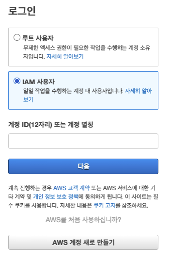
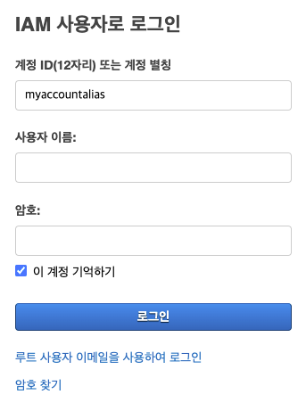
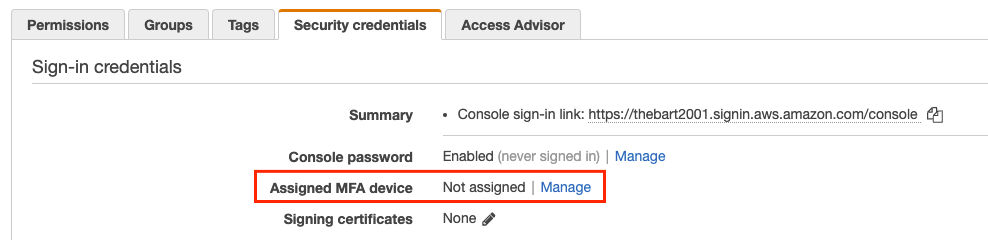

# AWS IAM 맛보기: 사용자, MFA 인증, Role Switch 

## AWS 보안 모범 사례
클라우드 서비스를 관리하는 입장에서 보안은 필수적인 사항입니다. 누군가는 보안이 생산성을 저해하는 요소로 생각할 수 있겠지만 인프라를 관리하는 입장에서 보안은 최소한의 안전장치입니다. 

AWS에서는 [여러가지 보안 모범 사례](https://docs.aws.amazon.com/ko_kr/IAM/latest/UserGuide/best-practices.html)를 제시하고 있지만 이 중에서 단순하고 일반적으로 통용되는 가장 큰 원칙은 [최소 권한 부여 원칙](https://docs.aws.amazon.com/ko_kr/IAM/latest/UserGuide/best-practices.html#grant-least-privilege)입니다.
다시 말해서 클라우드 리소스를 사용하는 모든 리소스(사용자와 서비스)는 필요한 최소한의 권한을 부여해야 하는 것입니다. 불필요한 권한 부여는 클라우드 리소스에 대한 오남용 혹은 사고를 일으킬 수 있기 때문에 '최소 권한 부여 원칙'을 중심으로 이 글을 읽어주시면 되겠습니다.

## AWS IAM
AWS Identity and Access Management(IAM)은 AWS 리소스에 대한 액세스를 안전하게 제어할 수 있는 서비스입니다. IAM을 사용하여 사용자 혹은 AWS 리소스가 다른 AWS 리소스를 사용할 수 있도록 인증을 요구하고 권한 부여할 수 있습니다.

### 인증(Authentication)
인증이란 리소스에 접근하려는 사용자가 누군인지 밝히기 위한 시스템입니다. 액세스 키, 비밀번호, 멀티 팩터 인증(MFA) 등으로 보안 수단을 관리할 수 있습니다.

### 권한 부여와 정책(Policy)
IAM은 사용자에게 필요한 권한을 부여해 주는 시스템으로 이를 이용해 클라우드 내에서 사용자의 행동을 세부적으로 관리할 수 있습니다. 권한부여는 IAM 정책(Policy)를 통해서 이루어지며 IAM 정책은 JSON 형식으로 관리될 수 있으며 아래는 몇 가지 정책의 예시입니다.
정책은 다음과 같이 Version, Statement으로 구성되어 있고 Statement에는 각 정책이 배열로 담겨있습니다. Sid(Statement ID)는 각 Statement을 구별하기 위한 이름일 뿐 생략 가능합니다.

- 관리자 권한 정책: AWS의 모든 인프라에 대한 모든 권한을 행사할 수 있음
```json
{
    "Version": "2012-10-17",
    "Statement": [
        {
            "Effect": "Allow",
            "Action": "*",
            "Resource": "*"
        }
    ]
} 
```
- EC2 읽기 전용 정책: EC2 모든 인스턴스에 대해서 조회만 가능한 정책
```json
{
  "Version": "2012-10-17",
  "Statement": [{
    "Effect": "Allow",
    "Action": [
      "ec2:DescribeInstances",
      "ec2:DescribeImages",
      "ec2:DescribeTags",
      "ec2:DescribeSnapshots"
    ],
    "Resource": "*"
  }
  ]
} 
```
- 특정 S3 버킷에 대한 읽기 전용 정책: 지정한 S3 버킷(DOC-EXAMPLE-BUCKET) 내 객체에 대해서 읽기 권한만 가진 정책
```json
{
    "Version": "2012-10-17",
    "Statement": [
        {
            "Sid": "PublicRead",
            "Effect": "Allow",
            "Principal": "*",
            "Action": [
                "s3:GetObject",
                "s3:GetObjectVersion"
            ],
            "Resource": [
                "arn:aws:s3:::DOC-EXAMPLE-BUCKET/*"
            ]
        }
    ]
}
```

## IAM 자격 증명(Identity)의 종류
- IAM에서 자격증명에 사용되는 주체는 다음과 같습니다.

### Root User
Amazon Web Services(AWS) 계정을 처음 생성하는 경우에는 만들어지는 자격 증명, 쉽게 말해서 계정 그 자체입니다.
이메일 주소와 암호로 로그인하며 계정의 모든 AWS 서비스 및 리소스에 대한 전체 액세스 권한을 가졌습니다.
ex) honglidong@naver.com으로 AWS 계정을 만들고 로그인하여 사용할 때
> ❗일상적인 작업, 심지어 관리 작업의 경우에도 루트 사용자를 사용하지 마세요. 관리자 권한이 필요한 경우는 별도의 IAM User를 만들어서 사용하시길 바랍니다.

### IAM 사용자 (User)
IAM에서 생성하는 자격 증명으로서 AWS 리소스를 제어할 수 있는 사용자입니다. AWS에서 사용자는 이름과 자격 증명으로 구성됩니다.
ex) honglidong@naver.com으로 AWS 계정을 로그인한 후에 Admin이라는 사용자를 만들어서 사용

### IAM 사용자 그룹 (User Group)
IAM 사용자 그룹은 IAM 사용자의 집합입니다. 사용자 그룹을 활용하면 다수의 사용자들에 대한 권한을 지정함으로써 해당 사용자들에 대한 권한을 더 쉽게 관리할 수 있습니다.
ex) Admins, Developers, Test 그룹을 만들고 각 그룹별로 다른 권한을 지정하여 관리
다음은 사용자 그룹이 갖는 몇 가지 중요한 특징입니다.
- 한 사용자 그룹에 여러 사용자가 포함될 수 있으며 한 사용자가 다중 사용자 그룹에 속할 수 있습니다.
- 사용자 그룹은 중첩될 수 없습니다. 즉, 사용자 그룹은 사용자만 포함할 수 있으며 다른 그룹은 포함할 수 없습니다.
- AWS 계정의 모든 사용자를 자동으로 포함하는 기본 사용자 그룹은 없습니다. 이러한 사용자 그룹이 필요한 경우 하나 만들어 새로운 사용자를 각각 해당 그룹에 할당해야 합니다.
- AWS 계정의 IAM 리소스 수와 크기는 제한되어 있습니다.


### IAM 역할 (Role)
IAM 사용자와 유사하지만 사용자뿐만 아니라 서비스 혹은 리소스에 권한을 부여할 수 있는 자격 증명입니다. 쉽게 말하면 특정 권한을 행사할 수 있는 완장, 출입증에 비유할 수 있으며 AWS에서는 모자의 형태로 IAM 역할을 표현하고 있습니다. 다시 말해서 어느 누구든지 IAM 역할에 부여된 권한(정책)을 모자만 쓰면 가질 수 있다는 의미로 표현하고 있습니다.

IAM 역할은 사용자뿐만 아니라 다음과 같이 AWS 내의 서비스(ex. EC2 인스턴스)가 다른 서비스(ex. S3)에 접근하는 경우에 활용할 수 있습니다.


더불어 IAM 역할을 활용하여 임시로 권한이 필요한 사용자에게 임시 자격증명을 제공할 수 있습니다.

### IAM 임시 자격 증명
임시 자격 증명은 기본적으로 IAM 역할에 사용되지만 다른 용도로도 사용됩니다. 일반 IAM 사용자보다 제한된 권한을 갖는 임시 자격 증명을 요청할 수 있습니다. 이렇게 하면 제한된 자격 증명으로는 허용되지 않는 작업을 뜻하지 않게 수행하는 것을 방지할 수 있습니다. 임시 자격 증명의 장점은 일정 시간이 지나면 자동으로 만료된다는 것입니다. 다시 말해서 자격 증명의 유효 시간을 통제할 수 있습니다. 임시 자격 증명의 장점은 보안을 유지하면서 유연하게 AWS 리소스에 대한 권한을 제공할 수 있다는 점입니다.

## 예제를 통한 IAM 실습
### Case1.
```
AWS를 활용하여 프로젝트를 시작하려고 합니다.
친구와 함께 EC2를 활용한 프로젝트를 하려고 하는데 친구에게 자신의 계정과 패스워드 그리고 액세스 키를 새로 만들어서 공유하려고 합니다.
```
어떠한 형태가 되었든 루트 계정을 직접적으로 사용하고 공유하는 것은 보안적으로 절대 않습니다.

타인은 물론이고 본인 역시 IAM 사용자를 만들어야 합니다.

먼저 [IAM 사용자 생성(콘솔)](https://docs.aws.amazon.com/ko_kr/IAM/latest/UserGuide/id_users_create.html#id_users_create_console)에 따라을 따라서 본인을 위한 관리자 계정을 생성합니다. (나머지 사항은 옵션입니다.)
```
사용자 이름: admin
AWS 자격 증명 유형 선택: 암호를 선택합니다. (액세스 키는 나중에도 만들 수 있습니다.) 
권한 설정 > 기존 정책 직접 연결 > AdministratorAccess 선택합니다.
```

생성한 IAM 계정으로 로그인하기 전에 [계정에 별칭(alias)을 생성](https://docs.aws.amazon.com/ko_kr/IAM/latest/UserGuide/console_account-alias.html#CreateAccountAlias)하면 로그인이 편해집니다.

IAM 사용자를 선택하여 로그인시에는 계정ID 혹은 별칭을 입력해야 합니다.



계정 ID는 12자리의 숫자로 되어 있는데 이를 기억하기도 쉽지 않고 매번 로그인시에 찾아서 입력하기에는 번거롭습니다. 

별칭을 생성하면 `https://${계정별칭}.signin.aws.amazon.com/console`으로 접속시 계정ID를 입력하지 않고도 아래와 같이 IAM 사용자 아이디와 비밀번호를 입력하는 상태에서 시작할 수 있습니다.



Admin으로 로그인 후에는 [IAM 사용자 생성(콘솔)](https://docs.aws.amazon.com/ko_kr/IAM/latest/UserGuide/id_users_create.html#id_users_create_console)에 따라을 따라서 친구를 위한 계정을 생성합니다. (나머지 사항은 옵션입니다.)
```
사용자 이름: my.friend
AWS 자격 증명 유형 선택: 암호를 선택합니다. (액세스 키는 나중에도 만들 수 있습니다.) 
(친구와 함께 EC2에 기반한 프로젝트를 진행하다고 가정하여)
권한 설정 > 기존 정책 직접 연결 > AmazonEC2FullAccess를 선택합니다.
```
생성된 계정의 아이디와 비번 그리고 `https://${계정별칭}.signin.aws.amazon.com/console` 주소를 친구에게 전달합니다.

### Case 2.
```
친구를 믿기는 하지만 EC2에 대한 전체 권한을 준 것이 걱정되기 시작합니다.
친구가 계정비밀번호를 분실할 염려도 있기 때문입니다.
```
[MFA](https://docs.aws.amazon.com/ko_kr/IAM/latest/UserGuide/id_credentials_mfa_enable_virtual.html#enable-virt-mfa-for-iam-user)를 활성화하면 OTP 기반으로 콘솔에 로그인을 강제할 수 있습니다.

먼저 친구로 하여금 모바일 OTP를 준비하게 합니다. (Google OTP 혹은 Microsoft Authenticator)

IAM > Users > my.friend > Security Credential 탭을 누르고 MFA 활성화를 위해 Manage를 누릅니다.

```
Virtual MFA device 선택
모바일 OTP로 QR 코드 스캔
2회에 걸쳐서 6자리 암호코드 입력
```

이제 친구는 다음 AWS 콘솔 로그인 부터는 모바일 OTP에 있는 6자리 암호코드를 입력해야 합니다.

다시 말해서 비밀번호뿐만 아니라 OTP를 사용하여 이중으로 인증을 요구할 수 있습니다.  

참고로 콘솔 로그인과 별개로 액세스 키에 대한 분실이 있을 경우 반드시 [재설정](https://docs.aws.amazon.com/ko_kr/IAM/latest/UserGuide/id_credentials_access-keys_retrieve.html)이 필요합니다. 

### Case 3.
```
AWS의 전문가인 선배가 친구와 진행하는 프로젝트에 대해서 피드백을 주겠다고 합니다. EC2에 대해서 조회할 수 있는 권한만 필요하다고 합니다.
선배를 위한 IAM 사용자를 만들어주겠다고 말씀드렸으나 이미 AWS 계정이 있으니 Role Switch만 할 수 있게 해주면 된다고 하면서 본인의 계정 ID 12자리를 알려줬습니다.
```

교차 계정에 대해서 Role Switch를 사용합니다.

예를 들어 아래와 같이 Dev 계정의 Thor 사용자에게 EC2ReadOnly, S3ReadOnly 등의 권한을 임시로 부여하는 것입니다.


<center>출처: https://whchoi98.gitbook.io/aws-iam/iam-role</center>

여기서는 EC2에 대한 조회권한만 있는 역할을 생성하고 그 역할을 선배의 AWS 계정에 위임할 수 있도록 설정하는 것에 해당합니다.

먼저 `IAM > 역할 > 역할 만들기` 메뉴로 진입합니다.
```
신뢰할 수 있는 엔터티 유형: AWS 계정
다른 AWS 계정: ${선배 AWS 계정 ID 12자리} (옵션은 일단 생략합니다.)
권한 정책: AmazonEC2ReadOnlyAccess 선택
역할 이름: cross-role-switch
```

cross-role-switch 생성 후에 ARN(Amazon Resource Name)을 확인하고 선배에게 알려줍니다.
ARN은 다음과 같은 규칙을 띄고 있습니다.
```
arn:aws:iam::${계정ID 12자리 숫자}:role/cross-role-switch
```

이제 선배의 입장에서 본인의 AWS 계정 내 IAM 사용자로 로그인합니다.
`IAM > 정책 > 정책 생성`을 클릭하여 `sts-policy`라는 이름으로 다음과 같이 정책을 생성합니다.
```json
{
  "Version": "2012-10-17",
  "Statement": [
    {
      "Sid": "VisualEditor0",
      "Effect": "Allow",
      "Action": "sts:AssumeRole",
      "Resource": "arn:aws:iam::${계정ID 12자리 숫자}:role/cross-role-switch"
    }
  ]
}
```
여기서 sts(Security Token Service)는 AWS 리소스에 대해서 권한을 위임(assume)할 수 있게 해주는 서비스입니다.

이제 선배가 사용하는 AWS 계정 내 IAM 사용자에 sts-policy를 추가합니다.
`IAM > 사용자 > 사용자 선택 > 권한 > 권한 추가`
```
기존 정책 직접 연결 선택
sts-policy 선택
```
(물론 IAM 그룹을 통해서 정책을 추가하는 것도 좋습니다!)

이제 우측 상단 사용자 정보 메뉴에서 `역할 전환` 버튼을 클릭하고 역할을 전환합니다.

```
계정: 나의 계정 12자리
역할: cross-role-switch
표시 이름: 선택
```

이제 새로운 콘솔에 로그인되고 우측 상단에 역할이 전환된 것을 확인할 수 있습니다. 


이제 선배의 IAM User로 프로젝트로 진행하고 있는 EC2 인스턴스를 조회할 수 있는지 확인합니다.

(참고로 이 임시 자격증명은 만료시간이 기본값이 1시간이며 1시간이 지난 후에는 다시 역할 전환을 실행해야 합니다.) 

## 요약
지금까지 최소 권한 부여 원칙을 중심으로 IAM 자격증명과 MFA, 그리고 교차 역할전환을 활용한 임시 자격증명을 사용하는 간단한 예제를 소개하였습니다.

예제에서는 AWS에서 제공되는 기본 정책을 주로 사용였으나 실제로는 정책을 직접 관리해야 하기 때문에 가급적 정책을 최소한으로 설계하여 만들어서 사용하는 것을 권장합니다.

# 참고
- [AWS IAM 공식문서](https://docs.aws.amazon.com/ko_kr/IAM/latest/UserGuide/introduction.html)
- [IAM 역할(Role)과 Switch](https://whchoi98.gitbook.io/aws-iam/iam-role)