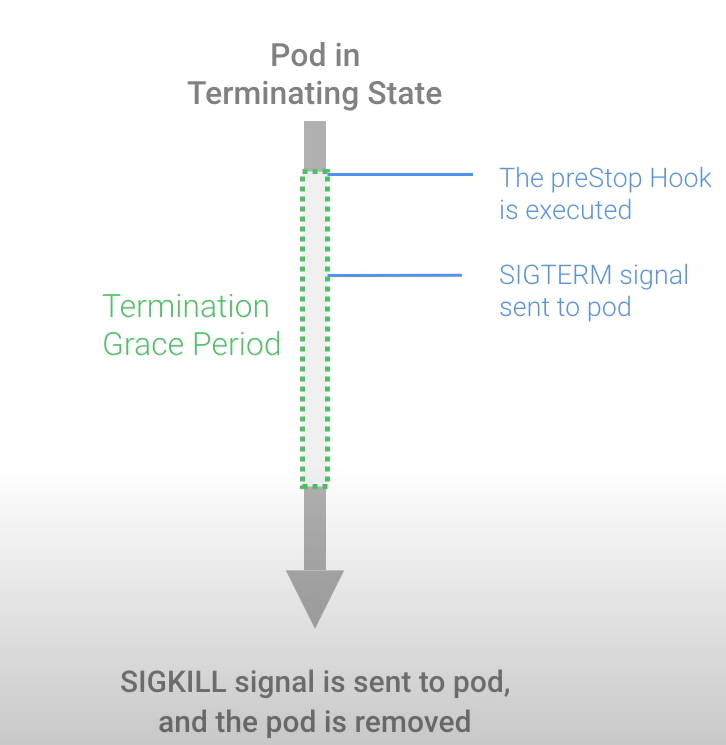
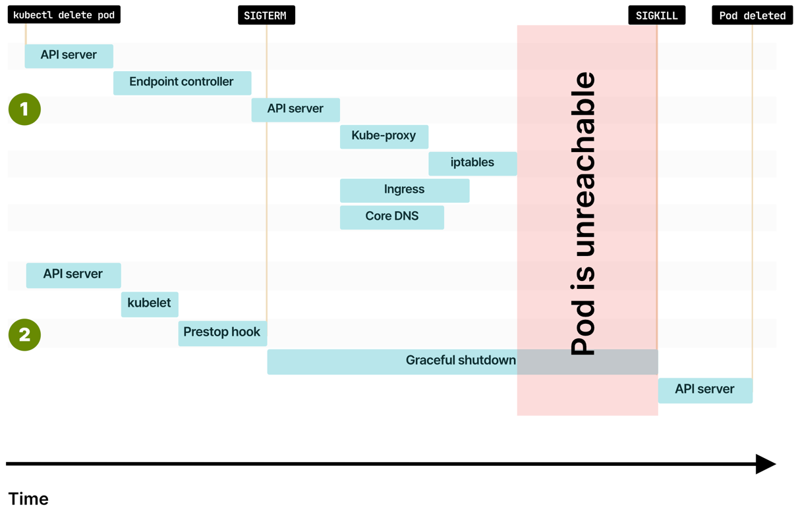
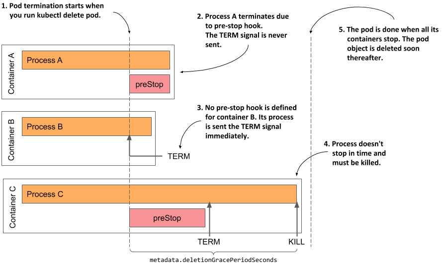

# 쿠버네티스 파드 라이프사이클 (Kubernetes Pod Lifecycle) 

[파드(Pod)](https://kubernetes.io/ko/docs/concepts/workloads/pods/)는 쿠버네티스(Kubernetes의)에서 생성하고 관리할 수 있는 배포 가능한 가장 작은 컴퓨팅 단위입니다.

파드는 하나 이상의 컨테이너 그룹으로 이루어져 있으며 스토리지와 네트워크를 공유합니다.

파드에 대한 정의를 넘어서 파드의 생명주기(lifecycle)에 대해서 알아보겠습니다.

파드 라이프사이클은 Pending → Running → Succeeded or Failed 단계를 가집니다.

기본 컨테이너 중 적어도 하나 이상이 OK로 시작하면 Running 단계 통과하며

컨테이너 종료시 Succeeded 또는 Failed 단계로 이동합니다.

파드는 다음과 같이 명세(spec, 변하지 않는 부분)와 상태(status, 변하는 부분)를 가집니다.
```bash
# 예제로 사용할 nginx pod를 쿠버네티스 클러스터에 배포
> kubectl apply -f https://k8s.io/examples/pods/simple-pod.yaml
# nginx pod 조회
> kubectl get pod nginx -o yaml
# ...
spec:
containers:
# ...
status:
conditions:
# ...
```

## 파드의 수명(lifetime)

파드는 임시 엔티티입니다.

다시 말해서 UID(고유ID)가 할당된 이상 종료/삭제될 때까지 재스케줄되지 않으며 재스케줄링시 이름은 같지만 UID가 다른 파드가 생성됩니다.

스케줄링이(scheduling)란 kubelet이 파드를 실행할 수 있도록 파드를 노드에 할당하는 것을 의미합니다.

## 파드의 단계(phase)

```
# pod phase 확인 방법
> kubectl get pod nginx -o yaml
# ...
status:
# ...
phase: Running
```

파드의 단계(phase)는 파드의 라이프사이클 중 어느 단계에 해당하는지 표현하는 간단한 고수준(high level)의 요약입니다.

| 구분        | 의미                                                                                                        |
|-----------|-----------------------------------------------------------------------------------------------------------|
| Pending   | 쿠버네티스 클러스터에서 승인되었지만, 하나 이상의 컨테이너가 설정되지 않았고 실행할 준비가 되지 않음 (스케줄링 시간 및 이미지 다운로드 시간 포함)                       |
| Running   | 노드에 바인딩되었고, 모든 컨테이너가 생성됨. 적어도 하나의 컨테이너가 실행 중이거나 시작 또는 재시작 중. (Running이라도 파드의 모든 컨테이너가 실행 중인 상태가 아닐수도 있다!) |
| Succeeded | 모든 컨테이너들이 성공적으로 종료                                                                                        |
| Failed    | 모든 컨테이너가 종료 AND 적어도 하나 이상의 컨테이너가 실패로 종료                                                                   |
| Unknown   | 파드의 상태를 알 수 없음 (파드 ↔ 노드 통신 오류)                                                                            |
(참고) Terminating: 파드의 단계에 해당하지는 않으며 그레이스풀하게(gracefully) 종료되도록 부여한 기간에 있는 상태 (파드의 종료 부분 참고)

## 컨테이너 상태(status)
파드 내 컨테이너는 Waiting, Running, Terminated 상태를 가집니다.
```bash
# pod 내 container status 조회 방법 1
> kubectl describe pod nginx
# ...
Containers:
nginx:
# ...
    State:          Running
      Started:      Tue, 22 Mar 2022 10:35:17 +0000

# pod 내 container status 조회 방법 2
> kubectl get pod nginx -o yaml
# ...
status:
containerStatuses:
- containerID: docker://e3e5522c3ce187430304771b2392acc1b9c823a865781a5dfcb2f9b3b290680b
  image: nginx:1.14.2
  name: nginx
# ...
    state:
      running:
        startedAt: "2022-03-22T10:35:17Z"
```

### Waiting
- Running 혹은 Terminated 상태가 아닐 경우
- 컨테이너를 시작하는 데 필요한 작업중 (ex. 레지스트리에서 이미지 Pull, 시크릿 데이터 적용 작업)
- kubectl으로 컨테이너 상태 조회시 Waiting인 이유(Reason) 표시

### Running
- 컨테이너가 문제없이 실행되고 있음
- postStart 훅까지 실행된 상태

### Terminated
- 실행을 시작한 다음 완료될 때까지 실행되었거나 어떤 이유로 실패
- preStop 훅까지 실행된 상태

[참고] [컨테이너 라이프사이클 훅(Hook)](https://kubernetes.io/ko/docs/concepts/containers/container-lifecycle-hooks/)

## 컨테이너 재시작 정책(restart policy)
파드의 spec.restartPolicy에서 정의할 수 있으며 다음 중 하나의 값을 가집니다.
- Always(기본값): 항상 재시작
- OnFailure: exit code 0이 아닐 경우에만 재시작
- Never: 재시작 하지 않음
재시작 정책 값에 따라서 동일한 노드에서 kubelet에 의해 재시작이 이루어집니다.

## 파드의 컨디션(conditions)
각 파드는 PodStatus 하위에 파드가 통과하거나 통과하지 못한(True or False) PodConditions 배열을 가집니다.

```bash
# pod condition 조회 방법
> kubectl get pod nginx -o yaml
# ...
status:
conditions:
- lastProbeTime: null
  lastTransitionTime: "2022-03-22T10:35:10Z"
  status: "True"
  type: Initialized
- lastProbeTime: null
  lastTransitionTime: "2022-03-22T10:35:17Z"
  status: "True"
  type: Ready
- lastProbeTime: null
  lastTransitionTime: "2022-03-22T10:35:17Z"
  status: "True"
  type: ContainersReady
- lastProbeTime: null
  lastTransitionTime: "2022-03-22T10:35:10Z"
  status: "True"
  type: PodScheduled
# ...
> kubectl describe pod nginx
# ...
Conditions:
Type              Status
Initialized       True
Ready             True
ContainersReady   True
PodScheduled      True
# ...
```
- PodScheduled: 파드가 노드에 스케줄되었음
- ContainersReady: 파드의 모든 컨테이너가 준비됨
- Initialized: 모든 초기화 컨테이너(init container)가 성공적으로 완료(completed)
- Ready: 파드는 요청을 처리할 수 있으며 일치하는 모든 서비스의 로드 밸런싱 풀에 추가되어야 함

다음은 각 컨디션의 필드에 대한 설명입니다.

| 필드명                | 설명                                                     |
|--------------------|--------------------------------------------------------|
| type               | 파드 컨디션 이름                                              |
| status             | "True", "False", 또는 "Unknown"                          |
| lastProbeTime      | 파드 컨디션이 마지막으로 프로브된 시간의 타임스탬프                           |
| lastTransitionTime | 파드가 한 상태에서 다른 상태로 전환된 마지막 시간에 대한 타임스탬프                 |
| reason             | 컨디션의 마지막 전환에 대한 이유를 나타내는 기계가 판독 가능한 UpperCamelCase 텍스트 |
| message            | 마지막 상태 전환에 대한 세부 정보를 나타내는 사람이 읽을 수 있는 메시지              |

## 컨테이너 프로브(probe)
프로브는 컨테이너에서 kubelet에 의해서 주기적으로 수행되는 진단입니다.

각 노드에 있는 kubelet이 컨테이너 내에서 코드를 실행하거나 컨테이너에 네트워크 요청을 전송하여 진단을 수행합니다.

### 체크 메커니즘 종류
#### exec
- 컨테이너 내에서 지정된 명령어 실행
- exit code가 0이면 성공한 것으로 간주
```yaml
livenessProbe:
  exec:
    command:
    - cat
    - /tmp/healthy
    # /tmp/healthy 파일이 있으면 성공
```
#### grpc
- gRPC를 사용하여 원격 프로시저 호출을 수행하며 컨테이너가 gRPC 헬스 체크를 구현해야 함
- 현재 알파기능이며 GRPCContainerProbe [기능게이트](https://kubernetes.io/ko/docs/reference/command-line-tools-reference/feature-gates/)를 활성화해야 사용할 수 있음

#### httpGet
- 지정한 포트 및 경로에 HTTP GET 요청을 수행하고 응답코드 200~400이면 성공한 것으로 간주
- 참고로 httpPost는 없으며 exec을 사용하여 [다음](https://stackoverflow.com/questions/53807528/liveness-probe-with-http-post)과 같이 구현할 수 있다고 함
```yaml
livenessProbe:
  httpGet:
    path: /healthz
    port: 8080
    httpHeaders:
    - name: Custom-Header
      value: Awesome
      # `curl -H "Custom-Header: Awesome" localhost:8080/healthz` 요청을 보내서 200 OK 나오면 성공
```
#### tcpSocket
- 지정된 포트에서 대해 TCP 검사를 수행하며 포트가 활성화 되어 있으면 진단이 성공한 것으로 간주
```yaml
livenessProbe:
  tcpSocket:
    port: 8080
    # 8080 port가 open되어 있으면 성공
```
### 프로브 결과
- Success: 진단 통과
- Failure: 진단 실패
- Unknown : 진단 자체가 실패. 아무런 조치를 수행해서는 안되면 kubelet이 추가 체크 실행.

### 프로브 종류
프로브의 종류는 다음과 같습니다. 
#### 활성 프로브(livenessProbe)
- 컨테이너가 동작 중인지 여부
- 실패시 kubelet은 컨테이너를 죽이고 컨테이너는 재시작
- 활성 프로브가 없다면 기본 상태는 Success

#### 준비성 프로브(readinessProbe)
- 컨테이너가 요청을 처리할 준비가 되었는지 여부
- 실패시 엔드포인트 컨트롤러는 파드에 연관된 모든 서비스들의 엔드포인트에서 파드의 IP주소를 제거
- 준비성 프로브가 있는 상태에서 최초 상태는 Failure
- 준비성 프로브가 없다면 기본 상태는 Success

#### 스타트업 프로브(startupProbe)
- 컨테이너 내의 애플리케이션이 시작었는지 여부
- 성공할 때까지 다른 나머지 프로브는 활성화되지 않음
- (활성화 프로브와 동일하게) 실패시 kubelet이 컨테이너를 죽이고, 컨테이너는 재시작
- 스타트업 프로브가 없다면 기본 상태는 Success

### 각 프로브의 사용 사례
각 프로브의 사용 사례는 다음과 같습니다.
#### 언제 활성 프로브를 사용해야 하는가? (livenessProbe)
- kubelet이 파드의 restartPolicy에 따라서 올바른 대처를 자동적으로 수행하기 때문에 활성 프로브가 반드시 필요한 것은 아닙니다.
- 그러나 프로브가 실패한 후 컨테이너가 종료되거나 재시작되길 원한다면 활성 프로브 지정 및 `restartPolicy = Always or OnFailure`으로 설정합니다.

#### 언제 준비성 프로브를 사용해야 하는가? (readinessProbe)
- 컨테이너는 시작되었으나 트래픽을 받는 시점을 정하고 싶은 경우에 사용합니다.
- 컨테이너를 자체적으로 maintenance 상태에 놓고 싶은 경우에 사용합니다.
- 애플리케이션이 백엔드 서비스에 엄격한 의존성이 있을 경우에 사용합니다. (ex. 컨테이너화된 API 뒤에 있는 DB와의 연결)

#### 언제 스타트업 프로브를 사용해야 하는가? (startupProbe)
- 서비스를 시작하는 데 오랜 시간이 걸리는 컨테이너가 있는 파드에서 긴 활성 간격을 설정하는 대신 사용합니다.
- 컨테이너가 시동 시 대량 데이터의 로딩, 구성 파일, 또는 마이그레이션에 대한 작업을 수행할 경우 사용합니다.
- 활성 프로브만 있는 컨테이너가 initialDelaySeconds + failureThreshold × periodSeconds 이후에(=활성 프로브에 몇번 실패하고) 기동된다면, 스타트업 프로브가 활성화 프로브와 같은 엔드포인트를 확인하도록 지정합니다.

## 파드의 종료(termination)
파드는 노드에서 실행되는 프로세스에 해당하므로 필요하지 않을 때(요청을 모두 마친 후에) 정상적으로 종료하는 것이 중요합니다.

파드에 삭제 요청을 보내면 클러스터는 파드가 강제로 종료되기 전에 설정한 유예 기간(grace period)을 준 후에 kubelet은 정상 종료를 시도하려고 합니다.

유예기간 동안 컨테이너 런타임은 각 컨테이너의 기본 프로세스에 TERM 신호 전송 (STOPSIGNAL 설정값)
유예 기간이 만료되면 KILL 시그널이 프로세스로 전송되고 파드는 삭제됩니다.




위와 같이 SIGTERM이 성공하였다면 유예 기간(graceful period) 후반부부터 Pod에 접근이 불가하다.


위의 그림은 하나의 파드 내 여러 컨테이너가 있을 경우의 각 컨테이너의 종료 과정입니다.
- Container A: prestop 훅으로 종료됨
- Container B: prestop 훅이 없어서 TERM 명령으로 종료
- Container C: preStop 훅이 있고 TERM 명령을 보냈으나 유예기간 동안 종료되지 않아서 KILL 명령으로 종료

## 강제 파드 종료
기본적으로 모든 삭제는 종료 유예기간을 지정할 수 있습니다. (--grace-period=<seconds>, default 30)

유예기간을 0으로 설정하면(--grace-period=0) API 서버에서 파드가 바로 삭제됩니다.

강제 삭제가 수행되면, API 서버는 실행 중인 노드에서 파드가 종료되었다는 kubelet의 확인을 기다리지 않으며 API에서 즉시 파드를 제거하므로 동일한 이름으로 새로운 파드를 생성할 수 있습니다.

## 참고
- [쿠버네티스 공식문서 - 파드 라이프사이클](https://kubernetes.io/ko/docs/concepts/workloads/pods/pod-lifecycle/)