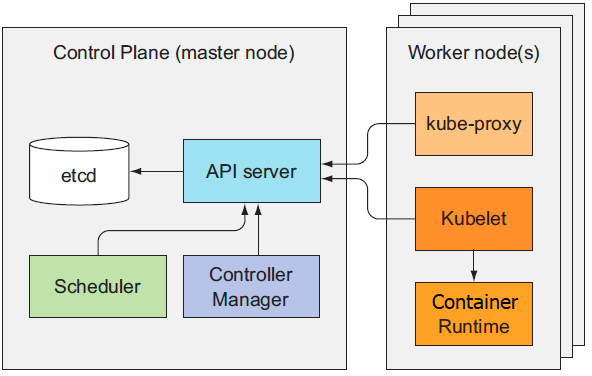

# 쿠버네티스 구성요소 (Kubernetes Components)

## 쿠버네티스 아키텍쳐
- 쿠버네티스 클러스터는 컨트롤 플레인, 워커 노드, 그리고 애드온 요소로 구성

**컨트롤 플레인**
- 클러스터 기능을 제어하고 전체 클러스터가 동작하게 만드는 역할
- 클러스터 상태 저장/관리하지만 컨테이너를 직접 실행하지 않음
- 구성요소: etcd, API 서버, 스케줄러, 컨트롤러 매니저(kube-controller-manager), 클라우드 컨트롤러 매니저(cloud-controller-manager)

**워커 노드**
- 컨테이너를 직접 실행하는 역할
- 구성요소: kubelet, kube-proxy, 컨테이너 런타임

**애드온**
- 클러스터 단위 기능을 제공하기 위한 추가 구성 요소
- ex) 쿠버네티스 DNS 서버, 대시보드, 인그레스 컨트롤러, 힙스터, 컨테이너 네트워크 인터페이스 플러그인

**들어가기 전에...**
- 각 구성요소를 모두 설명하는 것은 너무 방대하므로 이 글에서는 etcd, API 서버, 스케줄러, 컨트롤러 매니저, kubelet, kube-proxy에 대해서만 간단히 다루겠다.

**예제를 위한 준비**
- [kind](https://kind.sigs.k8s.io/)를 활용하여 앞으로의 예제를 위한 로컬 쿠버네티스 클러스터 구성
- 실제 운영환경에서는 하나의 노드가 VM 혹은 물리장비의 형태이나 kind를 활용하면 docker 형태로 실행 가능

```bash
# requirements: docker, kind, kubectl
# kind 설치
> brew install kind
> kind --version
kind version 0.12.0

# 클러스터 설정파일 준비 (1 master node, 2 worker node)
# https://kind.sigs.k8s.io/docs/user/quick-start/#multinode-clusters
> cat multi-node-cluster.yaml
# three node (two workers) cluster config
kind: Cluster
apiVersion: kind.x-k8s.io/v1alpha4
nodes:
- role: control-plane
- role: worker
- role: worker

# 클러스터 생성
> kind create cluster --config multi-node-cluster.yaml

# kind로 노드 조회 
> kind get nodes
kind-control-plane
kind-worker
kind-worker2

# docker로 노드 조회 (각 노드가 docker로 구성된 것을 확인 가능)
> docker https
CONTAINER ID   IMAGE                  COMMAND                  CREATED      STATUS      PORTS                       NAMES
21f6b52fbb3b   kindest/node:v1.23.4   "/usr/local/bin/entr…"   6 days ago   Up 6 days   127.0.0.1:59210->6443/tcp   kind-control-plane
5e51fcdb0405   kindest/node:v1.23.4   "/usr/local/bin/entr…"   6 days ago   Up 6 days                               kind-worker
a93a355c97ec   kindest/node:v1.23.4   "/usr/local/bin/entr…"   6 days ago   Up 6 days                               kind-worker2

# kubectl 설치: https://kubernetes.io/ko/docs/tasks/tools/install-kubectl-macos/
# kind로 구성된 클러스터로 kubectl context 설정
> kubectl config use-context kind-kind 

# kubectl으로 노드 조회
> kubectl get nodes
NAME                 STATUS   ROLES                  AGE     VERSION
kind-control-plane   Ready    control-plane,master   6d22h   v1.23.4
kind-worker          Ready    <none>                 6d22h   v1.23.4
kind-worker2         Ready    <none>                 6d22h   v1.23.4
```

## 구성 요소의 분산 특성
- 구성 요소들은 모두 개별 프로세스로 실행

```bash
# 컨트롤 플레인 구성요소 조회
> kubectl get componentstatus
NAME                 STATUS    MESSAGE                         ERROR
controller-manager   Healthy   ok
scheduler            Healthy   ok
etcd-0               Healthy   {"health":"true","reason":""}
```

**구성 요소 간 통신 방법**
- 각 구성 요소는 API 서버하고만 통신하며 서로 직접 통신하지 않음
- API 서버는 etcd와 통신하는 유일한 구성 요소
- 다른 구성 요소는 API 서버를 통하여 etcd에 저장된 클러스터 상태를 변경
- 대부분의 요청은 구성 요소 → API 서버 순으로 진행
- kubectl logs, attach, port-forward 명령을 실행할 때는 API 서버에서 시작하여 kubelet에 접속

**구성 요소의 가용성**
- 컨트롤 플레인의 구성요소 → 여러 서버에 걸쳐 실행 가능 (가용성 확보 가능)
- 워커 노드의 구성요소 → 각 노드마다 실행되어야 함 (가용성 확보 불가)
- (컨트롤 플레인 구성요소 내에서)
  - etcd, API 서버: 여러 인스턴스로 병렬 작업 가능
  - 스케줄러, 컨트롤러 매니저: 하나의 인스턴스만 활성화, 나머지는 대기

**구성 요소 배포/실행 방법**
- 컨트롤 플레인 구성 요소는 시스템에 직접 프로세스 배포하거나 파드로 실행 가능
- kubelet은 일반 시스템 구성 요소로 실행되는 유일한 구성 요소 (직접 노드에서 프로세스로 조회할 수 있음)
```bash
> kubectl get pod -n kube-system --sort-by=spec.nodeName -o=custom-columns='POD:metadata.name,NODE:spec.nodeName'
POD                                          NODE
coredns-64897985d-fbv5k                      kind-control-plane
coredns-64897985d-tdkvn                      kind-control-plane
etcd-kind-control-plane                      kind-control-plane
kube-proxy-842mj                             kind-control-plane
kindnet-rtpfh                                kind-control-plane
kube-apiserver-kind-control-plane            kind-control-plane
kube-controller-manager-kind-control-plane   kind-control-plane
kube-scheduler-kind-control-plane            kind-control-plane
kindnet-hxc9k                                kind-worker
kube-proxy-gz4bh                             kind-worker
kube-proxy-5g8b4                             kind-worker2
kindnet-82jmk                                kind-worker2
# etcd, apiserver, scheduler, controller-manager, coredns(DNS서버)는 마스터에서 실행되고 있음

# kubelet은 노드(컨테이너) 내에서 프로세스로 실행 중임
> docker ps --format '{{.Names}}'
kind-control-plane
kind-worker
kind-worker2
> docker exec -it kind-control-plane ps -ef | grep kubelet
root         642       1  1 Apr09 pts/0    01:54:19 /usr/bin/kubelet --bootstrap
> docker exec -it kind-worker ps -ef | grep kubelet
root         182       1  0 Apr09 pts/0    01:06:09 /usr/bin/kubelet --bootstrap
> docker exec -it kind-worker2 ps -ef | grep kubelet
root         180       1  0 Apr09 pts/0    01:06:04 /usr/bin/kubelet --bootstrap
```

## etcd
- 모든 오브젝트(파드, 레플리케이션 컨트롤러, 서비스, 시크릿 등)는 API 서버가 다시 시작되거나 실패하더라도 매니페스트가 영구적으로 저장하기 위해 key-value 분산 저장소로 etcd 사용
- API 서버만 유일하게 etcd와 직접 통신하며 다른 구성요소는 API 서버를 통해서만 데이터를 읽거나 쓸 수 있음 → 강력한 낙관적 잠금 시스템 및 유효성 검사 가능
- (참고) 낙관적 동시성 제어(=Optimistic Concurrency Control = 낙관적 잠금 = Optimisstic Lock)
  - 데이터에 잠금을 설정하지 않고 데이터에 버전 번호를 포함하는 방법
  - 데이터를 업데이트 할 때 클라이언트가 데이터를 읽은 시간과 업데이트를 제출하는 시간 사이에 버전 번호가 증가했는지를 체크
  - 만약 버전 번호가 증가하였다면 제출한 내용은 거부되고 다시 데이터를 읽어서 업데이트를 시도해야 함
  - 결과적으로 두 클라이언트가 동일한 데이터 항목 업데이트를 시도하면 첫 번째 시도만 성공함

**리소스를 etcd에 저장하는 방법**
- 쿠버네티스는 모든 데이터를 etcd의 /registry 이하 경로에 저장
```bash
# etcd 데이터 조회
# 위의 kind를 사용하여 생성한 클러스터에서 control-plane 노드(도커 컨테이너) 접속
> docker exec -it kind-control-plane bash

# etcd 데이터 조회를 위한 etcdctl 설치
> root@multi-node-control-plane:/# apt update && apt -y install etcd-client

# etcdctl 명령어로 etcd 데이터 조회
> root@kind-control-plane:/# ETCDCTL_API=3 etcdctl --endpoints 127.0.0.1:2379 --cacert /etc/kubernetes/pki/etcd/ca.crt --cert /etc/kubernetes/pki/etcd/server.crt --key /etc/kubernetes/pki/etcd/server.key --keys-only --prefix get /registry/ | head -n10
/registry/apiregistration.k8s.io/apiservices/v1.
/registry/apiregistration.k8s.io/apiservices/v1.admissionregistration.k8s.io
/registry/apiregistration.k8s.io/apiservices/v1.apiextensions.k8s.io
/registry/apiregistration.k8s.io/apiservices/v1.apps
# ...
```

**저장된 오브젝트의 일관성과 유효성 보장**
- API 서버에서만 낙관적 잠금을 사용하여 클러스터 상태를 업데이트 →  오류 발생 최소화 및 일관성 유지

**클러스터링된 etcd의 일관성 보장**

- [Raft 합의 알고리즘](https://dinonotes.com/archives/909) 사용하여 일관성 보장

**etcd 인스턴스 수가 홀수인 이유**
- 일부 인스턴스가 실패하더라도 과반을 확보하기 위함
- 대규모 클러스터에서는 5~7대면 충분

## API 서버
- 다른 모든 구성요소와 kubectl 같은 클라이언트에서 사용하는 중심 구성 요소
- 클러스터 상태 조회/변경을 위한 RESTful API로 CRUD 인터페이스 제공
- 오브젝트를 etcd에 저장을 전적으로 담당하기 때문에 잘못 설정된 오브젝트를 저장하거나 동시에 업데이트 되는 것을 방지
- kubectl을 사용하여 리소스 생성시 API 서버로 HTTP POST 요청을 전달하며 다음과 같은 절차를 거쳐서 리소스 유효성을 검사하고 etcd에 저장

- 위와 같이 여러 단계를 거쳐서 검증된 요청에 대해서만 etcd에 저장

**API 서버가 리소스 변경을 클라이언트에 통보하는 방법**
- API 서버는 단지 컨트롤러와 다른 구성요소가 배포된 리소스의 변경사항을 관찰할 수 있도록 해 줌
- 여러 클라이언트는 API 서버에 HTTP 연결을 맺고 변경사항을 감지
- 오브젝트가 갱신될 때마다 API 서버는 감시하고 있는 연결된 모든 클라이언들에게 새로운 버전을 보냄
- 아래의 그림은 특정 클라이언트가 감시 요청(GET /pods?watch=true)을 보낸 상태에서 오브젝트가 갱신되면(POST /pods/) API 서버가 갱신된 오브젝트를 감시하는 모든 관찰자에게 전달하는 과정

- kubectl은 리소스 변경을 감시할 수 있는 API 서버의 클라이언트 중 하나
- 감시 메커니즘: 대표적으로 `kubetl get pods --watch` 옵션이 있으며 파드의 생성/수정/삭제 통보를 API 서버로부터 받을 수 있음

## 스케줄러
- API 서버의 감시 메커니즘을 통해 생성된 파드를 새로운 노드에 할당하는 역할
- 선택된 노드에 파드를 실행하도록 직접 지시하지는 않고 API 서버로 파드의 정의를 갱신하고 API 서버는 kubelet에 파드가 스케줄링 된 것을 통보

**기본 스케줄링 알고리즘**

- 파드를 스케줄링 할 수 있는 노드 목록을 필터링
- 수용 가능한 노드의 우선순위에 따라서 노드 선택 (동점일 경우 라운드-로빈)

**파드에 가장 적합한 노드 선택**
모든 노드가 파드를 실행할 수 있지만 특정 노드(예를 들어 파드 수가 적은 노드)가 더 적합한 선택일 수 있음

**고급 파드 스케줄링**
- 가능한 많은 노드에 분산시키는 것이 이상적
- 특정한 요구사항이나 인프라의 사양에 맞게 스케줄러를 직접 구현하여 사용자 맞춤형으로 스케줄링할 수 있음

**다중 스케줄러 사용**
- 기본 스케줄러 외에 다른 스케줄러를 생성하고 실행할 수 있음
- 파드의 정의 중 schedulerName 속성에 커스텀 스케줄러로 지정할 수 있음

## 컨트롤러 매니저와 컨트롤러
- 컨트롤러 매니저: 컨트롤러 프로세스를 실행하는 컨트롤 플레인의 구성 요소
- 컨트롤러: API 서버로 배포된 리소스가 시스템이 원하는 상태로 수렴되도록 만드는 구성 요소
- 다음은 하나의 컨트롤러 매니저에서 실행될 수 있는 컨트롤러 목록
  - 레플리케이션 매니저 (레플리케이션 컨트롤러 리소스의 컨트롤러)
  - 레플리카셋, 데몬셋, 잡 컨트롤러
  - 디플로이먼트 컨트롤러
  - 스테이트풀셋 컨트롤러
  - 노드 컨트롤러
  - 서비스 컨트롤러
  - 엔드포인트 컨트롤러
  - 네임스페이스 컨트롤러
  - 퍼시스턴트볼륨 컨트롤러
  - 그 밖의 컨트롤러

**컨트롤러의 역할과 동작 방식**
- API 서버에서 리소스(디플로이먼트, 서비스 등)가 변경되는 것을 감시하고 변경(오브젝트 생성/갱신/삭제) 작업을 수행

- 컨트롤러는 조정루프(control loop, reconcile loop)를 컨트롤러 매니저로부터 이벤트 목록을 정기적으로 수신하여 실제 상태를 원하는 상태로 조정하고 새로운 상태를 리소소의 상태를 기록
- 컨트롤러는 서로 직접 통신하지 않으며 서로의 존재조차 모름
- 컨트롤러는 API 서버로만 오브젝트를 제어하며 kubelet의 존재도 모름

## Kubelet
- 워커 노드에서 실행하는 모든 것을 담당하는 구성 요소

- **kubelet의 작업 순서**
- 실행 중인 노드를 노드 리소스로 만들어서 API 서버에 등록
- API 서버를 모니터링하여 노드에 파드가 스케줄링되면 파드의 컨네이너 시작
- 실행 중인 컨테이너를 모니터링하면서 상태, 이벤트, 리소스 사용량을 API 서버에 보고
- 활성화 프로브(liveness probe)로 컨테이너 감시하고 필요시 재시작
- API 서버에서 파드가 삭제되면 컨테이너 정지 및 API 서버에 통보

**API 서버 없이 정적 파드 실행 (static pod)**
- kubelet은 특정 로컬 디렉터리 내에 있는 매니페스트 기반으로 정적 파드 실행할 수 있음 (컨트롤 플레인 구성 요소들은 정적 파드임)
- 왜 정적 파드를 왜 사용할까? → 정적 파드는 컨트롤 플레인에 의존적이지 않기 때문에 node에 컨트롤 플레인 구성 요소를 배포하는데 사용

- 위의 그림에서 containerA,B는 API서버를 통해서 kubelet이 실행하고 정적파드 containerC는 kubelet이 직접 실행함

## kube-proxy
- 모든 워커노드에 있으며 클라이언트가 쿠버네티스 API로 정의한 서비스에 연결을 해주는 역할
- 서비스의 IP와 포트로 들어온 접속을 서비스를 지원하는 파드로 연결 및 로드밸런싱 수행
- kube-proxy가 네트워크를 관리하는 방법은 다음과 같음
  - userspace 모드
  - iptables 모드
  - ipvs 모드
  - 각 모드별 차이는 [이 블로그](https://arisu1000.tistory.com/27839?category=787056) 혹은 [공식 문서](https://kubernetes.io/ko/docs/concepts/services-networking/service/#%EA%B0%80%EC%83%81-ip%EC%99%80-%EC%84%9C%EB%B9%84%EC%8A%A4-%ED%94%84%EB%A1%9D%EC%8B%9C) 참조 

## 참고
- [쿠버네티스 공식문서 - 쿠버네티스 컴포넌트](https://kubernetes.io/ko/docs/concepts/overview/components/)
- [쿠버네티스 인 액션 - 11장. 쿠버네티스 내부 이해](http://www.yes24.com/Product/Goods/89607047)